\mainmatter


# (PART) Get Started {-}

# Introduction {#intro-chap}

**1. R프로그램**

   - 데이터 분석을 위한 자료 전처리, 통계 및 시각화를 지원하는 컴퓨터 언어 및 환경
   - 1980년 AT&T 벨 연구소의 John Chambers가 개발한 S 언어를 기반으로 1995년 뉴질랜드 Auckland 대학의 통계학과 교수 Robert Gentleman과 Ross Ihaka 가 개발
   - [GNU](https://en.wikipedia.org/wiki/GNU_Project) 기반의 오픈 소스
   - 통계학, 전산학, 생물학, 의학 등 거의 모든 학문분야에서 분석도구로 활용되고 있고, 최근 data science 분야에서 널리 활용


**2. R 언어의 특징**

   - **무료 소프트웨어**
   - [CRAN (Comprehensive R Archive Network)](http://cran.r-project.org/web/view)에서 배포
   - 특정 vendor가 아닌 전 세계 연구자들이 개발한 알고리즘 및 최신 함수 활용 가능(packaging system)
   - 범용적으로 사용되는 거의 대부분의 운영체제(Windows, Mac, Linux)에서 작동 가능
   - 방대한 개발 및 사용 생태계 형성 
   - 강력한 그래픽 기능

\footnotesize

\BeginKnitrBlock{rmdtip}<div class="rmdtip">**유용한 웹 사이트**: R과 관련한 거의 모든 문제는 Googling (구글을 이용한 검색)을 통해 해결 가능(검색주제 + "in R" or "in R software")하고 많은 해답들이 아래 열거한 웹 페이지에 게시되어 있음. 

- R 프로그래밍에 대한 Q&A: [Stack Overflow](https://stackoverflow.com)
- R 관련 웹 문서 모음: [Rpubs](https://rpubs.com/)
- R package에 대한 raw source code 제공: [Github](https://github.com)
- R을 이용한 통계 분석: [Statistical tools for high-throughput data analysis (STHDA)](http://www.sthda.com/english/)
</div>\EndKnitrBlock{rmdtip}

 \normalsize


## R 설치하기 {#installation}

R 다운로드 사이트: https://www.r-project.org 또는 https://cran.r-project.org

1. 웹 브라우저(i.e. Explore, Chrome, Firefox 등)의 주소 입력창에 https://www.r-project.org

2. 좌측 R Logo 하단 Download 아래 CRAN 클릭

\footnotesize

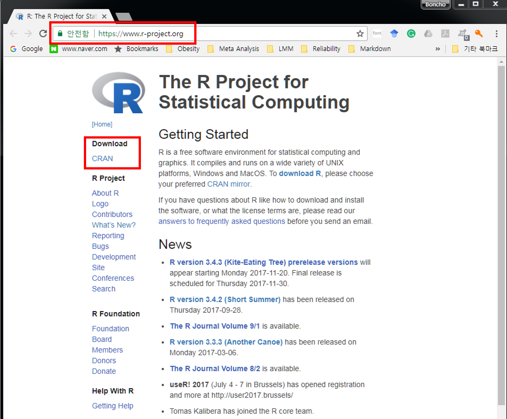

 \normalsize

<br/>

3. 클릭 후 연결한 페이지를 스크롤 후 Korea 아래 링크^[해당 링크들은 접속 시점에 따라 변경될 수 있음] 클릭 


\footnotesize

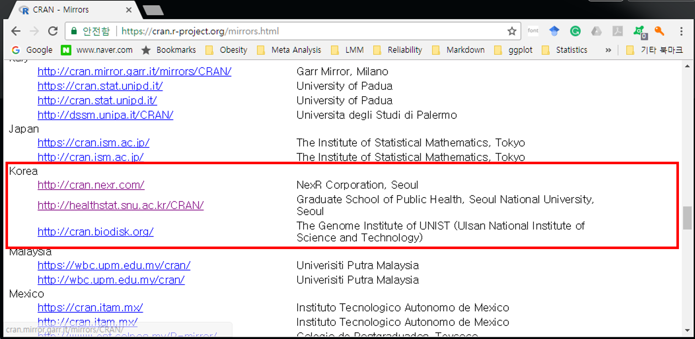

 \normalsize

<br/>

4. 클릭 후 세 가지 운영체제(Linux, Mac OS X, Windowns)에 따른 R 버전 선택 가능^[본 노트는 Windows 버전 설치만 다룸]


\footnotesize

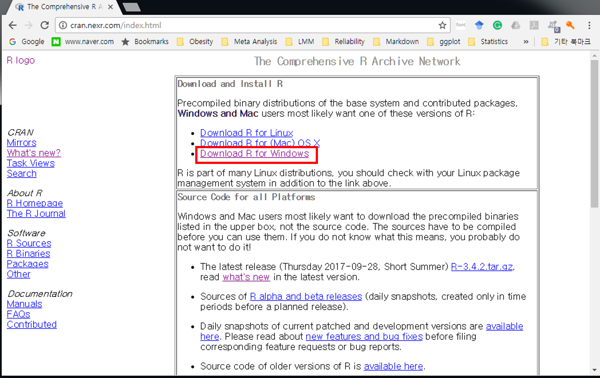

 \normalsize

<br/>

5. **Downloads R for Windows** 링크 클릭하면 다음과 같은 화면으로 이동

\footnotesize


 \normalsize

<br/>

\footnotesize

\BeginKnitrBlock{rmdtip}<div class="rmdtip">다음 하위폴더에 대한 간략 설멍

- **`base`**: R 실행 프로그램
- **`contrib`**: R package의 바이너리 파일
- **`Rtools`**: R package 개발 및 배포를 위한 프로그램
</div>\EndKnitrBlock{rmdtip}

 \normalsize

<br/>

6. 위 화면에서 **base** 링크 클릭 후 아래 화면에서 **Downloads R 3.x.x for Windows** 를 클릭 후 설치 파일을 임의의 디렉토리에 저장 및 실행

\footnotesize


 \normalsize

<br/>


7. 다운로드한 파일을 실행하면 아래와 같은 대화창이 나타남
    - 한국어 선택 $\rightarrow$ 환영 화면에서 [다음(N)>] 클릭

\footnotesize

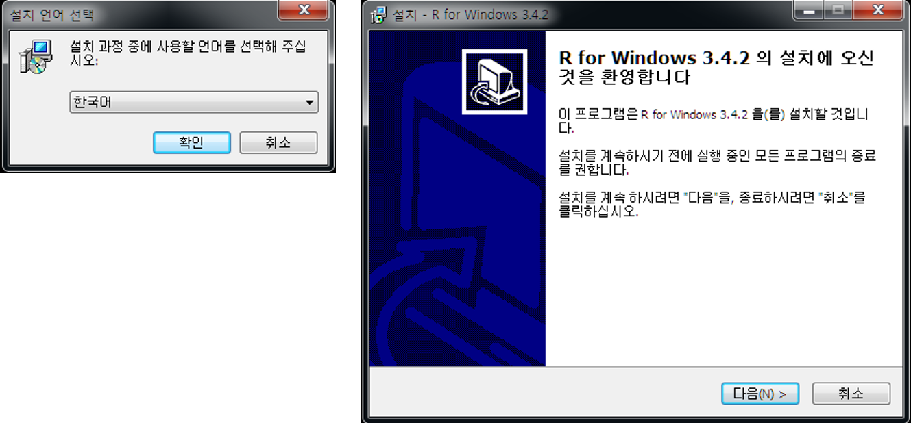

 \normalsize

<br/>

8. GNU 라이센스에 대한 설명 및 동의 여부([다음(N)>]) 클릭

\footnotesize

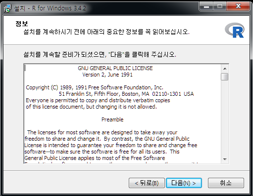

 \normalsize

<br/>

9. 설치 디렉토리 설정 및 구성요소 설지 여부
    - 원하는 디렉토리 설정(예: `C:\R\R-3.x.x`)
    - 기본 프로그램("Core Files"), 32 또는 64 bit 용 설치 파일, R console 한글 번역 모두 체크 뒤 [다음(N)>] 클릭

\footnotesize

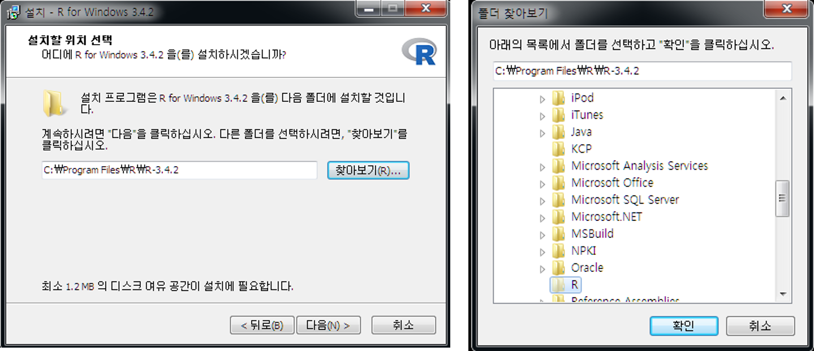

 \normalsize

\footnotesize

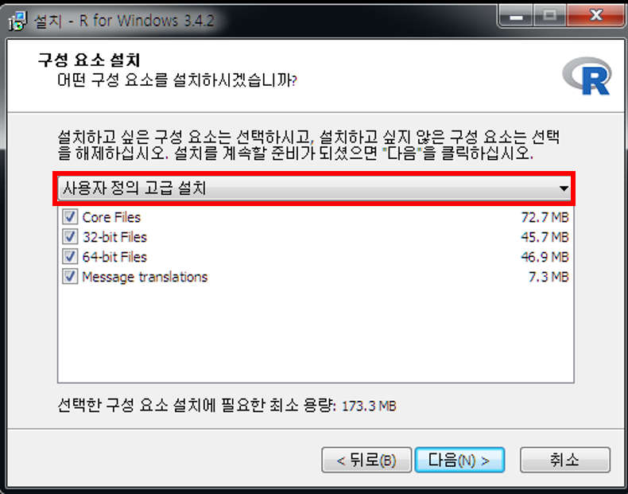

 \normalsize

<br/>

10. R 스타트업 옵션 지정
   - 기본값("No" check-button)으로도 설치 진행 가능
   - 본 문서에서는 스타트업 옵션 변경으로 진행

\footnotesize


 \normalsize

<br/>

11. 화면표시방식(디스플레이 모드) 설정 변경
   - MDI: 한 윈도우 내에서 script 편집창, 출력, 도움말 창 사용
   - SDI: 다중 창에서 각각 script 편집창, 출력, 도움말 등을 독립적으로 열기

\footnotesize

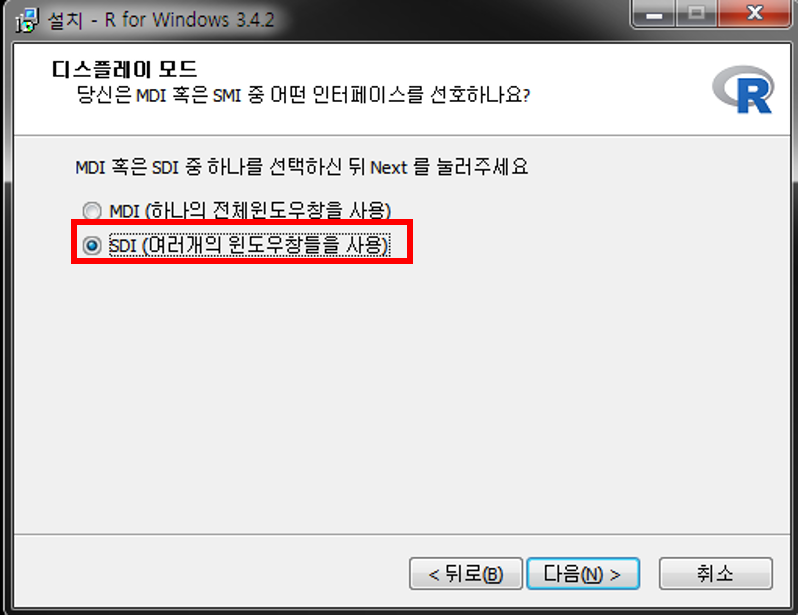

 \normalsize

<br/>

12. 도움말 형식에서 HTML 도움말 기반 선택

\footnotesize

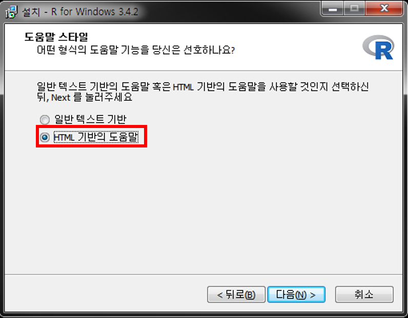

 \normalsize

<br/>

13. 시작메뉴 폴더 선택
   - "바로가기"를 생성할 시작 메뉴 폴더 지정 후 [다음(N)>] 클릭 후 설치 진행
   - 하단 "시작메뉴 폴더 만들지 않음" 체크박스 표시 시 시작메뉴에 "바로가기" 아이콘이 생성되지 않음(실행에 전혀 지장 없음)

\footnotesize

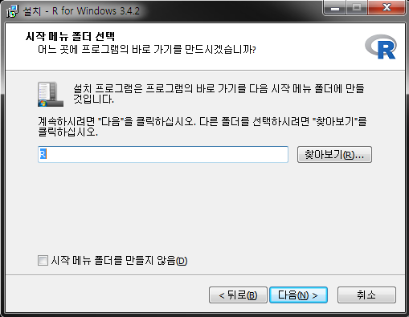

 \normalsize

<br/>

14. 추가 옵션 지정: 바탕화면 아이콘 생성 등 추가적 작업 옵션 체크 후 [다음(N)>] 클릭 $\rightarrow$ 설치 진행
   - 설치된 R 버전 정보 레지스트리 저장 여부 
   - `.Rdata` 확장자를 R 실행파일과 자동 연계

\footnotesize


 \normalsize

<br/>

15. 설치 완료 후 바탕화면의 R 아이콘을 더블클릭하면 Rgui가 실행

\footnotesize

<div class="figure" style="text-align: center">
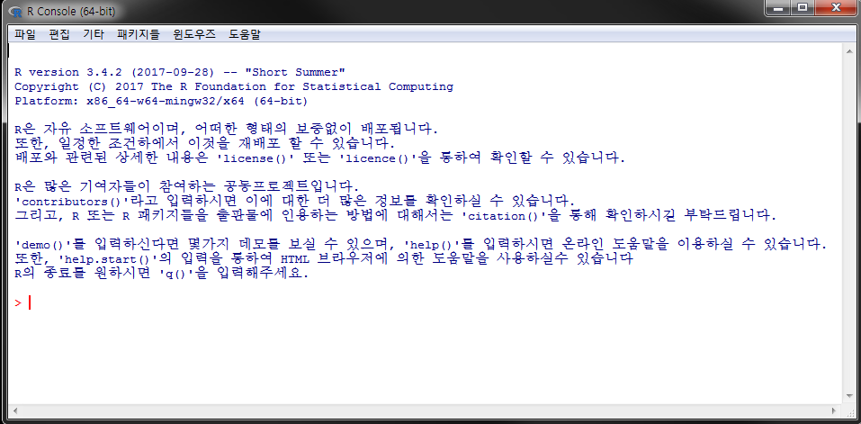
<p class="caption">(\#fig:r-console)Windows에서 R 실행화면(콘솔 창, SDI 모드)</p>
</div>

 \normalsize

## R 시작 및 작동 체크{#r-check}

\BeginKnitrBlock{rmdimportant}<div class="rmdimportant">**실습**: 설치된 R을 실행 후 보이는 R 콘솔(consle) 창에서 명령어를 실행하고 결과 확인</div>\EndKnitrBlock{rmdimportant}

Figure \@ref(fig:r-console) 에서 `>` 기호는 R의 명령 프롬프트(command prompt) 임 

   - $\rightarrow$ 컴퓨터가 사용자 명령을 기다리고 있다는 기호

1. 현재 R session^[현재 실행되고 있는 R의 작업공간] 정보(R 설치 버전, locale, 로딩 packages) 출력

\footnotesize


```r
# R의 설치 버전 및 현재 설정된 locale(언어, 시간대) 및 로딩된 R package 정보 출력
sessionInfo() 
```

```
R version 4.0.0 (2020-04-24)
Platform: x86_64-w64-mingw32/x64 (64-bit)
Running under: Windows 10 x64 (build 18363)

Matrix products: default

locale:
[1] LC_COLLATE=Korean_Korea.949  LC_CTYPE=Korean_Korea.949   
[3] LC_MONETARY=Korean_Korea.949 LC_NUMERIC=C                
[5] LC_TIME=Korean_Korea.949    

attached base packages:
[1] stats     graphics  grDevices utils     datasets  methods   base     

other attached packages:
[1] knitr_1.28

loaded via a namespace (and not attached):
 [1] Rcpp_1.0.4.6    bookdown_0.19   digest_0.6.25   mime_0.9       
 [5] magrittr_1.5    evaluate_0.14   highr_0.8       rlang_0.4.6    
 [9] stringi_1.4.6   rmarkdown_2.2   tools_4.0.0     stringr_1.4.0  
[13] markdown_1.1    xfun_0.14       yaml_2.2.1      compiler_4.0.0 
[17] htmltools_0.4.0
```

 \normalsize

<br/>

2. 문자열 출력

\footnotesize


```r
#문자열 출력
print("Hello R") #문자열
```

```
[1] "Hello R"
```

 \normalsize

> `#` 기호는 주석의 시작을 의미하고 실제로 실행되지 않음 같은 행에서 `#` 뒤 내용의 코드 역시 실행되지 않음

3. `a` 라는 변수에 숫자 9, `b`라는 변수에 숫자 7를 할당 후 출력

\footnotesize


```r
# 수치형 값(scalar)을 변수에 할당(assign)
# 여러 명령어를 한줄에 입력할 때에는 세미콜론(;)으로 구분
a = 9; b = 7
a
```

```
[1] 9
```

```r
b
```

```
[1] 7
```

 \normalsize

<br/>

4. 변수 `a`와 `b`의 사칙연산

\footnotesize


```r
a+b; a-b; a*b; a/b
```

```
[1] 16
```

```
[1] 2
```

```
[1] 63
```

```
[1] 1.285714
```

 \normalsize

<br/>

5. R 그래픽 맛보기: 정규분포로부터 난수 100개 생성 후 생성된 데이터에 대한 히스토그램 작성

\footnotesize


```r
# 난수 생성 시 값은 매번 달라지기 때문에 seed를 주어 일정값이 생성되도록 고정
# "="과 "<-"는 모두 동일한 기능을 가진 할당 연산자임
#평균이 0 이고 분산이 1인 정규분포에서 난수 100개 생성
set.seed(12345) # random seed 지정
x <- rnorm(100) # 난수 생성
hist(x) # 히스토그램
```

<div class="figure" style="text-align: center">

<p class="caption">(\#fig:check-04)정규분포 100개의 히스토그램</p>
</div>

 \normalsize

<br/>

\footnotesize

\BeginKnitrBlock{rmdtip}<div class="rmdtip">R 명령어 또는 전체 프로그램 소스 실행 시 매우 빈번히 오류가 나타나는데, 이를 해결할 수 있는 가장 좋은 방법은 앞에서 언급한 Google을 이용한 검색 또는 R 설치 시 자체적으로 내장되어 있는 도움말을 참고하는 것이 가장 효율적임. </div>\EndKnitrBlock{rmdtip}

 \normalsize

<br/>

\footnotesize

<table class="table table-condensed table-striped" style="font-size: 10px; margin-left: auto; margin-right: auto;">
<caption style="font-size: initial !important;">(\#tab:tab-help)R help 관련 명령어 리스트</caption>
 <thead>
  <tr>
   <th style="text-align:left;"> 도움말 보기 명령어 </th>
   <th style="text-align:left;"> 설명 </th>
   <th style="text-align:left;"> 사용법 </th>
  </tr>
 </thead>
<tbody>
  <tr>
   <td style="text-align:left;"> `help` 또는 `?` </td>
   <td style="text-align:left;width: 5cm; "> 도움말 시스템 호출 </td>
   <td style="text-align:left;"> `help(함수명)` </td>
  </tr>
  <tr>
   <td style="text-align:left;"> `help.search` 또는 `??` </td>
   <td style="text-align:left;width: 5cm; "> 주어진 문자열을 포함한 문서 검색 </td>
   <td style="text-align:left;"> `help.search(pattern)` </td>
  </tr>
  <tr>
   <td style="text-align:left;"> `example` </td>
   <td style="text-align:left;width: 5cm; "> topic의 도움말 페이지에 있는 examples section 실행 </td>
   <td style="text-align:left;"> `example(함수명)` </td>
  </tr>
  <tr>
   <td style="text-align:left;"> `vignette` </td>
   <td style="text-align:left;width: 5cm; "> topic의 pdf 또는 html 레퍼런스 메뉴얼 불러오기 </td>
   <td style="text-align:left;"> `vignette(패키지명 또는 패턴)` </td>
  </tr>
</tbody>
</table>

 \normalsize

<br/>

\footnotesize

\BeginKnitrBlock{rmdtip}<div class="rmdtip">**Vignette** 의 활용

- `vignette()`에서 제공하는 문서는 데이터를 기반으로 사용하고자 하는 패키지의 실제 활용 예시를 작성한 문서이기 때문에 초보자들이 R 패키지 활용에 대한 접근성을 높혀줌.
- `browseVignettes()` 명령어를 통해 vignette을 제공하는 R 패키지 및 해당 vignette 문서 확인 가능 
</div>\EndKnitrBlock{rmdtip}

 \normalsize

## R script 편집기 사용{#rconsle-script}

\BeginKnitrBlock{rmdimportant}<div class="rmdimportant">**실습**: R 설치 후 Rgui 에서 제공하는 편집기(R editor)에 명령어를 입력하고 실행
</div>\EndKnitrBlock{rmdimportant}

설치된 R을 실행 후 상단 pull-down 메뉴에서 [**File**] $\rightarrow$ [**새 스크립트**]를 선택하면 아래 그림과 같이 편집창(R 인스톨 시 SDI 옵션 기준)이 나타남

\footnotesize


 \normalsize

편집기 창에 다음 명령어 입력

\footnotesize


```r
# R에 내장된 cars 데이터셋 불러오기 cars dataset에 포함된 변수들의 기초통계량
# 출력 2차원 산점도
data(cars)
help(cars)  # cars 데이터셋에 대한 설명 help 창에 출력
head(cars)  # cars 데이터셋 처음 6개 행 데이터 출력
summary(cars)  # cars 데이터셋 요약
plot(cars)  # 변수가 2개인 경우 산점도 출력
```

 \normalsize

- 편집창에서 한 줄을 실행시키려면 명령어가 입력된 줄에서 **[Ctrl]** + **[R]** 입력
- 편집창에 입력한 모든 명령어를 실행시키려면 모든 줄을 선택(마우스 또는 [Shift] + $\downarrow$)


\footnotesize


```
  speed dist
1     4    2
2     4   10
3     7    4
4     7   22
5     8   16
6     9   10
```

```
     speed           dist       
 Min.   : 4.0   Min.   :  2.00  
 1st Qu.:12.0   1st Qu.: 26.00  
 Median :15.0   Median : 36.00  
 Mean   :15.4   Mean   : 42.98  
 3rd Qu.:19.0   3rd Qu.: 56.00  
 Max.   :25.0   Max.   :120.00  
```

<div class="figure">

<p class="caption">(\#fig:check-edit-out)cars 데이터셋의 speed와 dist 간 2차원 산점도: speed는 자동차 속도(mph)이고 dist는 해당 속도에서 브레이크를 밟았을 때 멈출 때 까지 걸린 거리(ft)를 나타냄.</p>
</div>

 \normalsize

- R은 명령어를 입력하고 실행결과를 확인하는 대화형(interpreter) 방식
- 콘솔창에서 $\uparrow$/$\downarrow$를 누르면 이전/이후 실행 명령 기록 확인 가능
- 여러 줄 이상 R 명령어라든가 반복적, 장기간 작업을 수행해야 할 경우 R 명령어로 구성된 스크립트 작성 후 일괄 실행하는 것이 일반적
- 여러 다중 명령 코딩 시 콘솔창에 직접 입력하는 것은 비효율적이므로 스크립트 에디터를 사용
- 위 예시처럼 R 에디터 사용할 수 있으나 가독성 및 코딩 효율이 떨어짐
- 과거 많이 사용됐던 R 에디터: [WinEdt](http://www.winedt.com), [Tinn-R](https://sourceforge.net/projects/tinn-r/), [Vim](http://www.vim.org/scripts/script.php?script_id=2628)
- 현재 가장 범용적 R 에디터: **Rstudio**

## RStudio{#r-studio}

- [RStudio](https://rstudio.com/): R 통합 분석/개발 환경(integrated development environment, IDE)으로 현재 가장 대중적으로 사용되고 있는 R 사용 환경
- 명령 곤솔 외 파일 편집, 데이터 객체, 명령 기록(.history), 그래프 등에 쉽게 접근 가능
- RStudio 독자적인 개발 환경 제공: Rmarkdown, Rnotebook, Shiny Web Application 등 다양한 R 환경을 제공
- 버전관리(git, subversion)를 통해 project 관리 가능
- **무료** 및 유료 소프트웨어 제공

### RStudio 설치하기{#rstudio-install}

1. 웹 브라우저를 통해 https://rstudio.com 접속 후 상단 [DOWNLOAD](https://rstudio.com/products/rstudio/download/) 링크 클릭

\footnotesize


 \normalsize

2. Desktop 또는 Server 버전 중 택일

   - 서버용 설치를 위해서는 Server 클릭 $\rightarrow$ 소규모 자료 분석용으로는 불필요
   - 여기서는 **Desktop** 버전 선택 후 다음 링크로 이동
  
\footnotesize


 \normalsize

3. 운영체제에 맞는 Rstudio installer 다운로드(여기서는 Windows 버전 다운로드)

\footnotesize


 \normalsize

4. RStudio installer 다운로드 시 파일이 저장된 폴더에서 보통 `RStudio-xx.xx.xxx.exe` 형식의 파일명 확인
   - 더블 클릭 후 실행
   - **[다음>]** 몇 번 클릭 후 설치 종료

\footnotesize

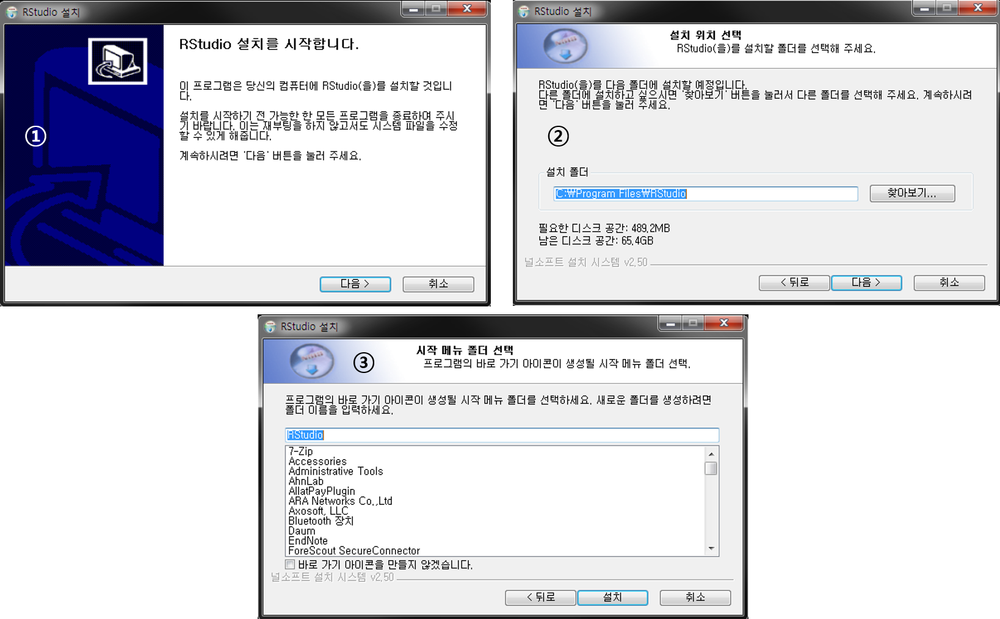

 \normalsize

5. 바탕화면 혹은 시작 프로그램에 새로 설치된 RStudio 아이콘 클릭 후 아래와 같은 프로그램 창이 나타나면 설치 성공

\footnotesize

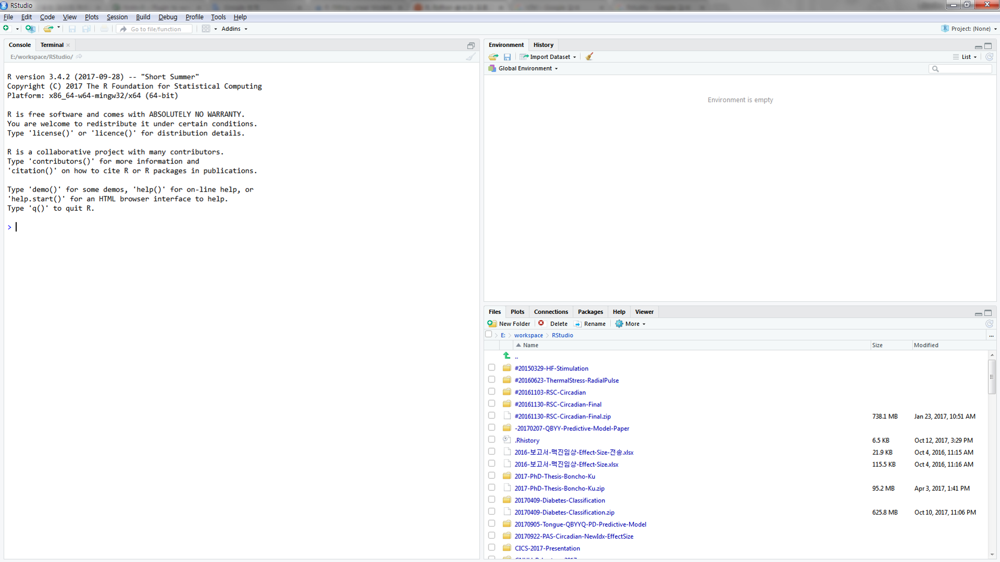

 \normalsize

### RStudio IDE 화면 구성{#rstudio-component}

RStudio는 아래 그림과 같이 4개 창으로 구성^[각 창의 위치는 세팅 구성에 따라 달라질 수 있음. 창 구성 방법은 RStudio 환경 옵션 설정에서 설명함.]

\footnotesize

<div class="figure" style="text-align: center">
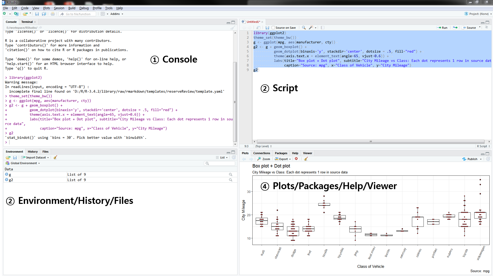
<p class="caption">(\#fig:rstudio-windows)RStudio 화면구성: 우하단 그림은 http://r-statistics.co/Top50-Ggplot2-Visualizations-MasterList-R-Code.html 에서 발췌</p>
</div>

 \normalsize

**1. 콘솔(console)**

- R 명령어 실행공간(RGui, 정확하게는 R 설치 디렉토리에서  "~/R/R.x.x/bin/x64/Rterm.exe" 가 구동되고 있는 공간)
- R script 또는 콘솔 창에서 작성한 명령어(프로그램) 실행 및 그 결과 출력
- 경고, 에러/로그 등의 메세지 확인

\footnotesize

<div class="figure" style="text-align: center">
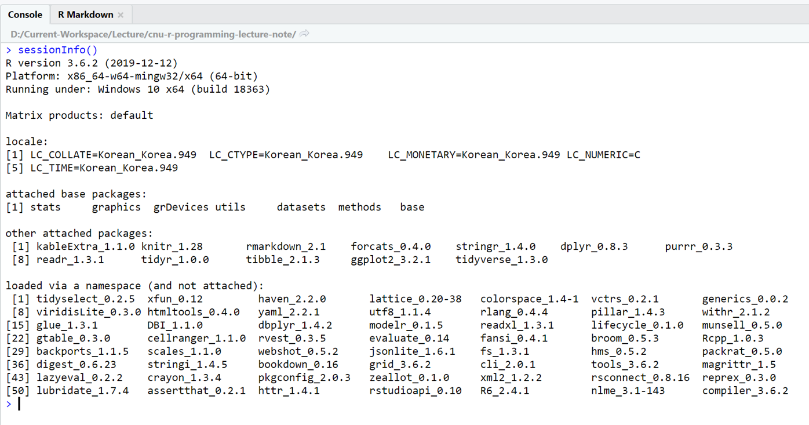
<p class="caption">(\#fig:rstudio-console)RStudio 콘솔창에서 명령어 실행 후 출력결과 화면</p>
</div>

 \normalsize


**2. 스크립트(script)** (Figure \@ref(fig:rstudio-new-script))

- R 명령어 입력 공간으로 일괄처리(batch processing) 가능
- 새로운 스크립트 창 열기
   - 아래 그림과 같이 pull-down 메뉴 좌측 상단 아이콘 클릭 후 [R script] 선택 
   - `[File]` $\rightarrow$ `[New File]` $\rightarrow$ `[R Script]` 선택
   - 단축 키: `[Ctrl] + [Shift] + [N]`
- 일괄 명령어 처리를 위한 RStudio 제공 단축 키
   - `[Ctrl] + [Enter]`: 선택한 블럭 내 명령어 실행
   - `[Alt] + [Enter]`: 선택 없이 커서가 위치한 라인의 명령어 실행
- R 스크립트 이외 R Markdown, R Notebook, Shiny web application 등 새 문서의 목적에 따라 다양한 종류의 소스 파일 생성 가능
- 저장된 R 스크립트 파일은 `파일명.R`로 저장됨
- 파일 실행 방법
   - 실행하고자 하는 파일을 읽은 후(`[File]` $\rightarrow$ `[Open File]` + 파일명 선택 또는 `파일명.R` 더블 클릭) 입력된 모든 라인을 선택한 뒤 `[Ctrl] + [Enter]`
   - 파일 읽은 후 `[Ctrl] + [Shift] + [S]` (현재 열려있는 `*.R` 파일에 대해) 또는 `[Ctrl] + [Shift] + [Enter]`

\footnotesize

<div class="figure" style="text-align: center">
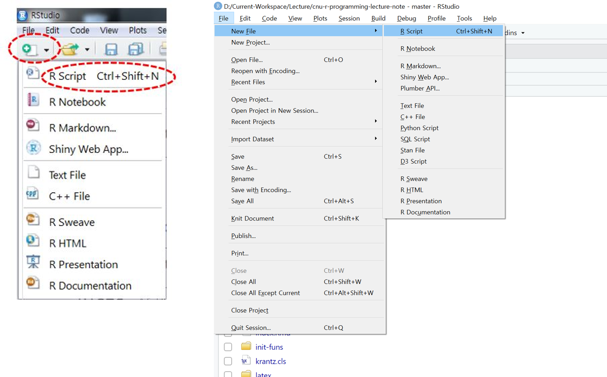
<p class="caption">(\#fig:rstudio-new-script)RStudio 스크립트 새로 열기</p>
</div>

 \normalsize

<br/>

\footnotesize

\BeginKnitrBlock{rmdtip}<div class="rmdtip">RStudio는 코딩 및 소스 작성의 효율성을 위해 여러 가지 단축 키를 제공하고 있음. 단축키는 아래 그림과 같이 pull down 메뉴 `[Tools]` 또는 `[Help]`에서 `[Keyboard shortcut help]` 또는 `[Alt] + [Shift] + [K]` 단축키를 통해 확인할 수 있음. 또는 Rstudio cheatsheet에서 단축키에 대한 정보를 제공하는데 pull down 메뉴 `[Help]` $\rightarrow$ `[Cheatsheets]` $\rightarrow$ `[RStudio IDE Cheat Sheet]`을 선택하면 각 아이콘 및 메뉴 기능에 대한 개괄적 설명 확인 가능함. 
</div>\EndKnitrBlock{rmdtip}

 \normalsize

**3. 환경/명령기록(Environment/History)** (Figure \@ref(fig:rstudio-env))

- **Environment**: 현재 R 작업환경에 저장되어 있는 객체의 특성 및 값 등을 요약 제시
   - 좌측 아래 화살표 버튼 클릭: 해당 객체의 상세 정보 확인
   - 우측 사각형 버튼 또는 객체(데이터셋명) 클릭: 객체가 데이터셋(데이터프레임)인 경우 스프레드 시트 형태로 데이터셋 확인

\footnotesize

<div class="figure" style="text-align: center">
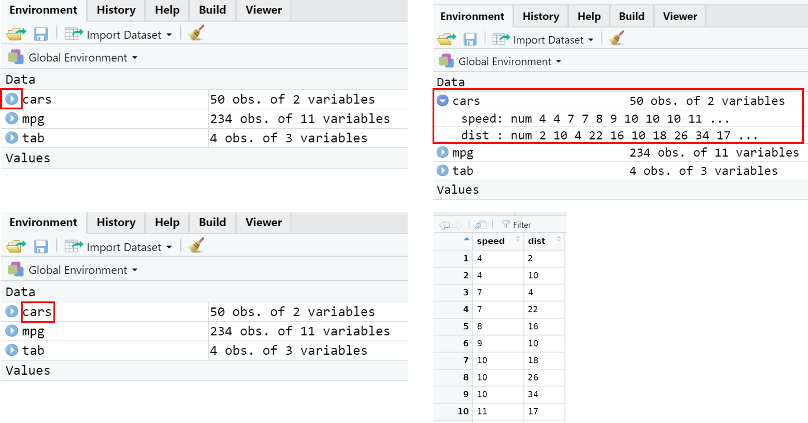
<p class="caption">(\#fig:rstudio-env)RStudio Environment 창 객체 상세 정보 및 스프레드 시트 출력 결과</p>
</div>

 \normalsize

- History: R 콘솔에서 실행된 명령어(스크립트)들의 이력 확인

\footnotesize


 \normalsize

**4. File/Plots/Packages/Help/Viewer**

- File: Windows 파일 탐색기와 유사한 기능 제공
   - 파일 및 폴더 생성, 삭제/파일 및 폴더명 수정, 그리고 작업경로 설정
      
\footnotesize

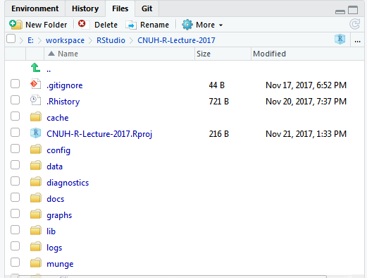

 \normalsize

- **Plots**: 생성한 그래프 출력
   - 작업 중 생성한 그래프 이력이 Plots 창에 저장: $\leftarrow$ 이전, $\rightarrow$ 최근
   - **`Zoom`**: 클릭 시 해당 그래프의 팝업창이 생성되고 팝업창의 크기 조정을 통해 그래프의 축소/확대 가능
   - **`Export`**: 선택한 그래프를 이미지 파일(`.png`, `.jpeg`, `.pdf` 등)로 저장할 수 있고, 클립보드로 복사 가능

\footnotesize

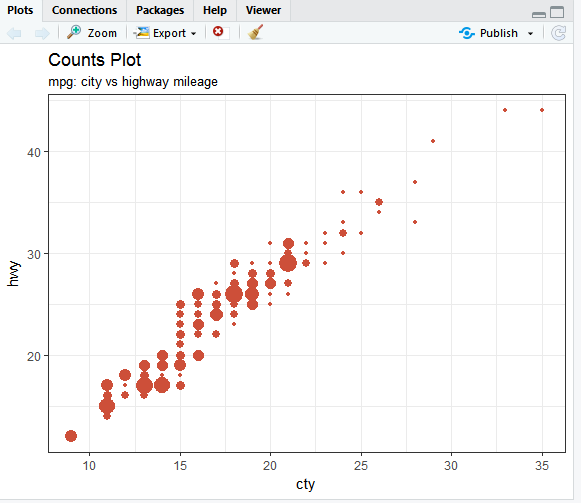

 \normalsize

- **Packages**: 현재 컴퓨터에 설치된 R 패키지 목록 출력
   - 신규 설치 및 업데이트 가능

\footnotesize

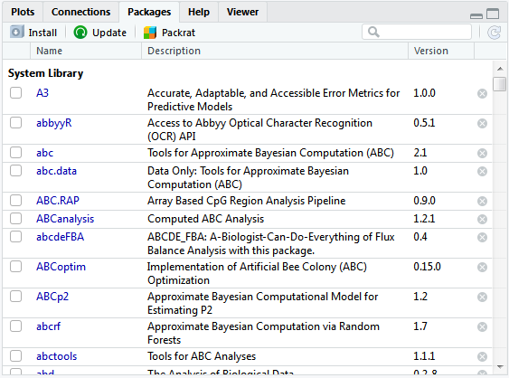

 \normalsize

- **Help**: `help(topic)` 입력 시 도움말 창이 출력되는 공간

\footnotesize


```r
help(lm)
```

 \normalsize

\footnotesize

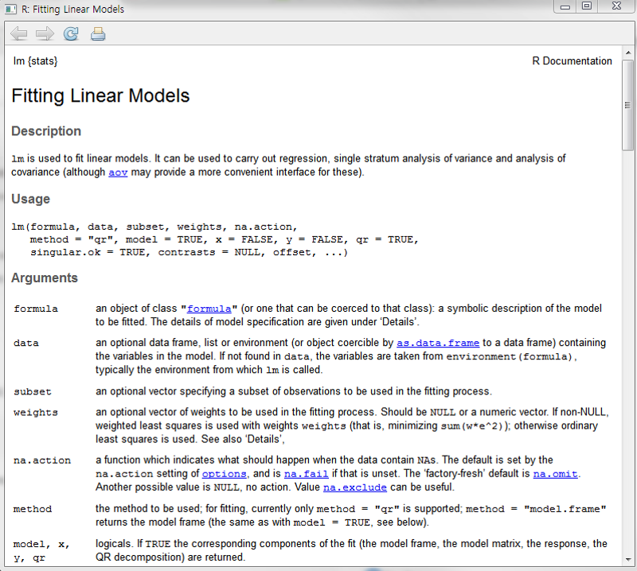

 \normalsize

### RStudio 환경 설정{#rstudio-glob-options}

Pull-down 메뉴에서 `[Tools]` $\rightarrow$ `[Global Options...]`를 선택

\footnotesize


 \normalsize


**General**: RStudio 운용 관련 전반적 설정 세팅

\footnotesize

<div class="figure" style="text-align: center">

<p class="caption">(\#fig:rstudio-glob-option)R General option 팝업 창</p>
</div>

 \normalsize

- **R version**: 만약 컴퓨터에 두 개 이상 다른 R 버전이 설치되어 있는 경우 `[Change]` 클릭 후 설정 변경 가능
- **Default Working directory**: 작업 디렉토리 지정([`Browse`] 클릭 후 임의 폴더 설정 가능)
- **Restore most recently opened project at startup**: RStudio 실행 시 가장 최근에 작업한 프로젝트로 이동
- **Restore previously open source documents at startup**: RStudio 실행 시 현재 프로젝트에서 가장 최근에 작업한 소스코드 문서를 함께 열어줌. 
- **Restore .RData into workspace at startup**: 작업 디렉토리에 존재하는 `.RData` 파일을 RStudio 실행 시 불러옴
- **Save workspace to .RData on exit**: R workspace 자동 저장(`.RData`) 여부
- **Always save history (even when not saving .RData) **: R 실행 명령 history 저장 여부(Always/Never/Ask) 
- **Remove duplicate entries in history**: history 저장 시 중복 명령 제거 여부

작업폴더(Working Directory)는 현재 R session에서 사용하는 기본 폴더로서 R 소스파일 및 데이터의 저장 및 로딩시 기본이 되는 폴더임. 

- 소스파일이나 데이터를 불러들일 때 작업 폴더에 있는 파일은 경로명을 지정하지 않고 파일명만 사용해도 됨
- 작업폴더가 아닌 곳에 있는 파일을 불러들일 때는 경로명까지 써 주어야함.
- R 데이터를 저장할때도 파일명만 쓰면 기본적으로 작업폴더에 저장되며, 다른 폴더에 저장하기 위해서는 경로명까지 써 주어야 함.

처음 컴퓨터에 RStudio를 설치하면 Working directory는 Windows 사용자 폴더(예: `user`)의 `Document` 폴더가 기본값으로 설정되어 있음. 기본 작업폴더를 변경하려면 Figure \@ref(fig:rstudio-glob-option)에서 설정 가능. 

현재 R session의 작업 디렉토리 설정 방법

- `[Session] -> [Set Working Directoy] -> [Choose Directory]`에서 설정

\footnotesize

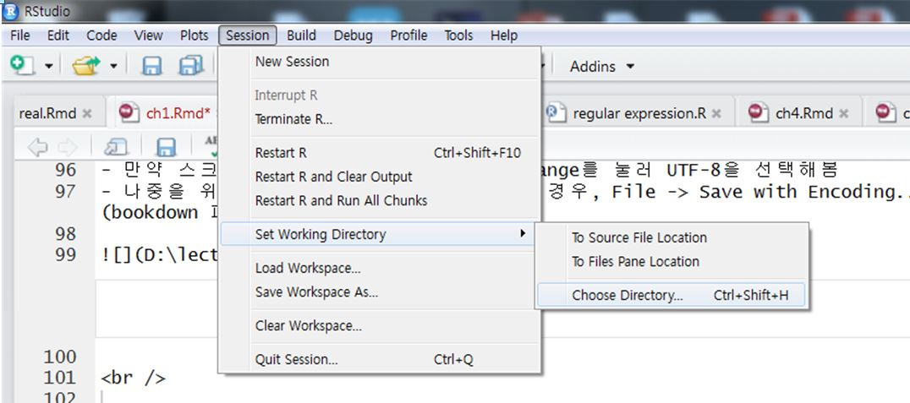

 \normalsize

R 콘솔에서 다음과 같은 명령어로 작업폴더를 확인 및 변경 가능

\footnotesize


```r
getwd() # 작업폴더 확인
```

```
[1] "D:/Current-Workspace/Lecture/cnu-r-programming-lecture-note"
```

 \normalsize

\footnotesize


```r
setwd("..") # 차상위 폴더로 이동
getwd()
```

```
[1] "D:/Current-Workspace/Lecture"
```

```r
setwd("../..") # 차차상위 폴더로 이동
getwd()
```

```
[1] "D:/"
```

```r
setwd("D:/Current-Workspace/Lecture/misc/") # 절대 폴더 명 입력
setwd("..")
# dir() # 폴더 내 파일 명 출력
getwd()
```

```
[1] "D:/Current-Workspace/Lecture"
```

```r
setwd("misc") # Current-Workspace 하위폴더인 misc 으로 이동
getwd()
```

```
[1] "D:/Current-Workspace/Lecture/misc"
```

```r
setwd("D:/Current-Workspace/Lecture/cnu-r-programming-lecture-note/")
getwd()
```

```
[1] "D:/Current-Workspace/Lecture/cnu-r-programming-lecture-note"
```

 \normalsize


\footnotesize

\BeginKnitrBlock{rmdcaution}<div class="rmdcaution">R에서 디렉토리 또는 폴더 구분자는 `/` 임. Windows에서 사용하는 구분자는 `\`인데, R에서 `\`는 특수문자로 간주하기 때문에 Windows 의 폴더명을 그대로 사용 시 에러 메세지를 출력함. 이를 해결하기 위해 Windows 경로명을 그대로 복사한 경우 경로 구분자 `\` 대신 `\\`로 변경

**실습**:  `C:\r-project`를 컴퓨터에 생성 후 해당 폴더를 default 작업폴더로 설정</div>\EndKnitrBlock{rmdcaution}

 \normalsize

<br/>

**Code: Editing**: 들여쓰기, 자동 줄바꿈 등 코드 편집에 대한 전반적 설정

\footnotesize


 \normalsize

- **Insert spaces for tab**: `[Tab]` 키를 눌렀을 때 공백(space) 개수 결정(본 강의노트: `Tab width = 4`)
- **Auto-detect code indentation**: 코들 들여쓰기 자동 감지 
- **Insert matching parens/quotes**: 따옴표, 괄호 입력 시 커서를 따옴표/괄호 사이로 자동 이동
- **Auto-indent code after paste**: 코드 복사 시 들여쓰기 일괄 적용
- **Vertically align arguments in auto-indent**: 함수 작성 시 들여쓰기 레벨 유지 여부
- **Soft-wrap R source file**: 스크립트 편집기 너비를 초과하는 경우 R 코드 행을 자동 줄바꿈
- **Continue comment when inserting new line**: 주석 표시를 다음 행에도 자동 적용 여부
- **Surround selection on text insertino**: 스크립트 상 text 선택 후 자동 따옴표 및 괄호 적용 여부
- **Focus console after executing from source**: 스크립트 실행 후 커서 위치를 콘솔로 이동 여부

**Code: Display**: 스크립트(소스) 에디터 표시 화면 설정

\footnotesize

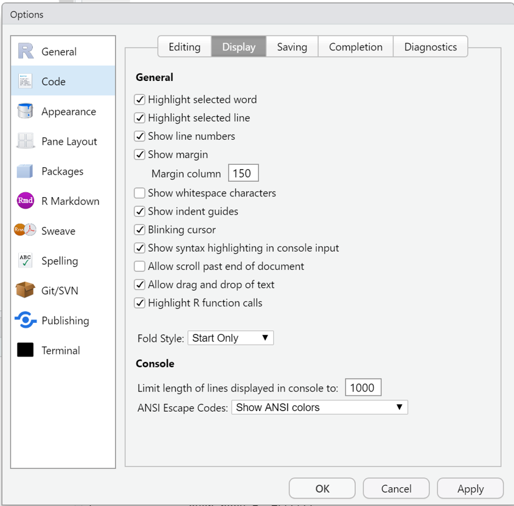

 \normalsize

- **Highlight selected word**: 스크립트 내 text 선택 시 동일한 text에 대해 배경강조 효과 여부
- **Highlight selected line**: 선택된 행에 대해 배경 강조효과 여부
- **Show line numbers**: 행 번호 보여주기 여부
- **Show margin**: 소스 에디터 오른 쪽에 지정한 margin column 보여주기 여부
- **Show whitespace characters**: 에디터에 공백 표시 여부
- **Show indent guides**: 현재 들여쓰기 열 표시 여부
- **Blinking cursor**: 커서 깜박임 여부 
- **Show syntax highlighting in console output**: 콘솔 입력 라인에 R 구문 강조 표시 적용 여부
- **Allow scroll past end of document**: 문서 마지막 행 이후 스크롤 허용 여부
- **Allow drag and drop of text**: 선택한 복수의 행으로 구성된 text에 대해 마우스 drag 허용
- **Highlight R function calls**: R 내장 및 패키지 제공함수에 대해 강조 여부

**Code: Saving**: 스크립트(소스) 에디터 저장 설정

\footnotesize


 \normalsize

- **Ensure that source file end with newline**
- **String trailing horizontal whitespace when saving**
- **Restore last cursor position when opening file**
- **Default text encoding**: 소스 에디터의 기본 설정 인코딩 설정 변경
   - RStudio의 Windows 버전 기본 text encoding은 `CP949` 임
   - Linux나 Mac OS의 경우 한글은 `UTF-8`로 인코딩이 설정되어 있음. 
   - R 언어는 Linux 환경에서 개발되었기 때문에 `UTF-8` 인코딩과 호환성이 더 좋음
   - 스크립트 파일의 한글이 깨질 때는 `[File] -> [Reopen with Encoding...]`에서 encoding 방식 변경

**Appearance**: RStudio 전체 폰트, 폰트 크기, theme 설정

\footnotesize

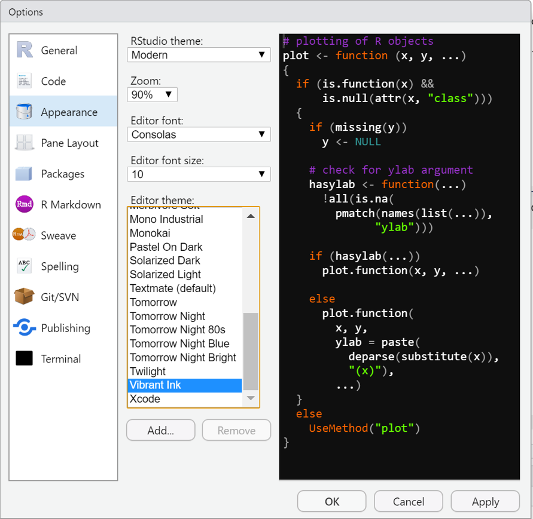

 \normalsize

- 본인의 취향에 맞게 폰트 및 테마(theme) 설정
- 취향 $\rightarrow$ 가독성이 제일 좋고 편안한 theme


**Pane Layout**: RStudio 구성 패널들의 위치 및 항목 등을 수정/추가/삭제(4개 페널은 항시 유지)

\footnotesize

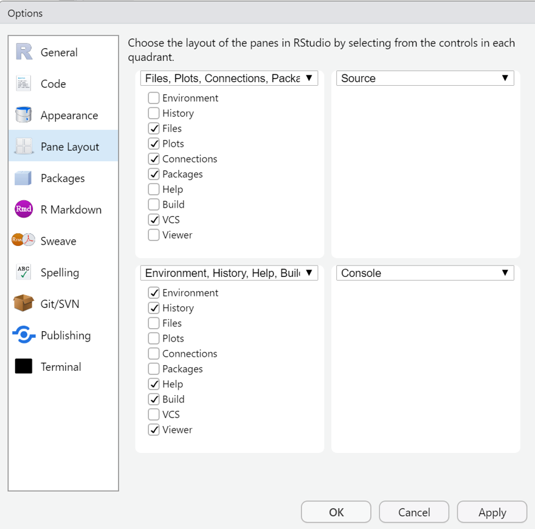

 \normalsize


\footnotesize

\BeginKnitrBlock{rmdimportant}<div class="rmdimportant">**실습**: 개인 취향에 맞게 RStudio 에디터 및 theme을 변경해 보자!!</div>\EndKnitrBlock{rmdimportant}

 \normalsize


### RStudio 프로젝트{#rstudio-project}

1. 프로젝트 
    - 물리적 측면: 최종 산출물(문서)를 생성하기 위한 데이터, 사진, 그림 등을 모아 놓은 폴더
    - 논리적 측면: R session 및 작업의 버전 관리

2. 프로젝트의 필요성
    - 자료의 정합성 보장
    - 다양한 확장자를 갖는 파일들이 한 폴더 내에 뒤섞일 때 곤란해 질 수 있음 
    - 실제 분석 및 그래프 생성에 사용한 정확한 프로그램 또는 코드 연결이 어려움
  
3. 좋은 프로젝트 구성을 위한 방법
    - 원자료(raw data)의 보호: 가급적 자료를 읽기 전용(read only) 형태로 다루기
    - 데이터 정제(data wrangling 또는 data munging)를 위한 스크립트와 정제 자료를 보관하는 읽기 전용 데이터 디렉토리 생성
    - 작성한 스크립트로 생성한 모든 산출물(테이블, 그래프 등)을 "일회용품"처럼 처리 $\rightarrow$ 스크립트로 재현 가능
    - 한 프로젝트 내 각기 다른 분석마다 다른 하위 디렉토리에 출력결과 저장하는 것이 유용

3. RStudio 새로운 프로젝트 생성
    - RStudio의 강력하고 유용한 기능
    - 새로운 프로젝트 생성: RStudio 메뉴에서 `[File]` $\rightarrow$ `[New Project]` 선택하면 아래와 같은 팝업 메뉴 생성

\footnotesize

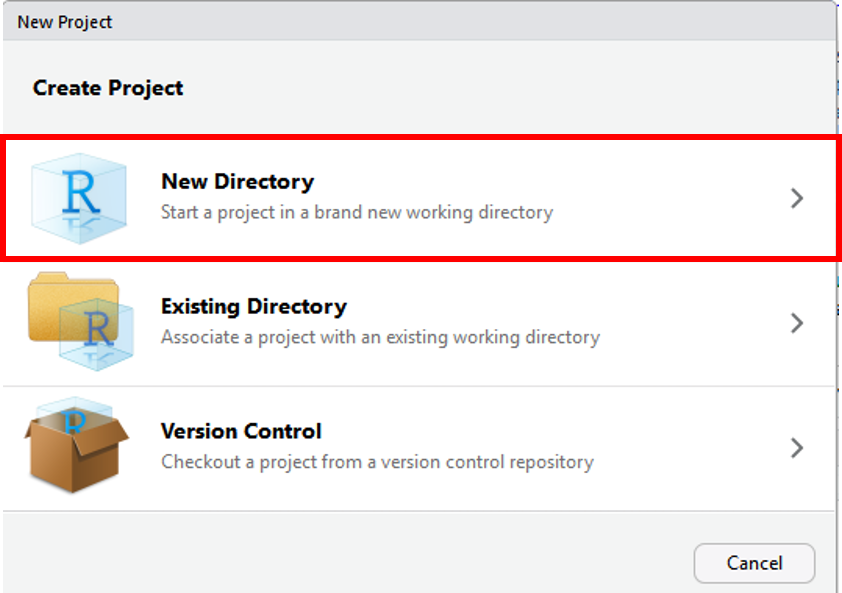

 \normalsize

4. 위 그림에서 `New Directory`를 선택하면 아래와 같은 팝업 창이 나타나면 아래와 같은 프로젝트 유형이 나타남. 여기서는 `New Project` 선택

\footnotesize

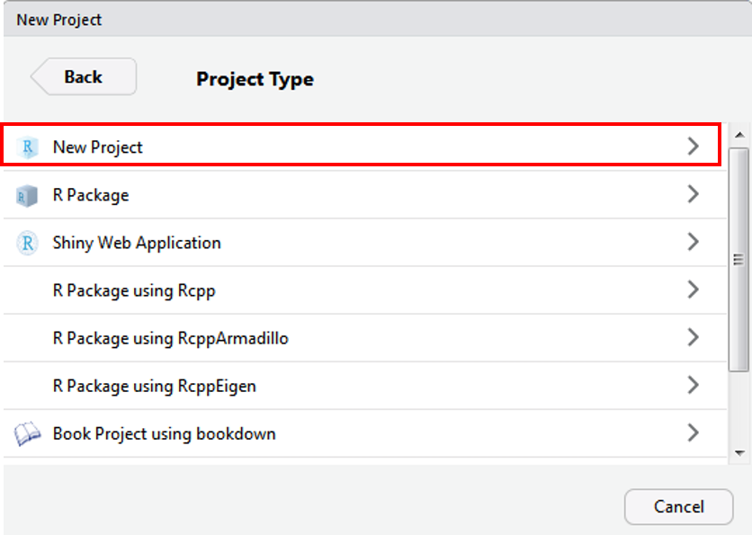

 \normalsize

5. 다음 팝업창에서 새로운 프로젝트의 폴더명을 지정 후 `Create Project` 클릭
   - 아래 `[Create projects as subdirectories of]`에서 생성하고자 하는 프로젝트의 상위 디렉토리 설정 $\rightarrow$ 보통 RStudio의 기본 작업폴더로 설정

\footnotesize

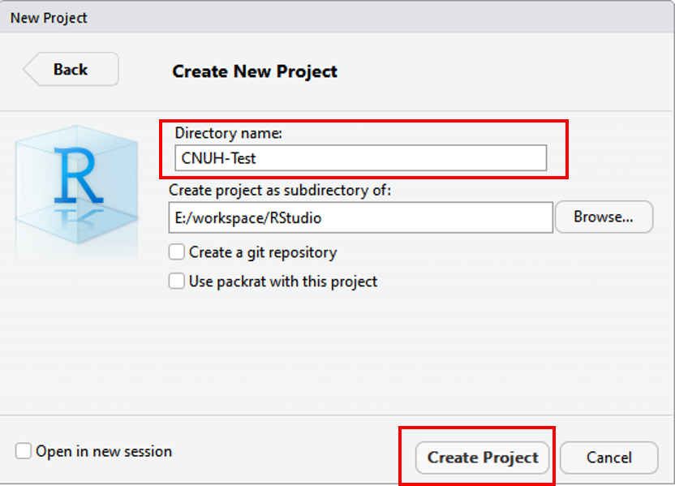

 \normalsize

6. 현재 R session 종료 후 새로운 프로젝트로 session 화면이 열리면 프로젝트 생성 완료

\footnotesize

\BeginKnitrBlock{rmdimportant}<div class="rmdimportant">**실습**: 프로젝트 생성

   - 위에서 설정한 작업폴더 내에 `학번-r-programming` 프로젝트 생성
   - 생성한 프로젝트 폴더 내에 `docs`, `figures`, `script` 폴더 생성
</div>\EndKnitrBlock{rmdimportant}

 \normalsize


## R 패키지{#r-package}

\footnotesize

\BeginKnitrBlock{rmdnote}<div class="rmdnote">**R 패키지(package)**: 특수 목적을 위한 로직으로 구성된 코드들의 집합으로 R에서 구동되는 분석툴을 통칭

   - CRAN을 통해 배포: 3자가 이용하기 쉬움 $\rightarrow$ R 시스템 환경에서 패키지는 가장 중요한 역할
   - CRAN [available package by name](https://cran.r-project.org/web/packages/available_packages_by_date.html) 또는 [available package by    date](https://cran.r-project.org/web/packages/available_packages_by_name.html)에서 현재 등재된 패키지 리스트 확인 가능
   - R console에서 `available.packages()` 함수를 통해서도 확인 가능
   - 현재 CRAN 기준(2020-03-17) 배포된 패키지의 개수는 16045 개임

**목적**: RStudio 환경에서 패키지를 설치하고 불러오기</div>\EndKnitrBlock{rmdnote}

 \normalsize

### R 패키지 경로 확인 및 변경{#r-package-path}

- 패키지 설치 시 일반적으로 R 환경에서 기본값으로 지정한 라이브러리 폴더에 저장
- 패키지 설치 전 R 패키지 설치 경로(path) 지정
- `.libPaths()` 함수를 통해 현재 설정된 패키지 저장 경로 확인

\footnotesize


```r
.libPaths()
```

```
[1] "C:/Users/user/Documents/R/win-library/4.0"
[2] "C:/Program Files/R/R-4.0.0/library"       
```

 \normalsize

- 일반적으로 첫 번째 경로를 디폴트 라이브러리 폴더로 사용
- 사용자 지정 라이브러리 경로를 설정 하려면 아래와 같은 절차로 진행

> **실습: c:/r-library 폴더를 패키지 경로로 지정**

1) `C:\`에서 [새로 만들기(W)] -> [폴더(F)] 선택 후 생성 폴더 이름을 `r-library`로 변경

2) 윈도우즈 `[제어판] -> [시스템 및 보안] -> [시스템] -> [고급 시스템 설정]` 클릭

\footnotesize

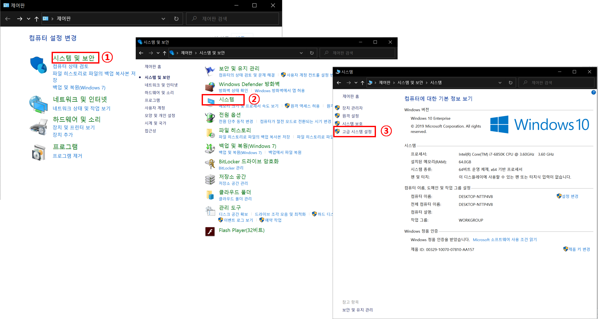

 \normalsize

3) `[환경변수(N)...]` 선택 후 시스템 변수에서 `[새로 만들기(W)...]` 클릭

\footnotesize

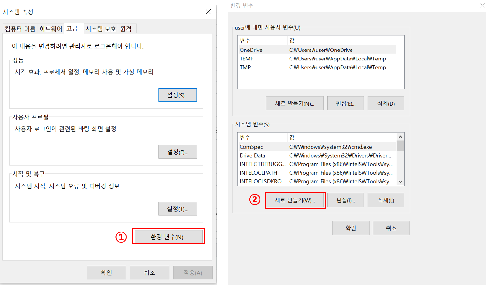

 \normalsize

4) 아래 그림과 같이 변수 이름(N)에 `R_LIBS`, 변수 값(V)에 해당 디렉토리 경로 `C:\r-library` 입력 후 확인 버튼 클릭

\footnotesize

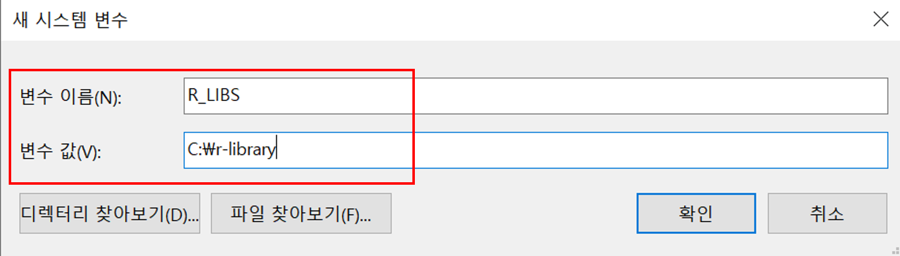

 \normalsize

5) 현재 RStudio 종료 후 재실행한 다음 콘솔창에 `.libPaths()` 입력 후 라이브러리 경로 확인

<!-- ```{r lib-path-test, comment=NA, tidy=TRUE} -->
<!-- .libPaths() -->
<!-- ``` -->

### R 패키지 설치하기{#r-package-install}

- RStudio 메뉴 `[Tools]` $\rightarrow$ `[Install packages]` 클릭 후 생성된 팝업 창에서 설치하고자 하는 패키지 입력 후 설치

\footnotesize

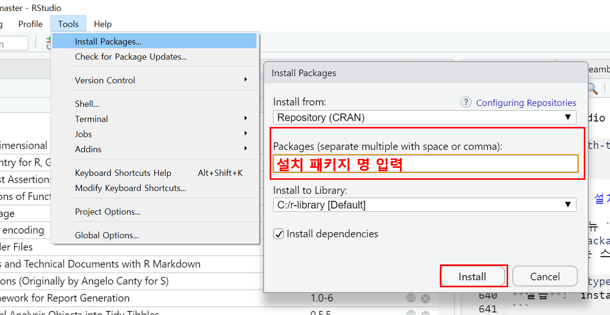

 \normalsize

- RStudio `Packages` 창에서 `[Install]` 버튼 누르면 위와 동일한 팝업창이 나타남(위와 동일)

\footnotesize

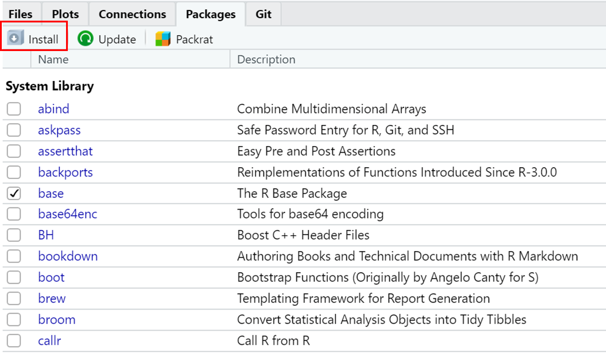

 \normalsize

- R 콘솔 또는 스크립트 창에서 `install.packages(package_name)` 함수를 사용해서 패키지 설치

\footnotesize

\BeginKnitrBlock{rmdimportant}<div class="rmdimportant">**실습**: `install.packages()` 함수를 이용해 `tidyverse` 패키지 설치</div>\EndKnitrBlock{rmdimportant}

 \normalsize

\footnotesize


```r
install.packages("tidyverse")
```

 \normalsize

> 위 명령어를 실행하면 `tidyverse` 패키지 뿐 아니라 연관된 패키지들이 동시에 설치됨


### R 패키지 불러오기{#r-package-load}

1. `library()` vs. `require()`
    - `library()`: 불러오고자 하는 패키지가 시스템에 존재하지 않는 경우 에러 메세지 출력(에러 이후 명령어들이 실행되지 않음)
    - `require()`: 패키지가 시스템에 존재하지 않는 경우 경고 메세지 출력(경고 이후 명령어 정상적으로 실행)

2. 다중 패키지 동시에 불러오기
    - RStudio `Packages` 창에서 설치하고자 하는 패키지 선택 버튼 클릭하면 R workspace로 해당 패키지 로드 가능
    - 스크립트 이용

\footnotesize

\BeginKnitrBlock{rmdimportant}<div class="rmdimportant">**실습**: `tidyverse` 패키지 불러오기</div>\EndKnitrBlock{rmdimportant}

 \normalsize

\footnotesize


```r
require(tidyverse)
```

```
필요한 패키지를 로딩중입니다: tidyverse
```

```
-- Attaching packages ------------------------------------------------------------------------------------------------------------- tidyverse 1.3.0 --
```

```
√ ggplot2 3.3.1     √ purrr   0.3.4
√ tibble  3.0.1     √ dplyr   1.0.0
√ tidyr   1.1.0     √ stringr 1.4.0
√ readr   1.3.1     √ forcats 0.5.0
```

```
-- Conflicts ---------------------------------------------------------------------------------------------------------------- tidyverse_conflicts() --
x dplyr::filter()     masks stats::filter()
x dplyr::group_rows() masks kableExtra::group_rows()
x dplyr::lag()        masks stats::lag()
```

 \normalsize

\footnotesize

\BeginKnitrBlock{rmdnote}<div class="rmdnote">실무에서 R의 활용능력은 패키지 활용 여부에 달려 있음. 즉, 목적에 맞는 업무를 수행하기 위해 가장 적합한 패키지를 찾고 활용하느냐에 따라 R 활용능력의 차이를 보임. 앞서 언급한 바와 같이 CRAN에 등록된 패키지는 16000 개가 넘지만, 이 중 많이 활용되고 있는 패키지의 수는 약 200 ~ 300 개 내외이고, 실제 데이터 분석 시 10 ~ 20개 정도의 패키지가 사용됨. 앞 예제에서 설치하고 불러온 `tidyverse` 패키지는 Hadley Wickham [@tidyverse2019]이 개발한 데이터 전처리 및 시각화 패키지 번들이고, 현재 R 프로그램 환경에 지대한 영향을 미침. 본 강의 "데이터프레임 가공 및 시각화"에서 해당 패키지 활용 방법을 배울 예정</div>\EndKnitrBlock{rmdnote}

 \normalsize

## R 기초 문법{#r-basic}

\footnotesize

\BeginKnitrBlock{rmdnote}<div class="rmdnote">본 절에서 다루는 R 문법은 R 입문 시 객체(object)의 명명 규칙과 R 콘솔 창에서 가장 빈번하게 사용되는 기초적인 명령어만 다룰 예정임. 심화 내용은 2-3주 차에 다룰 예정임. </div>\EndKnitrBlock{rmdnote}

 \normalsize

- R은 객체지향언어(object-oriented language)
   - 객체(object): 숫자, 데이터셋, 단어, 테이블, 분석결과 등 모든 것을 칭함
   - "객체지향"의 의미는 R의 모든 명령어는 객체를 대상으로 이루어진다는 것을 의미

\footnotesize

\BeginKnitrBlock{rmdtip}<div class="rmdtip">알아두면 유용한(콘솔창에서 매우 많이 사용되는) 명령어 및 단축키

- `ls()`: 현재 R 작업공간에 저장된 모든 객체 리스트 출력
- `rm(object_name)`: `object_name`에 해당하는 객체 삭제
- `rm(list = ls())`: R 작업공간에 저장된 모든 객체들을 일괄 삭제
- 단축키 `[Ctrl] + [L]`: R 콘솔 창 일괄 청소
- 단축키 `[Ctrl] + [Shift] + [F10]`: R session 초기화

**예시**</div>\EndKnitrBlock{rmdtip}

 \normalsize

\footnotesize


```r
x <- 7
y <- 1:30 #1에서 30까지 정수 입력
ls() #현재 작업공간 내 객체명 출력
```

```
 [1] "a"                  "b"                  "cars"              
 [4] "def.chunk.hook"     "fig_cap"            "hook_output"       
 [7] "tab"                "x"                  "y"                 
[10] "도움말 보기 명령어" "사용법"             "설명"              
```

 \normalsize

\footnotesize


```r
rm(x) # 객체 x 삭제
ls()
```

```
 [1] "a"                  "b"                  "cars"              
 [4] "def.chunk.hook"     "fig_cap"            "hook_output"       
 [7] "tab"                "y"                  "도움말 보기 명령어"
[10] "사용법"             "설명"              
```

```r
rm(a,b) # 객체 a,b 동시 삭제
ls()
```

```
[1] "cars"               "def.chunk.hook"     "fig_cap"           
[4] "hook_output"        "tab"                "y"                 
[7] "도움말 보기 명령어" "사용법"             "설명"              
```

```r
# rm(list = ls()) # 모든 객체 삭제
```

 \normalsize

#### R 객체 입력 방법 및 변수 설정 규칙{#r-object-nam-rule .unnumbered}

객체를 할당하는 두 가지 방법:`=`, `<-`

- 두 할당 지시자의 차이점
   - `=`: 명령의 최상 수준에서만 사용 가능
   - `<-`: 어디서든 사용 가능
   - 함수 호출과 동시에 변수에 값을 할당할 목적으로는 `<-`만 사용 가능

\footnotesize


```r
# mean(): 입력 벡터의 평균 계산
mean(y <- 1:5)
```

```
[1] 3
```

```r
y
```

```
[1] 1 2 3 4 5
```

```r
mean(x = 1:5)
```

```
[1] 3
```

```r
x
```

```
Error in eval(expr, envir, enclos): 객체 'x'를 찾을 수 없습니다
```

 \normalsize

객체 또는 변수의 명명 규칙

- 알파벳, 한글, 숫자, `_`, `.`의 조합으로 구성 가능(`-`은 사용 불가)
- 변수명의 알파벳, 한글, `.`로 시작 가능
- `.`로 시작한 경우 뒤에 숫자 올 수 없음(숫자로 인지)
- 대소문자 구분
    
\footnotesize


```r
# 1:10은 1부터 10까지 정수 생성
# 'c()'는 벡터 생성 함수
x <- c(1:10) 
# 1:10으로 구성된 행렬 생성
X <- matrix(c(1:10), nrow = 2, ncol = 5, byrow = T)
x
```

```
 [1]  1  2  3  4  5  6  7  8  9 10
```

```r
X
```

```
     [,1] [,2] [,3] [,4] [,5]
[1,]    1    2    3    4    5
[2,]    6    7    8    9   10
```

```r
# 논리형 객체
.x <- TRUE
.x
```

```
[1] TRUE
```

```r
# 알파벳 + 숫자
# seq(): 수열을 만드는 함수
# 1 에서부터(from) 10 까지(to) 공차가 2(by)인 수열
a1 <- seq(from = 1, to = 10, by = 2)
# 한글 변수명
가수 <- c("Damian Rice", "Beatles", "최백호", "Queen", "Carlos Gardel", "BTS", "조용필")
가수
```

```
[1] "Damian Rice" "Beatles" "최백호"
"Queen"
[5] "Carlos Gardel" "BTS" "조용필"
```

 \normalsize

3. 잘못된 객체 또는 변수 명명 예시

\footnotesize


```r
3x <- 7
```

```
Error: <text>:1:2: 예상하지 못한 기호(symbol)입니다.
1: 3x
     ^
```

 \normalsize

\footnotesize


```r
_x <- c("M", "M", "F")
```

```
Error: <text>:1:1: 예상하지 못한 입력입니다.
1: _
    ^
```

 \normalsize

\footnotesize


```r
.3 <- 10
```

```
Error in 0.3 <- 10: 대입에 유효하지 않은 (do_set) 좌변입니다
```

 \normalsize


## R Markdown (맛보기){#r-markdown-get-start}

\footnotesize

\BeginKnitrBlock{rmdnote}<div class="rmdnote">[R 기초 문법] 절과 마찬가지로 R Markdown을 이용해 최소한의 문서(`html` 문서)를 작성하고 생성하는 방법에 대해 기술함. R Markdown에 대한 보다 상세한 내용은 본 수업의 마지막 주차에 다룰 예정임. </div>\EndKnitrBlock{rmdnote}

 \normalsize

1. R Markdown은 R 코드와 분석 결과(표, 그림 등)을 포함한 문서 또는 컨텐츠를 제작하는 도구로 일반적으로 아래 열거한 형태로 활용함
   - 문서 또는 논문(`pdf`, `html`, `docx`)
   - 프리젠테이션(`pdf`, `html`, `pptx`)
   - 웹 또는 블로그

2. 재현가능(reproducible)한 분석 및 연구^[과학적 연구의 결과물을 오픈소스로 내놓고 누구라도 검증 가능] 가능
   - 신뢰성 있는 문서 작성
   - `Copy & paste`를 하지 않고 효율적 작업 가능
   
3. R Markdown 문서를 통해 최종 결과물(`pdf`, `html`, `docx`)이 도출되는 process
   - 현재 공식적인 프로세스는 `knitr` + `rmarkdown` + `pandoc` + `RStudio` + `github`

\footnotesize

<div class="figure" style="text-align: center">

<p class="caption">(\#fig:rmarkdown-flow)R Markdown의 최종 결과물 산출과정(http://applied-r.com/project-reporting-template/)</p>
</div>

 \normalsize

#### R Markdown 문서 시작하기{#create-rmd-file .unnumbered}

- **R Markdown** 문서 생성: `[File] -> [New File] -> [R Markdown..]`을 선택

\footnotesize

\BeginKnitrBlock{rmdcaution}<div class="rmdcaution">RStudio를 처음 설치하고 위와 같이 진행할 경우 아래와 같은 패키지 설치 여부를 묻는 팝업 창이 나타남. 패키지 설치 여부에 `[Yes]`를 클릭하면 R Markdown 문서 생성을 위해 필요한 패키지들이 자동으로 설치</div>\EndKnitrBlock{rmdcaution}

 \normalsize

\footnotesize


 \normalsize

- 설치 완료 후 R Markdown으로 생성할 최종 문서 유형 선택 질의 창이 나타남. 아래 창에서 제목(Title)과 저자(Author) 이름 입력 후 `[OK]` 버튼 클릭(`Document`, `html` 문서 선택)

\footnotesize

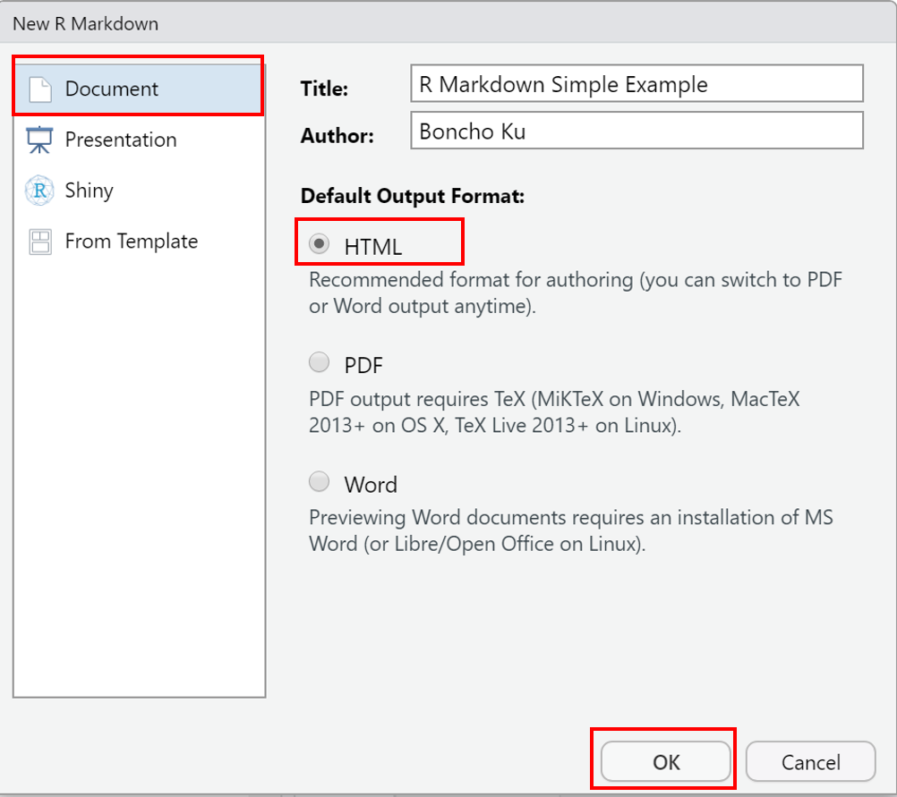

 \normalsize

- 아래 그림과 같이 새로운 문서 창이 생성되고 `test.Rmd` 파일로 저장^[[RStudio 프로젝트]에서 생성한 폴더 내에 파일 저장]

\footnotesize

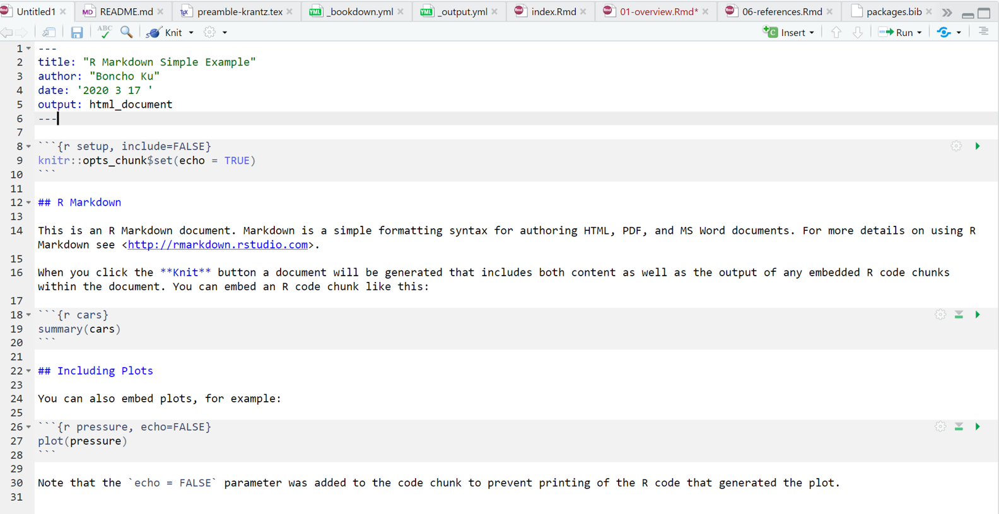

 \normalsize

- 문서 상단에 `Knit` 아이콘을 클릭 후 `Knit to HTML` 클릭 또는 문서 아무 곳에 커서를 위치하고 단축키 `[Ctrl] + [Shift] + [K]` 입력

\footnotesize


 \normalsize

- `knitr` + `R Markdown` + `pandoc` $\rightarrow$ `html` 파일 생성 결과

\footnotesize

<div class="figure" style="text-align: center">

<p class="caption">(\#fig:rmarkdown-new-out)test.html 문서 화면(저장 폴더 내 `test.html`을 크롬 브라우저로 실행)</p>
</div>

 \normalsize

#### R Markdown 문서 구성

R Markdown 문서는 아래 그림과 같이 **YAML**, **Markdown 텍스트**, **Code Chunk** 세 부분으로 구성됨. 

\footnotesize


 \normalsize

**1. YAML (YAML Ain't Markup Language)**

- R Markdown 문서의 metadata로 문서의 맨 처음에 항상 포함되어야 함. 
- R Markdown 문서의 최종 출력 형태, 제목, 저자, 날짜 등의 정보 등을 포함
- YAML 언어에 대한 사용 예시는 @xie-2016 의 [Appendix B.2](https://bookdown.org/yihui/bookdown/r-markdown.html) 참고
- 최소 형태의 YAML 예시 

\footnotesize


```yaml
---
title: "Hello R Markdown"
author: "Zorba"
date: "2020-03-17"
output: html_document
---
```

 \normalsize

**2. Markdown 텍스트**

- Markdown 문법은 15주 차 강의에서 배울 예정임
- [R Markdown 레퍼런스 가이드](https://rstudio.com/wp-content/uploads/2015/03/rmarkdown-reference.pdf) 참조
- 그림 삽입: ``

````markdown
그립 삽입 구문
   
````


 


**3. Code Chunk**

- 실제 R code가 실행되는 부분임
- Code chunk 실행 시 다양한 옵션들이 있으나 이 부분 역시 15주 차 강의에서 간략히 다룰 예정임
- Code chunk는  ```` ```{r} ````로 시작되며 `r`은 code 언어 이름을 나타냄.
- Code chunk는 ```` ``` ```` 로 종료
- R Markdown 문서 작성 시 단축키 `[Ctrl] + [Alt] + [I]`를 입력하면 Chunk 입력창이 자동 생성됨
- Chunk option에 대한 상세 내용은 https://yihui.org/knitr/options/ 또는 [R Markdown 레퍼런스 가이드](https://rstudio.com/wp-content/uploads/2015/03/rmarkdown-reference.pdf) 참조

````markdown
Code chunk 예시

Xie의 R Markdown: The Definitive Guide에서 발췌

```{r}
fit = lm(dist ~ speed, data = cars)
b   = coef(fit)
plot(cars)
abline(fit)
```
````
\footnotesize


```r
fit = lm(dist ~ speed, data = cars)
b   = coef(fit)
plot(cars)
abline(fit)
```

<!-- -->

 \normalsize

- Code chunk에서 외부 그림 파일 불러오기(@xie-2018 에서 예시 발췌) 

\footnotesize


```r
knitr::include_graphics(rep('figures/knit-logo.png', 3))
```


 \normalsize


\footnotesize

\BeginKnitrBlock{rmdimportant}<div class="rmdimportant">**Homework 1**: R Markdown 문서에 아래 내용을 포함한 문서를 `html` 파일 형식으로 출력 후 제출

   - 간략한 자기소개 및 "통계 프로그래밍 언어" 수업에 대한 본인만의 목표 기술
   - 본인이 setting 한 RStudio 구성 캡쳐 화면을 그림 파일로 저장하고 R Markdown 문서에 삽입(화면 캡쳐 시 생성 프로젝트 내 폴더 내용 반드시 포함)
   - 패키지 `ggplot2`를 불러오고 `cars` 데이터셋의 2차원 산점도(**hint**: `help(geom_point)` 또는 googling 활용)를 문서에 포함
</div>\EndKnitrBlock{rmdimportant}

 \normalsize


<!--  -->
<!-- # References {-} -->
<!--  -->

