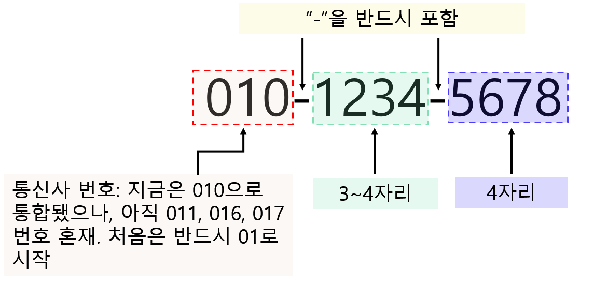

# 문자열 처리와 정규표현식 {#string-regexp}


\footnotesize

\BeginKnitrBlock{rmdimportant}<div class="rmdimportant">**학습 목표**

- 텍스트 문자 처리에 있어 가장 기본인 정규 표현식(regular rexpression)에 대해 알아본다.
- R에서 기본으로 제공하는 문자열 차리 함수에 대해 알아본다
</div>\EndKnitrBlock{rmdimportant}

 \normalsize


#### **학습 필요성** {#ch03-require .unnumbered}


- 실제 데이터는 다양한 형태의 텍스트(문자열)을 포함


- R에서 문자열을 이용한 반복 계산 가능


- 대규모 텍스트 데이터(웹문서, 블로그, SNS, 뉴스, 논문, 상품평, ...)로부터 새로운 정보 및 지식을 도출하기 위한 텍스트 마이닝이 대두 되면서 텍스트 처리에 대한 기본적 이해 필요


- 여러 문자열로 이루어진 방대한 텍스트 벡터에서 특정 패턴을 갖고 있는 구문을 선별해야 할 경우, 패턴을 도식화 할 수 있는 함축적 표현이 필요 $\rightarrow$ **정규 표현식**


#### **정규 표현식의 기본함수** {#regex-prim-fun .unnumbered}


- `grep()`, `grepl()`: 문자형 벡터에서 정규 표현식 또는 문자 패턴의 일치를 검색. 
   - `grep()`: 일치하는 특정 문자열을 포함하는 문자형 벡터 또는 인덱스를 반환
   - `grepl()`: 문자열 포함 여부에 대한 논리값 반환  


- `regexpr()`, `gregexpr()`: 문자형 벡터에서 정규 표현식 또는 문자 패턴과 일치하는 원소를 검색하고, 일치가 시작되는 문자열의 인덱스와 일치 길이를 반환

- `sub()`, `gsub()`: 문자열 벡터에서 정규 표현식 또는 문자 패턴과 일치하는 원소를 검색하고 해당 문자열을 다른 문자열로 변경

- `regexec()`: `regexpr()`과 동일하게 일치가 시작되는 문자열의 인덱스를 반환하지만 괄호로 묶인 하위 표현식의 위치를 추가로 반환


> **Note**: 정규 표현식 및 문자열 처리를 위한 함수의 종류는 매우 다양하지만, 본 강의에서는 정규 표현식의 이해를 위해 일부만 소개할 것임


#### **문자열 기초** {#string-basic .unnumbered}


- 탈출 지시자(escape indicator): `\` 
   - 키보드로 입력할 수 없는 문자를 입력하기 위해 사용
   - 문자열에 백슬래쉬 `\`를 입력하려면 `\\`로 표시


\footnotesize


```r
# 문자열에 따옴표(single of double quote, ', ") 입력
double_quote <- "\"" 
double_quote
```

```
[1] "\""
```

```r
single_quote <- '\'' 
single_quote
```

```
[1] "'"
```

```r
x <- c("\"", "\\", '\'')
writeLines(x)
```

```
"
\
'
```

```r
# 백슬레쉬가 포함된 문자열
x <- "abc\n\tabc"

# \n: Enter
# \t: tab 문자를 표현

writeLines(x)
```

```
abc
	abc
```

```r
# 특수문자 표현
x <- "\u00b5" # 그리스 문자 mu 표현 (유니코드)
x
```

```
[1] "μ"
```

 \normalsize


\footnotesize

\BeginKnitrBlock{rmdtip}<div class="rmdtip">**참고자료**

   - [Youtube 동영상](https://www.youtube.com/watch?v=q8SzNKib5-4&t=18s): 영어 강의가 옥의 티...
   - [regexr.com](https://regexr.com): 정규 표현식의 패턴 확인 가능
   - [Wikibooks R programming: Text processing](https://en.wikibooks.org/wiki/R_Programming/Text_Processing)
</div>\EndKnitrBlock{rmdtip}

 \normalsize


## 유용한 문자열 관련 함수

### **`nchar()`** {#nchar}

- 인간이 눈으로 읽을 수 있는 문자의 개수(길이)를 반환
- 공백, 줄바꿈 표시자(예: `\n`)도 하나의 문자 개수로 인식
- 한글의 한 글자는 2 바이트(byte)지만 한 글자로 인식 $\rightarrow$ byte 단위 반환 가능

\footnotesize


```r
# 문자열을 구성하는 문자 개수 반환
nchar(
  x, # 문자형 벡터
  type # "bytes": 바이트 단위 길이 반환
       # "char": 인간이 읽을 수 있는 글자 길이 반환
       # "width": 문자열이 표현된 폭의 길이 반환
)
```

 \normalsize


- 예시


\footnotesize


```r
x <- "Carlos Gardel's song: Por Una Cabeza"
nchar(x)
```

```
[1] 36
```

```r
y <- "abcde\nfghij"
nchar(y)
```

```
[1] 11
```

```r
z <- "양준일: 가나다라마바사"
nchar(z)
```

```
[1] 12
```

```r
# 문자열 벡터
str <- sentences[1:10]
nchar(str)
```

```
 [1] 42 43 38 40 36 37 43 43 35 40
```

```r
s <- c("abc", "가나다", "1234[]", "R programming\n", "\"R\"")

nchar(s, type = "char")
```

```
[1]  3  3  6 14  3
```

```r
nchar(s, type = "byte")
```

```
[1]  3  6  6 14  3
```

```r
nchar(s, type = "width")
```

```
[1]  3  6  6 14  3
```

 \normalsize


\footnotesize

\BeginKnitrBlock{rmdwarning}<div class="rmdwarning">백터의 원소 개수를 반환하는 `length()` 함수와는 다름. </div>\EndKnitrBlock{rmdwarning}

 \normalsize


### **`paste()`**, **`paste0()`** {#paste}

- 하나 이상의 문자열을 연결하여 하나의 문자열로 만들어주는 함수
- Excel의 문자열 연결자인 `&`와 거의 동일한 기능을 수행


\footnotesize


```r
paste(
  ..., # 한 개 이상의 R 객체. 강제로 문자형 변환
  sep  # 연결 구분자: 디폴트 값은 공백(" ")
  collapse # 묶을 객체가 하나의 문자열 벡터인 경우
           # 모든 원소를 collapse 구분자로 묶은 길이가 1인 벡터 반환
)
```

 \normalsize


- `paste0()`은 `paste()`의 wrapper 함수이고 `paste()`의 구분자 인수 `sep = ""` 일 때와 동일한 결과 반환
- 예시

\footnotesize


```r
i <- 1:length(letters)

paste(letters, i) # sep = " "
```

```
 [1] "a 1"  "b 2"  "c 3"  "d 4"  "e 5"  "f 6"  "g 7"  "h 8"  "i 9"  "j 10"
[11] "k 11" "l 12" "m 13" "n 14" "o 15" "p 16" "q 17" "r 18" "s 19" "t 20"
[21] "u 21" "v 22" "w 23" "x 24" "y 25" "z 26"
```

```r
paste(letters, i, sep = "_") # sep = "-"
```

```
 [1] "a_1"  "b_2"  "c_3"  "d_4"  "e_5"  "f_6"  "g_7"  "h_8"  "i_9"  "j_10"
[11] "k_11" "l_12" "m_13" "n_14" "o_15" "p_16" "q_17" "r_18" "s_19" "t_20"
[21] "u_21" "v_22" "w_23" "x_24" "y_25" "z_26"
```

```r
paste0(letters, i) # paste(letters, i, sep = "") 동일
```

```
 [1] "a1"  "b2"  "c3"  "d4"  "e5"  "f6"  "g7"  "h8"  "i9"  "j10" "k11" "l12"
[13] "m13" "n14" "o15" "p16" "q17" "r18" "s19" "t20" "u21" "v22" "w23" "x24"
[25] "y25" "z26"
```

```r
# collapse 인수 활용
paste(letters, collapse = "")
```

```
[1] "abcdefghijklmnopqrstuvwxyz"
```

```r
writeLines(paste(str, collapse = "\n"))
```

```
The birch canoe slid on the smooth planks.
Glue the sheet to the dark blue background.
It's easy to tell the depth of a well.
These days a chicken leg is a rare dish.
Rice is often served in round bowls.
The juice of lemons makes fine punch.
The box was thrown beside the parked truck.
The hogs were fed chopped corn and garbage.
Four hours of steady work faced us.
Large size in stockings is hard to sell.
```

```r
# 3개 이상 객체 묶기
paste("Col", 1:2, c(TRUE, FALSE, TRUE), sep =" ", collapse = "<->")
```

```
[1] "Col 1 TRUE<->Col 2 FALSE<->Col 1 TRUE"
```

```r
# paste 함수 응용
# 스트링 명령어 실행 
exprs <- paste("lm(mpg ~", names(mtcars)[3:5], ", data = mtcars)")
exprs
```

```
[1] "lm(mpg ~ disp , data = mtcars)" "lm(mpg ~ hp , data = mtcars)"  
[3] "lm(mpg ~ drat , data = mtcars)"
```

```r
sapply(1:length(exprs), function(i) coef(eval(parse(text = exprs[i]))))
```

```
                   [,1]        [,2]      [,3]
(Intercept) 29.59985476 30.09886054 -7.524618
disp        -0.04121512 -0.06822828  7.678233
```

 \normalsize


### **`sprintf()`** {#sprintf}

- `C` 언어의 `sprintf()` 함수와 동일하며 특정 변수들의 값을 이용해 문자열을 반환함
- 수치형 값의 소숫점 자리수를 맞추거나 할 때 유용하게 사용
- 포맷팅 문자열을 통해 수치형의 자릿수를 지정 뿐 아니라 전체 문자열의 길이 및 정렬 가능
- 대표적인 포맷팅 문자열은 아래 표와 같음. 

\footnotesize

<table>
 <thead>
  <tr>
   <th style="text-align:left;"> Format </th>
   <th style="text-align:left;"> 설명 </th>
  </tr>
 </thead>
<tbody>
  <tr>
   <td style="text-align:left;"> %s </td>
   <td style="text-align:left;"> 문자열 </td>
  </tr>
  <tr>
   <td style="text-align:left;"> %d </td>
   <td style="text-align:left;"> 정수형 </td>
  </tr>
  <tr>
   <td style="text-align:left;"> %f </td>
   <td style="text-align:left;"> 부동 소수점 수 </td>
  </tr>
  <tr>
   <td style="text-align:left;"> %e, %E </td>
   <td style="text-align:left;"> 지수형 </td>
  </tr>
</tbody>
</table>

 \normalsize


- 예시 

\footnotesize


```r
options()$digits #
```

```
[1] 7
```

```r
pi # 파이 값
```

```
[1] 3.141593
```

```r
sprintf("%f", pi) 
```

```
[1] "3.141593"
```

```r
# 소숫점 자리수 3자리 까지 출력
sprintf("%.3f", pi)
```

```
[1] "3.142"
```

```r
# 소숫점 출력 하지 않음
sprintf("%1.0f", pi)
```

```
[1] "3"
```

```r
# 출력 문자열의 길이를 5로 고정 후
# 소숫점 한 자리까지 출력
sprintf("%5.1f", pi)
```

```
[1] "  3.1"
```

```r
nchar(sprintf("%5.1f", pi))
```

```
[1] 5
```

```r
# 빈 공백에 0값 대입
sprintf("%05.1f", pi)
```

```
[1] "003.1"
```

```r
# 양수/음수 표현
sprintf("%+f", pi)
```

```
[1] "+3.141593"
```

```r
sprintf("%+f", -pi)
```

```
[1] "-3.141593"
```

```r
# 출력 문자열의 첫 번째 값을 공백으로
sprintf("% f", pi) 
```

```
[1] " 3.141593"
```

```r
# 왼쪽 정렬
sprintf("%-10.3f", pi)
```

```
[1] "3.142     "
```

```r
# 수치형에 정수 포맷을 입력하면?
sprintf("%d", pi)
```

```
Error in sprintf("%d", pi): '%d'는 유효하지 않은 포맷입니다; 수치형 객체들에는 포맷 %f, %e, %g 또는 %a를 사용해 주세요
```

```r
sprintf("%d", 100); sprintf("%d", 20L)
```

```
[1] "100"
```

```
[1] "20"
```

```r
# 지수형
sprintf("%e", pi)
```

```
[1] "3.141593e+00"
```

```r
sprintf("%E", pi)
```

```
[1] "3.141593E+00"
```

```r
sprintf("%.2E", pi)
```

```
[1] "3.14E+00"
```

```r
# 문자열 
sprintf("%s = %.2f", "Mean", pi)
```

```
[1] "Mean = 3.14"
```

```r
# 응용 
mn <- apply(cars, 2, mean)
std <- apply(cars, 2, sd)

# Mean ± SD 형태로 결과 출력 (소숫점 2자리 고정)
res <- sprintf("%.2f \U00B1 %.2f", mn, std)
resp <- paste(paste0(names(cars), ": ", res), collapse = "\n")
writeLines(resp)
```

```
speed: 15.40 ± 5.29
dist: 42.98 ± 25.77
```

 \normalsize


### **`substr()`** {#substr}


- 문자열에서 특정 부분을 추출하는 함수
- 보통 한 문자열이 주어졌을 때 `start`에서 `end` 까지 추출

\footnotesize


```r
substr(
  x, # 문자형 벡터
  start, # 문자열 추출 시작 위치
  stop # 무자열 추출 종료 위치
)
```

 \normalsize

- 예시 

\footnotesize


```r
cnu <- "충남대학교 자연과학대학 정보통계학과"
substr(cnu, start = 14, stop = nchar(str))
```

```
[1] "정보통계학과"
```

```r
# 문자열 벡터에서 각 원소 별 적용
substr(str, 5, 15)
```

```
 [1] "birch canoe" " the sheet " " easy to te" "e days a ch" " is often s"
 [6] "juice of le" "box was thr" "hogs were f" " hours of s" "e size in s"
```

 \normalsize

### **`tolower()`, `toupper()`** {#low-up-fun}

- 대문자를 소문자(`tolower()`) 혹은 소문자를 대문자(`toupper()`)로 변환

\footnotesize


```r
LETTERS; tolower(LETTERS)
```

```
 [1] "A" "B" "C" "D" "E" "F" "G" "H" "I" "J" "K" "L" "M" "N" "O" "P" "Q" "R" "S"
[20] "T" "U" "V" "W" "X" "Y" "Z"
```

```
 [1] "a" "b" "c" "d" "e" "f" "g" "h" "i" "j" "k" "l" "m" "n" "o" "p" "q" "r" "s"
[20] "t" "u" "v" "w" "x" "y" "z"
```

```r
letters; toupper(letters)
```

```
 [1] "a" "b" "c" "d" "e" "f" "g" "h" "i" "j" "k" "l" "m" "n" "o" "p" "q" "r" "s"
[20] "t" "u" "v" "w" "x" "y" "z"
```

```
 [1] "A" "B" "C" "D" "E" "F" "G" "H" "I" "J" "K" "L" "M" "N" "O" "P" "Q" "R" "S"
[20] "T" "U" "V" "W" "X" "Y" "Z"
```

 \normalsize


## 정규표현식 기본 함수 {#regexp-basic-fun}

### **`grep()`, `grepl()`** {#grep-grepl}

정규표현식을 이용한 특정 문자 패턴 검색 시 가장 빈번히 사용되는 함수들 중 하나임. 

#### **`grep()`** {#grep .unnumbered}

특정 문자 벡터에서 찾고자 하는 패턴과 일치하는 원소의 인덱스, 원소값 반환


\footnotesize


```r
# 일치하는 특정 문자열을 포함하는 원소값(문자형) 또는 인덱스(정수)를 반환

grep(
  pattern, # 정규 표현식 또는 문자 패턴
  string,  # 패턴을 검색할 문자열 벡터
  value    # 논리값 
           # TRUE: pattern에 해당하는 원소값 반환
           # FALSE: pattern이 있는 원소의 색인 반환
)
```

 \normalsize


\footnotesize


```r
x <- c("Equator", "North Pole", "South Pole")

# x에서 Pole 이 있는 원소의 문자열 반환
grep("Pole", x, value = T)
```

```
[1] "North Pole" "South Pole"
```

```r
# x에서 Pole 이 있는 원소의 색인 반환
grep("Pole", x, value = F)
```

```
[1] 2 3
```

```r
# x에서 Eq를 포함한 원소 색인 반환
grep("Eq", x)
```

```
[1] 1
```

 \normalsize


#### **`grepl()`** {#grepl .unnumbered}


`grep()`과 유사한 기능을 갖지만, 함수의 반환값이 논리형 벡터임


\footnotesize


```r
# 일치하는 특정 문자열을 포함하는 원소 색인에 대한 논리값 반환

grepl(
  pattern, # 정규 표현식 또는 문자 패턴
  string  # 패턴을 검색할 문자열 벡터
)
```

 \normalsize

- 사용 예시

\footnotesize


```r
# grepl() 예시
# Titanic data 불러오기
url1 <- "https://raw.githubusercontent.com/"
url2 <- "agconti/kaggle-titanic/master/data/train.csv"
titanic <- read.csv(paste0(url1, url2), 
                    stringsAsFactors = FALSE)

# 승객이름 추출 
pname <- titanic$Name

# 승객 이름이 James 인 사람만 추출
g <- grepl("James", pname)
pname[g]
```

```
 [1] "Moran, Mr. James"                                    
 [2] "Crease, Mr. Ernest James"                            
 [3] "Sobey, Mr. Samuel James Hayden"                      
 [4] "Bateman, Rev. Robert James"                          
 [5] "Watt, Mrs. James (Elizabeth \"Bessie\" Inglis Milne)"
 [6] "Smith, Mr. James Clinch"                             
 [7] "Brown, Mrs. James Joseph (Margaret Tobin)"           
 [8] "Bracken, Mr. James H"                                
 [9] "Reed, Mr. James George"                              
[10] "Baxter, Mrs. James (Helene DeLaudeniere Chaput)"     
[11] "Drew, Mrs. James Vivian (Lulu Thorne Christian)"     
[12] "Flynn, Mr. James"                                    
[13] "Scanlan, Mr. James"                                  
[14] "Webber, Mr. James"                                   
[15] "McGough, Mr. James Robert"                           
[16] "Farrell, Mr. James"                                  
[17] "Sharp, Mr. Percival James R"                         
[18] "Downton, Mr. William James"                          
[19] "Elsbury, Mr. William James"                          
[20] "Kelly, Mr. James"                                    
[21] "Hawksford, Mr. Walter James"                         
[22] "Lester, Mr. James"                                   
[23] "Slemen, Mr. Richard James"                           
[24] "Banfield, Mr. Frederick James"                       
```

 \normalsize


### **`regexpr()`**, **`gregexpr()`**

`grep()`과 `grepl()`의 한계점 보완: 특정 문자 패턴의 일치여부에 대한 정보를 제공하지만 위치 및 정규식의 일치 여부를 알려주지는 않음

#### **`regexpr()`** {#regexpr .unnumbered}

- 문자열에서 패턴이 일치하는 문자(표현)가 첫 번째 등장하는 위치와 몇 개의 문자로 구성(길이) 되어 있는지를 반환
- 예시

\footnotesize


```r
x <- c("Darth Vader: If you only knew the power of the Dark Side. 
       Obi-Wan never told you what happend to your father", 
       "Luke: He told me enough! It was you who killed him!", 
       "Darth Vader: No. I'm your father")

# grep 계열 함수
grep("you", x); grepl("you", x)
```

```
[1] 1 2 3
```

```
[1] TRUE TRUE TRUE
```

```r
# regexpr() 
regexpr("you", x) # 각 x의 문자열에서 you가 처음 나타난 위치 및 길이 반환
```

```
[1] 17 33 22
attr(,"match.length")
[1] 3 3 3
attr(,"index.type")
[1] "chars"
attr(,"useBytes")
[1] TRUE
```

```r
regexpr("father", x) # 패턴을 포함하지 않은 경우 -1 반환
```

```
[1] 111  -1  27
attr(,"match.length")
[1]  6 -1  6
attr(,"index.type")
[1] "chars"
attr(,"useBytes")
[1] TRUE
```

 \normalsize

- `substr()` 함수와 `regexpr()` 함수를 이용해 텍스트 내 원하는 문자 추출 가능

\footnotesize


```r
idx <- regexpr("father", x)
substr(x, idx, idx + attr(idx, "match.length") - 1)
```

```
[1] "father" ""       "father"
```

 \normalsize


#### **`gregexpr()`** {#gregexpr .unnumbered}

- 영역에 걸쳐 패턴과 일치하는 문자의 위치 및 길이 반환(`regexpr()`의 global 버전)  


\footnotesize


```r
gregexpr("you", x) # 각 x의 문자열에서 you가 나타난 모든 위치 및 길이 반환
```

```
[[1]]
[1]  17  86 106
attr(,"match.length")
[1] 3 3 3
attr(,"index.type")
[1] "chars"
attr(,"useBytes")
[1] TRUE

[[2]]
[1] 33
attr(,"match.length")
[1] 3
attr(,"index.type")
[1] "chars"
attr(,"useBytes")
[1] TRUE

[[3]]
[1] 22
attr(,"match.length")
[1] 3
attr(,"index.type")
[1] "chars"
attr(,"useBytes")
[1] TRUE
```

```r
gregexpr("father", x) # 패턴을 포함하지 않은 경우 -1 반환
```

```
[[1]]
[1] 111
attr(,"match.length")
[1] 6
attr(,"index.type")
[1] "chars"
attr(,"useBytes")
[1] TRUE

[[2]]
[1] -1
attr(,"match.length")
[1] -1
attr(,"index.type")
[1] "chars"
attr(,"useBytes")
[1] TRUE

[[3]]
[1] 27
attr(,"match.length")
[1] 6
attr(,"index.type")
[1] "chars"
attr(,"useBytes")
[1] TRUE
```

 \normalsize


### **`sub()`**, **`gsub()`** {#sub-gsub-fun}

- 검색하고자 하는 패턴을 원하는 문자로 변경

- 문자열 벡터의 패턴을 일치시키거나 문자열 정리가 필요할 때 사용


#### **`sub()`** {#sub .unnumbered}

- 문자열에서 첫 번째 일치하는 패턴만 변경

\footnotesize


```r
sub(pattern, # 검색하고자 하는 문자, 패턴, 표현
    replacement, # 검색할 패턴 대신 변경하고자 하는 문자 및 표현
    x # 문자형 벡터
    )
```

 \normalsize

- 예시 

\footnotesize


```r
jude <- c("Hey Jude, don't make it bad", 
         "Take a sad song and make it better", 
         "Remember to let her into your heart", 
         "Then you can start to make it better")

sub("a", "X", jude)
```

```
[1] "Hey Jude, don't mXke it bad"         
[2] "TXke a sad song and make it better"  
[3] "Remember to let her into your heXrt" 
[4] "Then you cXn start to make it better"
```

 \normalsize

#### **`gsub()`** {#gsub-fun .unnumbered}

- 문자열에서 일치하는 모든 패턴 변경
- 예시

\footnotesize


```r
sub(" ", "_", jude)
```

```
[1] "Hey_Jude, don't make it bad"         
[2] "Take_a sad song and make it better"  
[3] "Remember_to let her into your heart" 
[4] "Then_you can start to make it better"
```

```r
gsub(" ", "_", jude)
```

```
[1] "Hey_Jude,_don't_make_it_bad"         
[2] "Take_a_sad_song_and_make_it_better"  
[3] "Remember_to_let_her_into_your_heart" 
[4] "Then_you_can_start_to_make_it_better"
```

```r
gsub("a", "X", jude)
```

```
[1] "Hey Jude, don't mXke it bXd"         
[2] "TXke X sXd song Xnd mXke it better"  
[3] "Remember to let her into your heXrt" 
[4] "Then you cXn stXrt to mXke it better"
```

 \normalsize


### **`regexec()`** {#regexec-fun}


`regexpr()`과 유사하게 작동하지만 괄호(`()`)로 묶인 하위 표현식에 대한 인덱스를 제공

- `()`: 정규 표현식의 메타 문자 중 하나로 그룹을 나타냄 $\rightarrow$ 정규표현식 내 논리적 테스트 수행 가능


\footnotesize


```r
bla <- c("I like statistics", 
         "I like R programming", 
         "I like bananas", 
         "Estates and statues are too expensive")

grepl("like", bla)
```

```
[1]  TRUE  TRUE  TRUE FALSE
```

```r
grepl("are", bla)
```

```
[1] FALSE FALSE FALSE  TRUE
```

```r
grepl("(like|are)", bla)
```

```
[1] TRUE TRUE TRUE TRUE
```

 \normalsize

- 찾고자 하는 패턴을 두 그룹으로 나눌 때 유용
- 예시

\footnotesize


```r
gregexpr("stat", bla) 
```

```
[[1]]
[1] 8
attr(,"match.length")
[1] 4
attr(,"index.type")
[1] "chars"
attr(,"useBytes")
[1] TRUE

[[2]]
[1] -1
attr(,"match.length")
[1] -1
attr(,"index.type")
[1] "chars"
attr(,"useBytes")
[1] TRUE

[[3]]
[1] -1
attr(,"match.length")
[1] -1
attr(,"index.type")
[1] "chars"
attr(,"useBytes")
[1] TRUE

[[4]]
[1]  2 13
attr(,"match.length")
[1] 4 4
attr(,"index.type")
[1] "chars"
attr(,"useBytes")
[1] TRUE
```

```r
gregexpr("(st)(at)", bla) 
```

```
[[1]]
[1] 8
attr(,"match.length")
[1] 4
attr(,"index.type")
[1] "chars"
attr(,"useBytes")
[1] TRUE

[[2]]
[1] -1
attr(,"match.length")
[1] -1
attr(,"index.type")
[1] "chars"
attr(,"useBytes")
[1] TRUE

[[3]]
[1] -1
attr(,"match.length")
[1] -1
attr(,"index.type")
[1] "chars"
attr(,"useBytes")
[1] TRUE

[[4]]
[1]  2 13
attr(,"match.length")
[1] 4 4
attr(,"index.type")
[1] "chars"
attr(,"useBytes")
[1] TRUE
```

```r
# "at"에 대한 패턴을 찾지 못하고 
# "stat" 패턴과 과 동일한 결과 반환

regexec("(st)(at)", bla)
```

```
[[1]]
[1]  8  8 10
attr(,"match.length")
[1] 4 2 2
attr(,"index.type")
[1] "chars"
attr(,"useBytes")
[1] TRUE

[[2]]
[1] -1
attr(,"match.length")
[1] -1
attr(,"index.type")
[1] "chars"
attr(,"useBytes")
[1] TRUE

[[3]]
[1] -1
attr(,"match.length")
[1] -1
attr(,"index.type")
[1] "chars"
attr(,"useBytes")
[1] TRUE

[[4]]
[1] 2 2 4
attr(,"match.length")
[1] 4 2 2
attr(,"index.type")
[1] "chars"
attr(,"useBytes")
[1] TRUE
```

```r
# "stat" 패턴도 동시에 반환됨을 유의
# 첫 번째 일치 패턴만 반환
```

 \normalsize


### **`strsplit()`** {#strsplit}

- 문자열에서 매칭되는 특정 패턴(문자)을 기준으로 문자열을 분할함

\footnotesize


```r
strsplit(
  x,    # 문자형 벡터
  split # 분할 구분 문자(정규표현식 포함)
)
```

 \normalsize

- 예시 

\footnotesize


```r
jude_w1 <- strsplit(jude, " ")
jude_w1
```

```
[[1]]
[1] "Hey"   "Jude," "don't" "make"  "it"    "bad"  

[[2]]
[1] "Take"   "a"      "sad"    "song"   "and"    "make"   "it"     "better"

[[3]]
[1] "Remember" "to"       "let"      "her"      "into"     "your"     "heart"   

[[4]]
[1] "Then"   "you"    "can"    "start"  "to"     "make"   "it"     "better"
```

```r
# 공백, 쉼표가 있는 경우 구분
jude_w2 <- strsplit(jude, "(\\s|,)")
jude_w2
```

```
[[1]]
[1] "Hey"   "Jude"  ""      "don't" "make"  "it"    "bad"  

[[2]]
[1] "Take"   "a"      "sad"    "song"   "and"    "make"   "it"     "better"

[[3]]
[1] "Remember" "to"       "let"      "her"      "into"     "your"     "heart"   

[[4]]
[1] "Then"   "you"    "can"    "start"  "to"     "make"   "it"     "better"
```

 \normalsize


## 정규 표현식(regular expression) {#reg-exp}

- 주어진 문자열에 특정한 패턴이 있는 경우, 해당 패턴을 일반화(수식화)한 문자열

- 특정 패턴을 표현한 문자열을 메타 문자(meta character) 라고 지칭

- 일반적으로 특정 규칙 또는 패턴이 문자열을 **찾고(to find)**, 해당 규칙에 해당하는 문자열을 **대체(replace, substitute)** 하기 위해 사용

- R 언어 뿐 아니라 타 프로그래밍 언어(C, Perl, Python 등) 워드 프로세서, 텍스트 편집기, 검색 엔진, 운영체제(Windows, Linux 등)에서도 범용적으로 사용

- 정규식이라고도 불리우며 영어로는 regex 또는 regexp 로 명칭됨


### 기본 메타 문자 {#basic-meta}

\footnotesize

<table class="table table-condensed table-striped" style="font-size: 10px; margin-left: auto; margin-right: auto;">
<caption style="font-size: initial !important;">(\#tab:meta-char)정규표현식 메타 문자: 기본</caption>
 <thead>
  <tr>
   <th style="text-align:left;"> Expression </th>
   <th style="text-align:left;"> Name </th>
   <th style="text-align:left;"> 설명 </th>
  </tr>
 </thead>
<tbody>
  <tr>
   <td style="text-align:left;width: 3cm; font-family: monospace;"> \. </td>
   <td style="text-align:left;width: 3cm; font-family: monospace;"> Period (마침표) </td>
   <td style="text-align:left;width: 7cm; font-family: monospace;"> 무엇이든 한 글자를 의미 </td>
  </tr>
  <tr>
   <td style="text-align:left;width: 3cm; font-family: monospace;"> \+ </td>
   <td style="text-align:left;width: 3cm; font-family: monospace;"> Plus </td>
   <td style="text-align:left;width: 7cm; font-family: monospace;"> \+ 앞에 오는 표현이 하나 이상 포함 </td>
  </tr>
  <tr>
   <td style="text-align:left;width: 3cm; font-family: monospace;"> \* </td>
   <td style="text-align:left;width: 3cm; font-family: monospace;"> Asterisk </td>
   <td style="text-align:left;width: 7cm; font-family: monospace;"> \* 앞에 오는 표현이 0 또는 하나 이상 포함 </td>
  </tr>
  <tr>
   <td style="text-align:left;width: 3cm; font-family: monospace;"> ? </td>
   <td style="text-align:left;width: 3cm; font-family: monospace;"> Question mark </td>
   <td style="text-align:left;width: 7cm; font-family: monospace;"> ? 앞에 오는 표현이 0 또는 하나 포함 </td>
  </tr>
  <tr>
   <td style="text-align:left;width: 3cm; font-family: monospace;"> ^ </td>
   <td style="text-align:left;width: 3cm; font-family: monospace;"> Caret </td>
   <td style="text-align:left;width: 7cm; font-family: monospace;"> ^ 뒤에 오는 표현으로 시작 </td>
  </tr>
  <tr>
   <td style="text-align:left;width: 3cm; font-family: monospace;"> $ </td>
   <td style="text-align:left;width: 3cm; font-family: monospace;"> Dollar </td>
   <td style="text-align:left;width: 7cm; font-family: monospace;"> $ 앞에 오는 표연으로 끝나는 경우 </td>
  </tr>
  <tr>
   <td style="text-align:left;width: 3cm; font-family: monospace;"> {} </td>
   <td style="text-align:left;width: 3cm; font-family: monospace;"> Curly bracket </td>
   <td style="text-align:left;width: 7cm; font-family: monospace;"> {} 앞에 정확히 {}에 있는 숫자만큼 반복되는 패턴 (예시 참고) </td>
  </tr>
  <tr>
   <td style="text-align:left;width: 3cm; font-family: monospace;"> () </td>
   <td style="text-align:left;width: 3cm; font-family: monospace;"> Parenthesis </td>
   <td style="text-align:left;width: 7cm; font-family: monospace;"> () 정규 표현식 내 하위(그룹) 표현식 (예시 참고) </td>
  </tr>
  <tr>
   <td style="text-align:left;width: 3cm; font-family: monospace;"> | </td>
   <td style="text-align:left;width: 3cm; font-family: monospace;"> Vertical bar </td>
   <td style="text-align:left;width: 7cm; font-family: monospace;"> | 의 왼쪽 또는 오른쪽 표현이 존재하는지 </td>
  </tr>
</tbody>
</table>

 \normalsize


- 메타 문자를 메타 문자가 아닌 문자 자체로 인식하기 위해서는 해당 문자 앞에 `\\`를 붙임


\footnotesize


```r
# 마침표가 있는 위치 반환
str2 <- str[1:2]
regexpr(".", str2)
```

```
[1] 1 1
attr(,"match.length")
[1] 1 1
attr(,"index.type")
[1] "chars"
attr(,"useBytes")
[1] TRUE
```

 \normalsize

\footnotesize


```r
# 에러 출력
regexpr("\.", str2)
```

```
Error: ""\."로 시작하는 문자열 중에서 '\.'는 인식할 수 없는 이스케이프입니다
```

 \normalsize

\footnotesize


```r
# 정확한 표현
regexpr("\\.", str2)
```

```
[1] 42 43
attr(,"match.length")
[1] 1 1
attr(,"index.type")
[1] "chars"
attr(,"useBytes")
[1] TRUE
```

 \normalsize


#### **`.` 마침표(period)** {#period .unnumbered}

- 어떤 임의의 한 문자를 의미

\footnotesize


```r
# 문자열 자체가 존재하니까 참값 반환
grepl(".", jude) 
```

```
[1] TRUE TRUE TRUE TRUE
```

```r
grepl(".", "#@#%@FDSAGF$%") 
```

```
[1] TRUE
```

```r
# 문자없음 ""
grepl(".", "")
```

```
[1] FALSE
```

```r
# a로 시작하고 중간에 어떤 글자가 하나 존재하고 b로 끝나는 패턴 
bla2 <- c("aac", "aab", "accb", "acadb")
g <- grepl("a.b", bla2)
bla2[g]
```

```
[1] "aab"   "acadb"
```

```r
# a와 b 사이 어떤 두 문자 존재하는 패턴
g <- grepl("a..b", bla2)
bla2[g]
```

```
[1] "accb"
```

 \normalsize


#### **`+` (plus)** {#plus .unnumbered}

- `+` 에 선행된 패턴이 한 번 이상 매칭 $\rightarrow$ `+` 앞에 문자를 1개 이상 포함

\footnotesize


```r
# "a"를 적어도 하나 이상 포함한 원소 반환
grepl("a+", c("ab", "aa", "aab", "aaab", "b"))
```

```
[1]  TRUE  TRUE  TRUE  TRUE FALSE
```

```r
# "l"과 "n" 사이에 "o"가 하나 이상인 원소 반환
grepl("lo+n", c("bloon", "blno", "leno", "lnooon", "lololon"))
```

```
[1]  TRUE FALSE FALSE FALSE  TRUE
```

 \normalsize


#### **`*` (asterisk)** {#asterisk .unnumbered}

- `*` 앞에 선행된 문자 또는 패턴이 0번 이상 매치 $\rightarrow$ `*` 앞에 문자를 0개 또는 1개 이상 포함


\footnotesize


```r
# xx가 "a"를 0 또는 1개 이상 포함하고 있는가?
xx <- c("bbb", "acb", "def", "cde", "zde", "era", "xsery")
# "a" 존재와 상관 없이 모든 문자열이 조건에 부합
g <- grepl("a*", xx)
xx[g]
```

```
[1] "bbb"   "acb"   "def"   "cde"   "zde"   "era"   "xsery"
```

```r
# "aab"와 "c" 사이에 "d"가 없거나 하나 이상인 경우 
# "caabec"인 경우 "aab"와 "c" 사이에 "e"가 존재하기 때문에 FALSE
grepl("aabd*c", c("aabddc", "caabec", "aabc"))
```

```
[1]  TRUE FALSE  TRUE
```

 \normalsize


#### **`?` (question)** {#question .unnumbered}

- `?` 앞에 항목은 선택 사항이며 많아야 한 번 매치 $\rightarrow$ `?` 앞의 문자를 0개 또는 1개 포함

\footnotesize


```r
xx <- c("ac", "abbc", "abc", "abcd", "abbdc")

g <- grepl("ab?c", xx) ## "a"와 "c" 사이 "b"가 0개 또는 1개 포함
xx[g]
```

```
[1] "ac"   "abc"  "abcd"
```

```r
yy <- c("aabc", "aabbc", "daabec", "aabbbc", "aabbbbc")
g <- grepl("aabb?c", yy) ## "aab"와 "c" 사이에 "b"가 0개 또는 1개 있는 경우 일치
yy[g]
```

```
[1] "aabc"  "aabbc"
```

 \normalsize


#### **`^` (caret)** {#caret  .unnumbered}

- `^` 뒤에 나오는 문자(열)로 시작하는 문자열 반환

\footnotesize


```r
# str에서 "The"로 시작하는 문자열 반환
g <- grepl("^The", str)
str[g]
```

```
[1] "The birch canoe slid on the smooth planks." 
[2] "These days a chicken leg is a rare dish."   
[3] "The juice of lemons makes fine punch."      
[4] "The box was thrown beside the parked truck."
[5] "The hogs were fed chopped corn and garbage."
```

 \normalsize

- `[^]`: 대괄호(straight bracket) 안에 첫 번째 문자가 `^`인 경우 `^`뒤에 있는 문자들을 제외한 모든 문자와 매치


\footnotesize


```r
xx <- c("abc", "def", "xyz", "werx", "wbcsp", "cba")
# "a", "b", "c"를 순서 상관 없이 동시에 포함하지 않은 문자열 반환
g <- grepl("[^abc]", xx)
xx[g]
```

```
[1] "def"   "xyz"   "werx"  "wbcsp"
```

 \normalsize


- `^[]`: `[]` 안에 들어간 문자 중 어느 한 단어로 시작하는 문자열 반환

\footnotesize


```r
xx <- c("def", "wasp", "sepcial", "statisitc", "abbey load", "cross", "batman")
g <- grepl("^[abc]", xx)
xx[g]
```

```
[1] "abbey load" "cross"      "batman"    
```

 \normalsize


#### **`$` (dollar)** {#dollar  .unnumbered}

- `$` 앞에 나오는 문자 및 패턴과 문자열의 맨 마지막 문자 패턴과 매치

\footnotesize


```r
g <- grepl("father$", x)
writeLines(x[g])
```

```
Darth Vader: If you only knew the power of the Dark Side. 
       Obi-Wan never told you what happend to your father
Darth Vader: No. I'm your father
```

 \normalsize


#### **`{}` (curly bracket)** {#c-bracket  .unnumbered}

- `{}` 앞의 문자 패턴이 `{}` 안에 숫자만큼 반복되는 패턴을 매치
   - `{n}`: 정확히 n 번 매치
   - `{n,m}`: n 번에서 m 번 매치
   - `{n, }`: 적어도 n 번 이상 매치 

\footnotesize


```r
xx <- c("tango", "jazz", "swing jazz", "hip hop", 
        "groove", "rock'n roll", "heavy metal")

# "z"가 정확히 2번 반복되는 원소 반환
g <- grepl("z{2}", xx)
xx[g]
```

```
[1] "jazz"       "swing jazz"
```

```r
# "e"가 2번 이상 반복되는 원소 반환
yy <- c("deer", "abacd", "abcd", "daaeb", "eel", "greeeeg")
g <- grepl("e{2,}", yy)
xx[g]
```

```
[1] "tango"       "groove"      "rock'n roll" "heavy metal"
```

```r
# "b"가 2번 이상 4번 이하 반복되고 앞에 "a"가 있는 원소 반환
zz <- c("ababababab", "abbb", "cbbe", "xabbbbcd")
g <- grepl("ab{2,4}", zz)
zz[g]
```

```
[1] "abbb"     "xabbbbcd"
```

 \normalsize


\footnotesize

\BeginKnitrBlock{rmdnote}<div class="rmdnote">**참고**: 위에서 소개한 메타 문자 중 `*`는 `{0,}`, `+`는 `{1,}`, `?`는 `{0,1}`과 동일한 의미를 가짐</div>\EndKnitrBlock{rmdnote}

 \normalsize


#### **`()` (parenthesis)** {#parenthesis  .unnumbered}

- 특정 문자열을 `()`로 grouping
- 한 개 이상의 그룹 지정 가능


\footnotesize


```r
# ab가 1~4회 이상 반복되는 문자열 반환
g <- grepl("(ab){1,4}", zz)
zz[g]
```

```
[1] "ababababab" "abbb"       "xabbbbcd"  
```

```r
# "The"로 시작하고  "punch"가 포함된 문자열 ㅂ반환
g <- grepl("^(The)+.*(punch)", str)
str[g]
```

```
[1] "The juice of lemons makes fine punch."
```

 \normalsize


#### **`|` (vertical bar)** {#vertical-bar  .unnumbered}


- `|`를 기준으로 좌우 문자 패턴 중 하나를 의미하며 `OR` 조건과 동일한 의미를 가짐
- `[]` 의 경우 메타문자나 문자 한글자에 대해서만 적용되는 반면 `|`는 문자를 묶어 문자열로 지정 가능


\footnotesize


```r
g <- grepl("(is|was)", str)
str[g]
```

```
[1] "These days a chicken leg is a rare dish."   
[2] "Rice is often served in round bowls."       
[3] "The box was thrown beside the parked truck."
[4] "Large size in stockings is hard to sell."   
```

```r
g <- grepl("(are|were)", str)
str[g]
```

```
[1] "These days a chicken leg is a rare dish."   
[2] "The hogs were fed chopped corn and garbage."
```

 \normalsize


### 문자 집합 {#character-set}

\footnotesize

<table class="table table-condensed table-striped" style="font-size: 10px; margin-left: auto; margin-right: auto;">
<caption style="font-size: initial !important;">(\#tab:meta-char2)정규표현식 메타 문자: 문자집합</caption>
 <thead>
  <tr>
   <th style="text-align:left;"> Expression </th>
   <th style="text-align:left;"> 설명 </th>
  </tr>
 </thead>
<tbody>
  <tr>
   <td style="text-align:left;width: 3cm; font-family: monospace;"> \\w </td>
   <td style="text-align:left;width: 7cm; font-family: monospace;"> 문자(letter), 숫자(digit), 또는 _ (underscore) 포함 </td>
  </tr>
  <tr>
   <td style="text-align:left;width: 3cm; font-family: monospace;"> \\d </td>
   <td style="text-align:left;width: 7cm; font-family: monospace;"> 숫자 0에서 9 </td>
  </tr>
  <tr>
   <td style="text-align:left;width: 3cm; font-family: monospace;"> \\s </td>
   <td style="text-align:left;width: 7cm; font-family: monospace;"> 공백문자(line break, tab, spaces) </td>
  </tr>
  <tr>
   <td style="text-align:left;width: 3cm; font-family: monospace;"> \\W </td>
   <td style="text-align:left;width: 7cm; font-family: monospace;"> \\w에 포함하지 않는 표현 </td>
  </tr>
  <tr>
   <td style="text-align:left;width: 3cm; font-family: monospace;"> \\D </td>
   <td style="text-align:left;width: 7cm; font-family: monospace;"> 숫자가 아닌 표현 </td>
  </tr>
  <tr>
   <td style="text-align:left;width: 3cm; font-family: monospace;"> \\S </td>
   <td style="text-align:left;width: 7cm; font-family: monospace;"> 공백이 아닌 표현 </td>
  </tr>
</tbody>
</table>

 \normalsize


\footnotesize


```r
# \w 를 이용해 email 추출

email <- c("demo@naver.com", 
           "sample@gmail.com", 
           "coffee@daum.net", 
           "redbull@nate.com", 
           "android@gmail.com", 
           "secondmoon@gmail.com", 
           "zorba1997@korea.re.kr")

# 이메일 주소가 naver 또는 gmail만 추출
g <- grepl("\\w+@(naver|gmail)\\.\\w+", email)
email[g]
```

```
[1] "demo@naver.com"       "sample@gmail.com"     "android@gmail.com"   
[4] "secondmoon@gmail.com"
```

```r
# 숫자를 포함하는 문자열 추출: \d
ex <- c("ticket", "51203", "+-.,!@#", "ABCD", "_", "010-123-4567")
g <- grepl("\\d", ex)
ex[g]
```

```
[1] "51203"        "010-123-4567"
```

```r
# 뒤쪽 공백문자 제거
xx <- c("some text on the line 1; \n and then some text on line two        ")
sub("\\s+$", "", xx)
```

```
[1] "some text on the line 1; \n and then some text on line two"
```

```r
# 영문자(소문자 및 대문자 포함), 숫자, 언더바(_)를 제외한 문자 포함 
g <- grepl("\\W", ex)
ex[g]
```

```
[1] "+-.,!@#"      "010-123-4567"
```

```r
# 숫자를 제외한 모든 문자 반환
g <- grepl("\\D", ex)
ex[g]
```

```
[1] "ticket"       "+-.,!@#"      "ABCD"         "_"            "010-123-4567"
```

```r
# 영문자, 숫자, 언더바를 제외한 모든 문자 포함하고
# 숫자와 특수문자를 포함하는 문자열도 제외
g <- grepl("\\W\\D", ex)
ex[g]
```

```
[1] "+-.,!@#"
```

```r
## 공백, 탭을 제외한 모든 문자 포함

blank <- c(" ", "_", "abcd", "\t", "%^$#*#*") 
g <- grepl("\\S", blank)
blank[g]
```

```
[1] "_"       "abcd"    "%^$#*#*"
```

 \normalsize


### 문자 클래스 {#character-class}

- 문자 집합을 더 세분화하여 특정 목적에 맞는 정규 표현형 

- 대괄호(`[]`) 안에 특정 패턴에 해당하는 문자로 규칙 표현하고 하이픈(`-`)을 사용해 특정 문자의 범위 지정 가능

- 응용 가능한 문자 클래스 


\footnotesize

<table class="table table-condensed table-striped" style="font-size: 10px; margin-left: auto; margin-right: auto;">
<caption style="font-size: initial !important;">(\#tab:meta-char3)정규표현식 주요 문자 클래스</caption>
 <thead>
  <tr>
   <th style="text-align:left;"> Expression </th>
   <th style="text-align:left;"> 설명 </th>
  </tr>
 </thead>
<tbody>
  <tr>
   <td style="text-align:left;width: 3cm; font-family: monospace;"> [a-z] </td>
   <td style="text-align:left;width: 7cm; font-family: monospace;"> 알파벳 소문자 중 하나 </td>
  </tr>
  <tr>
   <td style="text-align:left;width: 3cm; font-family: monospace;"> [A-Z] </td>
   <td style="text-align:left;width: 7cm; font-family: monospace;"> 알파벳 대문자 중 하나 </td>
  </tr>
  <tr>
   <td style="text-align:left;width: 3cm; font-family: monospace;"> [0-9] </td>
   <td style="text-align:left;width: 7cm; font-family: monospace;"> 0에서 9까지 숫자 중 하나 </td>
  </tr>
  <tr>
   <td style="text-align:left;width: 3cm; font-family: monospace;"> [a-zA-Z] </td>
   <td style="text-align:left;width: 7cm; font-family: monospace;"> 모든 알파벳 중 하나 </td>
  </tr>
  <tr>
   <td style="text-align:left;width: 3cm; font-family: monospace;"> [a-z0-9] </td>
   <td style="text-align:left;width: 7cm; font-family: monospace;"> 알파벳 소문자나 숫자 중 한 문자 </td>
  </tr>
  <tr>
   <td style="text-align:left;width: 3cm; font-family: monospace;"> [가-힝] </td>
   <td style="text-align:left;width: 7cm; font-family: monospace;"> 모든 한글 중 하나 </td>
  </tr>
  <tr>
   <td style="text-align:left;width: 3cm; font-family: monospace;"> [(abc)d] </td>
   <td style="text-align:left;width: 7cm; font-family: monospace;"> 문자열 'abc'와 문자 'd' 중 하나 </td>
  </tr>
</tbody>
</table>

 \normalsize

- POSIX (Portable Operating System Interface): 서로 다른 UNIX OS의 API를 정리하여 이식성이 높은 유닉스 응용 프로그램을 개발하기 위한 목적으로 IEEE가 책정한 애플리케이션 인터페이스 규격 [@POSIX]


\footnotesize

<table class="table table-condensed table-striped" style="font-size: 10px; margin-left: auto; margin-right: auto;">
<caption style="font-size: initial !important;">(\#tab:meta-char4)정규표현식: POSIX 문자 클래스</caption>
 <thead>
  <tr>
   <th style="text-align:left;"> Expression </th>
   <th style="text-align:left;"> 설명 </th>
  </tr>
 </thead>
<tbody>
  <tr>
   <td style="text-align:left;width: 3cm; font-family: monospace;"> [[:punct:]] </td>
   <td style="text-align:left;width: 7cm; font-family: monospace;"> 구둣점 문자 [][!#$%&amp;’()*+,./:;&lt;=&gt;?@\\^_`{|}~-] </td>
  </tr>
  <tr>
   <td style="text-align:left;width: 3cm; font-family: monospace;"> [[:alpha:]] </td>
   <td style="text-align:left;width: 7cm; font-family: monospace;"> 알파벳 [A-Za-z]와 동일한 표현 </td>
  </tr>
  <tr>
   <td style="text-align:left;width: 3cm; font-family: monospace;"> [[:lower:]] </td>
   <td style="text-align:left;width: 7cm; font-family: monospace;"> 소문자 알파벳 [a-z]와 동일 </td>
  </tr>
  <tr>
   <td style="text-align:left;width: 3cm; font-family: monospace;"> [[:upper:]] </td>
   <td style="text-align:left;width: 7cm; font-family: monospace;"> 대문자 알파벳 [A-Z]와 동일 </td>
  </tr>
  <tr>
   <td style="text-align:left;width: 3cm; font-family: monospace;"> [[:digit:]] </td>
   <td style="text-align:left;width: 7cm; font-family: monospace;"> 숫자 0 ~ 9 [0-9]와 동일 </td>
  </tr>
  <tr>
   <td style="text-align:left;width: 3cm; font-family: monospace;"> [[:alnum:]] </td>
   <td style="text-align:left;width: 7cm; font-family: monospace;"> 알파벳과 숫자 [0-9A-Za-z]와 동일 </td>
  </tr>
  <tr>
   <td style="text-align:left;width: 3cm; font-family: monospace;"> [[:cntrl:]] </td>
   <td style="text-align:left;width: 7cm; font-family: monospace;"> 제어문자 b </td>
  </tr>
  <tr>
   <td style="text-align:left;width: 3cm; font-family: monospace;"> [[:print:]] </td>
   <td style="text-align:left;width: 7cm; font-family: monospace;"> 모든 인쇄 가능한 문자 </td>
  </tr>
  <tr>
   <td style="text-align:left;width: 3cm; font-family: monospace;"> [[:space:]] </td>
   <td style="text-align:left;width: 7cm; font-family: monospace;"> 공백문자 \\t\\r\\n\\v\\f </td>
  </tr>
  <tr>
   <td style="text-align:left;width: 3cm; font-family: monospace;"> [[:blank:]] </td>
   <td style="text-align:left;width: 7cm; font-family: monospace;"> 공백문자 중 \\t \\n </td>
  </tr>
  <tr>
   <td style="text-align:left;width: 3cm; font-family: monospace;"> [[:xdigit:]] </td>
   <td style="text-align:left;width: 7cm; font-family: monospace;"> 16 진수 </td>
  </tr>
</tbody>
</table>

 \normalsize

\footnotesize


```r
movie <- c("terminator 3: rise of the machiens", 
           "les miserables", 
           "avengers: infinity war", 
           "iron man", 
           "indiana jones: the last crusade", 
           "irish man", 
           "mission impossible", 
           "the devil wears prada", 
           "parasite (gisaengchung)", 
           "once upon a time in hollywood")

# 각 영화제목의 첫글자를 대문자로 변경
# \b는 단어의 양쪽 가장 자리의 빈 문자를 의미
# \\1은 () 첫 번째 그룹, \\U는 대문자(perl)
gsub("\\b(\\w)", "\\U\\1", movie, perl = T)
```

```
 [1] "Terminator 3: Rise Of The Machiens" "Les Miserables"                    
 [3] "Avengers: Infinity War"             "Iron Man"                          
 [5] "Indiana Jones: The Last Crusade"    "Irish Man"                         
 [7] "Mission Impossible"                 "The Devil Wears Prada"             
 [9] "Parasite (Gisaengchung)"            "Once Upon A Time In Hollywood"     
```

```r
# 엑셀에서 ()로 표시된 음수 데이터를 읽어온 경우
# 이를 음수로 표시
num <- c("0.123", "0.456", "(0.45)", "1.25")
gsub("\\(([0-9.]+)\\)", "-\\1", num)
```

```
[1] "0.123" "0.456" "-0.45" "1.25" 
```

 \normalsize


### 정규 표현식 예시 {#regexp-ex}


- 텍스트 데이터를 처리할 때 일반적으로 많이 활용되는 정규 표현식 
- 정제되지 않은 데이터 가공 시 유용하게 활용


#### **공백 제거** {#regex-blank-ex .unnumbered}

- 선행 예제에서 문자열 뒤에 존재하는 공백 제거 예시 확인
- 다음 예시들은 선행 및 모든 공백 제거에 대한 정규 표현식에 대해 살펴봄


**필요 표현식**

1) 공백을 다른 문자로 교체 해주는 함수 $\rightarrow$ `gsub()`
2) 공백 character class: `\\s`
3) 처음과 끝 지정 meta character: `^`, `$`
4) 조건을 찾기 위한 meta character: `+`, `|`


- 모든 공백을 제거하려면 $\rightarrow$ `\\s`
- 앞쪽 공백만 제거하려면? $\rightarrow$ `^\\s+`
- 뒤쪽 공백만 제거하려면? $\rightarrow$ `\\s+$`
- 양쪽 공백 모두를 제거하려면? 문장의 맨 앞에 곻백이 하나 이상 존재하거나(OR, `|`), 문장 맨 끝에 공백이 하나 이상 존재 $\rightarrow$ `(^\\s+|\\s+$)`


\footnotesize


```r
txt <- c("        신종 코로나바이러스 감염증(코로나19) 환자 가운데 회복해서 항체가
         생긴 사람 중 절반가량은 체내에 바이러스가 남아 있는 것으로 나타났다.   ")
txt
```

```
[1] "        신종 코로나바이러스 감염증(코로나19) 환자 가운데 회복해서 항체가\n         생긴 사람 중 절반가량은 체내에 바이러스가 남아 있는 것으로 나타났다.   "
```

```r
# 모근 공백 제거
gsub("\\s", "", txt)
```

```
[1] "신종코로나바이러스감염증(코로나19)환자가운데회복해서항체가생긴사람중절반가량은체내에바이러스가남아있는것으로나타났다."
```

```r
# 앞쪽 공백만 제거
gsub("^\\s+", "", txt)
```

```
[1] "신종 코로나바이러스 감염증(코로나19) 환자 가운데 회복해서 항체가\n         생긴 사람 중 절반가량은 체내에 바이러스가 남아 있는 것으로 나타났다.   "
```

```r
# 뒤쪽 공백만 제거
gsub("\\s+$", "", txt)
```

```
[1] "        신종 코로나바이러스 감염증(코로나19) 환자 가운데 회복해서 항체가\n         생긴 사람 중 절반가량은 체내에 바이러스가 남아 있는 것으로 나타났다."
```

```r
# 양쪽에 존재하는 공백들 제거
gsub("(^\\s+|\\s+$)", "", txt)
```

```
[1] "신종 코로나바이러스 감염증(코로나19) 환자 가운데 회복해서 항체가\n         생긴 사람 중 절반가량은 체내에 바이러스가 남아 있는 것으로 나타났다."
```

```r
# 가운데 \n 뒤에 존재하는 공백들을 없애려면??
gsub("(^\\s+| {2,}|\\s+$)", "", txt)
```

```
[1] "신종 코로나바이러스 감염증(코로나19) 환자 가운데 회복해서 항체가\n생긴 사람 중 절반가량은 체내에 바이러스가 남아 있는 것으로 나타났다."
```

 \normalsize


#### **핸드폰 번호 추출** {#regex-cellphone .unnumbered}

- 대한민국 핸드폰 번호의 형태

\footnotesize



 \normalsize

**필요한 표현식**

1) 처음 세 자리: `^(01)\\d{1}`
2) 가운데 3~4자리: `-\\d{3,4}`
3) 마지막 4자리: `-\\d{4}`


\footnotesize


```r
phone <- c("042-868-9999", "02-3345-1234", 
           "010-5661-7578", "016-123-4567", 
           "063-123-5678", "070-5498- 1904", 
           "011-423-2912", "010-6745-2973")

g <- grepl("^(01)\\d{1}-\\d{3,4}-\\d{4}", phone)
phone[g]
```

```
[1] "010-5661-7578" "016-123-4567"  "011-423-2912"  "010-6745-2973"
```

 \normalsize


#### **이메일 추출** {#regex-email .unnumbered}

- 정규 표현식을 이용해 이메일(e-mail) 주소만 텍스트 문서에서 추출
- 이메일 주소 구성


\footnotesize


 \normalsize

**필요한 표현식**

1) E-mail ID(@ 왼쪽): 어떤 알파벳, 숫자, 특수문자가 1개 이상 $\rightarrow$ `[A-Za-z0-9[:punct:]]+`
2) E-mail ID(@ 오른쪽-1): 어떤 알파벳이나 숫자가 하나 이상 존재하고 특수문자 포함(`.xx.xx` 추출에 필요)  $\rightarrow$  `@[A-Za-z0-9[:punct:]]+`
3) E-mail ID(@ 오른쪽-2): `.xx` 또는 `.xxx` 검색  $\rightarrow$ `\\.[A-Za-z]+`

**예시**

- [네이버 뉴스 크롤링](https://dr-hkim.github.io/Naver-News-Web-Scraping-using-Keywords-in-R/) [@naver-scraping]
   - 검색 포탈: 네이버
   - 검색범위: 2020년 4월 21일
   - 검색 keyword: 21대 국회위원 선거
   - 검색 뉴스 개수: 39개
   - 검색결과 저장 파일: `dataset/news-scraping.csv`
   
- 개별 기사에 해당하는 URL로부터 ID 생성
- 각 뉴스로부터 기자들의 e-mail 추출
- 추출 후 기사 ID, 기사제목, e-mail 주소로 구성된 데이터 프레임 생성

\footnotesize


```r
# 크롤링한 데이터 불러오기
news_naver <- read.csv("dataset/news-scraping.csv", header = T, 
                       stringsAsFactors = FALSE)

# regmatches 함수: regexpr(), gregexpr(), regexec()로 검색한 패턴을
# 텍스트(문자열)에서 추출

# ID 추출
id <- regmatches(news_naver$url, regexpr("\\d{10}", news_naver$url))
contents <- news_naver$news_content
news_naver2 <- data.frame(id, title = news_naver$news_title, 
                          stringsAsFactors = FALSE)
tmp <- regmatches(contents, 
                  gregexpr("\\b[A-Za-z0-9[:punct:]]+@[A-Za-z0-9[:punct:]]+\\.[A-Za-z]+", 
                           contents))
names(tmp) <- id
x <- t(sapply(tmp, function(x) x[1:2], simplify = "array"))
colnames(x) <- paste0("email", 1:2)
email <- data.frame(id = row.names(x), x, stringsAsFactors = F)
res <- merge(news_naver2, email, by = "id")
head(res)
```

```
          id
1 0000026769
2 0000091243
3 0000425146
4 0000425152
5 0000489588
6 0000535054
                                                                             title
1                                          그림으로 보는 제21대 국회의원 선거 결과
2                           '스트레이트' 꼼수로 얼룩진 21대 총선… 후퇴한 정치개혁
3                            [뉴스1번지] 20대 국회 막판 달구는 긴급재난지원금 논쟁
4                             [뉴스1번지] 주호영 당선인에게 듣는 슬기로운 국회생활
5                                    [엄창섭의 몸과 삶] 나쁜 유전자, 나쁜 국회의원
6 고용진·전재수·유동수 의원 다시 금배지…'보험업계 숙원법안' 21대 국회 통과 기대
              email1 email2
1   cyr@sisain.co.kr   <NA>
2               <NA>   <NA>
3               <NA>   <NA>
4               <NA>   <NA>
5               <NA>   <NA>
6 huropa@inews24.com   <NA>
```

```r
# stringr 패키지 사용

# email <- str_extract_all(contents,
#          "\\b[A-Za-z0-9[:punct:]]+@[A-Za-z0-9[:punct:]]+\\.[A-Za-z]+",
#          simplify = TRUE)
# email <- data.frame(email, stringsAsFactors = FALSE)
# names(email) <- paste0("email", 1:2)
# res <- data.frame(id, title = news_naver$news_title, email,
#                   stringsAsFactors = FALSE)
# head(res)
```

 \normalsize


<!-- #### 핸드폰 번호 {#regex-cellphone .unnumbered} -->


<!-- #### 일반 전화번호 {#regex-phone .unnumbered} -->

<!-- ### 확장 예제 -->


