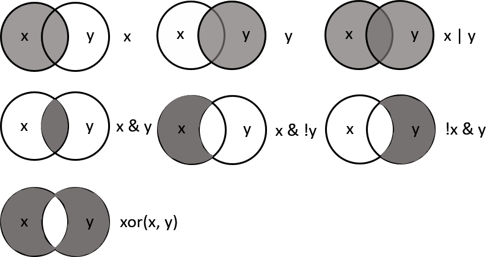
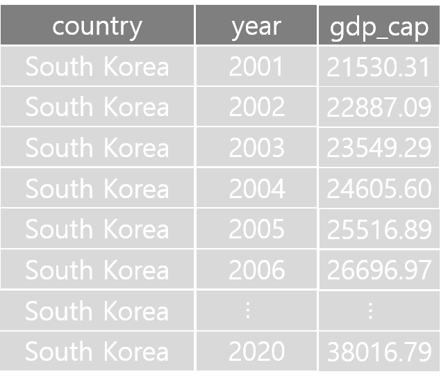

# 데이터 핸들링(Data handling) {#data-handling}

\footnotesize

\BeginKnitrBlock{rmdimportant}<div class="rmdimportant">**학습 목표**

- Hadely Weckam이 개발한 데이터의 전처리 및 시각화를 위해 각광받는 tidyverse 패키지에 대해 알아본다
- 데이터를 읽고, 저장하고, 목적에 맞게 가공하고, tidyverse 하에서 반복 계산 방법에 대해 알아본다. 
</div>\EndKnitrBlock{rmdimportant}

 \normalsize


**데이터 분석과정**

1) 데이터를 R 작업환경(workspace)에 **불러오고(import)**, 
2) 불러온 데이터를 **가공하고(data management, data preprocessing)**, 
3) 가공한 데이터를 **분석(analysis, modeling)** 및 **시각화(visualization)** 후,  
4) 분석 결과를 **저장(save)** 및 외부 파일로 **내보낸(export)** 후, 
5) 이를 통해 전문가와 **소통(communicate)**


\footnotesize

<div class="figure" style="text-align: center">

<p class="caption">(\#fig:unnamed-chunk-3)Data 분석의 과정. @wickham-2016r 에서 발췌</p>
</div>

 \normalsize


**R의 데이터 가공(관리) 방법**

1. 기본 R을 활용: 지금까지 배워온 방법으로 분석을 위한 데이터 가공(색인, 필터, 병합 등)


2. **tidyverse** 패키지 활용
   - 직관적 코드 작성 가능
   - 빠른 실행속도


3. **data.table** 패키지 활용(본 강의에서는 다루지 않음)
   - 빠른 실행속도 
   

다양한 통계 함수와 최신 분석에 대한 여러 패키지 및 함수를 R 언어를 통해 활용 가능함에도 불구하고, 타 통계 소프트웨어(SAS, SPSS, Stata, Minitab 등)에 비해 데이터 가공 및 처리가 직관적이지 않고 불편했던 점은 R이 갖고 있던 큰 단점 중 하나임. RStudio의 수석 데이터 과학자인 Hadely Wickham의 tidyverse는 이러한 단점을 최대한 보완했고, 현재는 R을 통한 데이터 분석에서 핵심적인 도구로 자리매김 하고 있음. Tidyverse의 철학은 R 언어의 생태계에 혁신적인 변화를 가져왔을 뿐 아니라 지속적으로 진화하고 있기 때문에 해당 패키지들이 제공하는 언어 형태를 이해할 필요가 있음. 


## Prerequisites {#ch4-prerequi}

### 외부데이터 불러오기 및 저장 {#data-import-export}

\footnotesize

\BeginKnitrBlock{rmdnote}<div class="rmdnote">R 기본 함수를 이용해서 데이터 저장 파일의 가장 기본적인 형태인 텍스트 파일을 읽고 저장하는 방법에 대해 먼저 살펴봄. Base R에서 외부 데이터를 읽고 저장을 위한 함수는 매우 다양하지만 가장 많이 사용되고 있는 함수들에 대해 살펴볼 것임</div>\EndKnitrBlock{rmdnote}

 \normalsize


- 기본 R(base R)에서 제공하는 함수를 이용해 외부 데이터를 읽고, 내보내고, 저장하는 방법에 대해 살펴봄. 
- 가장 일반적인 형태의 데이터는 보통 텍스트 파일 형태로 저장되어 있음, 일반적으로
   - 첫 번째 줄: 변수명
   - 두 번째 줄 부터: 데이터 입력
   
```
id sex age edulev height 
1 Male 65   12 168
2 Female 74 9  145
3 Male 61   12 171
4 Male 85   6  158
5 Female 88 0  134
```

- 데이터의 자료값과 자료값을 구분하는 문자를 구분자(separator)라고 하며 주로 공백(` `), 콤마(`,`), tab 문자(`\t`) 등이 사용됨
- 주로 확장자 명이 `*.txt` 이며, 콤마 구분자인 경우 보통은 `*.csv` (comma separated values)로 저장

```
#titanic3.csv 파일 일부 

"pclass","survived","name","sex","age",
1,1,"Allen, Miss. Elisabeth Walton","female"
1,1,"Allison, Master. Hudson Trevor","male"
1,0,"Allison, Miss. Helen Loraine", "female"
1,0,"Allison, Mr. Hudson Joshua Creighton","male"
1,0,"Allison, Mrs. Hudson J C (Bessie Waldo Daniels)","female"
```


#### **텍스트 파일 입출력** {#text-import-export .unnumbered}


\footnotesize

\BeginKnitrBlock{rmdcaution}<div class="rmdcaution">외부 데이터를 불러온다는 것은 외부에 저장되어 있는 파일을 R 작업환경으로 읽어온다는 의미이기 때문에, 현재 작업공간의 작업 디렉토리(working directory) 확인이 필요.</div>\EndKnitrBlock{rmdcaution}

 \normalsize

- `read.table()/write.table()`: 
   - 가장 범용적으로 외부 텍스트 데이터를 R 작업공간으로 데이터 프레임으로 읽고 저장하는 함수
   - 텍스트 파일의 형태에 따라 구분자 지정 가능

\footnotesize


```r
# read.table(): 텍스트 파일 읽어오기
read.table(
  file, # 파일명. 일반적으로 폴더명 구분자 
        # 보통 folder/파일이름.txt 형태로 입력
  header = FALSE, # 첫 번째 행을 헤더(변수명)으로 처리할 지 여부
  sep = "", # 구분자 ",", "\t" 등의 형태로 입력
  comment.char = "#", # 주석문자 지정
  stringsAsFactors = TRUE, # 문자형 변수를 factor으로 변환할 지 여부
  encoding = "unknown" # 텍스트의 encoding 보통 CP949 또는 UTF-8
                       # 한글이 입력된 데이터가 있을 때 사용
)
```

 \normalsize

- `read.table()` 예시

\footnotesize

\BeginKnitrBlock{rmdnote}<div class="rmdnote">예시에 사용된 데이터들은 Clinical trial data analysis using R [@chen-2010]에서 제공되는 데이터임.</div>\EndKnitrBlock{rmdnote}

 \normalsize


\footnotesize


```r
# tab 구분자 데이터 불러오기
# dataset 폴더에 저장되어 있는 DBP.txt 파일 읽어오기
dbp <- read.table("dataset/DBP.txt", sep = "\t", header = TRUE)
str(dbp)
```

```
'data.frame':	40 obs. of  9 variables:
 $ Subject: int  1 2 3 4 5 6 7 8 9 10 ...
 $ TRT    : chr  "A" "A" "A" "A" ...
 $ DBP1   : int  114 116 119 115 116 117 118 120 114 115 ...
 $ DBP2   : int  115 113 115 113 112 112 111 115 112 113 ...
 $ DBP3   : int  113 112 113 112 107 113 100 113 113 108 ...
 $ DBP4   : int  109 103 104 109 104 104 109 102 109 106 ...
 $ DBP5   : int  105 101 98 101 105 102 99 102 103 97 ...
 $ Age    : int  43 51 48 42 49 47 50 61 43 51 ...
 $ Sex    : chr  "F" "M" "F" "F" ...
```

```r
# 문자형 값들을 factor로 변환하지 않는 경우
dbp2 <- read.table("dataset/DBP.txt", sep = "\t", 
                   header = TRUE, 
                   stringsAsFactors = FALSE)
str(dbp2)
```

```
'data.frame':	40 obs. of  9 variables:
 $ Subject: int  1 2 3 4 5 6 7 8 9 10 ...
 $ TRT    : chr  "A" "A" "A" "A" ...
 $ DBP1   : int  114 116 119 115 116 117 118 120 114 115 ...
 $ DBP2   : int  115 113 115 113 112 112 111 115 112 113 ...
 $ DBP3   : int  113 112 113 112 107 113 100 113 113 108 ...
 $ DBP4   : int  109 103 104 109 104 104 109 102 109 106 ...
 $ DBP5   : int  105 101 98 101 105 102 99 102 103 97 ...
 $ Age    : int  43 51 48 42 49 47 50 61 43 51 ...
 $ Sex    : chr  "F" "M" "F" "F" ...
```

```r
# 데이터 형태 파악
head(dbp)
```

```
  Subject TRT DBP1 DBP2 DBP3 DBP4 DBP5 Age Sex
1       1   A  114  115  113  109  105  43   F
2       2   A  116  113  112  103  101  51   M
3       3   A  119  115  113  104   98  48   F
4       4   A  115  113  112  109  101  42   F
5       5   A  116  112  107  104  105  49   M
6       6   A  117  112  113  104  102  47   M
```

```r
# 콤마 구분자 데이터 불러오기
# dataset 폴더에 저장되어 있는 diabetes_csv.txt 파일 읽어오기
diab <- read.table("dataset/diabetes_csv.txt", sep = ",", header = TRUE)
str(diab)
```

```
'data.frame':	403 obs. of  19 variables:
 $ id      : int  1000 1001 1002 1003 1005 1008 1011 1015 1016 1022 ...
 $ chol    : int  203 165 228 78 249 248 195 227 177 263 ...
 $ stab.glu: int  82 97 92 93 90 94 92 75 87 89 ...
 $ hdl     : int  56 24 37 12 28 69 41 44 49 40 ...
 $ ratio   : num  3.6 6.9 6.2 6.5 8.9 ...
 $ glyhb   : num  4.31 4.44 4.64 4.63 7.72 ...
 $ location: chr  "Buckingham" "Buckingham" "Buckingham" "Buckingham" ...
 $ age     : int  46 29 58 67 64 34 30 37 45 55 ...
 $ gender  : chr  "female" "female" "female" "male" ...
 $ height  : int  62 64 61 67 68 71 69 59 69 63 ...
 $ weight  : int  121 218 256 119 183 190 191 170 166 202 ...
 $ frame   : chr  "medium" "large" "large" "large" ...
 $ bp.1s   : int  118 112 190 110 138 132 161 NA 160 108 ...
 $ bp.1d   : int  59 68 92 50 80 86 112 NA 80 72 ...
 $ bp.2s   : int  NA NA 185 NA NA NA 161 NA 128 NA ...
 $ bp.2d   : int  NA NA 92 NA NA NA 112 NA 86 NA ...
 $ waist   : int  29 46 49 33 44 36 46 34 34 45 ...
 $ hip     : int  38 48 57 38 41 42 49 39 40 50 ...
 $ time.ppn: int  720 360 180 480 300 195 720 1020 300 240 ...
```

```r
head(diab)
```

```
    id chol stab.glu hdl ratio glyhb   location age gender height weight  frame
1 1000  203       82  56   3.6  4.31 Buckingham  46 female     62    121 medium
2 1001  165       97  24   6.9  4.44 Buckingham  29 female     64    218  large
3 1002  228       92  37   6.2  4.64 Buckingham  58 female     61    256  large
4 1003   78       93  12   6.5  4.63 Buckingham  67   male     67    119  large
5 1005  249       90  28   8.9  7.72 Buckingham  64   male     68    183 medium
6 1008  248       94  69   3.6  4.81 Buckingham  34   male     71    190  large
  bp.1s bp.1d bp.2s bp.2d waist hip time.ppn
1   118    59    NA    NA    29  38      720
2   112    68    NA    NA    46  48      360
3   190    92   185    92    49  57      180
4   110    50    NA    NA    33  38      480
5   138    80    NA    NA    44  41      300
6   132    86    NA    NA    36  42      195
```

```r
# Encoding이 다른 경우(한글데이터 포함): 
# 한약재 사전 데이터 (CP949 encoding으로 저장)
# tab 구분자 데이터 사용
# UTF-8로 읽어오기
herb <- read.table("dataset/herb_dic_sample.txt", sep = "\t", 
                   header = TRUE, 
                   encoding = "UTF-8", 
                   stringsAsFactors = FALSE)
head(herb)
```

```
                              herb                      herb_normal
1             <U+02B8><ed><U+00AD>             <U+02B8><ed><U+00AD>
2 <U+02B8><ed><U+00AD><eb><U+00BF> <U+02B8><ed><U+00AD><eb><U+00BF>
3 <U+02B8><ed><U+00AD><f9><U+00AB> <U+02B8><ed><U+00AD><f9><U+00AB>
4                 <d3><d7><cf><fd>                 <d3><d7><cf><fd>
5         <d3><d7><cf><fd><U+06AD>                 <d3><d7><cf><fd>
6         <d3><d7><cf><fd><e3><f3>                 <d3><d7><cf><fd>
                            korean
1         <U+00B0><U+00A1><c0><da>
2 <U+00B0><U+00A1><c0><da><U+0030>
3 <U+00B0><U+00A1><c0><da><c7><c7>
4         <U+00B4><e7><U+00B1><cd>
5         <U+00B4><e7><U+00B1><cd>
6         <U+00B4><e7><U+00B1><cd>
```

```r
# CP949로 읽어오기
herb <- read.table("dataset/herb_dic_sample.txt", sep = "\t", 
                   header = TRUE, 
                   encoding = "CP949", 
                   stringsAsFactors = FALSE)
head(herb)
```

```
    herb herb_normal korean
1   訶子        訶子   가자
2 訶子肉      訶子肉 가자육
3 訶子皮      訶子皮 가자피
4   當歸        當歸   당귀
5 當歸尾        當歸   당귀
6 當歸身        當歸   당귀
```

 \normalsize

- `read.table()` + `textConnection()`: 웹사이트나 URL에 있는 데이터를 `Copy + Paste` 해서 읽어올 경우 유용하게 사용
   - `textConnection()`: 텍스트에서 한 줄씩 읽어 문자형 벡터처럼 인식할 수 있도록 해주는 함수

\footnotesize


```r
# Plasma 데이터: http://lib.stat.cmu.edu/datasets/Plasma_Retinol 
input1 <- ("64	2	2	21.4838	1	1298.8	57	6.3	0	170.3	1945	890	200	915
76	2	1	23.87631	1	1032.5	50.1	15.8	0	75.8	2653	451	124	727
38	2	2	20.0108	2	2372.3	83.6	19.1	14.1	257.9	6321	660	328	721
40	2	2	25.14062	3	2449.5	97.5	26.5	0.5	332.6	1061	864	153	615
72	2	1	20.98504	1	1952.1	82.6	16.2	0	170.8	2863	1209	92	799
40	2	2	27.52136	3	1366.9	56	9.6	1.3	154.6	1729	1439	148	654
65	2	1	22.01154	2	2213.9	52	28.7	0	255.1	5371	802	258	834
58	2	1	28.75702	1	1595.6	63.4	10.9	0	214.1	823	2571	64	825
35	2	1	23.07662	3	1800.5	57.8	20.3	0.6	233.6	2895	944	218	517
55	2	2	34.96995	3	1263.6	39.6	15.5	0	171.9	3307	493	81	562")

input2 <- ("AGE: Age (years)
	SEX: Sex (1=Male, 2=Female).
	SMOKSTAT: Smoking status (1=Never, 2=Former, 3=Current Smoker)
	QUETELET: Quetelet (weight/(height^2))
	VITUSE: Vitamin Use (1=Yes, fairly often, 2=Yes, not often, 3=No)
	CALORIES: Number of calories consumed per day.
	FAT: Grams of fat consumed per day.
	FIBER: Grams of fiber consumed per day.
	ALCOHOL: Number of alcoholic drinks consumed per week.
	CHOLESTEROL: Cholesterol consumed (mg per day).
	BETADIET: Dietary beta-carotene consumed (mcg per day).
	RETDIET: Dietary retinol consumed (mcg per day)
	BETAPLASMA: Plasma beta-carotene (ng/ml)
	RETPLASMA: Plasma Retinol (ng/ml)")

plasma <- read.table(textConnection(input1), sep = "\t", header = F)
codebook <- read.table(textConnection(input2), sep = ":", header = F)
varname <- gsub("^\\s+", "", codebook$V1) # 변수명 지정

names(plasma) <- varname
head(plasma)
```

```
  AGE SEX SMOKSTAT QUETELET VITUSE CALORIES  FAT FIBER ALCOHOL CHOLESTEROL
1  64   2        2 21.48380      1   1298.8 57.0   6.3     0.0       170.3
2  76   2        1 23.87631      1   1032.5 50.1  15.8     0.0        75.8
3  38   2        2 20.01080      2   2372.3 83.6  19.1    14.1       257.9
4  40   2        2 25.14062      3   2449.5 97.5  26.5     0.5       332.6
5  72   2        1 20.98504      1   1952.1 82.6  16.2     0.0       170.8
6  40   2        2 27.52136      3   1366.9 56.0   9.6     1.3       154.6
  BETADIET RETDIET BETAPLASMA RETPLASMA
1     1945     890        200       915
2     2653     451        124       727
3     6321     660        328       721
4     1061     864        153       615
5     2863    1209         92       799
6     1729    1439        148       654
```

 \normalsize

- `write.table()`: R의 객체(벡터, 행렬, 데이터 프레임)를 저장 후 외부 텍스트 파일로 내보내기 위한 함수


\footnotesize


```r
# write.table() R 객체를 텍스트 파일로 저장하기
write.table(
  data_obj, # 저장할 객체 이름
  file,  # 저장할 위치 및 파일명  또는 
         # 또는 "파일쓰기"를 위한 연결 명칭
  sep,   # 저장 시 사용할 구분자
  row.names = TRUE # 행 이름 저장 여부
)
```

 \normalsize

- 예시

\footnotesize


```r
# 위에서 읽어온 plasma 객체를 dataset/plasma.txt 로 내보내기
# 행 이름은 생략, tab으로 데이터 구분

write.table(plasma, "dataset/plasma.txt", 
            sep = "\t", row.names = F)
```

 \normalsize

- 파일명 대신 Windows clipboard 로 내보내기 가능

\footnotesize


```r
# clipboard로 복사 후 excel 시트에 해당 데이터 붙여넣기
# Ctrl + V
write.table(plasma, "clipboard", 
            sep = "\t", row.names = F)
```

 \normalsize


- `read.csv()`/`write.csv()`: `read.table()` 함수의 wrapper 함수로 구분자 인수 `sep`이 콤마(`,`)로 고정(예시 생략)


#### R 바이너리(binary) 파일 입출력 {#binary-import-export .unnumbered}

R 작업공간에 존재하는 한 개 이상의 객체들을 저장하고 읽기 위한 함수

- R 데이터 관련 바이너리 파일은 한 개 이상의 객체가 저장된 바이너리 파일인 경우 `*.Rdata` 형태를 갖고, 단일 객체를 저장할 경우 보통 `*.rds` 파일 확장자로 저장

- `*.Rdata` 입출력 함수
   - `load()`: `*.Rdata` 파일 읽어오기
   - `save()`: 한 개 이상 R 작업공간에 존재하는 객체를 `.Rdata` 파일로 저장
   - `save.image()`: 현재 R 작업공간에 존재하는 모든 객체를 `.Rdata` 파일로 저장

\footnotesize


```r
# 현재 작업공간에 존재하는 모든 객체를 "output" 폴더에 저장
# output 폴더가 존재하지 않는 경우 아래 명령 실행
# dir.create("output") 
ls()
```

```
 [1] "codebook"       "dbp"            "dbp2"           "def.chunk.hook"
 [5] "diab"           "herb"           "hook_output"    "input1"        
 [9] "input2"         "plasma"         "varname"       
```

```r
save.image(file = "output/all_obj.Rdata")

rm(list = ls()) 
ls()
```

```
character(0)
```

```r
# 저장된 binary 파일(all_obj.Rdata) 불러오기
load("output/all_obj.Rdata")
ls()
```

```
 [1] "codebook"       "dbp"            "dbp2"           "def.chunk.hook"
 [5] "diab"           "herb"           "hook_output"    "input1"        
 [9] "input2"         "plasma"         "varname"       
```

```r
# dnp, plasma 데이터만 output 폴더에 sub_obj.Rdata로 저장
save(dbp, plasma, file = "output/sub_obj.Rdata")
rm(list = c("dbp", "plasma"))
ls()
```

```
[1] "codebook"       "dbp2"           "def.chunk.hook" "diab"          
[5] "herb"           "hook_output"    "input1"         "input2"        
[9] "varname"       
```

```r
# sub_obj.Rdata 파일 불러오기
load("output/sub_obj.Rdata")
ls()
```

```
 [1] "codebook"       "dbp"            "dbp2"           "def.chunk.hook"
 [5] "diab"           "herb"           "hook_output"    "input1"        
 [9] "input2"         "plasma"         "varname"       
```

 \normalsize


- `*.rds` 입출력 함수
   - `readRDS()`/ `saveRDS()`: 단일 객체가 저장된 `*.rds` 파일을 읽거나 저장
   - 대용량 데이터를 다룰 때 유용함
   - `read.table()` 보다 데이터를 읽는 속도가 빠르며, 다른 확장자 명의 텍스트 파일보다 높은 압축율을 보임

\footnotesize


```r
# 대용량 파일 dataset/pulse.csv 불러오기
# system.time(): 명령 실행 시가 계산 함수
system.time(pulse <- read.csv("dataset/pulse.csv", header = T))
```

```
 사용자  시스템 elapsed 
  20.56    0.03   20.60 
```

```r
# saveRDS()함수를 이용해 output/pulse.rds 파일로 저장
saveRDS(pulse, "output/pulse.rds")
rm(pulse); ls()
```

```
 [1] "codebook"       "dbp"            "dbp2"           "def.chunk.hook"
 [5] "diab"           "herb"           "hook_output"    "input1"        
 [9] "input2"         "plasma"         "varname"       
```

```r
system.time(pulse <- readRDS("output/pulse.rds"))
```

```
 사용자  시스템 elapsed 
   0.08    0.01    0.09 
```

 \normalsize


## Tidyverse {#tidyverse}


- "Tidy" + "Universe"의 조어로 "tidy data"의 기본 설계 철학, 문법 및 데이터 구조를 공유하는 RStudio 수석 과학자인 Hadley Wickham이 개발한 패키지 묶음(번들) 또는 메타 패키지로, 데이터 과학(data science)을 위한 R package를 표방 [@R-tidyverse] 

- 데이터 분석 과정 중 가장 긴 시간을 할애하는 데이터 전처리(data preprocessing, data management, data wrangling, data munging 등으로 표현)를 위한 다양한 함수들을 제공하며, 특히 파이프(pipe) 연산자로 지칭되는 `%>%`를 통한 코드의 간결성 및 가독성을 최대화 하는 것이 tidyverse 패키지들의 특징

- Hadley Wickham이 주창한 [Tidy Tools Manifesto](https://mran.microsoft.com/web/packages/tidyverse/vignettes/manifesto.html)에 따르면, tidyverse가 추구하는 프로그래밍 인터페이스에 대한 4 가지 원칙을 제시

> 1) 기존 데이터의 구조를 재사용
>
> 2) 파이프 연산자를 이용한 최대한 간결한 함수 작성
>
> 3) R의 특징 중 하나인 functional programming 수용
>
> 4) 사람이 읽기 쉬운 프로그램으로 설계


- Tidyverse를 구성하는 주요 패키지(알파벳 순)

> 1) **dplyr**: 가장 일반적인 데이터 가공 및 처리 해결을 위한 "동사"(함수)로 구성된 문법 제공
> 2) **forcat**: 범주형 변수 처리를 위해 Rdml factor와 관련된 일반적인 문제 해결을 위한 함수 제공
> 3) **ggplot2**: 그래픽 문법을 기반으로 2차원 그래픽을 생성하기 위해 고안된 시스템
> 4) **purrr**: 함수 및 벡터의 반복 작업을 수행할 수 있는 도구를 제공
> 5) **readr**: base R에서 제공하는 파일 입출력 함수보다 효율적인 성능을 갖는 입출력 함수로 구성
> 6) **stringr**: 가능한 한 쉬운 방법으로 문자열을 다룰 수 있는 함수 제공
> 7) **tibble**: Tidyverse에서 재해석한 데이터 프레임 형태로 tidyverse에서 다루는 데이터의 기본 형태
> 8) **tidyr**: 데이터를 정리하고 "tidy data"를 도출하기 위한 일련의 함수 제공


\footnotesize


 \normalsize


- 그 밖에 유용한 tidyverse에 소속되어 있는 패키지

> - **haven**: 타 통계 프로그램(SAS, SPSS, Stata)의 데이터 포멧 입출력 함수 제공
> - **readxl**: Excel 파일 입력 함수 제공
> - **lubridate**: 시간(년/월/일/시/분) 데이터 가공 및 연산 함수 제공
> - **magrittr**: Tidyverse의 문법(함수)를 연결 시켜주는 파이프 연산자 제공. 예전에는 독립적인 패키지였으나 지금은 모든 tidyverse 패키지에 내장되어 있음


## `readr` 패키지 {#readr}

- 기본적으로 \@ref(data-import-export) 절에서 학습했던 `read.table()`, `read.csv()`와 거의 동일하게 작동하지만, 읽고 저장하는 속도가 base R에서 제공하는 기본 입출력 함수보다 월등히 뛰어남. 최근 readr 패키지에서 제공하는 입출력 함수보다 더 빠르게 데이터 입출력이 가능한 feather 패키지 [@R-feather] 제공 

- 데이터를 읽는 동안 사소한 문제가 있는 경우 해당 부분에 경고 표시 및 행, 관측 정보를 표시해줌 $\rightarrow$ 데이터 디버깅에 유용

- 주요 함수^[주요 함수들의 사용방법은 거의 유사하기 때문에 read_csv() 함수에 대해서만 살펴봄]
   - `read_table()`, `write_table()`
   - `read_csv()`, `write_csv()`

- [readr vignette](https://cran.r-project.org/web/packages/readr/vignettes/readr.html)을 통해 더 자세한 예시를 살펴볼 수 있음

\footnotesize


```r
read_csv(
  file, # 파일 명
  col_names = TRUE, # 첫 번째 행를 변수명으로 처리할 것인지 여부
                    # read.table(), read.csv()의 header 인수와 동일
  col_types = NULL, # 열(변수)의 데이터 형 지정
                    # 기본적으로 데이터 유형을 자동으로 감지하지만, 
                    # 입력 텍스트의 형태에 따라 데이터 유형을 
                    # 잘못 추측할 수 있기 때문에 간혹 해당 인수 입력 필요
                    # col_* 함수 또는 campact string으로 지정 가능
                    # c=character, i=integer, n=number, d=double, 
                    # l=logical, f=factor, D=date, T=date time, t=time
                    # ?=guess, _/- skip column
  progress, # 데이터 읽기/쓰기  진행 progress 표시 여부
)
```

 \normalsize

- 예시

\footnotesize


```r
# dataset/titanic3.csv 불러오기
titanic <- read_csv("dataset/titanic3.csv")
```

```
Parsed with column specification:
cols(
  pclass = col_double(),
  survived = col_double(),
  name = col_character(),
  sex = col_character(),
  age = col_double(),
  sibsp = col_double(),
  parch = col_double(),
  ticket = col_character(),
  fare = col_double(),
  cabin = col_character(),
  embarked = col_character(),
  boat = col_character(),
  body = col_double(),
  home.dest = col_character()
)
```

```r
titanic
```

```
# A tibble: 1,309 x 14
   pclass survived name  sex     age sibsp parch ticket  fare cabin embarked
    <dbl>    <dbl> <chr> <chr> <dbl> <dbl> <dbl> <chr>  <dbl> <chr> <chr>   
 1      1        1 Alle~ fema~ 29        0     0 24160  211.  B5    S       
 2      1        1 Alli~ male   0.92     1     2 113781 152.  C22 ~ S       
 3      1        0 Alli~ fema~  2        1     2 113781 152.  C22 ~ S       
 4      1        0 Alli~ male  30        1     2 113781 152.  C22 ~ S       
 5      1        0 Alli~ fema~ 25        1     2 113781 152.  C22 ~ S       
 6      1        1 Ande~ male  48        0     0 19952   26.6 E12   S       
 7      1        1 Andr~ fema~ 63        1     0 13502   78.0 D7    S       
 8      1        0 Andr~ male  39        0     0 112050   0   A36   S       
 9      1        1 Appl~ fema~ 53        2     0 11769   51.5 C101  S       
10      1        0 Arta~ male  71        0     0 PC 17~  49.5 <NA>  C       
# ... with 1,299 more rows, and 3 more variables: boat <chr>, body <dbl>,
#   home.dest <chr>
```

```r
# read.csv와 비교
head(read.csv("dataset/titanic3.csv", header = T), 10)
```

```
   pclass survived                                            name    sex   age
1       1        1                   Allen, Miss. Elisabeth Walton female 29.00
2       1        1                  Allison, Master. Hudson Trevor   male  0.92
3       1        0                    Allison, Miss. Helen Loraine female  2.00
4       1        0            Allison, Mr. Hudson Joshua Creighton   male 30.00
5       1        0 Allison, Mrs. Hudson J C (Bessie Waldo Daniels) female 25.00
6       1        1                             Anderson, Mr. Harry   male 48.00
7       1        1               Andrews, Miss. Kornelia Theodosia female 63.00
8       1        0                          Andrews, Mr. Thomas Jr   male 39.00
9       1        1   Appleton, Mrs. Edward Dale (Charlotte Lamson) female 53.00
10      1        0                         Artagaveytia, Mr. Ramon   male 71.00
   sibsp parch   ticket     fare   cabin embarked boat body
1      0     0    24160 211.3375      B5        S    2   NA
2      1     2   113781 151.5500 C22 C26        S   11   NA
3      1     2   113781 151.5500 C22 C26        S        NA
4      1     2   113781 151.5500 C22 C26        S       135
5      1     2   113781 151.5500 C22 C26        S        NA
6      0     0    19952  26.5500     E12        S    3   NA
7      1     0    13502  77.9583      D7        S   10   NA
8      0     0   112050   0.0000     A36        S        NA
9      2     0    11769  51.4792    C101        S    D   NA
10     0     0 PC 17609  49.5042                C        22
                         home.dest
1                     St Louis, MO
2  Montreal, PQ / Chesterville, ON
3  Montreal, PQ / Chesterville, ON
4  Montreal, PQ / Chesterville, ON
5  Montreal, PQ / Chesterville, ON
6                     New York, NY
7                       Hudson, NY
8                      Belfast, NI
9              Bayside, Queens, NY
10             Montevideo, Uruguay
```

```r
# column type을 변경
titanic2 <- read_csv("dataset/titanic3.csv", 
                     col_types = "iicfdiicdcfcic")
titanic2
```

```
# A tibble: 1,309 x 14
   pclass survived name  sex     age sibsp parch ticket  fare cabin embarked
    <int>    <int> <chr> <fct> <dbl> <int> <int> <chr>  <dbl> <chr> <fct>   
 1      1        1 Alle~ fema~ 29        0     0 24160  211.  B5    S       
 2      1        1 Alli~ male   0.92     1     2 113781 152.  C22 ~ S       
 3      1        0 Alli~ fema~  2        1     2 113781 152.  C22 ~ S       
 4      1        0 Alli~ male  30        1     2 113781 152.  C22 ~ S       
 5      1        0 Alli~ fema~ 25        1     2 113781 152.  C22 ~ S       
 6      1        1 Ande~ male  48        0     0 19952   26.6 E12   S       
 7      1        1 Andr~ fema~ 63        1     0 13502   78.0 D7    S       
 8      1        0 Andr~ male  39        0     0 112050   0   A36   S       
 9      1        1 Appl~ fema~ 53        2     0 11769   51.5 C101  S       
10      1        0 Arta~ male  71        0     0 PC 17~  49.5 <NA>  C       
# ... with 1,299 more rows, and 3 more variables: boat <chr>, body <int>,
#   home.dest <chr>
```

```r
# 특정 변수만 불러오기
titanic3 <- read_csv("dataset/titanic3.csv", 
                     col_types = cols_only(
                       pclass = col_integer(), 
                       survived = col_integer(), 
                       sex = col_factor(), 
                       age = col_double()
                     ))
titanic3
```

```
# A tibble: 1,309 x 4
   pclass survived sex      age
    <int>    <int> <fct>  <dbl>
 1      1        1 female 29   
 2      1        1 male    0.92
 3      1        0 female  2   
 4      1        0 male   30   
 5      1        0 female 25   
 6      1        1 male   48   
 7      1        1 female 63   
 8      1        0 male   39   
 9      1        1 female 53   
10      1        0 male   71   
# ... with 1,299 more rows
```

```r
# 대용량 데이터셋 읽어올 때 시간 비교
# install.packages("feather") # feather package
require(feather)
```

```
필요한 패키지를 로딩중입니다: feather
```

```r
system.time(pulse <- read.csv("dataset/pulse.csv", header = T))
```

```
 사용자  시스템 elapsed 
  20.03    0.03   20.06 
```

```r
write_feather(pulse, "dataset/pulse.feather")
system.time(pulse <- readRDS("output/pulse.rds"))
```

```
 사용자  시스템 elapsed 
   0.08    0.02    0.09 
```

```r
system.time(pulse <- read_csv("dataset/pulse.csv"))
```

```
Parsed with column specification:
cols(
  .default = col_double()
)
```

```
See spec(...) for full column specifications.
```

```
 사용자  시스템 elapsed 
  15.95    0.03   16.01 
```

```r
system.time(pulse <- read_feather("dataset/pulse.feather"))
```

```
 사용자  시스템 elapsed 
   0.18    0.00    0.19 
```

 \normalsize


### Excel 파일 입출력 {#import-export-excel}

- R에서 기본적으로 제공하는 파일 입출력 함수는 대부분 텍스트 파일(`*.txt`, `*.csv`, `*.tsv`^[tab separated values])을 대상으로 하고 있음
- **readr** 패키지에서도 이러한 원칙은 유지됨
- Excel 파일을 R로 읽어오기(과거 방법) 
   - `*.xls` 또는 `*.xlsx` 파일을 엑셀로 읽은 후 해당 데이터를 위 텍스트 파일 형태로 내보낸 후 해당 파일을 R로 읽어옴
   - **xlsx** 패키지 등을 이용해 엑셀 파일을 직접 읽어올 수 있으나, Java 기반으로 개발된 패키지이기 때문에 Java Runtime Environment를 운영체제에 설치해야만 작동

- 최근 tidyverse 중 하나인 **readxl** 패키지를 이용해 간편하게 R 작업환경에 엑셀 파일을 읽어오는 것이 가능(Hadley Wickham이 개발...)
   - tidyverse의 한 부분임에도 불구하고 tidyverse 패키지 번들에는 포함되어 있지 않기 때문에 별도 설치 필요
   
#### **readxl** 패키지 구성 주요 함수 {#readxl-funs .unnumbered}

- `read_xls()`, `read_xlsx()`, `read_excel`: 엑셀 파일을 읽어오는 함수로 각각 Excel 97 ~ 2003, Excel 2007 이상, 또는 버전 상관 없이 저장된 엑셀 파일에 접근함
- `excel_sheets()`: 엑셀 파일 내 시트 이름 추출 $\rightarrow$ 한 엑셀 파일의 복수 시트에 데이터가 저장되어 있는 경우 활용
- 예시: 2020년 4월 23일 COVID-19 유병률 데이터 ([Our World in Data](https://github.com/owid/covid-19-data/tree/master/public/data))

\footnotesize


```r
read_xlsx(
  path, # Excel 폴더 및 파일 이름
  sheet = NULL, # 불러올 엑셀 시트 이름
                # default = 첫 번째 시트
  col_names = TRUE, # read_csv()의 인수와 동일한 형태 입력
  col_types = NULL  # read_csv()의 인수와 동일한 형태 입력
)
```

 \normalsize


\footnotesize


```r
# 2020년 4월 21일자 COVID-19 국가별 유별률 및 사망률 집계 자료
# dataset/owid-covid-data.xlsx 파일 불러오기 
# install.packages("readxl")
require(readxl)
```

```
필요한 패키지를 로딩중입니다: readxl
```

```r
covid19 <- read_xlsx("dataset/covid-19-dataset/owid-covid-data.xlsx")
covid19
```

```
# A tibble: 14,315 x 16
   iso_code location date  total_cases new_cases total_deaths new_deaths
   <chr>    <chr>    <chr>       <dbl>     <dbl>        <dbl>      <dbl>
 1 ABW      Aruba    2020~           2         2            0          0
 2 ABW      Aruba    2020~           4         2            0          0
 3 ABW      Aruba    2020~          12         8            0          0
 4 ABW      Aruba    2020~          17         5            0          0
 5 ABW      Aruba    2020~          19         2            0          0
 6 ABW      Aruba    2020~          28         9            0          0
 7 ABW      Aruba    2020~          28         0            0          0
 8 ABW      Aruba    2020~          28         0            0          0
 9 ABW      Aruba    2020~          50        22            0          0
10 ABW      Aruba    2020~          55         5            0          0
# ... with 14,305 more rows, and 9 more variables:
#   total_cases_per_million <dbl>, new_cases_per_million <dbl>,
#   total_deaths_per_million <dbl>, new_deaths_per_million <dbl>,
#   total_tests <dbl>, new_tests <dbl>, total_tests_per_thousand <dbl>,
#   new_tests_per_thousand <dbl>, tests_units <chr>
```

```r
# 여러 시트를 동시에 불러올 경우
# dataset/datR4CTDA.xlsx 의 모든 시트 불러오기
path <- "dataset/datR4CTDA.xlsx"
sheet_name <- excel_sheets(path)
dL <- lapply(sheet_name, function(x) read_xlsx(path, sheet = x))
names(dL) <- sheet_name

# Tidyverse 에서는? (맛보기)
path %>% 
  excel_sheets %>% 
  set_names %>% 
  map(~read_xlsx(path = path, sheet = .x)) -> dL2
```

 \normalsize


### tibble 패키지 {#tibble}

- **readr** 또는 **readxl** 패키지에서 제공하는 함수를 이용해 외부 데이터를 읽어온 후, 확인할 때 기존 데이터 프레임과 미묘한 차이점이 있다는 것을 확인
- 프린트된 데이터의 맨 윗 부분을 보면 `A tibble: 데이터 차원` 이 표시된 부분을 볼 수 있음
- `tibble`은 tidyverse 생태계에서 사용되는 데이터 프레임 $\rightarrow$ 데이터 프레임을 조금 더 빠르고 사용하기 쉽게 수정한 버전의 데이터 프레임

#### tibble 생성하기 {#create-tibble .unnumbered}

- 기본 R 함수에서 제공하는 `as.*` 계열 함수 처럼 `as_tibble()` 함수를 통해 기존 일반적인 형태의 데이터 프레임을 tibble 로 변환 가능

\footnotesize


```r
head(iris)
```

```
  Sepal.Length Sepal.Width Petal.Length Petal.Width Species
1          5.1         3.5          1.4         0.2  setosa
2          4.9         3.0          1.4         0.2  setosa
3          4.7         3.2          1.3         0.2  setosa
4          4.6         3.1          1.5         0.2  setosa
5          5.0         3.6          1.4         0.2  setosa
6          5.4         3.9          1.7         0.4  setosa
```

```r
as_tibble(iris)
```

```
# A tibble: 150 x 5
   Sepal.Length Sepal.Width Petal.Length Petal.Width Species
          <dbl>       <dbl>        <dbl>       <dbl> <fct>  
 1          5.1         3.5          1.4         0.2 setosa 
 2          4.9         3            1.4         0.2 setosa 
 3          4.7         3.2          1.3         0.2 setosa 
 4          4.6         3.1          1.5         0.2 setosa 
 5          5           3.6          1.4         0.2 setosa 
 6          5.4         3.9          1.7         0.4 setosa 
 7          4.6         3.4          1.4         0.3 setosa 
 8          5           3.4          1.5         0.2 setosa 
 9          4.4         2.9          1.4         0.2 setosa 
10          4.9         3.1          1.5         0.1 setosa 
# ... with 140 more rows
```

 \normalsize

- 개별 벡터로부터 tibble 생성 가능
- 방금 생성한 변수 참조 가능
- 문자형 변수가 입력된 경우 데이터 프레임과 다르게 별다른 옵션이 없어도 강제로 factor로 형 변환을 하지 않음

\footnotesize


```r
# 벡터로부터 tibble 객체 생성
tibble(x = letters, y = rnorm(26), z = y^2)
```

```
# A tibble: 26 x 3
   x           y       z
   <chr>   <dbl>   <dbl>
 1 a     -0.0338 0.00114
 2 b     -1.03   1.06   
 3 c      0.356  0.126  
 4 d      0.277  0.0765 
 5 e      0.154  0.0238 
 6 f     -0.697  0.486  
 7 g      0.926  0.858  
 8 h      1.04   1.09   
 9 i      0.671  0.450  
10 j     -1.76   3.09   
# ... with 16 more rows
```

```r
# 데이터 프레임으로 위와 동일하게 적용하면?
data.frame(x = letters, y = rnorm(26), z = y^2)
```

```
Error in data.frame(x = letters, y = rnorm(26), z = y^2): 객체 'y'를 찾을 수 없습니다
```

```r
# 벡터의 길이가 다른 경우
# 길이가 1인 벡터는 재사용 가능
tibble(x = 1, y = rep(0:1, each = 4), z = 2)
```

```
# A tibble: 8 x 3
      x     y     z
  <dbl> <int> <dbl>
1     1     0     2
2     1     0     2
3     1     0     2
4     1     0     2
5     1     1     2
6     1     1     2
7     1     1     2
8     1     1     2
```

```r
# 데이터 프레임과 마찬가지로 비정상적 문자를 변수명으로 사용 가능
# 역따옴표(``) 
tibble(`2000` = "year", 
       `:)` = "smile", 
       `:(` = "sad")
```

```
# A tibble: 1 x 3
  `2000` `:)`  `:(` 
  <chr>  <chr> <chr>
1 year   smile sad  
```

 \normalsize

- `tribble()` 함수 사용: transposed (전치된) tibble의 약어로 데이터를 직접 입력 시 유용

\footnotesize


```r
tribble(
   ~x, ~y,   ~z,
  "M", 172,  69,
  "F", 156,  45, 
  "M", 165,  73, 
)
```

```
# A tibble: 3 x 3
  x         y     z
  <chr> <dbl> <dbl>
1 M       172    69
2 F       156    45
3 M       165    73
```

 \normalsize

#### `tibble()`과 `data.frame()`의 차이점 {#diff-tibble-df .unnumbered}

- 가장 큰 차이점은 데이터 처리의 속도 및 데이터의 프린팅 
- tibble이 데이터 프레임 보다 간결하고 많은 정보 확인 가능
- `str()`에서 확인할 수 있는 데이터 유형 확인 가능

\footnotesize


```r
head(iris)
```

```
  Sepal.Length Sepal.Width Petal.Length Petal.Width Species
1          5.1         3.5          1.4         0.2  setosa
2          4.9         3.0          1.4         0.2  setosa
3          4.7         3.2          1.3         0.2  setosa
4          4.6         3.1          1.5         0.2  setosa
5          5.0         3.6          1.4         0.2  setosa
6          5.4         3.9          1.7         0.4  setosa
```

```r
dd <- as_tibble(iris)
dd
```

```
# A tibble: 150 x 5
   Sepal.Length Sepal.Width Petal.Length Petal.Width Species
          <dbl>       <dbl>        <dbl>       <dbl> <fct>  
 1          5.1         3.5          1.4         0.2 setosa 
 2          4.9         3            1.4         0.2 setosa 
 3          4.7         3.2          1.3         0.2 setosa 
 4          4.6         3.1          1.5         0.2 setosa 
 5          5           3.6          1.4         0.2 setosa 
 6          5.4         3.9          1.7         0.4 setosa 
 7          4.6         3.4          1.4         0.3 setosa 
 8          5           3.4          1.5         0.2 setosa 
 9          4.4         2.9          1.4         0.2 setosa 
10          4.9         3.1          1.5         0.1 setosa 
# ... with 140 more rows
```

 \normalsize


## `dplyr` 패키지 {#dplyr}

\footnotesize

\BeginKnitrBlock{rmdnote}<div class="rmdnote">`dplyr`에서 제공하는 "동사"(함수)로 데이터(데이터 프레임) 전처리 방법에 대해 익힌다. </div>\EndKnitrBlock{rmdnote}

 \normalsize


- `dplyr`은 tidyverse 에서 데이터 전처리를 담당하는 패키지로 데이터 전처리 과정을 쉽고 빠르게 수행할 수 있는 함수로 구성된 패키지임. 

- 데이터 핸들링을 위해 Hadley Wickham이 개발한 `plyr` 패키지를 최적화한 패키지로 C++ 로 코딩되어 성능이 `plyr`에 비해 월등히 우수함. 

- base R에 존재하는 함수만으로도 전처리는 충분히 가능하나, `dplyr`은 아래와 같은 장점을 가짐
   
   a. 파이프 연산자(`%>%`)로 코드의 가독성 극대화
   
   b. 코드 작성이 쉬움
      - 전통적인 R의 데이터 처리에서 사용되는 `[`, `[[`, `$`와 같은 색인 연산자 최소화
      - `dplyr`은 몇 가지 "동사"를 조합하여 사용
   
   c. RStudio를 사용할 경우 코드 작성이 빨라짐 
   
   d. 접근 방법이 SQL 문과 유사함 


- `dplyr`은 초기 데이터 프레임만을 다루지만, `purrr` 패키지를 통해 행렬, 배열, 리스트 등에도 적용 가능


- `dplyr`에서 제공하는 가장 기본 "동사"는 다음과 같음

   - `filter()`: 각 행(row)을 조건에 따라 선택
   
   - `arrange()`: 선택한 변수(column)에 해당하는 행(row)을 기준으로 정렬
   
   - `select()`: 변수(column) 선택
   
   - `mutate()`: 새로운 변수를 추가하거나 이미 존재하는 변수를 변환
   
   - `summarize()` 또는 `summarise()`: 변수 집계(평균, 표준편차, 최댓값, 최솟값, ...)
   
   - `group_by()` : 위 열거한 모든 동사들을 그룹별로 적용
   

- base R 제공 함수와 비교

\footnotesize

<table class="table table-striped" style="font-size: 10px; margin-left: auto; margin-right: auto;">
<caption style="font-size: initial !important;">(\#tab:unnamed-chunk-11)dplyr 패키지 함수와 R base 패키지 함수 비교</caption>
 <thead>
  <tr>
   <th style="text-align:left;"> 동사(함수) </th>
   <th style="text-align:left;"> 내용 </th>
   <th style="text-align:left;"> R base 패키지 함수 </th>
  </tr>
 </thead>
<tbody>
  <tr>
   <td style="text-align:left;width: 2cm; font-family: monospace;"> filter() </td>
   <td style="text-align:left;width: 4cm; font-family: monospace;"> 행 추출 </td>
   <td style="text-align:left;width: 4cm; font-family: monospace;"> subset() </td>
  </tr>
  <tr>
   <td style="text-align:left;width: 2cm; font-family: monospace;"> arrange() </td>
   <td style="text-align:left;width: 4cm; font-family: monospace;"> 내림차순/오름차순 정렬 </td>
   <td style="text-align:left;width: 4cm; font-family: monospace;"> order(), sort() </td>
  </tr>
  <tr>
   <td style="text-align:left;width: 2cm; font-family: monospace;"> select() </td>
   <td style="text-align:left;width: 4cm; font-family: monospace;"> 열 선택 </td>
   <td style="text-align:left;width: 4cm; font-family: monospace;"> data[, c('var_name01', 'var_name03')] </td>
  </tr>
  <tr>
   <td style="text-align:left;width: 2cm; font-family: monospace;"> mutate() </td>
   <td style="text-align:left;width: 4cm; font-family: monospace;"> 열 추가 및 변환 </td>
   <td style="text-align:left;width: 4cm; font-family: monospace;"> transform() </td>
  </tr>
  <tr>
   <td style="text-align:left;width: 2cm; font-family: monospace;"> summarise() </td>
   <td style="text-align:left;width: 4cm; font-family: monospace;"> 집계 </td>
   <td style="text-align:left;width: 4cm; font-family: monospace;"> aggregate() </td>
  </tr>
  <tr>
   <td style="text-align:left;width: 2cm; font-family: monospace;"> group_by() </td>
   <td style="text-align:left;width: 4cm; font-family: monospace;"> 그룹별 집계 및 함수 적용 </td>
   <td style="text-align:left;width: 4cm; font-family: monospace;">  </td>
  </tr>
</tbody>
</table>

 \normalsize


- `dplyr` 기본 동사와 연동해서 사용되는 주요 함수 

   - `slice()`: 행 색인을 이용한 추출 $\rightarrow$ `data[n:m, ]`과 동일
   
   - `distinct()`: 행 레코드 중 중복 항복 제거 $\rightarrow$ base R 패키지의 `unique()` 함수와 유사
   
   - `sample_n()`, `sample_frac()`: 데이터 레코드를 랜덤하게 샘플링 

   - `rename()`: 변수명 변경

   - `inner_join`, `right_join()`, `left_join()`, `full_join` : 두 데이터셋 병합 $\rightarrow$ `merge()` 함수와 유사
   
   - `tally()`, `count()`, `n()`: 데이터셋의 행의 길이(개수)를 반환하는 함수로 (그룹별) 집계에 사용: `length()`, `nrow()/NROW()` 함수와 유사
   
   - `*_all,`, `*_at`, `*_if`: `dplyr`에서 제공하는 기본 동사(`group_by()` 제외) 사용 시 적용 범위를 설정해 기본 동사와 동일한 기능을 수행하는 함수
   
   

\footnotesize

\BeginKnitrBlock{rmdtip}<div class="rmdtip">R에서 데이터 전처리 및 분석을 수행할 때, 간혹 동일한 이름의 함수명들이 중복된 채 R 작업공간에 읽어오는 경우가 있는데, 이 경우 가장 마지막에 읽어온 패키지의 함수를 작업공간에서 사용한다. 예를 들어 R base 패키지의 `filter()` 함수는 시계열 데이터의 노이즈를 제거하는 함수이지만, tidyverse 패키지를 읽어온 경우, dplyr 패키지의 `filter()` 함수와 이름이 중복되기 때문에 R 작업공간 상에서는 dplyr 패키지의 `filter()`가 작동을 함. 만약 stats 패키지의 `filter()` 함수를 사용하고자 하면 `stats::filter()`를 사용. 이를 더 일반화 하면 현재 컴퓨터 상에 설치되어 있는 R 패키지의 특정 함수는 `::` 연산자를 통해 접근할 수 있으며, `package_name::function_name()` 형태로 접근 가능함. </div>\EndKnitrBlock{rmdtip}

 \normalsize


### 파이프 연산자: `%>%` {#pipe-op}

- Tidyverse 세계에서 tidy를 담당하는 핵심적인 함수

- 여러 함수를 연결(chain)하는 역할을 하며, 이를 통해 불필요한 임시변수를 정의할 필요가 없어짐

- `function_1(x) %>% function_2(y) = function_2(function_1(x), y)`:  `function_1(x)`에서 반환한 값을 `function_2()`의 첫 번째 인자로 사용

- `x %>% f(y) %>% g(z)`= ? 


- 기존 R 문법과 차이점
   - 기존 R: 동사(목적어, 주변수, 나머지 변수)
   - Pipe 연결 방식: 목적어 `%>%` 동사(주변수, 나머지 변수) 

- 예시 

\footnotesize


```r
# base R 문법 적용
print(head(iris, 4))
```

```
  Sepal.Length Sepal.Width Petal.Length Petal.Width Species
1          5.1         3.5          1.4         0.2  setosa
2          4.9         3.0          1.4         0.2  setosa
3          4.7         3.2          1.3         0.2  setosa
4          4.6         3.1          1.5         0.2  setosa
```

```r
# %>% 연산자 이용
iris %>% head(4) %>% print
```

```
  Sepal.Length Sepal.Width Petal.Length Petal.Width Species
1          5.1         3.5          1.4         0.2  setosa
2          4.9         3.0          1.4         0.2  setosa
3          4.7         3.2          1.3         0.2  setosa
4          4.6         3.1          1.5         0.2  setosa
```

```r
# setosa 종에 해당하는 변수들의 평균 계산
apply(iris[iris$Species == "setosa", -5], 2, mean)
```

```
Sepal.Length  Sepal.Width Petal.Length  Petal.Width 
       5.006        3.428        1.462        0.246 
```

```r
# tidyverse의 pipe 연산자 이용
# require(tidyverse)

iris %>% 
  filter(Species == "setosa") %>% 
  select(-Species) %>% 
  summarise_all(mean)
```

```
  Sepal.Length Sepal.Width Petal.Length Petal.Width
1        5.006       3.428        1.462       0.246
```

```r
# Homework #3 b-c 풀이를 위한 pipe 연산 적용
# df <- within(df, {
#   am <- factor(am, levels = 0:1, 
#                labels = c("automatic", "manual"))
# })
# ggregate(cbind(mpg, disp, hp, drat, wt, qsec) ~ am, 
#           data = df, 
#           mean)
# aggregate(cbind(mpg, disp, hp, drat, wt, qsec) ~ am, 
#           data = df, 
#           sd)

mtcars %>% 
  mutate(am = factor(vs, 
                     levels = 0:1, 
                     labels = c("automatic", "manual"))) %>% 
  group_by(am) %>% 
  summarise_at(vars(mpg, disp:qsec), 
               list(mean = mean, 
                    sd = sd))
```

```
# A tibble: 2 x 13
  am    mpg_mean disp_mean hp_mean drat_mean wt_mean qsec_mean mpg_sd disp_sd
  <fct>    <dbl>     <dbl>   <dbl>     <dbl>   <dbl>     <dbl>  <dbl>   <dbl>
1 auto~     16.6      307.   190.       3.39    3.69      16.7   3.86   107. 
2 manu~     24.6      132.    91.4      3.86    2.61      19.3   5.38    56.9
# ... with 4 more variables: hp_sd <dbl>, drat_sd <dbl>, wt_sd <dbl>,
#   qsec_sd <dbl>
```

 \normalsize


### `filter()` {#dplyr-filter}

> **행(row, case, observation) 조작 동사**

- 데이터 프레임(또는 tibble)에서 특정 조건을 만족하는 레코드(row) 추출

\footnotesize

<div class="figure" style="text-align: center">

<p class="caption">(\#fig:unnamed-chunk-13)filter() 함수 다이어그램</p>
</div>

 \normalsize

- R base 패키지의 `subset()` 함수와 유사하게 작동하지만 성능이 더 좋음(속도가 더 빠르다). 

- 추출을 위한 조건은 \@ref(logical) 절 논리형 스칼라에서 설명한 비교 연산자를 준용함. 단 `filter()` 함수 내에서 and (`&`) 조건은 `,`(콤마, comma)로 표현 가능

- `filter()`에서 가능한 불린(boolean) 연산


\footnotesize

<div class="figure" style="text-align: center">

<p class="caption">(\#fig:unnamed-chunk-14)가능한 모든 boolean 연산 종류: x는 좌변, y는 우변을 의미하고 음영은 연산 이후 선택된 부분을 나타냄.</p>
</div>

 \normalsize


\footnotesize


```r
# filter() 동사 prototype
dplyr::filter(x, # 데이터 프레임 또는 티블 객체
              condition_01, # 첫 번째 조건
              condition_02, # 두 번째 조건
                            # 두 번째 인수 이후 조건들은 
                            # condition_1 & condition 2 & ... & condition_n 임
              ...)
```

 \normalsize


- 예시 1: `mpg` 데이터(`ggplot2` 패키지 내장 데이터)

   - `mpg` 데이터 코드북
   - 데이터 구조 확인을 위해 dplyr 패키지에서 제공하는 `glimpse()` 함수(`str()` 유사) 사용
   
\footnotesize

<table class="table table-striped" style="font-size: 10px; margin-left: auto; margin-right: auto;">
<caption style="font-size: initial !important;">(\#tab:unnamed-chunk-15)mpg 데이터셋 설명(코드북)</caption>
 <thead>
  <tr>
   <th style="text-align:left;"> 변수명 </th>
   <th style="text-align:left;"> 변수설명(영문) </th>
   <th style="text-align:left;"> 변수설명(국문) </th>
  </tr>
 </thead>
<tbody>
  <tr>
   <td style="text-align:left;width: 2cm; font-family: monospace;"> manufacturer </td>
   <td style="text-align:left;width: 5cm; font-family: monospace;"> manufacturer name </td>
   <td style="text-align:left;width: 5cm; font-family: monospace;"> 제조사 </td>
  </tr>
  <tr>
   <td style="text-align:left;width: 2cm; font-family: monospace;"> model </td>
   <td style="text-align:left;width: 5cm; font-family: monospace;"> model name </td>
   <td style="text-align:left;width: 5cm; font-family: monospace;"> 모델명 </td>
  </tr>
  <tr>
   <td style="text-align:left;width: 2cm; font-family: monospace;"> displ </td>
   <td style="text-align:left;width: 5cm; font-family: monospace;"> engine displacement, in litres </td>
   <td style="text-align:left;width: 5cm; font-family: monospace;"> 배기량 (리터) </td>
  </tr>
  <tr>
   <td style="text-align:left;width: 2cm; font-family: monospace;"> year </td>
   <td style="text-align:left;width: 5cm; font-family: monospace;"> year of manufacture </td>
   <td style="text-align:left;width: 5cm; font-family: monospace;"> 제조년도 </td>
  </tr>
  <tr>
   <td style="text-align:left;width: 2cm; font-family: monospace;"> cyl </td>
   <td style="text-align:left;width: 5cm; font-family: monospace;"> number of cylinders </td>
   <td style="text-align:left;width: 5cm; font-family: monospace;"> 엔진 기통 수 </td>
  </tr>
  <tr>
   <td style="text-align:left;width: 2cm; font-family: monospace;"> trans </td>
   <td style="text-align:left;width: 5cm; font-family: monospace;"> type of transmission </td>
   <td style="text-align:left;width: 5cm; font-family: monospace;"> 트렌스미션 </td>
  </tr>
  <tr>
   <td style="text-align:left;width: 2cm; font-family: monospace;"> drv </td>
   <td style="text-align:left;width: 5cm; font-family: monospace;"> the type of drive train, where f = front-wheel drive, r = rear wheel drive, 4 = 4wd </td>
   <td style="text-align:left;width: 5cm; font-family: monospace;"> 구동 유형: f = 전륜구동, r = 후륜구동, 4 = 4륜 구동 </td>
  </tr>
  <tr>
   <td style="text-align:left;width: 2cm; font-family: monospace;"> cty </td>
   <td style="text-align:left;width: 5cm; font-family: monospace;"> city miles per gallon </td>
   <td style="text-align:left;width: 5cm; font-family: monospace;"> 시내 연비 </td>
  </tr>
  <tr>
   <td style="text-align:left;width: 2cm; font-family: monospace;"> hwy </td>
   <td style="text-align:left;width: 5cm; font-family: monospace;"> highway miles per gallon </td>
   <td style="text-align:left;width: 5cm; font-family: monospace;"> 고속 연비 </td>
  </tr>
  <tr>
   <td style="text-align:left;width: 2cm; font-family: monospace;"> fl </td>
   <td style="text-align:left;width: 5cm; font-family: monospace;"> fuel type: e = E85, d = diesel, r = regular, p = premium, c = CNG </td>
   <td style="text-align:left;width: 5cm; font-family: monospace;"> 연료: e = 에탄올 85, r = 가솔린, p = 프리미엄, d = 디젤, c = CNP </td>
  </tr>
  <tr>
   <td style="text-align:left;width: 2cm; font-family: monospace;"> class </td>
   <td style="text-align:left;width: 5cm; font-family: monospace;"> 'type' of car </td>
   <td style="text-align:left;width: 5cm; font-family: monospace;"> 자동차 타입 </td>
  </tr>
</tbody>
</table>

 \normalsize


\footnotesize


```r
glimpse(mpg)
```

```
Rows: 234
Columns: 11
$ manufacturer <chr> "audi", "audi", "audi", "audi", "audi", "audi", "audi"...
$ model        <chr> "a4", "a4", "a4", "a4", "a4", "a4", "a4", "a4 quattro"...
$ displ        <dbl> 1.8, 1.8, 2.0, 2.0, 2.8, 2.8, 3.1, 1.8, 1.8, 2.0, 2.0,...
$ year         <int> 1999, 1999, 2008, 2008, 1999, 1999, 2008, 1999, 1999, ...
$ cyl          <int> 4, 4, 4, 4, 6, 6, 6, 4, 4, 4, 4, 6, 6, 6, 6, 6, 6, 8, ...
$ trans        <chr> "auto(l5)", "manual(m5)", "manual(m6)", "auto(av)", "a...
$ drv          <chr> "f", "f", "f", "f", "f", "f", "f", "4", "4", "4", "4",...
$ cty          <int> 18, 21, 20, 21, 16, 18, 18, 18, 16, 20, 19, 15, 17, 17...
$ hwy          <int> 29, 29, 31, 30, 26, 26, 27, 26, 25, 28, 27, 25, 25, 25...
$ fl           <chr> "p", "p", "p", "p", "p", "p", "p", "p", "p", "p", "p",...
$ class        <chr> "compact", "compact", "compact", "compact", "compact",...
```

```r
# 현대 차만 추출
## 기본 문법 사용
# mpg[mpg$manufacturer == "hyundai", ]
# subset(mpg, manufacturer == "hyundai")

## filter() 함수 사용
# filter(mpg, manufacturer == "hyundai")

## pipe 연산자 사용
mpg %>% 
  filter(manufacturer == "hyundai")
```

```
# A tibble: 14 x 11
   manufacturer model  displ  year   cyl trans   drv     cty   hwy fl    class  
   <chr>        <chr>  <dbl> <int> <int> <chr>   <chr> <int> <int> <chr> <chr>  
 1 hyundai      sonata   2.4  1999     4 auto(l~ f        18    26 r     midsize
 2 hyundai      sonata   2.4  1999     4 manual~ f        18    27 r     midsize
 3 hyundai      sonata   2.4  2008     4 auto(l~ f        21    30 r     midsize
 4 hyundai      sonata   2.4  2008     4 manual~ f        21    31 r     midsize
 5 hyundai      sonata   2.5  1999     6 auto(l~ f        18    26 r     midsize
 6 hyundai      sonata   2.5  1999     6 manual~ f        18    26 r     midsize
 7 hyundai      sonata   3.3  2008     6 auto(l~ f        19    28 r     midsize
 8 hyundai      tibur~   2    1999     4 auto(l~ f        19    26 r     subcom~
 9 hyundai      tibur~   2    1999     4 manual~ f        19    29 r     subcom~
10 hyundai      tibur~   2    2008     4 manual~ f        20    28 r     subcom~
11 hyundai      tibur~   2    2008     4 auto(l~ f        20    27 r     subcom~
12 hyundai      tibur~   2.7  2008     6 auto(l~ f        17    24 r     subcom~
13 hyundai      tibur~   2.7  2008     6 manual~ f        16    24 r     subcom~
14 hyundai      tibur~   2.7  2008     6 manual~ f        17    24 r     subcom~
```

```r
# 시내 연비가 20 mile/gallon 이상이고 타입이 suv 차량 추출
## 기본 문법 사용
# mpg[mpg$cty >= 20 & mpg$class == "suv", ]
# subset(mpg, cty >= 20 & class == "suv")

## filter() 함수 사용
# filter(mpg, cty >= 20, class == "suv")

## pipe 연산자 사용
mpg %>% 
  filter(cty >= 20, 
         class == "suv")
```

```
# A tibble: 2 x 11
  manufacturer model     displ  year   cyl trans   drv     cty   hwy fl    class
  <chr>        <chr>     <dbl> <int> <int> <chr>   <chr> <int> <int> <chr> <chr>
1 subaru       forester~   2.5  2008     4 manual~ 4        20    27 r     suv  
2 subaru       forester~   2.5  2008     4 auto(l~ 4        20    26 r     suv  
```

```r
# 제조사가 audi 또는 volkswagen 이고 고속 연비가 30 miles/gallon 인 차량만 추출
mpg %>% 
  filter(manufacturer == "audi" | manufacturer == "volkswagen", 
         hwy >= 30)
```

```
# A tibble: 5 x 11
  manufacturer model   displ  year   cyl trans   drv     cty   hwy fl    class  
  <chr>        <chr>   <dbl> <int> <int> <chr>   <chr> <int> <int> <chr> <chr>  
1 audi         a4        2    2008     4 manual~ f        20    31 p     compact
2 audi         a4        2    2008     4 auto(a~ f        21    30 p     compact
3 volkswagen   jetta     1.9  1999     4 manual~ f        33    44 d     compact
4 volkswagen   new be~   1.9  1999     4 manual~ f        35    44 d     subcom~
5 volkswagen   new be~   1.9  1999     4 auto(l~ f        29    41 d     subcom~
```

 \normalsize

<br/>


<!-- - 예시 2: gapminder 데이터 -->

<!-- ```{r filter-ex} -->
<!-- # country_pop 데이터 필터링 -->

<!-- # 데이터 체크 -->
<!-- glimpse(country_pop) -->

<!-- ## 1950 ~ 2020년 까지 데이터 추출 -->
<!-- country_pop %>%  -->
<!--   filter(year >= 1950, year <= 2020) %>%  -->
<!--   summary -->

<!-- ## 1950 ~ 2020년까지 데이터와 인구가 100만 이상인 데이터만 추출 -->
<!-- country_pop %>%  -->
<!--   filter(year >= 1950 & year <= 2020,  -->
<!--          population >= 10^6) %>%  -->
<!--   summary -->

<!-- ## 국가가 한국 또는 일본이고, 2015년도 데이터만 추출 -->
<!-- country_pop %>%  -->
<!--   filter(iso %in% c("kor", "jpn"),  -->
<!--          year == 2015) -->

<!-- ``` -->

### `arrange()`{#dplyr-arrange}

> **행(row, case, observation) 조작 동사**

- 지정한 열을 기준으로 데이터의 레코드(row)를 오름차순(작은 값부터 큰 값)으로 정렬

- 내림차순(큰 값부터 작은 값) 정렬 시 `desc()` 함수 이용


\footnotesize

<div class="figure" style="text-align: center">

<p class="caption">(\#fig:unnamed-chunk-16)arrange() 함수 다이어그램</p>
</div>

 \normalsize


\footnotesize


```r
arrange(data, # 데이터 프레임 또는 티블 객체
        var1, # 기준 변수 1
        var2, # 기준 변수 2
        ...)
```

 \normalsize

- 예시 1: `mpg` 데이터셋

\footnotesize


```r
# 시내 연비를 기준으로 오름차순 정렬
## R 기본 문법 사용
# mpg[order(mpg$cty), ]

## arrange 함수 사용
# arrange(mpg, cty)

## pipe 사용
mpg_asc <- mpg %>% arrange(cty)
mpg_asc %>% print
```

```
# A tibble: 234 x 11
   manufacturer model     displ  year   cyl trans  drv     cty   hwy fl    class
   <chr>        <chr>     <dbl> <int> <int> <chr>  <chr> <int> <int> <chr> <chr>
 1 dodge        dakota p~   4.7  2008     8 auto(~ 4         9    12 e     pick~
 2 dodge        durango ~   4.7  2008     8 auto(~ 4         9    12 e     suv  
 3 dodge        ram 1500~   4.7  2008     8 auto(~ 4         9    12 e     pick~
 4 dodge        ram 1500~   4.7  2008     8 manua~ 4         9    12 e     pick~
 5 jeep         grand ch~   4.7  2008     8 auto(~ 4         9    12 e     suv  
 6 chevrolet    c1500 su~   5.3  2008     8 auto(~ r        11    15 e     suv  
 7 chevrolet    k1500 ta~   5.3  2008     8 auto(~ 4        11    14 e     suv  
 8 chevrolet    k1500 ta~   5.7  1999     8 auto(~ 4        11    15 r     suv  
 9 dodge        caravan ~   3.3  2008     6 auto(~ f        11    17 e     mini~
10 dodge        dakota p~   5.2  1999     8 manua~ 4        11    17 r     pick~
# ... with 224 more rows
```

```r
# 시내 연비는 오름차순, 차량 타입은 내림차순(알파벳 역순) 정렬
## R 기본 문법 사용
### 문자형 벡터의 순위 계산을 위해 rank() 함수 사용
mpg_sortb <- mpg[order(mpg$cty, -rank(mpg$class)), ]

## arrange 함수 사용
mpg_sortt <- mpg %>% arrange(cty, desc(class))
mpg_sortt %>% print
```

```
# A tibble: 234 x 11
   manufacturer model     displ  year   cyl trans  drv     cty   hwy fl    class
   <chr>        <chr>     <dbl> <int> <int> <chr>  <chr> <int> <int> <chr> <chr>
 1 dodge        durango ~   4.7  2008     8 auto(~ 4         9    12 e     suv  
 2 jeep         grand ch~   4.7  2008     8 auto(~ 4         9    12 e     suv  
 3 dodge        dakota p~   4.7  2008     8 auto(~ 4         9    12 e     pick~
 4 dodge        ram 1500~   4.7  2008     8 auto(~ 4         9    12 e     pick~
 5 dodge        ram 1500~   4.7  2008     8 manua~ 4         9    12 e     pick~
 6 chevrolet    c1500 su~   5.3  2008     8 auto(~ r        11    15 e     suv  
 7 chevrolet    k1500 ta~   5.3  2008     8 auto(~ 4        11    14 e     suv  
 8 chevrolet    k1500 ta~   5.7  1999     8 auto(~ 4        11    15 r     suv  
 9 dodge        durango ~   5.2  1999     8 auto(~ 4        11    16 r     suv  
10 dodge        durango ~   5.9  1999     8 auto(~ 4        11    15 r     suv  
# ... with 224 more rows
```

```r
# 두 데이터 셋 동일성 여부
identical(mpg_sortb, mpg_sortt)
```

```
[1] TRUE
```

 \normalsize


### `select()` {#dplyr-select}

> **열(변수) 조작 동사**

- 데이터셋을 구성하는 **열(column, variable)**을 선택하는 함수 

\footnotesize

<div class="figure" style="text-align: center">

<p class="caption">(\#fig:unnamed-chunk-18)select() 함수 다이어그램</p>
</div>

 \normalsize


\footnotesize


```r
select(
  data, # 데이터 프레임 또는 티블 객체
  var_name1, # 변수 이름 (따옴표 없이도 가능)
  var_name2, 
  ...
)
```

 \normalsize


\footnotesize


```r
# 제조사(manufacturer), 모델명(model), 배기량(displ)
# 제조년도(year), 시내연비 (cty)만 추출

## 기본 R 문법 이용한 변수 추출
glimpse(mpg[, c("manufacturer", "model", "displ", "year", "cty")])
```

```
Rows: 234
Columns: 5
$ manufacturer <chr> "audi", "audi", "audi", "audi", "audi", "audi", "audi"...
$ model        <chr> "a4", "a4", "a4", "a4", "a4", "a4", "a4", "a4 quattro"...
$ displ        <dbl> 1.8, 1.8, 2.0, 2.0, 2.8, 2.8, 3.1, 1.8, 1.8, 2.0, 2.0,...
$ year         <int> 1999, 1999, 2008, 2008, 1999, 1999, 2008, 1999, 1999, ...
$ cty          <int> 18, 21, 20, 21, 16, 18, 18, 18, 16, 20, 19, 15, 17, 17...
```

```r
# glimpse(mpg[, c(1:4, 8)])
# glimpse(mpg[, names(mpg) %in% c("manufacturer", "displ", "model",
#                         "year", "cty")])

## select() 함수 이용
### 아래 스크립트는 모두 동일한 결과를 반환
# mpg %>% select(1:4, 8)
# 
# mpg %>% 
#   select(c("manufacturer", "model", "displ", "year", "cty"))

mpg %>% 
  select("manufacturer", "model", "displ", "year", "cty") %>% 
  glimpse
```

```
Rows: 234
Columns: 5
$ manufacturer <chr> "audi", "audi", "audi", "audi", "audi", "audi", "audi"...
$ model        <chr> "a4", "a4", "a4", "a4", "a4", "a4", "a4", "a4 quattro"...
$ displ        <dbl> 1.8, 1.8, 2.0, 2.0, 2.8, 2.8, 3.1, 1.8, 1.8, 2.0, 2.0,...
$ year         <int> 1999, 1999, 2008, 2008, 1999, 1999, 2008, 1999, 1999, ...
$ cty          <int> 18, 21, 20, 21, 16, 18, 18, 18, 16, 20, 19, 15, 17, 17...
```

 \normalsize

- R 기본 문법과 차이점

   - 선택하고자 하는 변수 입력 시 따옴표가 필요 없음
   - `:` 연산자를 이용해 선택 변수의 범위 지정 가능
   - `-` 연산자를 이용해 선택 변수 제거

\footnotesize


```r
# 제조사(manufacturer), 모델명(model), 배기량(displ)
# 제조년도(year), 시내연비 (cty)만 추출
## select() 따옴표 없이 변수명 입력
mpg %>% 
  select(manufacturer, model, displ, year, cty) %>% 
  glimpse
```

```
Rows: 234
Columns: 5
$ manufacturer <chr> "audi", "audi", "audi", "audi", "audi", "audi", "audi"...
$ model        <chr> "a4", "a4", "a4", "a4", "a4", "a4", "a4", "a4 quattro"...
$ displ        <dbl> 1.8, 1.8, 2.0, 2.0, 2.8, 2.8, 3.1, 1.8, 1.8, 2.0, 2.0,...
$ year         <int> 1999, 1999, 2008, 2008, 1999, 1999, 2008, 1999, 1999, ...
$ cty          <int> 18, 21, 20, 21, 16, 18, 18, 18, 16, 20, 19, 15, 17, 17...
```

```r
## : 연산자로 변수 범위 지정
mpg %>% 
  select(manufacturer:year, cty) %>% 
  glimpse
```

```
Rows: 234
Columns: 5
$ manufacturer <chr> "audi", "audi", "audi", "audi", "audi", "audi", "audi"...
$ model        <chr> "a4", "a4", "a4", "a4", "a4", "a4", "a4", "a4 quattro"...
$ displ        <dbl> 1.8, 1.8, 2.0, 2.0, 2.8, 2.8, 3.1, 1.8, 1.8, 2.0, 2.0,...
$ year         <int> 1999, 1999, 2008, 2008, 1999, 1999, 2008, 1999, 1999, ...
$ cty          <int> 18, 21, 20, 21, 16, 18, 18, 18, 16, 20, 19, 15, 17, 17...
```

```r
## 관심 없는 열을 -로 제외 가능
mpg %>% 
  select(-cyl, -trans, -drv, -hwy, -fl, -class) %>% 
  glimpse
```

```
Rows: 234
Columns: 5
$ manufacturer <chr> "audi", "audi", "audi", "audi", "audi", "audi", "audi"...
$ model        <chr> "a4", "a4", "a4", "a4", "a4", "a4", "a4", "a4 quattro"...
$ displ        <dbl> 1.8, 1.8, 2.0, 2.0, 2.8, 2.8, 3.1, 1.8, 1.8, 2.0, 2.0,...
$ year         <int> 1999, 1999, 2008, 2008, 1999, 1999, 2008, 1999, 1999, ...
$ cty          <int> 18, 21, 20, 21, 16, 18, 18, 18, 16, 20, 19, 15, 17, 17...
```

```r
## 조금 더 간결하게 (`:`와 `-` 연산 조합)
mpg %>% 
  select(-cyl:-drv, -hwy:-class) %>% 
  glimpse
```

```
Rows: 234
Columns: 5
$ manufacturer <chr> "audi", "audi", "audi", "audi", "audi", "audi", "audi"...
$ model        <chr> "a4", "a4", "a4", "a4", "a4", "a4", "a4", "a4 quattro"...
$ displ        <dbl> 1.8, 1.8, 2.0, 2.0, 2.8, 2.8, 3.1, 1.8, 1.8, 2.0, 2.0,...
$ year         <int> 1999, 1999, 2008, 2008, 1999, 1999, 2008, 1999, 1999, ...
$ cty          <int> 18, 21, 20, 21, 16, 18, 18, 18, 16, 20, 19, 15, 17, 17...
```

```r
### 동일한 기능: -는 괄호로 묶을 수 있음
mpg %>% 
  select(-(cyl:drv), -(hwy:class)) %>% 
  glimpse
```

```
Rows: 234
Columns: 5
$ manufacturer <chr> "audi", "audi", "audi", "audi", "audi", "audi", "audi"...
$ model        <chr> "a4", "a4", "a4", "a4", "a4", "a4", "a4", "a4 quattro"...
$ displ        <dbl> 1.8, 1.8, 2.0, 2.0, 2.8, 2.8, 3.1, 1.8, 1.8, 2.0, 2.0,...
$ year         <int> 1999, 1999, 2008, 2008, 1999, 1999, 2008, 1999, 1999, ...
$ cty          <int> 18, 21, 20, 21, 16, 18, 18, 18, 16, 20, 19, 15, 17, 17...
```

```r
# select() 함수를 이용해 변수명 변경 가능
mpg %>% 
  select(city_mpg = cty) %>% 
  glimpse
```

```
Rows: 234
Columns: 1
$ city_mpg <int> 18, 21, 20, 21, 16, 18, 18, 18, 16, 20, 19, 15, 17, 17, 15...
```

 \normalsize

- `select()`와 조합 시 유용한 선택 함수 

  - `starts_with("abc")`: "abc"로 시작하는 변수 선택
  - `ends_with("xyz")`: "xyz"로 끝나는 변수 선택
  - `contains("def")`: "def"를 포함하는 변수 선택
  - `matches("^F[0-9]")`: 정규표현식과 일치하는 변수 선택. "F"와 한 자리 숫자로 시작하는 변수 선택
  - `everything()`: `select()` 함수 내에서 미리 선택한 변수를 제외한 모든 변수 선택
  
\footnotesize


```r
# "m"으로 시작하는 변수 제거
## 기존 select() 함수 사용
mpg %>% 
  select(-manufacturer, -model) %>% 
  glimpse
```

```
Rows: 234
Columns: 9
$ displ <dbl> 1.8, 1.8, 2.0, 2.0, 2.8, 2.8, 3.1, 1.8, 1.8, 2.0, 2.0, 2.8, 2...
$ year  <int> 1999, 1999, 2008, 2008, 1999, 1999, 2008, 1999, 1999, 2008, 2...
$ cyl   <int> 4, 4, 4, 4, 6, 6, 6, 4, 4, 4, 4, 6, 6, 6, 6, 6, 6, 8, 8, 8, 8...
$ trans <chr> "auto(l5)", "manual(m5)", "manual(m6)", "auto(av)", "auto(l5)...
$ drv   <chr> "f", "f", "f", "f", "f", "f", "f", "4", "4", "4", "4", "4", "...
$ cty   <int> 18, 21, 20, 21, 16, 18, 18, 18, 16, 20, 19, 15, 17, 17, 15, 1...
$ hwy   <int> 29, 29, 31, 30, 26, 26, 27, 26, 25, 28, 27, 25, 25, 25, 25, 2...
$ fl    <chr> "p", "p", "p", "p", "p", "p", "p", "p", "p", "p", "p", "p", "...
$ class <chr> "compact", "compact", "compact", "compact", "compact", "compa...
```

```r
## select() + starts_with() 함수 사용
mpg %>% 
  select(-starts_with("m")) %>% 
  glimpse
```

```
Rows: 234
Columns: 9
$ displ <dbl> 1.8, 1.8, 2.0, 2.0, 2.8, 2.8, 3.1, 1.8, 1.8, 2.0, 2.0, 2.8, 2...
$ year  <int> 1999, 1999, 2008, 2008, 1999, 1999, 2008, 1999, 1999, 2008, 2...
$ cyl   <int> 4, 4, 4, 4, 6, 6, 6, 4, 4, 4, 4, 6, 6, 6, 6, 6, 6, 8, 8, 8, 8...
$ trans <chr> "auto(l5)", "manual(m5)", "manual(m6)", "auto(av)", "auto(l5)...
$ drv   <chr> "f", "f", "f", "f", "f", "f", "f", "4", "4", "4", "4", "4", "...
$ cty   <int> 18, 21, 20, 21, 16, 18, 18, 18, 16, 20, 19, 15, 17, 17, 15, 1...
$ hwy   <int> 29, 29, 31, 30, 26, 26, 27, 26, 25, 28, 27, 25, 25, 25, 25, 2...
$ fl    <chr> "p", "p", "p", "p", "p", "p", "p", "p", "p", "p", "p", "p", "...
$ class <chr> "compact", "compact", "compact", "compact", "compact", "compa...
```

```r
# "l"로 끝나는 변수 선택: ends_with() 함수 사용
mpg %>% 
  select(ends_with("l")) %>% 
  glimpse
```

```
Rows: 234
Columns: 4
$ model <chr> "a4", "a4", "a4", "a4", "a4", "a4", "a4", "a4 quattro", "a4 q...
$ displ <dbl> 1.8, 1.8, 2.0, 2.0, 2.8, 2.8, 3.1, 1.8, 1.8, 2.0, 2.0, 2.8, 2...
$ cyl   <int> 4, 4, 4, 4, 6, 6, 6, 4, 4, 4, 4, 6, 6, 6, 6, 6, 6, 8, 8, 8, 8...
$ fl    <chr> "p", "p", "p", "p", "p", "p", "p", "p", "p", "p", "p", "p", "...
```

```r
# dplyr 내장 데이터: starwars에서 이름, 성별, "color"를 포함하는 변수 선택
## contains() 함수 사용
starwars %>% 
  select(name, gender, contains("color")) %>% 
  head
```

```
# A tibble: 6 x 5
  name           gender    hair_color  skin_color  eye_color
  <chr>          <chr>     <chr>       <chr>       <chr>    
1 Luke Skywalker masculine blond       fair        blue     
2 C-3PO          masculine <NA>        gold        yellow   
3 R2-D2          masculine <NA>        white, blue red      
4 Darth Vader    masculine none        white       yellow   
5 Leia Organa    feminine  brown       light       brown    
6 Owen Lars      masculine brown, grey light       blue     
```

```r
# 다시 mpg 데이터... 
## 맨 마지막 문자가 "y"로 끝나는 변수 선택(제조사, 모델 포함)
## matches() 사용
mpg %>% 
  select(starts_with("m"), matches("y$")) %>% 
  glimpse
```

```
Rows: 234
Columns: 4
$ manufacturer <chr> "audi", "audi", "audi", "audi", "audi", "audi", "audi"...
$ model        <chr> "a4", "a4", "a4", "a4", "a4", "a4", "a4", "a4 quattro"...
$ cty          <int> 18, 21, 20, 21, 16, 18, 18, 18, 16, 20, 19, 15, 17, 17...
$ hwy          <int> 29, 29, 31, 30, 26, 26, 27, 26, 25, 28, 27, 25, 25, 25...
```

```r
# cty, hwy 변수를 각각 1-2 번째 열에 위치
mpg %>% 
  select(matches("y$"), everything()) %>% 
  glimpse
```

```
Rows: 234
Columns: 11
$ cty          <int> 18, 21, 20, 21, 16, 18, 18, 18, 16, 20, 19, 15, 17, 17...
$ hwy          <int> 29, 29, 31, 30, 26, 26, 27, 26, 25, 28, 27, 25, 25, 25...
$ manufacturer <chr> "audi", "audi", "audi", "audi", "audi", "audi", "audi"...
$ model        <chr> "a4", "a4", "a4", "a4", "a4", "a4", "a4", "a4 quattro"...
$ displ        <dbl> 1.8, 1.8, 2.0, 2.0, 2.8, 2.8, 3.1, 1.8, 1.8, 2.0, 2.0,...
$ year         <int> 1999, 1999, 2008, 2008, 1999, 1999, 2008, 1999, 1999, ...
$ cyl          <int> 4, 4, 4, 4, 6, 6, 6, 4, 4, 4, 4, 6, 6, 6, 6, 6, 6, 8, ...
$ trans        <chr> "auto(l5)", "manual(m5)", "manual(m6)", "auto(av)", "a...
$ drv          <chr> "f", "f", "f", "f", "f", "f", "f", "4", "4", "4", "4",...
$ fl           <chr> "p", "p", "p", "p", "p", "p", "p", "p", "p", "p", "p",...
$ class        <chr> "compact", "compact", "compact", "compact", "compact",...
```

 \normalsize

### `mutate()` {#dplyr-mutate}

> **열(변수) 조작 동사: 새로운 열을 추가하는 함수로 기본 R 문법의 `data$new_variable <- value` 와 유사한 기능을 함**

- 주어진 데이터 셋(데이터 프레임)에 이미 존재하고 있는 변수를 이용해 새로운 값 변환 시 유용
- 새로 만든 열을 `mutate()` 함수 내에서 사용 가능 $\rightarrow$ R base 패키지에서 재공하는 `transform()` 함수는 `mutate()` 함수와 거의 동일한 기능을 하지만, `transform()` 함수 내에서 생성한 변수의 재사용이 불가능


\footnotesize

<div class="figure" style="text-align: center">

<p class="caption">(\#fig:unnamed-chunk-21)mutate() 함수 다이어그램</p>
</div>

 \normalsize


\footnotesize


```r
# mpg 데이터 셋의 연비 단위는 miles/gallon으로 입력 -> kmh/l 로 변환
mile <- 1.61 #km
gallon <- 3.79 #litres
kpl <- mile/gallon

## 기본 R 문법
glimpse(transform(mpg, 
                  cty_kpl = cty * kpl, 
                  hwy_kpl = hwy * kpl))
```

```
Rows: 234
Columns: 13
$ manufacturer <chr> "audi", "audi", "audi", "audi", "audi", "audi", "audi"...
$ model        <chr> "a4", "a4", "a4", "a4", "a4", "a4", "a4", "a4 quattro"...
$ displ        <dbl> 1.8, 1.8, 2.0, 2.0, 2.8, 2.8, 3.1, 1.8, 1.8, 2.0, 2.0,...
$ year         <int> 1999, 1999, 2008, 2008, 1999, 1999, 2008, 1999, 1999, ...
$ cyl          <int> 4, 4, 4, 4, 6, 6, 6, 4, 4, 4, 4, 6, 6, 6, 6, 6, 6, 8, ...
$ trans        <chr> "auto(l5)", "manual(m5)", "manual(m6)", "auto(av)", "a...
$ drv          <chr> "f", "f", "f", "f", "f", "f", "f", "4", "4", "4", "4",...
$ cty          <int> 18, 21, 20, 21, 16, 18, 18, 18, 16, 20, 19, 15, 17, 17...
$ hwy          <int> 29, 29, 31, 30, 26, 26, 27, 26, 25, 28, 27, 25, 25, 25...
$ fl           <chr> "p", "p", "p", "p", "p", "p", "p", "p", "p", "p", "p",...
$ class        <chr> "compact", "compact", "compact", "compact", "compact",...
$ cty_kpl      <dbl> 7.646438, 8.920844, 8.496042, 8.920844, 6.796834, 7.64...
$ hwy_kpl      <dbl> 12.319261, 12.319261, 13.168865, 12.744063, 11.044855,...
```

```r
## tidyverse 문법
mpg %>% 
  mutate(cty_kpl = cty*kpl, 
         hwy_kpl = hwy*kpl) %>% 
  glimpse
```

```
Rows: 234
Columns: 13
$ manufacturer <chr> "audi", "audi", "audi", "audi", "audi", "audi", "audi"...
$ model        <chr> "a4", "a4", "a4", "a4", "a4", "a4", "a4", "a4 quattro"...
$ displ        <dbl> 1.8, 1.8, 2.0, 2.0, 2.8, 2.8, 3.1, 1.8, 1.8, 2.0, 2.0,...
$ year         <int> 1999, 1999, 2008, 2008, 1999, 1999, 2008, 1999, 1999, ...
$ cyl          <int> 4, 4, 4, 4, 6, 6, 6, 4, 4, 4, 4, 6, 6, 6, 6, 6, 6, 8, ...
$ trans        <chr> "auto(l5)", "manual(m5)", "manual(m6)", "auto(av)", "a...
$ drv          <chr> "f", "f", "f", "f", "f", "f", "f", "4", "4", "4", "4",...
$ cty          <int> 18, 21, 20, 21, 16, 18, 18, 18, 16, 20, 19, 15, 17, 17...
$ hwy          <int> 29, 29, 31, 30, 26, 26, 27, 26, 25, 28, 27, 25, 25, 25...
$ fl           <chr> "p", "p", "p", "p", "p", "p", "p", "p", "p", "p", "p",...
$ class        <chr> "compact", "compact", "compact", "compact", "compact",...
$ cty_kpl      <dbl> 7.646438, 8.920844, 8.496042, 8.920844, 6.796834, 7.64...
$ hwy_kpl      <dbl> 12.319261, 12.319261, 13.168865, 12.744063, 11.044855,...
```

```r
# 새로 생성한 변수를 이용해 변환 변수를 원래 단위로 바꿔보기
## R 기본 문법: transform() 사용
glimpse(transform(mpg, 
                  cty_kpl = cty * kpl, 
                  hwy_kpl = hwy * kpl,
                  cty_raw = cty_kpl/kpl,
                  hwy_raw = hwy_kpl/kpl,
                  )) 
```

```
Error in eval(substitute(list(...)), `_data`, parent.frame()): 객체 'cty_kpl'를 찾을 수 없습니다
```

```r
## Tidyverse 문법
mpg %>% 
  mutate(cty_kpl = cty*kpl, 
         hwy_kpl = hwy*kpl, 
         cty_raw = cty_kpl/kpl,
         hwy_raw = hwy_kpl/kpl) %>% 
  glimpse
```

```
Rows: 234
Columns: 15
$ manufacturer <chr> "audi", "audi", "audi", "audi", "audi", "audi", "audi"...
$ model        <chr> "a4", "a4", "a4", "a4", "a4", "a4", "a4", "a4 quattro"...
$ displ        <dbl> 1.8, 1.8, 2.0, 2.0, 2.8, 2.8, 3.1, 1.8, 1.8, 2.0, 2.0,...
$ year         <int> 1999, 1999, 2008, 2008, 1999, 1999, 2008, 1999, 1999, ...
$ cyl          <int> 4, 4, 4, 4, 6, 6, 6, 4, 4, 4, 4, 6, 6, 6, 6, 6, 6, 8, ...
$ trans        <chr> "auto(l5)", "manual(m5)", "manual(m6)", "auto(av)", "a...
$ drv          <chr> "f", "f", "f", "f", "f", "f", "f", "4", "4", "4", "4",...
$ cty          <int> 18, 21, 20, 21, 16, 18, 18, 18, 16, 20, 19, 15, 17, 17...
$ hwy          <int> 29, 29, 31, 30, 26, 26, 27, 26, 25, 28, 27, 25, 25, 25...
$ fl           <chr> "p", "p", "p", "p", "p", "p", "p", "p", "p", "p", "p",...
$ class        <chr> "compact", "compact", "compact", "compact", "compact",...
$ cty_kpl      <dbl> 7.646438, 8.920844, 8.496042, 8.920844, 6.796834, 7.64...
$ hwy_kpl      <dbl> 12.319261, 12.319261, 13.168865, 12.744063, 11.044855,...
$ cty_raw      <dbl> 18, 21, 20, 21, 16, 18, 18, 18, 16, 20, 19, 15, 17, 17...
$ hwy_raw      <dbl> 29, 29, 31, 30, 26, 26, 27, 26, 25, 28, 27, 25, 25, 25...
```

 \normalsize

### `transmute()` {#dplyr-transmute}

> **열(변수) 조작 동사: mutate()와 유사한 기능을 하지만 추가 또는 변환된 변수만 반환**

\footnotesize


```r
`연비` <- mpg %>% 
  transmute(cty_kpl = cty*kpl, 
            hwy_kpl = hwy*kpl, 
            cty_raw = cty_kpl/kpl,
            hwy_raw = hwy_kpl/kpl)
`연비` %>% print
```

```
# A tibble: 234 x 4
   cty_kpl hwy_kpl cty_raw hwy_raw
     <dbl>   <dbl>   <dbl>   <dbl>
 1    7.65    12.3      18     29 
 2    8.92    12.3      21     29 
 3    8.50    13.2      20     31.
 4    8.92    12.7      21     30 
 5    6.80    11.0      16     26 
 6    7.65    11.0      18     26 
 7    7.65    11.5      18     27 
 8    7.65    11.0      18     26 
 9    6.80    10.6      16     25 
10    8.50    11.9      20     28 
# ... with 224 more rows
```

 \normalsize


### `summarise()` {#dplyr-summarise}

> **변수 요약 및 집계: 변수를 집계하는 함수로 R stat 패키지(R 처음 실행 시 기본으로 불러오는 패키지 중 하나)의 `aggregate()` 함수와 유사한 기능을 함**

- 보통 `mean()`, `sd()`, `var()`, `median()`, `min()`, `max()` 등 요약 통계량을 반환하는 함수와 같이 사용
- 데이터 프레임(티블) 객체 반환
- 변수의 모든 레코드에 집계 함수를 적용하므로 `summarise()`만 단일로 사용하면 1개의 행만 반환


\footnotesize

<div class="figure" style="text-align: center">

<p class="caption">(\#fig:unnamed-chunk-24)summarise() 함수 다이어그램</p>
</div>

 \normalsize


\footnotesize


```r
# cty, hwy의 평균과 표준편차 계산
mpg %>% 
  summarise(mean_cty = mean(cty),
            sd_cty = sd(cty), 
            mean_hwy = mean(hwy), 
            sd_hwy = sd(hwy))
```

```
# A tibble: 1 x 4
  mean_cty sd_cty mean_hwy sd_hwy
     <dbl>  <dbl>    <dbl>  <dbl>
1     16.9   4.26     23.4   5.95
```

 \normalsize

### `group_by()` {#dplyr-group_by}

> **행(row, case, observation) 그룹화**

- 보통 `summarise()` 함수는 `aggregate()`함수와 유사하게 그룹 별 요약 통계량을 계산할 때 주로 사용됨
- `group_by()`는 "주어진 그룹에 따라(by group)", 즉 지정한 그룹(변수) 별 연산을 지정


\footnotesize

<div class="figure" style="text-align: center">

<p class="caption">(\#fig:unnamed-chunk-26)group_by() 함수 다이어그램</p>
</div>

 \normalsize


\footnotesize


```r
# 모델, 년도에 따른 cty, hwy 평균 계산
by_mpg <- group_by(mpg, model, year)
## 그룹 지정 check
by_mpg %>% 
  head %>% 
  print
```

```
# A tibble: 6 x 11
# Groups:   model, year [2]
  manufacturer model displ  year   cyl trans      drv     cty   hwy fl    class 
  <chr>        <chr> <dbl> <int> <int> <chr>      <chr> <int> <int> <chr> <chr> 
1 audi         a4      1.8  1999     4 auto(l5)   f        18    29 p     compa~
2 audi         a4      1.8  1999     4 manual(m5) f        21    29 p     compa~
3 audi         a4      2    2008     4 manual(m6) f        20    31 p     compa~
4 audi         a4      2    2008     4 auto(av)   f        21    30 p     compa~
5 audi         a4      2.8  1999     6 auto(l5)   f        16    26 p     compa~
6 audi         a4      2.8  1999     6 manual(m5) f        18    26 p     compa~
```

```r
## 통계량 계산
by_mpg %>% 
  summarise(mean_cty = mean(cty), 
            mean_hwy = mean(hwy)) %>% 
  print
```

```
`summarise()` regrouping output by 'model' (override with `.groups` argument)
```

```
# A tibble: 76 x 4
# Groups:   model [38]
   model        year mean_cty mean_hwy
   <chr>       <int>    <dbl>    <dbl>
 1 4runner 4wd  1999     15.2     19  
 2 4runner 4wd  2008     15       18.5
 3 a4           1999     18.2     27.5
 4 a4           2008     19.7     29.3
 5 a4 quattro   1999     16.5     25.2
 6 a4 quattro   2008     17.8     26.2
 7 a6 quattro   1999     15       24  
 8 a6 quattro   2008     16.5     24  
 9 altima       1999     20       28  
10 altima       2008     21       29  
# ... with 66 more rows
```

 \normalsize


\footnotesize


```r
## by_group() chain 연결
mean_mpg <- mpg %>% 
  group_by(model, year) %>% 
  summarise(mean_cty = mean(cty), 
            mean_hwy = mean(hwy)) 
```

 \normalsize

- `group_by()` 이후 적용되는 동사는 모두 그룹 별 연산 수행

\footnotesize


```r
# 제조사 별 시내연비가 낮은 순으로 정렬
audi <- mpg %>% 
  group_by(manufacturer) %>% 
  arrange(cty) %>% 
  filter(manufacturer == "audi")

audi %>% print
```

```
# A tibble: 18 x 11
# Groups:   manufacturer [1]
   manufacturer model    displ  year   cyl trans   drv     cty   hwy fl    class
   <chr>        <chr>    <dbl> <int> <int> <chr>   <chr> <int> <int> <chr> <chr>
 1 audi         a4 quat~   2.8  1999     6 auto(l~ 4        15    25 p     comp~
 2 audi         a4 quat~   3.1  2008     6 manual~ 4        15    25 p     comp~
 3 audi         a6 quat~   2.8  1999     6 auto(l~ 4        15    24 p     mids~
 4 audi         a4         2.8  1999     6 auto(l~ f        16    26 p     comp~
 5 audi         a4 quat~   1.8  1999     4 auto(l~ 4        16    25 p     comp~
 6 audi         a6 quat~   4.2  2008     8 auto(s~ 4        16    23 p     mids~
 7 audi         a4 quat~   2.8  1999     6 manual~ 4        17    25 p     comp~
 8 audi         a4 quat~   3.1  2008     6 auto(s~ 4        17    25 p     comp~
 9 audi         a6 quat~   3.1  2008     6 auto(s~ 4        17    25 p     mids~
10 audi         a4         1.8  1999     4 auto(l~ f        18    29 p     comp~
11 audi         a4         2.8  1999     6 manual~ f        18    26 p     comp~
12 audi         a4         3.1  2008     6 auto(a~ f        18    27 p     comp~
13 audi         a4 quat~   1.8  1999     4 manual~ 4        18    26 p     comp~
14 audi         a4 quat~   2    2008     4 auto(s~ 4        19    27 p     comp~
15 audi         a4         2    2008     4 manual~ f        20    31 p     comp~
16 audi         a4 quat~   2    2008     4 manual~ 4        20    28 p     comp~
17 audi         a4         1.8  1999     4 manual~ f        21    29 p     comp~
18 audi         a4         2    2008     4 auto(a~ f        21    30 p     comp~
```

 \normalsize


\footnotesize

\BeginKnitrBlock{rmdtip}<div class="rmdtip">그룹화된 데이터셋을 다시 그룹화 하지 않은 원래 데이터셋으로 변경할 때 `ungroup()` 함수를 사용</div>\EndKnitrBlock{rmdtip}

 \normalsize


### dplyr 관련 유용한 함수 {#dplyr-application}

- 데이터 핸들링 시 dplyr 기본 함수와 같이 사용되는 함수 모음

#### `slice()` {#dplyr-slice .unnumbered}

> **행(row, case, observation) 조작 동사: `filter()`의 특별한 케이스로 데이터의 색인을 직접 설정하여 원하는 row 추출**


\footnotesize


```r
# 1 ~ 8행에 해당하는 데이터 추출
slice_mpg <- mpg %>% slice(1:8)
slice_mpg %>% print
```

```
# A tibble: 8 x 11
  manufacturer model    displ  year   cyl trans   drv     cty   hwy fl    class 
  <chr>        <chr>    <dbl> <int> <int> <chr>   <chr> <int> <int> <chr> <chr> 
1 audi         a4         1.8  1999     4 auto(l~ f        18    29 p     compa~
2 audi         a4         1.8  1999     4 manual~ f        21    29 p     compa~
3 audi         a4         2    2008     4 manual~ f        20    31 p     compa~
4 audi         a4         2    2008     4 auto(a~ f        21    30 p     compa~
5 audi         a4         2.8  1999     6 auto(l~ f        16    26 p     compa~
6 audi         a4         2.8  1999     6 manual~ f        18    26 p     compa~
7 audi         a4         3.1  2008     6 auto(a~ f        18    27 p     compa~
8 audi         a4 quat~   1.8  1999     4 manual~ 4        18    26 p     compa~
```

```r
# 각 모델 별 첫 번째 데이터만 추출
slice_mpg_grp <- mpg %>% 
  group_by(model) %>% 
  slice(1) %>% 
  arrange(model)

slice_mpg_grp %>% print
```

```
# A tibble: 38 x 11
# Groups:   model [38]
   manufacturer model    displ  year   cyl trans  drv     cty   hwy fl    class 
   <chr>        <chr>    <dbl> <int> <int> <chr>  <chr> <int> <int> <chr> <chr> 
 1 toyota       4runner~   2.7  1999     4 manua~ 4        15    20 r     suv   
 2 audi         a4         1.8  1999     4 auto(~ f        18    29 p     compa~
 3 audi         a4 quat~   1.8  1999     4 manua~ 4        18    26 p     compa~
 4 audi         a6 quat~   2.8  1999     6 auto(~ 4        15    24 p     midsi~
 5 nissan       altima     2.4  1999     4 manua~ f        21    29 r     compa~
 6 chevrolet    c1500 s~   5.3  2008     8 auto(~ r        14    20 r     suv   
 7 toyota       camry      2.2  1999     4 manua~ f        21    29 r     midsi~
 8 toyota       camry s~   2.2  1999     4 auto(~ f        21    27 r     compa~
 9 dodge        caravan~   2.4  1999     4 auto(~ f        18    24 r     miniv~
10 honda        civic      1.6  1999     4 manua~ f        28    33 r     subco~
# ... with 28 more rows
```

 \normalsize


#### `top_n()` {#dplyr-topn .unnumbered}

> **행(row, case, observation) 조작 동사: 선택한 변수를 기준으로 상위 `n` 개의 데이터(행)만 추출**


\footnotesize


```r
# mpg 데이터에서 시내 연비가 높은 데이터 5개 추출
mpg %>% 
  top_n(5, cty) %>% 
  arrange(desc(cty))
```

```
# A tibble: 5 x 11
  manufacturer model   displ  year   cyl trans   drv     cty   hwy fl    class  
  <chr>        <chr>   <dbl> <int> <int> <chr>   <chr> <int> <int> <chr> <chr>  
1 volkswagen   new be~   1.9  1999     4 manual~ f        35    44 d     subcom~
2 volkswagen   jetta     1.9  1999     4 manual~ f        33    44 d     compact
3 volkswagen   new be~   1.9  1999     4 auto(l~ f        29    41 d     subcom~
4 honda        civic     1.6  1999     4 manual~ f        28    33 r     subcom~
5 toyota       corolla   1.8  2008     4 manual~ f        28    37 r     compact
```

 \normalsize


#### `distinct()` {#dplyr-distinct .unnumbered}

> **행(row, case, observation) 조작 동사: 선택한 변수를 기준으로 중복 없는 유일한(unique)한 행 추출 시 사용**

- R base 패키지의 `unique()` 또는 `unqiue.data.frame()`과 유사하게 작동하지만 처리 속도 면에서 뛰어남

\footnotesize


```r
# mpg 데이터에서 중복데이터 제거 (모든 열 기준)
mpg_uniq <- mpg %>% distinct()
mpg_uniq %>% print
```

```
# A tibble: 225 x 11
   manufacturer model    displ  year   cyl trans   drv     cty   hwy fl    class
   <chr>        <chr>    <dbl> <int> <int> <chr>   <chr> <int> <int> <chr> <chr>
 1 audi         a4         1.8  1999     4 auto(l~ f        18    29 p     comp~
 2 audi         a4         1.8  1999     4 manual~ f        21    29 p     comp~
 3 audi         a4         2    2008     4 manual~ f        20    31 p     comp~
 4 audi         a4         2    2008     4 auto(a~ f        21    30 p     comp~
 5 audi         a4         2.8  1999     6 auto(l~ f        16    26 p     comp~
 6 audi         a4         2.8  1999     6 manual~ f        18    26 p     comp~
 7 audi         a4         3.1  2008     6 auto(a~ f        18    27 p     comp~
 8 audi         a4 quat~   1.8  1999     4 manual~ 4        18    26 p     comp~
 9 audi         a4 quat~   1.8  1999     4 auto(l~ 4        16    25 p     comp~
10 audi         a4 quat~   2    2008     4 manual~ 4        20    28 p     comp~
# ... with 215 more rows
```

```r
# model을 기준으로 중복 데이터 제거
mpg_uniq2 <- mpg %>% 
  distinct(model, .keep_all = TRUE) %>% 
  arrange(model)

mpg_uniq2 %>% head(6) %>% print
```

```
# A tibble: 6 x 11
  manufacturer model     displ  year   cyl trans   drv     cty   hwy fl    class
  <chr>        <chr>     <dbl> <int> <int> <chr>   <chr> <int> <int> <chr> <chr>
1 toyota       4runner ~   2.7  1999     4 manual~ 4        15    20 r     suv  
2 audi         a4          1.8  1999     4 auto(l~ f        18    29 p     comp~
3 audi         a4 quatt~   1.8  1999     4 manual~ 4        18    26 p     comp~
4 audi         a6 quatt~   2.8  1999     6 auto(l~ 4        15    24 p     mids~
5 nissan       altima      2.4  1999     4 manual~ f        21    29 r     comp~
6 chevrolet    c1500 su~   5.3  2008     8 auto(l~ r        14    20 r     suv  
```

```r
# 위 그룹별 slice(1) 예제와 비교
identical(slice_mpg_grp %>% ungroup, mpg_uniq2)
```

```
[1] TRUE
```

 \normalsize


#### `sample_n()/sample_frac()` {#dplyr-sample .unnumbered}

> **행(row, case, observation) 조작 동사: 데이터의 행을 랜덤하게 추출하는 함수**

- `sample_(n)`: 전체 $N$ 행에서 $n$ 행을 랜덤하게 추출
- `sample_frac(p)`: 전체 $N$ 행에서 비율 $p$ ($0\leq p \leq1$) 만큼 추출
   
\footnotesize


```r
# 전체 234개 행에서 3개 행을 랜덤하게 추출
mpg %>% sample_n(3)
```

```
# A tibble: 3 x 11
  manufacturer model     displ  year   cyl trans   drv     cty   hwy fl    class
  <chr>        <chr>     <dbl> <int> <int> <chr>   <chr> <int> <int> <chr> <chr>
1 mercury      mountain~   5    1999     8 auto(l~ 4        13    17 r     suv  
2 chevrolet    corvette    6.2  2008     8 manual~ r        16    26 p     2sea~
3 toyota       toyota t~   2.7  1999     4 auto(l~ 4        16    20 r     pick~
```

```r
# 전체 234개 행의 5%에 해당하는 행을 랜덤하게 추출
mpg %>% sample_frac(0.05)
```

```
# A tibble: 12 x 11
   manufacturer model     displ  year   cyl trans  drv     cty   hwy fl    class
   <chr>        <chr>     <dbl> <int> <int> <chr>  <chr> <int> <int> <chr> <chr>
 1 ford         explorer~   4    2008     6 auto(~ 4        13    19 r     suv  
 2 toyota       camry       2.2  1999     4 manua~ f        21    29 r     mids~
 3 toyota       corolla     1.8  1999     4 auto(~ f        24    33 r     comp~
 4 subaru       forester~   2.5  2008     4 manua~ 4        19    25 p     suv  
 5 lincoln      navigato~   5.4  1999     8 auto(~ r        11    16 p     suv  
 6 jeep         grand ch~   6.1  2008     8 auto(~ 4        11    14 p     suv  
 7 subaru       forester~   2.5  2008     4 auto(~ 4        20    26 r     suv  
 8 hyundai      sonata      2.4  1999     4 manua~ f        18    27 r     mids~
 9 volkswagen   jetta       2    2008     4 auto(~ f        22    29 p     comp~
10 volkswagen   jetta       1.9  1999     4 manua~ f        33    44 d     comp~
11 chevrolet    malibu      3.5  2008     6 auto(~ f        18    29 r     mids~
12 dodge        ram 1500~   4.7  2008     8 manua~ 4        12    16 r     pick~
```

 \normalsize


#### `rename()` {#dplyr-rename .unnumbered}

> **열(변수) 조작 동사: 변수의 이름을 변경하는 함수**

- `rename(new_variable_name = old_variable_name)` 형태로 변경

\footnotesize


```r
# 변수명 변셩 
## R 기본 문법으로 변수명 변경
varn_mpg <- names(mpg) # 원 변수명 저장
names(mpg)[5] <- "cylinder" # cyl을 cylinder로 변셩
names(mpg) <- varn_mpg #

## Tidyverse 문법: rename() 사용
mpg %>% 
  rename(cylinder = cyl) %>% 
  head %>% 
  print
```

```
# A tibble: 6 x 11
  manufacturer model displ  year cylinder trans    drv     cty   hwy fl    class
  <chr>        <chr> <dbl> <int>    <int> <chr>    <chr> <int> <int> <chr> <chr>
1 audi         a4      1.8  1999        4 auto(l5) f        18    29 p     comp~
2 audi         a4      1.8  1999        4 manual(~ f        21    29 p     comp~
3 audi         a4      2    2008        4 manual(~ f        20    31 p     comp~
4 audi         a4      2    2008        4 auto(av) f        21    30 p     comp~
5 audi         a4      2.8  1999        6 auto(l5) f        16    26 p     comp~
6 audi         a4      2.8  1999        6 manual(~ f        18    26 p     comp~
```

```r
## cty를 city_mpg, hwy를 hw_mpg로 변경
mpg %>% 
  rename(city_mpg = cty, 
         hw_mpg = hwy) %>% 
  print
```

```
# A tibble: 234 x 11
   manufacturer model  displ  year   cyl trans drv   city_mpg hw_mpg fl    class
   <chr>        <chr>  <dbl> <int> <int> <chr> <chr>    <int>  <int> <chr> <chr>
 1 audi         a4       1.8  1999     4 auto~ f           18     29 p     comp~
 2 audi         a4       1.8  1999     4 manu~ f           21     29 p     comp~
 3 audi         a4       2    2008     4 manu~ f           20     31 p     comp~
 4 audi         a4       2    2008     4 auto~ f           21     30 p     comp~
 5 audi         a4       2.8  1999     6 auto~ f           16     26 p     comp~
 6 audi         a4       2.8  1999     6 manu~ f           18     26 p     comp~
 7 audi         a4       3.1  2008     6 auto~ f           18     27 p     comp~
 8 audi         a4 qu~   1.8  1999     4 manu~ 4           18     26 p     comp~
 9 audi         a4 qu~   1.8  1999     4 auto~ 4           16     25 p     comp~
10 audi         a4 qu~   2    2008     4 manu~ 4           20     28 p     comp~
# ... with 224 more rows
```

 \normalsize

<br/>


#### **Count 관련 동사(함수)** {#dplyr-count .unnumbered}

> 데이터셋의 행 개수를 집계하는 함수들로 데이터 요약 시 유용하게 사용

#### `tally()` {#tally .unnumbered}

- 총계, 행의 개수를 반환하는 함수^[tally의 사전적 의미: calculate the total number of]
- 데이터 프레임(티블) 객체 반환

\footnotesize


```r
# 전체 행 개수 (nrow(data))와 유사
mpg %>% 
  tally %>% 
  print
```

```
# A tibble: 1 x 1
      n
  <int>
1   234
```

```r
# 제조사, 년도별 데이터 개수 
mpg %>% 
  group_by(manufacturer, year) %>% 
  tally %>% 
  ungroup %>% 
  print
```

```
# A tibble: 30 x 3
   manufacturer  year     n
   <chr>        <int> <int>
 1 audi          1999     9
 2 audi          2008     9
 3 chevrolet     1999     7
 4 chevrolet     2008    12
 5 dodge         1999    16
 6 dodge         2008    21
 7 ford          1999    15
 8 ford          2008    10
 9 honda         1999     5
10 honda         2008     4
# ... with 20 more rows
```

 \normalsize

#### `count()` {#count .unnumbered}

- `tally()` 함수와 유사하나 개수 집계 전 `group_by()`와 집계 후 `ungroup()`을 실행

\footnotesize


```r
# 제조사, 년도별 데이터 개수: tally() 예시와 비교
mpg %>% 
  count(manufacturer, year) %>% 
  print
```

```
# A tibble: 30 x 3
   manufacturer  year     n
   <chr>        <int> <int>
 1 audi          1999     9
 2 audi          2008     9
 3 chevrolet     1999     7
 4 chevrolet     2008    12
 5 dodge         1999    16
 6 dodge         2008    21
 7 ford          1999    15
 8 ford          2008    10
 9 honda         1999     5
10 honda         2008     4
# ... with 20 more rows
```

 \normalsize

#### `n()` {#n-dplyr .unnumbered}

- 위에서 소개한 함수와 유사하게 행 개수를 반환하지만, 기본 동사(`summarise()`, `mutate()`, `filter()`) 내에서만 사용

\footnotesize


```r
# 제조사, 년도에 따른 배기량, 시내연비의 평균 계산(그룹 별 n 포함)
mpg %>% 
  group_by(manufacturer, year) %>% 
  summarise(
    N = n(), 
    mean_displ = mean(displ), 
    mean_hwy = mean(cty)) %>% 
  print
```

```
`summarise()` regrouping output by 'manufacturer' (override with `.groups` argument)
```

```
# A tibble: 30 x 5
# Groups:   manufacturer [15]
   manufacturer  year     N mean_displ mean_hwy
   <chr>        <int> <int>      <dbl>    <dbl>
 1 audi          1999     9       2.36     17.1
 2 audi          2008     9       2.73     18.1
 3 chevrolet     1999     7       4.97     15.1
 4 chevrolet     2008    12       5.12     14.9
 5 dodge         1999    16       4.32     13.4
 6 dodge         2008    21       4.42     13.0
 7 ford          1999    15       4.45     13.9
 8 ford          2008    10       4.66     14.1
 9 honda         1999     5       1.6      24.8
10 honda         2008     4       1.85     24  
# ... with 20 more rows
```

```r
# mutate, filter에서 사용하는 경우
mpg %>% 
  group_by(manufacturer, year) %>% 
  mutate(N = n()) %>% 
  filter(n() < 4) %>% 
  print
```

```
# A tibble: 18 x 12
# Groups:   manufacturer, year [9]
   manufacturer model displ  year   cyl trans drv     cty   hwy fl    class
   <chr>        <chr> <dbl> <int> <int> <chr> <chr> <int> <int> <chr> <chr>
 1 jeep         gran~   4    1999     6 auto~ 4        15    20 r     suv  
 2 jeep         gran~   4.7  1999     8 auto~ 4        14    17 r     suv  
 3 land rover   rang~   4    1999     8 auto~ 4        11    15 p     suv  
 4 land rover   rang~   4.2  2008     8 auto~ 4        12    18 r     suv  
 5 land rover   rang~   4.4  2008     8 auto~ 4        12    18 r     suv  
 6 land rover   rang~   4.6  1999     8 auto~ 4        11    15 p     suv  
 7 lincoln      navi~   5.4  1999     8 auto~ r        11    17 r     suv  
 8 lincoln      navi~   5.4  1999     8 auto~ r        11    16 p     suv  
 9 lincoln      navi~   5.4  2008     8 auto~ r        12    18 r     suv  
10 mercury      moun~   4    1999     6 auto~ 4        14    17 r     suv  
11 mercury      moun~   4    2008     6 auto~ 4        13    19 r     suv  
12 mercury      moun~   4.6  2008     8 auto~ 4        13    19 r     suv  
13 mercury      moun~   5    1999     8 auto~ 4        13    17 r     suv  
14 pontiac      gran~   3.1  1999     6 auto~ f        18    26 r     mids~
15 pontiac      gran~   3.8  1999     6 auto~ f        16    26 p     mids~
16 pontiac      gran~   3.8  1999     6 auto~ f        17    27 r     mids~
17 pontiac      gran~   3.8  2008     6 auto~ f        18    28 r     mids~
18 pontiac      gran~   5.3  2008     8 auto~ f        16    25 p     mids~
# ... with 1 more variable: N <int>
```

 \normalsize


### 부가 기능 {#dplyr-verb-variant-adverb}

- 위에서 소개한 dplyr 패키지의 기본 동사 함수를 조금 더 효율적으로 사용(예: 특정 조건을 만족하는 두 개 이상의 변수에 함수 적용)하기 위한 범위 지정 함수로서 아래와 같은 부사(adverb), 접속사 또는 전치사가 본 동사 뒤에 붙음

   a. `*_all`: 모든 변수에 적용
   b.  `*_at`: `vars()` 함수를 이용해 선택한 변수에 적용
   c. `*_if`: 조건식 또는 조건 함수로 선택한 변수에 적용

- 여기서 `*` = \{`filter`, `arrange`, `select`, `rename`, **`mutate`**, `transmute`, **`summarise`**, `group_by`\}

- 적용할 변수들은 대명사(pronoun)로 지칭되며, `.`로 나타냄

- `vars()`는 `*_at` 계열 함수 내에서 변수를 선택해주는 함수로  `select()` 함수와 동일한 문법으로 사용 가능(단독으로는 사용하지 않음)

#### `filter_all()`, `filter_at()`, `filter_if()` {#filter-variant .unnumbered}

> - `filter_all()`:`all_vars()` 또는 `any_vars()` 라는 조건 함수와 같이 사용되며, 해당 함수 내에 변수는 대명사 `.`로 나타냄
> - `filter_at()`: 변수 선택 지시자 `vars()`와 `vars()`에서 선택한 변수에 적용할 조건식 또는 조건 함수를 인수로 받음. 조건식 설정 시 `vars()` 에 포함된 변수들은 대명사 `.` 으로 표시
> - `filter_if()`: 조건을 만족하는 변수들을 선택한 후, 선택한 변수들 중 모두 또는 하나라도 입력한 조건을 만족하는 행 추출


\footnotesize


```r
# mtcars 데이터셋 사용
## filter_all()
### 모든 변수들이 100 보다 큰 케이스 추출
mtcars %>% 
  filter_all(all_vars(. > 100)) %>% 
  print
```

```
 [1] mpg  cyl  disp hp   drat wt   qsec vs   am   gear carb
<0 행> <또는 row.names의 길이가 0입니다>
```

```r
### 모든 변수들 중 하나라도 300 보다 큰 케이스 추출
mtcars %>% 
  filter_all(any_vars(. > 300)) %>% 
  print
```

```
                     mpg cyl disp  hp drat    wt  qsec vs am gear carb
Hornet Sportabout   18.7   8  360 175 3.15 3.440 17.02  0  0    3    2
Duster 360          14.3   8  360 245 3.21 3.570 15.84  0  0    3    4
Cadillac Fleetwood  10.4   8  472 205 2.93 5.250 17.98  0  0    3    4
Lincoln Continental 10.4   8  460 215 3.00 5.424 17.82  0  0    3    4
Chrysler Imperial   14.7   8  440 230 3.23 5.345 17.42  0  0    3    4
Dodge Challenger    15.5   8  318 150 2.76 3.520 16.87  0  0    3    2
AMC Javelin         15.2   8  304 150 3.15 3.435 17.30  0  0    3    2
Camaro Z28          13.3   8  350 245 3.73 3.840 15.41  0  0    3    4
Pontiac Firebird    19.2   8  400 175 3.08 3.845 17.05  0  0    3    2
Ford Pantera L      15.8   8  351 264 4.22 3.170 14.50  0  1    5    4
Maserati Bora       15.0   8  301 335 3.54 3.570 14.60  0  1    5    8
```

```r
## filter_at()
### 기어 개수(gear)와 기화기 개수(carb)가 짝수인 케이스만 추출
mtcars %>% 
  filter_at(vars(gear, carb),
            ~ . %% 2 == 0) %>% # 대명사 앞에 ~ 표시를 꼭 사용해야 함
  print
```

```
               mpg cyl  disp  hp drat    wt  qsec vs am gear carb
Mazda RX4     21.0   6 160.0 110 3.90 2.620 16.46  0  1    4    4
Mazda RX4 Wag 21.0   6 160.0 110 3.90 2.875 17.02  0  1    4    4
Merc 240D     24.4   4 146.7  62 3.69 3.190 20.00  1  0    4    2
Merc 230      22.8   4 140.8  95 3.92 3.150 22.90  1  0    4    2
Merc 280      19.2   6 167.6 123 3.92 3.440 18.30  1  0    4    4
Merc 280C     17.8   6 167.6 123 3.92 3.440 18.90  1  0    4    4
Honda Civic   30.4   4  75.7  52 4.93 1.615 18.52  1  1    4    2
Volvo 142E    21.4   4 121.0 109 4.11 2.780 18.60  1  1    4    2
```

```r
## filter_if()
### 내림한 값이 원래 값과 같은 변수들 모두 0이 아닌 케이스 추출
mtcars %>% 
  filter_if(~ all(floor(.) == .), 
            all_vars(. != 0)) %>% 
  # filter_if(~ all(floor(.) == .),
  #           ~ . != 0) %>%
  print
```

```
                mpg cyl  disp  hp drat    wt  qsec vs am gear carb
Datsun 710     22.8   4 108.0  93 3.85 2.320 18.61  1  1    4    1
Fiat 128       32.4   4  78.7  66 4.08 2.200 19.47  1  1    4    1
Honda Civic    30.4   4  75.7  52 4.93 1.615 18.52  1  1    4    2
Toyota Corolla 33.9   4  71.1  65 4.22 1.835 19.90  1  1    4    1
Fiat X1-9      27.3   4  79.0  66 4.08 1.935 18.90  1  1    4    1
Lotus Europa   30.4   4  95.1 113 3.77 1.513 16.90  1  1    5    2
Volvo 142E     21.4   4 121.0 109 4.11 2.780 18.60  1  1    4    2
```

 \normalsize


#### `select_all()`, `select_at()`, `select_if()` {#select-variant .unnumbered}

> 변수 선택과 변수명 변경을 동시에 수행

\footnotesize


```r
# select_all() 예시
## mpg 데이터셋의 모든 변수명을 대문자로 변경
mpg %>% 
  select_all(~toupper(.)) %>% 
  print
```

```
# A tibble: 234 x 11
   MANUFACTURER MODEL    DISPL  YEAR   CYL TRANS   DRV     CTY   HWY FL    CLASS
   <chr>        <chr>    <dbl> <int> <int> <chr>   <chr> <int> <int> <chr> <chr>
 1 audi         a4         1.8  1999     4 auto(l~ f        18    29 p     comp~
 2 audi         a4         1.8  1999     4 manual~ f        21    29 p     comp~
 3 audi         a4         2    2008     4 manual~ f        20    31 p     comp~
 4 audi         a4         2    2008     4 auto(a~ f        21    30 p     comp~
 5 audi         a4         2.8  1999     6 auto(l~ f        16    26 p     comp~
 6 audi         a4         2.8  1999     6 manual~ f        18    26 p     comp~
 7 audi         a4         3.1  2008     6 auto(a~ f        18    27 p     comp~
 8 audi         a4 quat~   1.8  1999     4 manual~ 4        18    26 p     comp~
 9 audi         a4 quat~   1.8  1999     4 auto(l~ 4        16    25 p     comp~
10 audi         a4 quat~   2    2008     4 manual~ 4        20    28 p     comp~
# ... with 224 more rows
```

```r
# select_if() 예시
## 문자형 변수를 선택하고 선택한 변수의 이름을 대문자로 변경
mpg %>% 
  select_if(~ is.character(.), ~ toupper(.)) %>% 
  print
```

```
# A tibble: 234 x 6
   MANUFACTURER MODEL      TRANS      DRV   FL    CLASS  
   <chr>        <chr>      <chr>      <chr> <chr> <chr>  
 1 audi         a4         auto(l5)   f     p     compact
 2 audi         a4         manual(m5) f     p     compact
 3 audi         a4         manual(m6) f     p     compact
 4 audi         a4         auto(av)   f     p     compact
 5 audi         a4         auto(l5)   f     p     compact
 6 audi         a4         manual(m5) f     p     compact
 7 audi         a4         auto(av)   f     p     compact
 8 audi         a4 quattro manual(m5) 4     p     compact
 9 audi         a4 quattro auto(l5)   4     p     compact
10 audi         a4 quattro manual(m6) 4     p     compact
# ... with 224 more rows
```

```r
# select_at() 예시
## model에서 cty 까지 변수를 선택하고 선택한 변수명을 대문자로 변경
mpg %>% 
  select_at(vars(model:cty), ~ toupper(.)) %>% 
  print
```

```
# A tibble: 234 x 7
   MODEL      DISPL  YEAR   CYL TRANS      DRV     CTY
   <chr>      <dbl> <int> <int> <chr>      <chr> <int>
 1 a4           1.8  1999     4 auto(l5)   f        18
 2 a4           1.8  1999     4 manual(m5) f        21
 3 a4           2    2008     4 manual(m6) f        20
 4 a4           2    2008     4 auto(av)   f        21
 5 a4           2.8  1999     6 auto(l5)   f        16
 6 a4           2.8  1999     6 manual(m5) f        18
 7 a4           3.1  2008     6 auto(av)   f        18
 8 a4 quattro   1.8  1999     4 manual(m5) 4        18
 9 a4 quattro   1.8  1999     4 auto(l5)   4        16
10 a4 quattro   2    2008     4 manual(m6) 4        20
# ... with 224 more rows
```

 \normalsize

#### `mutate_all()`, `mutate_at()`, `mutate_if()` {#mutate-variant .unnumbered}

> **실제 데이터 전처리 시 가장 많이 사용**
>
> - `mutate_all()`: 모든 변수에 적용(모든 데이터가 동일한 데이터 타입인 경우 유용)
> - `mutate_at()`: 선택한 변수에 적용. `vars()` 함수로 선택
> - `mutate_if()`: 특정 조건을 만족하는 변수에 적용

\footnotesize


```r
# mutate_all() 예시
## 문자형 변수를 선택 후 모든 변수를 요인형으로 변환
mpg %>% 
  select_if(~is.character(.)) %>% 
  mutate_all(~factor(.)) %>% 
  head %>% 
  print
```

```
# A tibble: 6 x 6
  manufacturer model trans      drv   fl    class  
  <fct>        <fct> <fct>      <fct> <fct> <fct>  
1 audi         a4    auto(l5)   f     p     compact
2 audi         a4    manual(m5) f     p     compact
3 audi         a4    manual(m6) f     p     compact
4 audi         a4    auto(av)   f     p     compact
5 audi         a4    auto(l5)   f     p     compact
6 audi         a4    manual(m5) f     p     compact
```

```r
# mutate_at() 예시
## cty, hwy 단위를 km/l로 변경
mpg %>% 
  mutate_at(vars(cty, hwy), 
            ~ . * kpl) %>%  # 원래 변수를 변경
  head %>% 
  print
```

```
# A tibble: 6 x 11
  manufacturer model displ  year   cyl trans      drv     cty   hwy fl    class 
  <chr>        <chr> <dbl> <int> <int> <chr>      <chr> <dbl> <dbl> <chr> <chr> 
1 audi         a4      1.8  1999     4 auto(l5)   f      7.65  12.3 p     compa~
2 audi         a4      1.8  1999     4 manual(m5) f      8.92  12.3 p     compa~
3 audi         a4      2    2008     4 manual(m6) f      8.50  13.2 p     compa~
4 audi         a4      2    2008     4 auto(av)   f      8.92  12.7 p     compa~
5 audi         a4      2.8  1999     6 auto(l5)   f      6.80  11.0 p     compa~
6 audi         a4      2.8  1999     6 manual(m5) f      7.65  11.0 p     compa~
```

```r
## "m"으로 시작하거나 "s"로 끝나는 변수 선택 후 요인형으로 변환
mpg %>% 
  mutate_at(vars(starts_with("m"), 
                 ends_with("s")), 
            ~ factor(.)) %>% 
  summary
```

```
     manufacturer                 model         displ            year     
 dodge     :37    caravan 2wd        : 11   Min.   :1.600   Min.   :1999  
 toyota    :34    ram 1500 pickup 4wd: 10   1st Qu.:2.400   1st Qu.:1999  
 volkswagen:27    civic              :  9   Median :3.300   Median :2004  
 ford      :25    dakota pickup 4wd  :  9   Mean   :3.472   Mean   :2004  
 chevrolet :19    jetta              :  9   3rd Qu.:4.600   3rd Qu.:2008  
 audi      :18    mustang            :  9   Max.   :7.000   Max.   :2008  
 (Other)   :74    (Other)            :177                                 
      cyl               trans        drv                 cty       
 Min.   :4.000   auto(l4)  :83   Length:234         Min.   : 9.00  
 1st Qu.:4.000   manual(m5):58   Class :character   1st Qu.:14.00  
 Median :6.000   auto(l5)  :39   Mode  :character   Median :17.00  
 Mean   :5.889   manual(m6):19                      Mean   :16.86  
 3rd Qu.:8.000   auto(s6)  :16                      3rd Qu.:19.00  
 Max.   :8.000   auto(l6)  : 6                      Max.   :35.00  
                 (Other)   :13                                     
      hwy             fl                   class   
 Min.   :12.00   Length:234         2seater   : 5  
 1st Qu.:18.00   Class :character   compact   :47  
 Median :24.00   Mode  :character   midsize   :41  
 Mean   :23.44                      minivan   :11  
 3rd Qu.:27.00                      pickup    :33  
 Max.   :44.00                      subcompact:35  
                                    suv       :62  
```

```r
# mutate_if() 예시 
## 문자형 변수를 요인형으로 변환
mpg %>% 
  mutate_if(~ is.character(.), ~ factor(.)) %>% 
  summary
```

```
     manufacturer                 model         displ            year     
 dodge     :37    caravan 2wd        : 11   Min.   :1.600   Min.   :1999  
 toyota    :34    ram 1500 pickup 4wd: 10   1st Qu.:2.400   1st Qu.:1999  
 volkswagen:27    civic              :  9   Median :3.300   Median :2004  
 ford      :25    dakota pickup 4wd  :  9   Mean   :3.472   Mean   :2004  
 chevrolet :19    jetta              :  9   3rd Qu.:4.600   3rd Qu.:2008  
 audi      :18    mustang            :  9   Max.   :7.000   Max.   :2008  
 (Other)   :74    (Other)            :177                                 
      cyl               trans    drv          cty             hwy       
 Min.   :4.000   auto(l4)  :83   4:103   Min.   : 9.00   Min.   :12.00  
 1st Qu.:4.000   manual(m5):58   f:106   1st Qu.:14.00   1st Qu.:18.00  
 Median :6.000   auto(l5)  :39   r: 25   Median :17.00   Median :24.00  
 Mean   :5.889   manual(m6):19           Mean   :16.86   Mean   :23.44  
 3rd Qu.:8.000   auto(s6)  :16           3rd Qu.:19.00   3rd Qu.:27.00  
 Max.   :8.000   auto(l6)  : 6           Max.   :35.00   Max.   :44.00  
                 (Other)   :13                                          
 fl             class   
 c:  1   2seater   : 5  
 d:  5   compact   :47  
 e:  8   midsize   :41  
 p: 52   minivan   :11  
 r:168   pickup    :33  
         subcompact:35  
         suv       :62  
```

 \normalsize

#### `summarise_all()`, `summarise_at()`, `summarise_if()` {#summarise-variant .unnumbered}

> - 사용 방법은 `mutate_all`, `mutate_at`, `mutate_all` 과 동일
> - 다중 변수 요약 시 코드를 효율적으로 작성할 수 있음. 

\footnotesize


```r
# summary_all() 예시
## 모든 변수의 최솟값과 최댓값 요약
## 문자형 변수는 알파벳 순으로 최솟값과 최댓값 반환
## 복수의 함수를 적용 시 list()함수 사용
mpg %>% 
  summarise_all(list(min = ~ min(.), 
                     max = ~ max(.))) %>% 
  glimpse
```

```
Rows: 1
Columns: 22
$ manufacturer_min <chr> "audi"
$ model_min        <chr> "4runner 4wd"
$ displ_min        <dbl> 1.6
$ year_min         <int> 1999
$ cyl_min          <int> 4
$ trans_min        <chr> "auto(av)"
$ drv_min          <chr> "4"
$ cty_min          <int> 9
$ hwy_min          <int> 12
$ fl_min           <chr> "c"
$ class_min        <chr> "2seater"
$ manufacturer_max <chr> "volkswagen"
$ model_max        <chr> "toyota tacoma 4wd"
$ displ_max        <dbl> 7
$ year_max         <int> 2008
$ cyl_max          <int> 8
$ trans_max        <chr> "manual(m6)"
$ drv_max          <chr> "r"
$ cty_max          <int> 35
$ hwy_max          <int> 44
$ fl_max           <chr> "r"
$ class_max        <chr> "suv"
```

```r
# summary_at() 예시
## dipl, cyl, cty, hwy에 대해 제조사 별 n수와 평균과 표준편차 계산
mpg %>% 
  add_count(manufacturer) %>% # 행 집계 결과를 열 변수로 추가하는 함수
  group_by(manufacturer, n) %>% 
  summarise_at(vars(displ, cyl, cty:hwy), 
               list(mean = ~ mean(.), 
                    sd = ~ sd(.))) %>% 
  print
```

```
# A tibble: 15 x 10
# Groups:   manufacturer [15]
   manufacturer     n displ_mean cyl_mean cty_mean hwy_mean displ_sd cyl_sd
   <chr>        <int>      <dbl>    <dbl>    <dbl>    <dbl>    <dbl>  <dbl>
 1 audi            18       2.54     5.22     17.6     26.4    0.673  1.22 
 2 chevrolet       19       5.06     7.26     15       21.9    1.37   1.37 
 3 dodge           37       4.38     7.08     13.1     17.9    0.868  1.12 
 4 ford            25       4.54     7.2      14       19.4    0.541  1    
 5 honda            9       1.71     4        24.4     32.6    0.145  0    
 6 hyundai         14       2.43     4.86     18.6     26.9    0.365  1.03 
 7 jeep             8       4.58     7.25     13.5     17.6    1.02   1.04 
 8 land rover       4       4.3      8        11.5     16.5    0.258  0    
 9 lincoln          3       5.4      8        11.3     17      0      0    
10 mercury          4       4.4      7        13.2     18      0.490  1.15 
11 nissan          13       3.27     5.54     18.1     24.6    0.864  1.20 
12 pontiac          5       3.96     6.4      17       26.4    0.808  0.894
13 subaru          14       2.46     4        19.3     25.6    0.109  0    
14 toyota          34       2.95     5.12     18.5     24.9    0.931  1.32 
15 volkswagen      27       2.26     4.59     20.9     29.2    0.443  0.844
# ... with 2 more variables: cty_sd <dbl>, hwy_sd <dbl>
```

```r
# summary_if() 예시
## 1) 문자형 변수이거나 모든 값이 1999보다 크거나 같은 변수이거나 
##     8보다 작거나 같고 정수인 변수를 factor 변환
## 2) 수치형 변수에 대한 제조사 별 n, 평균, 표준편차를 구한 후
## 3) 평균 cty (cty_mean) 기준 내림차순으로 정렬
mpg %>% 
  mutate_if(~ is.character(.) | all(. >= 1999) | 
              (all(. <= 8) & is.integer(.)), 
            ~ factor(.)) %>% 
  add_count(manufacturer) %>% 
  group_by(manufacturer, n) %>% 
  summarise_if(~ is.numeric(.), 
               list(mean = ~ mean(.), 
                    sd = ~ sd(.))) %>% 
  arrange(desc(cty_mean)) %>% 
  print
```

```
# A tibble: 15 x 8
# Groups:   manufacturer [15]
   manufacturer     n displ_mean cty_mean hwy_mean displ_sd cty_sd hwy_sd
   <fct>        <int>      <dbl>    <dbl>    <dbl>    <dbl>  <dbl>  <dbl>
 1 honda            9       1.71     24.4     32.6    0.145  1.94    2.55
 2 volkswagen      27       2.26     20.9     29.2    0.443  4.56    5.32
 3 subaru          14       2.46     19.3     25.6    0.109  0.914   1.16
 4 hyundai         14       2.43     18.6     26.9    0.365  1.50    2.18
 5 toyota          34       2.95     18.5     24.9    0.931  4.05    6.17
 6 nissan          13       3.27     18.1     24.6    0.864  3.43    5.09
 7 audi            18       2.54     17.6     26.4    0.673  1.97    2.18
 8 pontiac          5       3.96     17       26.4    0.808  1       1.14
 9 chevrolet       19       5.06     15       21.9    1.37   2.92    5.11
10 ford            25       4.54     14       19.4    0.541  1.91    3.33
11 jeep             8       4.58     13.5     17.6    1.02   2.51    3.25
12 mercury          4       4.4      13.2     18      0.490  0.5     1.15
13 dodge           37       4.38     13.1     17.9    0.868  2.49    3.57
14 land rover       4       4.3      11.5     16.5    0.258  0.577   1.73
15 lincoln          3       5.4      11.3     17      0      0.577   1   
```

 \normalsize


### 데이터 연결 {#dplyr-join}

- 분석용 데이터를 만들기 위해 **연관**된 복수의 데이터 테이블을 결합하는 작업이 필수임
- 서로 연결 또는 연관된 데이터를 관계형 데이터(relational data)라고 칭함
- 관계는 항상 한 쌍의 데이터 테이블 간의 관계로 정의
- 관계형 데이터 작업을 위해 설계된 3 가지 "동사" 유형

   a. **Mutating join**: 두 데이터 프레임 결합 시 두 테이블 간 행이 일치하는 경우 첫 번째 테이블에 새로운 변수 추가
   b. **Filtering join**: 다른 테이블의 관측치와 일치 여부에 따라 데이터 테이블의 행을 필터링
   c. **Set operation**: 데이터 셋의 관측치를 집합 연산으로 조합

   
\footnotesize

\BeginKnitrBlock{rmdnote}<div class="rmdnote">본 강의에서는 **mutating join** 에 대해서만 다룸</div>\EndKnitrBlock{rmdnote}

 \normalsize


- R base 패키지에서 제공하는 `merge()` 함수로 **mutating join**에 해당하는 두 데이터 간 병합이 가능하지만 앞으로 배울  `*_join()`로도 동일한 기능을 수행할 수 있고, 다음과 같은 장점을 가짐

> - 행 순서를 보존
> - `merge()`에 비해 코드가 직관적이고 빠름

**예제**

- 데이터: `nycflights13` (2013년 미국 New York에서 출발하는 항공기 이착륙 기록 데이터)
- `flights`, `airlines`, `airports`, `planes`, `weather` 총 5 개의 데이터 프레임으로 구성되어 있으며, 데이터 구조와 코드북은 다음과 같음

\footnotesize


```r
# install.packages("nycflights13")
require(nycflights13)
```

```
필요한 패키지를 로딩중입니다: nycflights13
```

 \normalsize

- `flights`: 336,776 건의 비행에 대한 기록과 19개의 변수로 구성되어 있는 데이터셋

\footnotesize


```
# A tibble: 336,776 x 19
    year month   day dep_time sched_dep_time dep_delay arr_time sched_arr_time
   <int> <int> <int>    <int>          <int>     <dbl>    <int>          <int>
 1  2013     1     1      517            515         2      830            819
 2  2013     1     1      533            529         4      850            830
 3  2013     1     1      542            540         2      923            850
 4  2013     1     1      544            545        -1     1004           1022
 5  2013     1     1      554            600        -6      812            837
 6  2013     1     1      554            558        -4      740            728
 7  2013     1     1      555            600        -5      913            854
 8  2013     1     1      557            600        -3      709            723
 9  2013     1     1      557            600        -3      838            846
10  2013     1     1      558            600        -2      753            745
# ... with 336,766 more rows, and 11 more variables: arr_delay <dbl>,
#   carrier <chr>, flight <int>, tailnum <chr>, origin <chr>, dest <chr>,
#   air_time <dbl>, distance <dbl>, hour <dbl>, minute <dbl>, time_hour <dttm>
```

 \normalsize

\footnotesize

<table class="table table-striped" style="font-size: 11px; margin-left: auto; margin-right: auto;">
<caption style="font-size: initial !important;">(\#tab:unnamed-chunk-46)flights 데이터셋 코드북</caption>
 <thead>
  <tr>
   <th style="text-align:left;"> 변수 </th>
   <th style="text-align:left;"> 설명 </th>
  </tr>
 </thead>
<tbody>
  <tr>
   <td style="text-align:left;width: 5cm; font-family: monospace;"> year, month, day </td>
   <td style="text-align:left;width: 5cm; font-family: monospace;"> 출발년도, 월, 일 </td>
  </tr>
  <tr>
   <td style="text-align:left;width: 5cm; font-family: monospace;"> dep_time, arr_time </td>
   <td style="text-align:left;width: 5cm; font-family: monospace;"> 실제 출발-도착 시간(현지시각) </td>
  </tr>
  <tr>
   <td style="text-align:left;width: 5cm; font-family: monospace;"> sched_dep_time, sched_arr_time </td>
   <td style="text-align:left;width: 5cm; font-family: monospace;"> 예정 출발-도착 시간(현지시각) </td>
  </tr>
  <tr>
   <td style="text-align:left;width: 5cm; font-family: monospace;"> dep_delay, arr_delay </td>
   <td style="text-align:left;width: 5cm; font-family: monospace;"> 출발 및 도착 지연 시간(분, min) </td>
  </tr>
  <tr>
   <td style="text-align:left;width: 5cm; font-family: monospace;"> carrier </td>
   <td style="text-align:left;width: 5cm; font-family: monospace;"> 항공코드 약어(두개 문자) </td>
  </tr>
  <tr>
   <td style="text-align:left;width: 5cm; font-family: monospace;"> tailnum </td>
   <td style="text-align:left;width: 5cm; font-family: monospace;"> 비행기 일련 번호 </td>
  </tr>
  <tr>
   <td style="text-align:left;width: 5cm; font-family: monospace;"> flight </td>
   <td style="text-align:left;width: 5cm; font-family: monospace;"> 항공편 번호 </td>
  </tr>
  <tr>
   <td style="text-align:left;width: 5cm; font-family: monospace;"> origin, dest </td>
   <td style="text-align:left;width: 5cm; font-family: monospace;"> 최초 출발지, 목적지 </td>
  </tr>
  <tr>
   <td style="text-align:left;width: 5cm; font-family: monospace;"> air_time </td>
   <td style="text-align:left;width: 5cm; font-family: monospace;"> 비행 시간(분, min) </td>
  </tr>
  <tr>
   <td style="text-align:left;width: 5cm; font-family: monospace;"> distance </td>
   <td style="text-align:left;width: 5cm; font-family: monospace;"> 비행 거리(마일, mile) </td>
  </tr>
  <tr>
   <td style="text-align:left;width: 5cm; font-family: monospace;"> hour, minutes </td>
   <td style="text-align:left;width: 5cm; font-family: monospace;"> 예정 출발 시각(시, 분)으로 분리 </td>
  </tr>
  <tr>
   <td style="text-align:left;width: 5cm; font-family: monospace;"> time_hour </td>
   <td style="text-align:left;width: 5cm; font-family: monospace;"> POSIXct 포맷으로로 기록된  예정 항공편 날짜 및 시간 </td>
  </tr>
</tbody>
</table>

 \normalsize


- `airlines`: 항공사 이름 및 약어 정보로 구성

\footnotesize


```
# A tibble: 16 x 2
   carrier name                       
   <chr>   <chr>                      
 1 9E      Endeavor Air Inc.          
 2 AA      American Airlines Inc.     
 3 AS      Alaska Airlines Inc.       
 4 B6      JetBlue Airways            
 5 DL      Delta Air Lines Inc.       
 6 EV      ExpressJet Airlines Inc.   
 7 F9      Frontier Airlines Inc.     
 8 FL      AirTran Airways Corporation
 9 HA      Hawaiian Airlines Inc.     
10 MQ      Envoy Air                  
11 OO      SkyWest Airlines Inc.      
12 UA      United Air Lines Inc.      
13 US      US Airways Inc.            
14 VX      Virgin America             
15 WN      Southwest Airlines Co.     
16 YV      Mesa Airlines Inc.         
```

 \normalsize

- `airports`: 각 공항에 대한 정보를 포함한 데이터셋이고 `faa`는 공항 코드

\footnotesize


```
# A tibble: 1,458 x 8
   faa   name                       lat    lon   alt    tz dst   tzone          
   <chr> <chr>                    <dbl>  <dbl> <dbl> <dbl> <chr> <chr>          
 1 04G   Lansdowne Airport         41.1  -80.6  1044    -5 A     America/New_Yo~
 2 06A   Moton Field Municipal A~  32.5  -85.7   264    -6 A     America/Chicago
 3 06C   Schaumburg Regional       42.0  -88.1   801    -6 A     America/Chicago
 4 06N   Randall Airport           41.4  -74.4   523    -5 A     America/New_Yo~
 5 09J   Jekyll Island Airport     31.1  -81.4    11    -5 A     America/New_Yo~
 6 0A9   Elizabethton Municipal ~  36.4  -82.2  1593    -5 A     America/New_Yo~
 7 0G6   Williams County Airport   41.5  -84.5   730    -5 A     America/New_Yo~
 8 0G7   Finger Lakes Regional A~  42.9  -76.8   492    -5 A     America/New_Yo~
 9 0P2   Shoestring Aviation Air~  39.8  -76.6  1000    -5 U     America/New_Yo~
10 0S9   Jefferson County Intl     48.1 -123.    108    -8 A     America/Los_An~
# ... with 1,448 more rows
```

 \normalsize

\footnotesize

<table class="table table-striped" style="font-size: 11px; margin-left: auto; margin-right: auto;">
<caption style="font-size: initial !important;">(\#tab:unnamed-chunk-49)airports 데이터셋 코드북</caption>
 <thead>
  <tr>
   <th style="text-align:left;"> 변수 </th>
   <th style="text-align:left;"> 설명 </th>
  </tr>
 </thead>
<tbody>
  <tr>
   <td style="text-align:left;width: 5cm; font-family: monospace;"> faa </td>
   <td style="text-align:left;width: 5cm; font-family: monospace;"> FAA 공항 코드 </td>
  </tr>
  <tr>
   <td style="text-align:left;width: 5cm; font-family: monospace;"> name </td>
   <td style="text-align:left;width: 5cm; font-family: monospace;"> 공항 명칭 </td>
  </tr>
  <tr>
   <td style="text-align:left;width: 5cm; font-family: monospace;"> lat </td>
   <td style="text-align:left;width: 5cm; font-family: monospace;"> 위도 </td>
  </tr>
  <tr>
   <td style="text-align:left;width: 5cm; font-family: monospace;"> lon </td>
   <td style="text-align:left;width: 5cm; font-family: monospace;"> 경도 </td>
  </tr>
  <tr>
   <td style="text-align:left;width: 5cm; font-family: monospace;"> alt </td>
   <td style="text-align:left;width: 5cm; font-family: monospace;"> 고도 </td>
  </tr>
  <tr>
   <td style="text-align:left;width: 5cm; font-family: monospace;"> tz </td>
   <td style="text-align:left;width: 5cm; font-family: monospace;"> 타임존 차이(GMT로부터) </td>
  </tr>
  <tr>
   <td style="text-align:left;width: 5cm; font-family: monospace;"> dst </td>
   <td style="text-align:left;width: 5cm; font-family: monospace;"> 일광 절약 시간제(섬머타임): A=미국 표준 DST, U=unknown, N=no DST </td>
  </tr>
  <tr>
   <td style="text-align:left;width: 5cm; font-family: monospace;"> tzone </td>
   <td style="text-align:left;width: 5cm; font-family: monospace;"> IANA 타임존 </td>
  </tr>
</tbody>
</table>

 \normalsize


- `planes`: 항공기 정보(제조사, 일련번호, 유형 등)에 대한 정보를 포함한 데이터셋

\footnotesize


```
# A tibble: 3,322 x 9
   tailnum  year type          manufacturer   model  engines seats speed engine 
   <chr>   <int> <chr>         <chr>          <chr>    <int> <int> <int> <chr>  
 1 N10156   2004 Fixed wing m~ EMBRAER        EMB-1~       2    55    NA Turbo-~
 2 N102UW   1998 Fixed wing m~ AIRBUS INDUST~ A320-~       2   182    NA Turbo-~
 3 N103US   1999 Fixed wing m~ AIRBUS INDUST~ A320-~       2   182    NA Turbo-~
 4 N104UW   1999 Fixed wing m~ AIRBUS INDUST~ A320-~       2   182    NA Turbo-~
 5 N10575   2002 Fixed wing m~ EMBRAER        EMB-1~       2    55    NA Turbo-~
 6 N105UW   1999 Fixed wing m~ AIRBUS INDUST~ A320-~       2   182    NA Turbo-~
 7 N107US   1999 Fixed wing m~ AIRBUS INDUST~ A320-~       2   182    NA Turbo-~
 8 N108UW   1999 Fixed wing m~ AIRBUS INDUST~ A320-~       2   182    NA Turbo-~
 9 N109UW   1999 Fixed wing m~ AIRBUS INDUST~ A320-~       2   182    NA Turbo-~
10 N110UW   1999 Fixed wing m~ AIRBUS INDUST~ A320-~       2   182    NA Turbo-~
# ... with 3,312 more rows
```

 \normalsize

\footnotesize

<table class="table table-striped" style="font-size: 11px; margin-left: auto; margin-right: auto;">
<caption style="font-size: initial !important;">(\#tab:unnamed-chunk-51)planes 데이터셋 코드북</caption>
 <thead>
  <tr>
   <th style="text-align:left;"> 변수 </th>
   <th style="text-align:left;"> 설명 </th>
  </tr>
 </thead>
<tbody>
  <tr>
   <td style="text-align:left;width: 5cm; font-family: monospace;"> tailnum </td>
   <td style="text-align:left;width: 5cm; font-family: monospace;"> 항공기 일련번호 </td>
  </tr>
  <tr>
   <td style="text-align:left;width: 5cm; font-family: monospace;"> year </td>
   <td style="text-align:left;width: 5cm; font-family: monospace;"> 제조년도 </td>
  </tr>
  <tr>
   <td style="text-align:left;width: 5cm; font-family: monospace;"> type </td>
   <td style="text-align:left;width: 5cm; font-family: monospace;"> 항공기 유형 </td>
  </tr>
  <tr>
   <td style="text-align:left;width: 5cm; font-family: monospace;"> manufacturer </td>
   <td style="text-align:left;width: 5cm; font-family: monospace;"> 제조사 </td>
  </tr>
  <tr>
   <td style="text-align:left;width: 5cm; font-family: monospace;"> model </td>
   <td style="text-align:left;width: 5cm; font-family: monospace;"> 모델명 </td>
  </tr>
  <tr>
   <td style="text-align:left;width: 5cm; font-family: monospace;"> engines </td>
   <td style="text-align:left;width: 5cm; font-family: monospace;"> 엔진 개수 </td>
  </tr>
  <tr>
   <td style="text-align:left;width: 5cm; font-family: monospace;"> seats </td>
   <td style="text-align:left;width: 5cm; font-family: monospace;"> 좌석 수 </td>
  </tr>
  <tr>
   <td style="text-align:left;width: 5cm; font-family: monospace;"> speed </td>
   <td style="text-align:left;width: 5cm; font-family: monospace;"> 속력 </td>
  </tr>
  <tr>
   <td style="text-align:left;width: 5cm; font-family: monospace;"> engine </td>
   <td style="text-align:left;width: 5cm; font-family: monospace;"> 엔진 유형 </td>
  </tr>
</tbody>
</table>

 \normalsize

- `weather`: 뉴욕시 각 공항 별 날씨 정보

\footnotesize


```
# A tibble: 26,115 x 15
   origin  year month   day  hour  temp  dewp humid wind_dir wind_speed
   <chr>  <int> <int> <int> <int> <dbl> <dbl> <dbl>    <dbl>      <dbl>
 1 EWR     2013     1     1     1  39.0  26.1  59.4      270      10.4 
 2 EWR     2013     1     1     2  39.0  27.0  61.6      250       8.06
 3 EWR     2013     1     1     3  39.0  28.0  64.4      240      11.5 
 4 EWR     2013     1     1     4  39.9  28.0  62.2      250      12.7 
 5 EWR     2013     1     1     5  39.0  28.0  64.4      260      12.7 
 6 EWR     2013     1     1     6  37.9  28.0  67.2      240      11.5 
 7 EWR     2013     1     1     7  39.0  28.0  64.4      240      15.0 
 8 EWR     2013     1     1     8  39.9  28.0  62.2      250      10.4 
 9 EWR     2013     1     1     9  39.9  28.0  62.2      260      15.0 
10 EWR     2013     1     1    10  41    28.0  59.6      260      13.8 
# ... with 26,105 more rows, and 5 more variables: wind_gust <dbl>,
#   precip <dbl>, pressure <dbl>, visib <dbl>, time_hour <dttm>
```

 \normalsize

\footnotesize

<table class="table table-striped" style="font-size: 11px; margin-left: auto; margin-right: auto;">
<caption style="font-size: initial !important;">(\#tab:unnamed-chunk-53)weather 데이터셋 코드북</caption>
 <thead>
  <tr>
   <th style="text-align:left;"> 변수 </th>
   <th style="text-align:left;"> 설명 </th>
  </tr>
 </thead>
<tbody>
  <tr>
   <td style="text-align:left;width: 5cm; font-family: monospace;"> origin </td>
   <td style="text-align:left;width: 5cm; font-family: monospace;"> 기상관측소 </td>
  </tr>
  <tr>
   <td style="text-align:left;width: 5cm; font-family: monospace;"> year, month, day, hour </td>
   <td style="text-align:left;width: 5cm; font-family: monospace;"> 년도, 월, 일, 시간 </td>
  </tr>
  <tr>
   <td style="text-align:left;width: 5cm; font-family: monospace;"> temp, dewp </td>
   <td style="text-align:left;width: 5cm; font-family: monospace;"> 기온, 이슬점 (F) </td>
  </tr>
  <tr>
   <td style="text-align:left;width: 5cm; font-family: monospace;"> humid </td>
   <td style="text-align:left;width: 5cm; font-family: monospace;"> 습도 </td>
  </tr>
  <tr>
   <td style="text-align:left;width: 5cm; font-family: monospace;"> wind_dir, wind_speed, wind_gust </td>
   <td style="text-align:left;width: 5cm; font-family: monospace;"> 바람방향(degree), 풍속 및 돌풍속도(mph) </td>
  </tr>
  <tr>
   <td style="text-align:left;width: 5cm; font-family: monospace;"> precip </td>
   <td style="text-align:left;width: 5cm; font-family: monospace;"> 강수량(inch) </td>
  </tr>
  <tr>
   <td style="text-align:left;width: 5cm; font-family: monospace;"> pressure </td>
   <td style="text-align:left;width: 5cm; font-family: monospace;"> 기압(mbar) </td>
  </tr>
  <tr>
   <td style="text-align:left;width: 5cm; font-family: monospace;"> visib </td>
   <td style="text-align:left;width: 5cm; font-family: monospace;"> 가시거리(mile) </td>
  </tr>
  <tr>
   <td style="text-align:left;width: 5cm; font-family: monospace;"> time_hour </td>
   <td style="text-align:left;width: 5cm; font-family: monospace;"> POSIXct 포맷 일자 및 시간 </td>
  </tr>
</tbody>
</table>

 \normalsize


> 열거한 각 테이블은 한 개 또는 복수의 변수로 연결 가능
>
> - `flights` $\longleftrightarrow$ `planes` (by `tailnum`)
> - `flights` $\longleftrightarrow$ `airlines` (by `carrier`)
> - `flights` $\longleftrightarrow$ `airports` (by `origin`, `dest`)
> - `flights` $\longleftrightarrow$ `weather` (by `origin`, `year`, `month`, `day`, `hour`)


\footnotesize

<div class="figure" style="text-align: center">

<p class="caption">(\#fig:unnamed-chunk-54)NYC flight 2013 데이터 관계도(https://r4ds.had.co.nz/ 에서 발췌)</p>
</div>

 \normalsize

- 각 쌍의 데이터를 연결하는데 사용한 변수를 키(key)라고 지칭
   a. 기준 테이블(여기서는 `flights` 데이터셋)의 키 $\rightarrow$ 기본키(primary key)
   b. 병합할 테이블의 키 $\rightarrow$ 외래키(foreign key)
   c. 다수의 변수를 이용한 기본키 및 외래키 생성 가능

#### `inner_join` {#inner-join .unnumbered}

> 두 데이터셋 모두에 존재하는 키 변수가 일치하는 행을 기준으로 병합

\footnotesize


```r
x <- tribble(
  ~key, ~val_x,
     1, "x1",
     2, "x2",
     3, "x3"
)
y <- tribble(
  ~key, ~val_y,
     1, "y1",
     2, "y2",
     4, "y3"
)

inner_join(x, y, by = "key") %>% print
```

```
# A tibble: 2 x 3
    key val_x val_y
  <dbl> <chr> <chr>
1     1 x1    y1   
2     2 x2    y2   
```

 \normalsize


<!-- ```{r fig.align='center', echo=FALSE, fig.show='hold', out.width='60%', fig.cap="inner join 개념(https://statkclee.github.io/data-science/ds-dplyr-join.html 에서 발췌)"}  -->
<!-- knitr::include_graphics('figures/dplyr-inner-join.gif', dpi = NA) -->
<!-- ``` -->


#### `left_join()` {#left-join .unnumbered}

> 두 데이터셋 관계 중 왼쪽(`x`) 데이터셋의 행은 모두 보존


\footnotesize


```r
left_join(x, y, by = "key") %>% print
```

```
# A tibble: 3 x 3
    key val_x val_y
  <dbl> <chr> <chr>
1     1 x1    y1   
2     2 x2    y2   
3     3 x3    <NA> 
```

 \normalsize


<!-- ```{r fig.align='center', echo=FALSE, fig.show='hold', out.width='60%', fig.cap="left join 개념(https://statkclee.github.io/data-science/ds-dplyr-join.html 에서 발췌)"}  -->
<!-- knitr::include_graphics('figures/dplyr-left-join.gif', dpi = NA) -->
<!-- ``` -->


#### `right_join()` {#right-join .unnumbered}

> 두 데이터셋 관계 중 오른쪽(`y`) 데이터셋의 행은 모두 보존

\footnotesize


```r
right_join(x, y, by = "key") %>% print
```

```
# A tibble: 3 x 3
    key val_x val_y
  <dbl> <chr> <chr>
1     1 x1    y1   
2     2 x2    y2   
3     4 <NA>  y3   
```

 \normalsize


<!-- ```{r fig.align='center', echo=FALSE, fig.show='hold', out.width='60%', fig.cap="right join 개념(https://statkclee.github.io/data-science/ds-dplyr-join.html 에서 발췌)"}  -->
<!-- knitr::include_graphics('figures/dplyr-right-join.gif', dpi = NA) -->
<!-- ``` -->


#### `full_join` {#full-join .unnumbered}

> 두 데이터셋의 관측치 모두를 보존

\footnotesize


```r
full_join(x, y, by = "key") %>% print
```

```
# A tibble: 4 x 3
    key val_x val_y
  <dbl> <chr> <chr>
1     1 x1    y1   
2     2 x2    y2   
3     3 x3    <NA> 
4     4 <NA>  y3   
```

 \normalsize


<!-- ```{r fig.align='center', echo=FALSE, fig.show='hold', out.width='60%', fig.cap="full join 개념(https://statkclee.github.io/data-science/ds-dplyr-join.html 에서 발췌)"}  -->
<!-- knitr::include_graphics('figures/dplyr-full-join.gif', dpi = NA) -->
<!-- ``` -->


#### NYC flights 2013 데이터 join 예시

\footnotesize


```r
# flights 데이터 간소화(일부 열만 추출)
flights2 <- flights %>% 
  select(year:day, hour, origin, dest, tailnum, carrier)

# flights2 와 airlines 병합
flights2 %>% 
  left_join(airlines, by = "carrier") %>% 
  print
```

```
# A tibble: 336,776 x 9
    year month   day  hour origin dest  tailnum carrier name                    
   <int> <int> <int> <dbl> <chr>  <chr> <chr>   <chr>   <chr>                   
 1  2013     1     1     5 EWR    IAH   N14228  UA      United Air Lines Inc.   
 2  2013     1     1     5 LGA    IAH   N24211  UA      United Air Lines Inc.   
 3  2013     1     1     5 JFK    MIA   N619AA  AA      American Airlines Inc.  
 4  2013     1     1     5 JFK    BQN   N804JB  B6      JetBlue Airways         
 5  2013     1     1     6 LGA    ATL   N668DN  DL      Delta Air Lines Inc.    
 6  2013     1     1     5 EWR    ORD   N39463  UA      United Air Lines Inc.   
 7  2013     1     1     6 EWR    FLL   N516JB  B6      JetBlue Airways         
 8  2013     1     1     6 LGA    IAD   N829AS  EV      ExpressJet Airlines Inc.
 9  2013     1     1     6 JFK    MCO   N593JB  B6      JetBlue Airways         
10  2013     1     1     6 LGA    ORD   N3ALAA  AA      American Airlines Inc.  
# ... with 336,766 more rows
```

```r
# flights2와 airline, airports 병합
## airports 데이터 간소화
airports2 <- airports %>% 
  select(faa:name, airport_name = name) %>% 
  print
```

```
# A tibble: 1,458 x 2
   faa   airport_name                  
   <chr> <chr>                         
 1 04G   Lansdowne Airport             
 2 06A   Moton Field Municipal Airport 
 3 06C   Schaumburg Regional           
 4 06N   Randall Airport               
 5 09J   Jekyll Island Airport         
 6 0A9   Elizabethton Municipal Airport
 7 0G6   Williams County Airport       
 8 0G7   Finger Lakes Regional Airport 
 9 0P2   Shoestring Aviation Airfield  
10 0S9   Jefferson County Intl         
# ... with 1,448 more rows
```

```r
flights2 %>% 
  left_join(airlines, by = "carrier") %>% 
  left_join(airports2, by = c("origin" = "faa")) %>% 
  print
```

```
# A tibble: 336,776 x 10
    year month   day  hour origin dest  tailnum carrier name       airport_name 
   <int> <int> <int> <dbl> <chr>  <chr> <chr>   <chr>   <chr>      <chr>        
 1  2013     1     1     5 EWR    IAH   N14228  UA      United Ai~ Newark Liber~
 2  2013     1     1     5 LGA    IAH   N24211  UA      United Ai~ La Guardia   
 3  2013     1     1     5 JFK    MIA   N619AA  AA      American ~ John F Kenne~
 4  2013     1     1     5 JFK    BQN   N804JB  B6      JetBlue A~ John F Kenne~
 5  2013     1     1     6 LGA    ATL   N668DN  DL      Delta Air~ La Guardia   
 6  2013     1     1     5 EWR    ORD   N39463  UA      United Ai~ Newark Liber~
 7  2013     1     1     6 EWR    FLL   N516JB  B6      JetBlue A~ Newark Liber~
 8  2013     1     1     6 LGA    IAD   N829AS  EV      ExpressJe~ La Guardia   
 9  2013     1     1     6 JFK    MCO   N593JB  B6      JetBlue A~ John F Kenne~
10  2013     1     1     6 LGA    ORD   N3ALAA  AA      American ~ La Guardia   
# ... with 336,766 more rows
```

```r
# flights2와 airline, airports, planes 병합
planes2 <- planes %>% 
  select(tailnum, model)

flights2 %>% 
  left_join(airlines, by = "carrier") %>% 
  left_join(airports2, by = c("origin" = "faa")) %>% 
  left_join(planes2, by = "tailnum") %>% 
  print
```

```
# A tibble: 336,776 x 11
    year month   day  hour origin dest  tailnum carrier name  airport_name model
   <int> <int> <int> <dbl> <chr>  <chr> <chr>   <chr>   <chr> <chr>        <chr>
 1  2013     1     1     5 EWR    IAH   N14228  UA      Unit~ Newark Libe~ 737-~
 2  2013     1     1     5 LGA    IAH   N24211  UA      Unit~ La Guardia   737-~
 3  2013     1     1     5 JFK    MIA   N619AA  AA      Amer~ John F Kenn~ 757-~
 4  2013     1     1     5 JFK    BQN   N804JB  B6      JetB~ John F Kenn~ A320~
 5  2013     1     1     6 LGA    ATL   N668DN  DL      Delt~ La Guardia   757-~
 6  2013     1     1     5 EWR    ORD   N39463  UA      Unit~ Newark Libe~ 737-~
 7  2013     1     1     6 EWR    FLL   N516JB  B6      JetB~ Newark Libe~ A320~
 8  2013     1     1     6 LGA    IAD   N829AS  EV      Expr~ La Guardia   CL-6~
 9  2013     1     1     6 JFK    MCO   N593JB  B6      JetB~ John F Kenn~ A320~
10  2013     1     1     6 LGA    ORD   N3ALAA  AA      Amer~ La Guardia   <NA> 
# ... with 336,766 more rows
```

```r
# flights2와 airline, airports2, planes2, weather2 병합
## weather 데이터 간소화
weather2 <- weather %>% 
  select(origin:temp, wind_speed)

flights2 %>% 
  left_join(airlines, by = "carrier") %>% 
  left_join(airports2, by = c("origin" = "faa")) %>% 
  left_join(planes2, by = "tailnum") %>% 
  left_join(weather2, by = c("origin", "year", 
                             "month", "day", "hour")) %>% 
  glimpse
```

```
Rows: 336,776
Columns: 13
$ year         <int> 2013, 2013, 2013, 2013, 2013, 2013, 2013, 2013, 2013, ...
$ month        <int> 1, 1, 1, 1, 1, 1, 1, 1, 1, 1, 1, 1, 1, 1, 1, 1, 1, 1, ...
$ day          <int> 1, 1, 1, 1, 1, 1, 1, 1, 1, 1, 1, 1, 1, 1, 1, 1, 1, 1, ...
$ hour         <dbl> 5, 5, 5, 5, 6, 5, 6, 6, 6, 6, 6, 6, 6, 6, 6, 5, 6, 6, ...
$ origin       <chr> "EWR", "LGA", "JFK", "JFK", "LGA", "EWR", "EWR", "LGA"...
$ dest         <chr> "IAH", "IAH", "MIA", "BQN", "ATL", "ORD", "FLL", "IAD"...
$ tailnum      <chr> "N14228", "N24211", "N619AA", "N804JB", "N668DN", "N39...
$ carrier      <chr> "UA", "UA", "AA", "B6", "DL", "UA", "B6", "EV", "B6", ...
$ name         <chr> "United Air Lines Inc.", "United Air Lines Inc.", "Ame...
$ airport_name <chr> "Newark Liberty Intl", "La Guardia", "John F Kennedy I...
$ model        <chr> "737-824", "737-824", "757-223", "A320-232", "757-232"...
$ temp         <dbl> 39.02, 39.92, 39.02, 39.02, 39.92, 39.02, 37.94, 39.92...
$ wind_speed   <dbl> 12.65858, 14.96014, 14.96014, 14.96014, 16.11092, 12.6...
```

 \normalsize


#### dplyr `*_join()` 과 base 패키지의 `merge()` 비교 {#comp-dplyr-merge .unnumbered}

\footnotesize

<table class="table table-striped" style="font-size: 11px; margin-left: auto; margin-right: auto;">
<caption style="font-size: initial !important;">(\#tab:unnamed-chunk-60)dplyr join 함수와 merge() 함수 비교</caption>
 <thead>
  <tr>
   <th style="text-align:left;"> dplyr::*_join() </th>
   <th style="text-align:left;"> base::merge() </th>
  </tr>
 </thead>
<tbody>
  <tr>
   <td style="text-align:left;width: 5cm; font-family: monospace;"> inner_join(x, y) </td>
   <td style="text-align:left;width: 5cm; font-family: monospace;"> merge(x, y) </td>
  </tr>
  <tr>
   <td style="text-align:left;width: 5cm; font-family: monospace;"> left_join(x, y) </td>
   <td style="text-align:left;width: 5cm; font-family: monospace;"> merge(x, y, all.x = TRUE) </td>
  </tr>
  <tr>
   <td style="text-align:left;width: 5cm; font-family: monospace;"> right_join(x, y) </td>
   <td style="text-align:left;width: 5cm; font-family: monospace;"> merge(x, y, all.y = TRUE) </td>
  </tr>
  <tr>
   <td style="text-align:left;width: 5cm; font-family: monospace;"> full_join(x, y) </td>
   <td style="text-align:left;width: 5cm; font-family: monospace;"> merge(x, y, all.x = TRUE, all.y = TRUE) </td>
  </tr>
</tbody>
</table>

 \normalsize


### 확장 예제: Gapminder {#ex-gapminder}


\footnotesize

\BeginKnitrBlock{rmdnote}<div class="rmdnote">**연습 데이터**:  Gapminder 데이터 활용. 각 대륙에 속한 국가의 인구, 경제, 보건, 교육, 환경, 노동에 대한 년도 별 국가 통계를 제공함. [Gapminder](https://gapminder.org)는 스웨덴의 비영리 통계 분석 서비스를 제공하는 웹사이트로, UN이 제공하는 데이터를 기반으로 인구 예측, 부의 이동 등에 관한 연구 논문 및 통계정보, 데이터를 공유함 [@gapminder]. R 패키지 중 `gapminder` [@gapminder-package]는 1950 ~ 2007 년 까지 5년 단위의 국가별 인구(population), 기대수명(year), 일인당 국민 총소득(gross domestic product per captia, 달러)에 대한 데이터를 제공 하지만, 본 강의에서는 현재 Gapminder 사이트에서 직접 다운로드 받은 가장 최근 데이터를 가지고 dplyr 패키지의 기본 동사를 학습함과 동시에 최종적으로 gapminder 패키지에서 제공하는 데이터와 동일한 형태의 구조를 갖는 데이터를 생성하는 것이 목직임. 해당 데이터는 [github 계정](https://github.com/zorba78/cnu-r-programming-lecture-note/blob/master/dataset/gapminder/gapminder-exercise.xlsx)에서 다운로드가 가능함. 
`gapminder-exercise.xlsx`는 총 4개의 시트로 구성되어 있으며, 각 시트에 대한 설명은 아래와 같음. </div>\EndKnitrBlock{rmdnote}

 \normalsize

\footnotesize

<table class="table table-striped" style="font-size: 11px; margin-left: auto; margin-right: auto;">
<caption style="font-size: initial !important;">(\#tab:unnamed-chunk-62)gapminder-exercise.xlsx 설명</caption>
 <thead>
  <tr>
   <th style="text-align:left;"> 시트 이름 </th>
   <th style="text-align:left;"> 설명 </th>
  </tr>
 </thead>
<tbody>
  <tr>
   <td style="text-align:left;width: 3cm; font-family: monospace;"> region </td>
   <td style="text-align:left;width: 7cm; font-family: monospace;"> 국가별 지역 정보 포함 </td>
  </tr>
  <tr>
   <td style="text-align:left;width: 3cm; font-family: monospace;"> country_pop </td>
   <td style="text-align:left;width: 7cm; font-family: monospace;"> 국가별 1800 ~ 2100년 까지 추계 인구수(명) </td>
  </tr>
  <tr>
   <td style="text-align:left;width: 3cm; font-family: monospace;"> gdpcap </td>
   <td style="text-align:left;width: 7cm; font-family: monospace;"> 국가별 1800 ~ 2100년 까지 국민 총소득(달러) </td>
  </tr>
  <tr>
   <td style="text-align:left;width: 3cm; font-family: monospace;"> lifeexp </td>
   <td style="text-align:left;width: 7cm; font-family: monospace;"> 국가별 1800 ~ 2100년 까지 기대수명(세) </td>
  </tr>
</tbody>
</table>

 \normalsize

<br/>

#### Prerequisites {#ex-pre .unnumbered}

> `gapminder` 패키지 설치하기

\footnotesize


```r
install.packages("gapminder")
```

 \normalsize


\footnotesize

\BeginKnitrBlock{rmdimportant}<div class="rmdimportant">**Gapminder 데이터 핸들링 실습**</div>\EndKnitrBlock{rmdimportant}

 \normalsize


1. `readxl` 패키지 + `%>%`를 이용해 Gapminder 데이터(`gapminder-exercise.xlsx`) 불러오기

\footnotesize


```r
require(readxl)
require(gapminder)
```

```
필요한 패키지를 로딩중입니다: gapminder
```

```r
path <- "dataset/gapminder/gapminder-exercise.xlsx"
# base R 문법 적용
# sheet_name <- excel_sheets(path)
# gapmL <- lapply(sheet_name, function(x) read_excel(path = path, sheet = x))
# names(gapmL) <- sheet_name

# pipe 연산자 이용
path %>% 
  excel_sheets %>% 
  set_names %>% 
  map(read_excel, path = path) -> gapmL

# 개별 객체에 데이터 저장
command <- paste(names(gapmL), "<-", 
                 paste0("gapmL$", names(gapmL)))
for (i in 1:length(command)) eval(parse(text = command[i]))

# check
ls()
```

```
 [1] "airports2"          "audi"               "base::merge()"     
 [4] "by_mpg"             "codebook"           "command"           
 [7] "country_pop"        "covid19"            "dbp"               
[10] "dbp2"               "dd"                 "def.chunk.hook"    
[13] "diab"               "dL"                 "dL2"               
[16] "dplyr::*_join()"    "flights2"           "gallon"            
[19] "gapmL"              "gdpcap"             "herb"              
[22] "hook_output"        "i"                  "input1"            
[25] "input2"             "kpl"                "lifeexp"           
[28] "mile"               "mpg"                "mpg_asc"           
[31] "mpg_sortb"          "mpg_sortt"          "mpg_uniq"          
[34] "mpg_uniq2"          "path"               "planes2"           
[37] "plasma"             "pulse"              "R base 패키지 함수"
[40] "region"             "sheet_name"         "slice_mpg"         
[43] "slice_mpg_grp"      "tab4_01"            "tab4_03"           
[46] "tab4_04"            "tab4_05"            "tab4_06"           
[49] "tab4_07"            "tab4_08"            "titanic"           
[52] "titanic2"           "titanic3"           "varn_mpg"          
[55] "varname"            "weather2"           "x"                 
[58] "y"                  "내용"               "동사(함수)"        
[61] "변수"               "변수명"             "변수설명(국문)"    
[64] "변수설명(영문)"     "설명"               "시트 이름"         
[67] "연비"              
```

```r
region %>% print
```

```
# A tibble: 234 x 3
   iso   country             region           
   <chr> <chr>               <chr>            
 1 AFG   Afghanistan         Southern Asia    
 2 ALB   Albania             Southern Europe  
 3 DZA   Algeria             Northern Africa  
 4 ASM   American Samoa      Polynesia Oceania
 5 AND   Andorra             Southern Europe  
 6 AGO   Angola              Middle Africa    
 7 AIA   Anguilla            Caribbean America
 8 ATG   Antigua and Barbuda Caribbean America
 9 ARG   Argentina           South America    
10 ARM   Armenia             Western Asia     
# ... with 224 more rows
```

```r
country_pop %>% print
```

```
# A tibble: 59,297 x 4
   iso   country      year population
   <chr> <chr>       <dbl>      <dbl>
 1 afg   Afghanistan  1800    3280000
 2 afg   Afghanistan  1801    3280000
 3 afg   Afghanistan  1802    3280000
 4 afg   Afghanistan  1803    3280000
 5 afg   Afghanistan  1804    3280000
 6 afg   Afghanistan  1805    3280000
 7 afg   Afghanistan  1806    3280000
 8 afg   Afghanistan  1807    3280000
 9 afg   Afghanistan  1808    3280000
10 afg   Afghanistan  1809    3280000
# ... with 59,287 more rows
```

```r
gdpcap %>% print
```

```
# A tibble: 46,995 x 4
   iso_code country      year  gdp_total
   <chr>    <chr>       <dbl>      <dbl>
 1 afg      Afghanistan  1800 1977840000
 2 afg      Afghanistan  1801 1977840000
 3 afg      Afghanistan  1802 1977840000
 4 afg      Afghanistan  1803 1977840000
 5 afg      Afghanistan  1804 1977840000
 6 afg      Afghanistan  1805 1977840000
 7 afg      Afghanistan  1806 1977840000
 8 afg      Afghanistan  1807 1977840000
 9 afg      Afghanistan  1808 1977840000
10 afg      Afghanistan  1809 1977840000
# ... with 46,985 more rows
```

```r
lifeexp %>% print
```

```
# A tibble: 56,130 x 4
   country     iso_code  year life_expectancy
   <chr>       <chr>    <dbl>           <dbl>
 1 Afghanistan afg       1800            28.2
 2 Afghanistan afg       1801            28.2
 3 Afghanistan afg       1802            28.2
 4 Afghanistan afg       1803            28.2
 5 Afghanistan afg       1804            28.2
 6 Afghanistan afg       1805            28.2
 7 Afghanistan afg       1806            28.2
 8 Afghanistan afg       1807            28.1
 9 Afghanistan afg       1808            28.1
10 Afghanistan afg       1809            28.1
# ... with 56,120 more rows
```

 \normalsize

2. `country_pop`, `gdpcap`, `lifeexp` 데이터 셋 결합

\footnotesize


```r
gap_unfilter <- country_pop %>% 
  left_join(gdpcap, by = c("iso" = "iso_code", 
                           "country", 
                           "year")) %>% 
  left_join(lifeexp, by = c("iso" = "iso_code", 
                            "country", 
                            "year"))
gap_unfilter %>% print
```

```
# A tibble: 59,297 x 6
   iso   country      year population  gdp_total life_expectancy
   <chr> <chr>       <dbl>      <dbl>      <dbl>           <dbl>
 1 afg   Afghanistan  1800    3280000 1977840000            28.2
 2 afg   Afghanistan  1801    3280000 1977840000            28.2
 3 afg   Afghanistan  1802    3280000 1977840000            28.2
 4 afg   Afghanistan  1803    3280000 1977840000            28.2
 5 afg   Afghanistan  1804    3280000 1977840000            28.2
 6 afg   Afghanistan  1805    3280000 1977840000            28.2
 7 afg   Afghanistan  1806    3280000 1977840000            28.2
 8 afg   Afghanistan  1807    3280000 1977840000            28.1
 9 afg   Afghanistan  1808    3280000 1977840000            28.1
10 afg   Afghanistan  1809    3280000 1977840000            28.1
# ... with 59,287 more rows
```

 \normalsize

3. 인구 수 6만 이상, 1950 ~ 2020년 년도 추출

\footnotesize


```r
gap_filter <- gap_unfilter %>% 
  filter(population >= 60000, 
         between(year, 1950, 2020))
gap_filter %>% print
```

```
# A tibble: 13,159 x 6
   iso   country      year population   gdp_total life_expectancy
   <chr> <chr>       <dbl>      <dbl>       <dbl>           <dbl>
 1 afg   Afghanistan  1950    7752117 18543063864            32.5
 2 afg   Afghanistan  1951    7840151 18988845722            32.9
 3 afg   Afghanistan  1952    7935996 19538422152            33.6
 4 afg   Afghanistan  1953    8039684 20645908512            34.3
 5 afg   Afghanistan  1954    8151316 20997790016            35.0
 6 afg   Afghanistan  1955    8270992 21330888368            35.7
 7 afg   Afghanistan  1956    8398873 22206620212            36.4
 8 afg   Afghanistan  1957    8535157 22131662101            37.1
 9 afg   Afghanistan  1958    8680097 23297380348            37.9
10 afg   Afghanistan  1959    8833947 23895826635            38.6
# ... with 13,149 more rows
```

 \normalsize

4. `iso` 변수 값을 대문자로 변환하고, 1인당 국민소득(`gdp_total/population`) 변수 `gdp_cap` 생성 후 `gdp_total` 제거

\footnotesize


```r
gap_filter <- gap_filter %>% 
  mutate(iso = toupper(iso), 
         gdp_cap = gdp_total/population) %>% 
  select(-gdp_total) 
gap_filter %>% print  
```

```
# A tibble: 13,159 x 6
   iso   country      year population life_expectancy gdp_cap
   <chr> <chr>       <dbl>      <dbl>           <dbl>   <dbl>
 1 AFG   Afghanistan  1950    7752117            32.5    2392
 2 AFG   Afghanistan  1951    7840151            32.9    2422
 3 AFG   Afghanistan  1952    7935996            33.6    2462
 4 AFG   Afghanistan  1953    8039684            34.3    2568
 5 AFG   Afghanistan  1954    8151316            35.0    2576
 6 AFG   Afghanistan  1955    8270992            35.7    2579
 7 AFG   Afghanistan  1956    8398873            36.4    2644
 8 AFG   Afghanistan  1957    8535157            37.1    2593
 9 AFG   Afghanistan  1958    8680097            37.9    2684
10 AFG   Afghanistan  1959    8833947            38.6    2705
# ... with 13,149 more rows
```

 \normalsize

5. `region` 데이터셋에서 대륙(`region`) 변수 결합

\footnotesize


```r
gap_filter <- gap_filter %>% 
  left_join(region %>% select(-country), 
            by = c("iso"))
gap_filter %>% print
```

```
# A tibble: 13,159 x 7
   iso   country      year population life_expectancy gdp_cap region       
   <chr> <chr>       <dbl>      <dbl>           <dbl>   <dbl> <chr>        
 1 AFG   Afghanistan  1950    7752117            32.5    2392 Southern Asia
 2 AFG   Afghanistan  1951    7840151            32.9    2422 Southern Asia
 3 AFG   Afghanistan  1952    7935996            33.6    2462 Southern Asia
 4 AFG   Afghanistan  1953    8039684            34.3    2568 Southern Asia
 5 AFG   Afghanistan  1954    8151316            35.0    2576 Southern Asia
 6 AFG   Afghanistan  1955    8270992            35.7    2579 Southern Asia
 7 AFG   Afghanistan  1956    8398873            36.4    2644 Southern Asia
 8 AFG   Afghanistan  1957    8535157            37.1    2593 Southern Asia
 9 AFG   Afghanistan  1958    8680097            37.9    2684 Southern Asia
10 AFG   Afghanistan  1959    8833947            38.6    2705 Southern Asia
# ... with 13,149 more rows
```

 \normalsize

6. 변수 정렬 (`iso`, `country`, `region`, `year:gdp_cap` 순서로)

\footnotesize


```r
gap_filter <- gap_filter %>% 
  select(iso:country, region, everything())
```

 \normalsize

7. 문자형 변수를 요인형으로 변환하고, `population`을 정수형으로 변환

\footnotesize


```r
gap_filter <- gap_filter %>% 
  mutate_if(~ is.character(.), ~factor(.)) %>% 
  mutate(population = as.integer(population))
```

 \normalsize

8. 2-7 절차를 pipe로 묶으면

\footnotesize


```r
gap_filter <- country_pop %>% 
  left_join(gdpcap, by = c("iso" = "iso_code", 
                           "country", 
                           "year")) %>% 
  left_join(lifeexp, by = c("iso" = "iso_code", 
                            "country", 
                            "year")) %>% 
  filter(population >= 60000, 
         between(year, 1950, 2020)) %>% 
  mutate(iso = toupper(iso), 
         gdp_cap = gdp_total/population) %>% 
  select(-gdp_total) %>% 
  left_join(region %>% select(-country), 
            by = c("iso")) %>% 
  select(iso:country, region, everything()) %>% 
  mutate_if(~ is.character(.), ~factor(.)) %>% 
  mutate(population = as.integer(population)) 

# write_csv(gap_filter, "dataset/gapminder/gapminder_filter.csv")
```

 \normalsize


9. 2020년 현재 지역별 인구수, 평균 일인당 국민소득, 평균 기대수명 계산 후 인구 수로 내림차순 정렬

\footnotesize


```r
gap_filter %>% 
  filter(year == 2020) %>% 
  group_by(region) %>% 
  summarise(Population = sum(population), 
            `GDP/Captia` = mean(gdp_cap), 
            `Life expect` = mean(life_expectancy, na.rm = TRUE)) %>% 
  arrange(desc(Population))
```

```
`summarise()` ungrouping output (override with `.groups` argument)
```

```
# A tibble: 22 x 4
   region             Population `GDP/Captia` `Life expect`
   <fct>                   <int>        <dbl>         <dbl>
 1 Southern Asia      1940369605        8371.          73.4
 2 Eastern Asia       1677440285       30459.          78.9
 3 South-Eastern Asia  668619854       24279.          73.8
 4 Eastern Africa      444237457        4692.          66.1
 5 South America       430457607       13721.          76.4
 6 Western Africa      401855184        2882.          65.6
 7 Northen America     368744804       51032.          80.5
 8 Eastern Europe      293013210       23683.          75.6
 9 Western Asia        279636774       30616.          77.3
10 Northern Africa     245635178       10702.          74.6
# ... with 12 more rows
```

 \normalsize


\footnotesize

\BeginKnitrBlock{rmdtip}<div class="rmdtip">지금까지 배운 dplyr 패키지와 관련 명령어를 포함한 주요 동사 및 함수에 대한 개괄적 사용 방법은 RStudio 에서 제공하는 [cheat sheet](https://rstudio.com/resources/cheatsheets/)을 통해 개념을 다질 수 있음. </div>\EndKnitrBlock{rmdtip}

 \normalsize


## 데이터 변환 {#data-transformation}

\footnotesize

\BeginKnitrBlock{rmdnote}<div class="rmdnote">**Tidy data**에 대한 개념을 알아보고, tidyr 패키지에서 제공하는 데이터 변환 함수 사용 방법에 대해 익힌다. </div>\EndKnitrBlock{rmdnote}

 \normalsize


- 데이터 분석에서 적어도 80% 이상의 시간을 데이터 전처리에 할애

- 실제 데이터(real world data, RWD)가 우리가 지금까지 다뤄왔던 예제 데이터 처럼 깔끔하게 정리된 경우는 거의 없음. 
   - 이상치(outlier)
   - 결측(missing data)
   - 변수 정의의 부재(예: 어러 가지 변수 값이 혼합되어 한 열로 포함된 경우) 
   - 비정형 문자열로 구성된 변수 
   - 불분명한 데이터 구조
   - ...
   
- Tidyverse 세계에서 지저분한 데이터(**messy data**)를 분석이 용이하고(전산 처리가 쉽고) 깔끔한 데이터(tidy data)로 정제하기 위해 데이터의 구조를 변환하는 함수를 포함하고 있는 패키지가 **tidyr**

- 여기서 "tidy"는 "organized"와 동일한 의미를 가짐

- **tidyr**은 Hadely Wickam 이 개발한 **reshape** 와 **reshape2** 패키지 [@wickham-2007p]가 포함하고 있는 전반적인 데이터 변환 함수 중 tidy data를 만드는데 핵심적인 함수만으로 구성된 패키지


### Tidy data {#tidy-data}

\footnotesize

\BeginKnitrBlock{rmdwarning}<div class="rmdwarning">시작 전 tidyverse 패키지를 R 작업공간으로 불러오기!!</div>\EndKnitrBlock{rmdwarning}

 \normalsize


> 아래 강의 내용은 @wickham-2014p 의 내용을 재구성함

- 데이터셋의 구성 요소
   a. 데이터셋은 관측값(**value**)으로 구성
   b. 각 관찰값은 변수(**variable**)와 관측(**observation**) 단위에 속함
   c. 변수는 측정 속성과 단위가 동일한 값으로 구성(예: 키, 몸무게, 체온 등)
   d. 관측(observation)은 속성(변수) 전체에서 동일한 단위(예: 사람, 가구, 지역 등)에서 측정된 모든 값


\footnotesize

<div class="figure" style="text-align: center">

<p class="caption">(\#fig:unnamed-chunk-77)데이터의 구성 요소</p>
</div>

 \normalsize


\footnotesize

\BeginKnitrBlock{rmdimportant}<div class="rmdimportant">
**Tidy Data Principles**

  - **각각의 변수는 하나의 열로 구성된다(Each variable forms a column)**.
  - **각각의 관측은 하나의 행으로 구성된다(Each observation forms a row)**.
  - **각각의 값은 반드시 자체적인 하나의 셀을 가져야 한다(Each value must have its own cell)**.
  - 각각의 관찰 단위는 테이블을 구성한다(Each type of observational unit forms a table).
</div>\EndKnitrBlock{rmdimportant}

 \normalsize


- 2 $\times$ 2 교차설계 데이터 예시: 2개의 열(column), 3개의 행(row), 각 행과 열은 이름을 갖고 있음(labelled)

\footnotesize

<table class="table table-striped" style="font-size: 11px; margin-left: auto; margin-right: auto;">
<caption style="font-size: initial !important;">(\#tab:unnamed-chunk-79)Tidy data 예시 데이터 1</caption>
 <thead>
  <tr>
   <th style="text-align:left;">   </th>
   <th style="text-align:left;"> treatmenta </th>
   <th style="text-align:center;"> treatmentb </th>
  </tr>
 </thead>
<tbody>
  <tr>
   <td style="text-align:left;width: 4cm; "> James McGill </td>
   <td style="text-align:left;width: 2cm; "> NA </td>
   <td style="text-align:center;width: 2cm; "> 1 </td>
  </tr>
  <tr>
   <td style="text-align:left;width: 4cm; "> Kimberly Wexler </td>
   <td style="text-align:left;width: 2cm; "> 17 </td>
   <td style="text-align:center;width: 2cm; "> 14 </td>
  </tr>
  <tr>
   <td style="text-align:left;width: 4cm; "> Lalo Salamanca </td>
   <td style="text-align:left;width: 2cm; "> 8 </td>
   <td style="text-align:center;width: 2cm; "> 19 </td>
  </tr>
</tbody>
</table>

 \normalsize

> 데이터셋에서 중요한 요인인 배정군의 수준이 변수로 사용 $\rightarrow$ **a**와 **b**는 **treatment**의 하위 수준임

<br/>

- 예시 데이터 1 전치 $\rightarrow$ 위 데이터 셋과 동일한 내용이지만 다른 레이아웃 형태


\footnotesize

<table class="table table-striped" style="font-size: 11px; margin-left: auto; margin-right: auto;">
<caption style="font-size: initial !important;">(\#tab:unnamed-chunk-80)Tidy data: 예시 데이터 1과 동일 내용, 다른 레이아웃</caption>
 <thead>
  <tr>
   <th style="text-align:left;">   </th>
   <th style="text-align:left;"> James McGill </th>
   <th style="text-align:center;"> Kimberly Wexler </th>
   <th style="text-align:center;"> Lalo Salamanca </th>
  </tr>
 </thead>
<tbody>
  <tr>
   <td style="text-align:left;width: 2cm; "> treatmenta </td>
   <td style="text-align:left;width: 3cm; "> NA </td>
   <td style="text-align:center;width: 3cm; "> 17 </td>
   <td style="text-align:center;width: 3cm; "> 8 </td>
  </tr>
  <tr>
   <td style="text-align:left;width: 2cm; "> treatmentb </td>
   <td style="text-align:left;width: 3cm; "> 1 </td>
   <td style="text-align:center;width: 3cm; "> 14 </td>
   <td style="text-align:center;width: 3cm; "> 19 </td>
  </tr>
</tbody>
</table>

 \normalsize

> 관측 단위가 변수로 사용


- 위 예시 데이터 1을 재정의
   1. `person`: 3 개의 값(`James`, `Kimberly`, `Lalo`)
   2. `treatment`: 2 개의 값(`a`, `b`)
   3. `result`: 6 개의 값(결측 포함) `person`과 `treatment`의 조합


\footnotesize

<table class="table table-striped" style="font-size: 11px; margin-left: auto; margin-right: auto;">
<caption style="font-size: initial !important;">(\#tab:unnamed-chunk-81)Tidy data: 예시 데이터 1 구조 변환</caption>
 <thead>
  <tr>
   <th style="text-align:left;"> name </th>
   <th style="text-align:center;"> treatment </th>
   <th style="text-align:center;"> result </th>
  </tr>
 </thead>
<tbody>
  <tr>
   <td style="text-align:left;width: 4cm; "> James McGill </td>
   <td style="text-align:center;width: 2cm; "> a </td>
   <td style="text-align:center;width: 2cm; "> NA </td>
  </tr>
  <tr>
   <td style="text-align:left;width: 4cm; "> Kimberly Wexler </td>
   <td style="text-align:center;width: 2cm; "> a </td>
   <td style="text-align:center;width: 2cm; "> 17 </td>
  </tr>
  <tr>
   <td style="text-align:left;width: 4cm; "> Lalo Salamanca </td>
   <td style="text-align:center;width: 2cm; "> a </td>
   <td style="text-align:center;width: 2cm; "> 8 </td>
  </tr>
  <tr>
   <td style="text-align:left;width: 4cm; "> James McGill </td>
   <td style="text-align:center;width: 2cm; "> b </td>
   <td style="text-align:center;width: 2cm; "> 1 </td>
  </tr>
  <tr>
   <td style="text-align:left;width: 4cm; "> Kimberly Wexler </td>
   <td style="text-align:center;width: 2cm; "> b </td>
   <td style="text-align:center;width: 2cm; "> 14 </td>
  </tr>
  <tr>
   <td style="text-align:left;width: 4cm; "> Lalo Salamanca </td>
   <td style="text-align:center;width: 2cm; "> b </td>
   <td style="text-align:center;width: 2cm; "> 19 </td>
  </tr>
</tbody>
</table>

 \normalsize

> 위 데이터는
>
> - 모든 행(row)는 observation을 나타냄
> - 모든 `result`에 해당하는 값(**value**)은 하나의 `treatment`와 하나의 `person`에 대응함
> - 모든 열은 변수(**variable**)
>
> $\rightarrow$ **tidy data** 원칙을 만족


**Tidy data**의 장점

- 표준화된 데이터 구조로 변수 및 관측치 추출이 용이
- 일관된 데이터 구조를 유지된다면 이와 관련한 도구(함수)를 배우는 것이 보다 용이함
- R의 vectorized programming 환경에 최적화 $\rightarrow$ 동일한 관측에 대한 서로 다른 변수값이 항상 짝으로 매칭되는 것을 보장


**Messy data**의 일반적인 문제점

1. 열 이름을 변수명이 아닌 값(value)으로 사용
2. 두 개 이상의 변수에 해당하는 값이 하나의 열에 저장


이러한 문제를 해결(데이터 정돈)하기 위해 데이터의 구조 변환은 필수적이며, 이를 위해 tidyr 패키지에서 아래와 같은 패키지 제공

- `gather()`, `pivot_longer()`: 아래로 긴 데이터 셋(melt된 데이터셋) $\rightarrow$ **long format**
- `spread()`, `pivot_wider()`: 옆으로 긴 데이터 셋(열에 cast된 데이터셋) $\rightarrow$ **wide format**


\footnotesize


 \normalsize

> - long format: 데이터가 적은 수의 열로 이루어지며, 각 열 보통 행의 unique한 정보를 표현하기 위한 ID(또는 key)로 구성되어 있고 보통은 관측된 변수에 대한 한 개의 열로 구성된 데이터 형태
> - wide format: 통계학에서 다루는 데이터 구조와 동일한 개념으로 한 관측 단위(사람, 가구 등)가 한 행을 이루고, 관측 단위에 대한 측정값(예: 키, 몸무게, 성별)들이 변수(열)로 표현된 데이터 형태

\footnotesize


```
                   mpg cyl disp  hp drat    wt  qsec vs am gear carb
Mazda RX4         21.0   6  160 110 3.90 2.620 16.46  0  1    4    4
Mazda RX4 Wag     21.0   6  160 110 3.90 2.875 17.02  0  1    4    4
Datsun 710        22.8   4  108  93 3.85 2.320 18.61  1  1    4    1
Hornet 4 Drive    21.4   6  258 110 3.08 3.215 19.44  1  0    3    1
Hornet Sportabout 18.7   8  360 175 3.15 3.440 17.02  0  0    3    2
Valiant           18.1   6  225 105 2.76 3.460 20.22  1  0    3    1
```

```
# A tibble: 352 x 3
   model       variable  value
   <chr>       <chr>     <dbl>
 1 AMC Javelin mpg       15.2 
 2 AMC Javelin cyl        8   
 3 AMC Javelin disp     304   
 4 AMC Javelin hp       150   
 5 AMC Javelin drat       3.15
 6 AMC Javelin wt         3.44
 7 AMC Javelin qsec      17.3 
 8 AMC Javelin vs         0   
 9 AMC Javelin am         0   
10 AMC Javelin gear       3   
# ... with 342 more rows
```

 \normalsize


\footnotesize

\BeginKnitrBlock{rmdcaution}<div class="rmdcaution">dplyr 패키지와 마찬가지로 tidyr 패키지에서 제공하는 함수는 데이터 프레임 또는 티블에서만 작동함</div>\EndKnitrBlock{rmdcaution}

 \normalsize


### Long format {#long-format}

- "long" 형태의 데이터 구조는 "wide" 형태의 데이터 보다 "사람"이 이해하기에 편한 형태는 아니지만 아래와 같은 장점을 가짐
   - "컴퓨터"가 이해하기 편한 구조
   - "wide" 형태보다 유연 $\rightarrow$ 데이터의 추가 및 삭제 용이
- "wide" 형태의 데이터를 "long" 형태로 변환 해주는 tidyr 패키지 내장 함수는
   - **`pivot_longer()`**: 데이터의 행의 길이를 늘리고 열의 개수를 줄이는 함수
   - `gather()`: `pivot_longer()`의 이전 버전으로 보다 쉽게 사용할 수 있고, 함수 명칭도 보다 직관적이지만 함수 업데이트는 종료


> "wide" 형태의 데이터를 "long" 형태로 바꾸는 것은 원래 구조의 데이터를 녹여서(melt) 길게 만든다는 의미로도 해석할 수 있음. tidyr의 초기 버전인 reshape 패키지에서 `pivot_wider()` 또는 `gather()`와 유사한 기능을 가진 함수 이름이 `melt()` 임. 본 강의에서는 `melt()` 함수의 사용 방법에 대해서는 다루지 않음.


\footnotesize


```r
# pivot_longer()의 기본 사용 형태
pivot_longer(
  data, # 데이터 프레임
  cols, # long format으로 변경을 위해 선택한 열 이름
        # dplyr select() 함수에서 사용한 변수선정 방법 준용
  names_to, # 선택한 열 이름을 값으로 갖는 변수명칭 지정
  names_prefix, #변수명에 처음에 붙는 접두어 패턴 제거(예시 참조, optional)
  names_pattern, # 정규표현식의 그룹지정(())에 해당하는 패턴을 값으로 사용
                 # 예시 참조(optional)
  values_to # 선택한 열에 포함되어 있는 셀 값을 저장할 변수 이름 지정
)

# gather() 기본 사용 형태
gather(
  data, # 데이터 프레임
  key, # 선택한 열 이름을 값으로 갖는 변수명칭 지정
  value, # 선택한 열에 포함되어 있는 셀 값을 저장할 변수 이름 지정
  ... # long format으로 변경할 열 선택
)
```

 \normalsize


\footnotesize


 \normalsize

#### **Examples** {#longer-ex .unnumbered}

1. **열의 이름이 변수명이 아니라 값으로 표현된 경우**


<!-- ```{r, echo=FALSE} -->
<!-- gap_filter %>% -->
<!--   filter(grepl("KOR|USA|DEU", iso), -->
<!--          between(year, 2001, 2020)) %>% -->
<!--   select(iso:year, gdp_cap) %>% -->
<!--   pivot_wider(names_from = year, -->
<!--               values_from = gdp_cap) %>% -->
<!--   select(-region, -iso) #%>% -->
<!--   # write_csv("dataset/tidyr-wide-ex01.csv", col_names = TRUE) -->

<!-- ``` -->

\footnotesize


```r
# 데이터 불러오기: read_csv() 함수를 이용해 
# tidyr-wide-ex01.csv 파일 불러오기
wide_01 <- read_csv("dataset/tidyr-wide-ex01.csv")
wide_01
```

```
# A tibble: 3 x 21
  country `2001` `2002` `2003` `2004` `2005` `2006` `2007` `2008` `2009` `2010`
  <chr>    <dbl>  <dbl>  <dbl>  <dbl>  <dbl>  <dbl>  <dbl>  <dbl>  <dbl>  <dbl>
1 Germany 37325. 37262. 36977. 37418. 37704. 39143. 40474. 40989. 38784. 40429.
2 South ~ 21530. 22997. 23549. 24606. 25517. 26697. 28014. 28588. 28643. 30352.
3 United~ 45663. 46029. 46941. 48275. 49513. 50438. 50898. 50350. 48644. 49479.
# ... with 10 more variables: `2011` <dbl>, `2012` <dbl>, `2013` <dbl>,
#   `2014` <dbl>, `2015` <dbl>, `2016` <dbl>, `2017` <dbl>, `2018` <dbl>,
#   `2019` <dbl>, `2020` <dbl>
```

 \normalsize

> - 총 21개의 열과 3개의 행으로 구성된 **"wide"** 형태 데이터 구조
> - 열 이름 `2001` ~ `2020`은 2001년부터 2020년 까지 년도을 의미함
> - 현재 데이터 구조에서 각 셀의 값(value)은 일인당 국민소득을 나타냄
> - 한 행은 국가(`country`)의 2001년부터 2020년 까지 년도 별 일인당 국민소득
> - 여기서 관측 단위(observational unit)은 국가(`country`)이며, 각 국가는 2001년부터 2020년 까지 일인당 국민소득에 대한 관찰값을 가짐


**위 데이터가 tidy data 원칙을 준수하려면 어떤 형태로 재구성 되야 할까?**

1. 열 이름은 년도에 해당하는 값(value) 임 $\rightarrow$ `year`라는 새로운 변수에 해당 값을 저장
2. 일인당 국민소득 정보를 포함한 `gdp_cap`이라는 변수 생성
3. 대략 아래와 같은 형태의 데이터

\footnotesize



 \normalsize


> **long format** 의 데이터 구조
>
> - Unique한 각각의 관측 결과(대한민국의 2001년 일인당 국민소득이 얼마)는 하나의 행에 존재
> - 데이터에서 변수로 표현할 수 있는 속성은 모두 열로 표시
> - 각 변수에 해당하는 값(value)은 하나의 셀에 위치
>
> $\rightarrow$ **tidy data** 원칙 만족


- 예시 1: `wide_01` 데이터셋

\footnotesize


```r
# wide_01 데이터 tidying
## pivot_wider() 사용
tidy_ex_01 <- wide_01 %>%
  pivot_longer(`2001`:`2020`,
               names_to = "year",
               values_to = "gdp_cap")
tidy_ex_01 %>% print
```

```
# A tibble: 60 x 3
   country year  gdp_cap
   <chr>   <chr>   <dbl>
 1 Germany 2001   37325.
 2 Germany 2002   37262.
 3 Germany 2003   36977.
 4 Germany 2004   37418.
 5 Germany 2005   37704.
 6 Germany 2006   39143.
 7 Germany 2007   40474.
 8 Germany 2008   40989.
 9 Germany 2009   38784.
10 Germany 2010   40429.
# ... with 50 more rows
```

```r
## gather() 사용
tidy_ex_01 <- wide_01 %>%
  gather(year, gdp_cap, `2001`:`2020`)
tidy_ex_01 %>% print
```

```
# A tibble: 60 x 3
   country       year  gdp_cap
   <chr>         <chr>   <dbl>
 1 Germany       2001   37325.
 2 South Korea   2001   21530.
 3 United States 2001   45663.
 4 Germany       2002   37262.
 5 South Korea   2002   22997.
 6 United States 2002   46029.
 7 Germany       2003   36977.
 8 South Korea   2003   23549.
 9 United States 2003   46941.
10 Germany       2004   37418.
# ... with 50 more rows
```

 \normalsize

- 예시 2: **tidyr** 패키지에 내장되어 있는 `billboard` 데이터셋(`help(billboard)` 참고)

\footnotesize


```r
billboard %>% print
```

```
# A tibble: 317 x 79
   artist track date.entered   wk1   wk2   wk3   wk4   wk5   wk6   wk7   wk8
   <chr>  <chr> <date>       <dbl> <dbl> <dbl> <dbl> <dbl> <dbl> <dbl> <dbl>
 1 2 Pac  Baby~ 2000-02-26      87    82    72    77    87    94    99    NA
 2 2Ge+h~ The ~ 2000-09-02      91    87    92    NA    NA    NA    NA    NA
 3 3 Doo~ Kryp~ 2000-04-08      81    70    68    67    66    57    54    53
 4 3 Doo~ Loser 2000-10-21      76    76    72    69    67    65    55    59
 5 504 B~ Wobb~ 2000-04-15      57    34    25    17    17    31    36    49
 6 98^0   Give~ 2000-08-19      51    39    34    26    26    19     2     2
 7 A*Tee~ Danc~ 2000-07-08      97    97    96    95   100    NA    NA    NA
 8 Aaliy~ I Do~ 2000-01-29      84    62    51    41    38    35    35    38
 9 Aaliy~ Try ~ 2000-03-18      59    53    38    28    21    18    16    14
10 Adams~ Open~ 2000-08-26      76    76    74    69    68    67    61    58
# ... with 307 more rows, and 68 more variables: wk9 <dbl>, wk10 <dbl>,
#   wk11 <dbl>, wk12 <dbl>, wk13 <dbl>, wk14 <dbl>, wk15 <dbl>, wk16 <dbl>,
#   wk17 <dbl>, wk18 <dbl>, wk19 <dbl>, wk20 <dbl>, wk21 <dbl>, wk22 <dbl>,
#   wk23 <dbl>, wk24 <dbl>, wk25 <dbl>, wk26 <dbl>, wk27 <dbl>, wk28 <dbl>,
#   wk29 <dbl>, wk30 <dbl>, wk31 <dbl>, wk32 <dbl>, wk33 <dbl>, wk34 <dbl>,
#   wk35 <dbl>, wk36 <dbl>, wk37 <dbl>, wk38 <dbl>, wk39 <dbl>, wk40 <dbl>,
#   wk41 <dbl>, wk42 <dbl>, wk43 <dbl>, wk44 <dbl>, wk45 <dbl>, wk46 <dbl>,
#   wk47 <dbl>, wk48 <dbl>, wk49 <dbl>, wk50 <dbl>, wk51 <dbl>, wk52 <dbl>,
#   wk53 <dbl>, wk54 <dbl>, wk55 <dbl>, wk56 <dbl>, wk57 <dbl>, wk58 <dbl>,
#   wk59 <dbl>, wk60 <dbl>, wk61 <dbl>, wk62 <dbl>, wk63 <dbl>, wk64 <dbl>,
#   wk65 <dbl>, wk66 <lgl>, wk67 <lgl>, wk68 <lgl>, wk69 <lgl>, wk70 <lgl>,
#   wk71 <lgl>, wk72 <lgl>, wk73 <lgl>, wk74 <lgl>, wk75 <lgl>, wk76 <lgl>
```

```r
names(billboard)
```

```
 [1] "artist"       "track"        "date.entered" "wk1"          "wk2"         
 [6] "wk3"          "wk4"          "wk5"          "wk6"          "wk7"         
[11] "wk8"          "wk9"          "wk10"         "wk11"         "wk12"        
[16] "wk13"         "wk14"         "wk15"         "wk16"         "wk17"        
[21] "wk18"         "wk19"         "wk20"         "wk21"         "wk22"        
[26] "wk23"         "wk24"         "wk25"         "wk26"         "wk27"        
[31] "wk28"         "wk29"         "wk30"         "wk31"         "wk32"        
[36] "wk33"         "wk34"         "wk35"         "wk36"         "wk37"        
[41] "wk38"         "wk39"         "wk40"         "wk41"         "wk42"        
[46] "wk43"         "wk44"         "wk45"         "wk46"         "wk47"        
[51] "wk48"         "wk49"         "wk50"         "wk51"         "wk52"        
[56] "wk53"         "wk54"         "wk55"         "wk56"         "wk57"        
[61] "wk58"         "wk59"         "wk60"         "wk61"         "wk62"        
[66] "wk63"         "wk64"         "wk65"         "wk66"         "wk67"        
[71] "wk68"         "wk69"         "wk70"         "wk71"         "wk72"        
[76] "wk73"         "wk74"         "wk75"         "wk76"        
```

```r
# pivot_wider()을 이용해 데이터 정돈
billb_tidy <- billboard %>%
  pivot_longer(starts_with("wk"),
               names_to = "week",
               values_to = "rank")
billb_tidy %>% print
```

```
# A tibble: 24,092 x 5
   artist track                   date.entered week   rank
   <chr>  <chr>                   <date>       <chr> <dbl>
 1 2 Pac  Baby Don't Cry (Keep... 2000-02-26   wk1      87
 2 2 Pac  Baby Don't Cry (Keep... 2000-02-26   wk2      82
 3 2 Pac  Baby Don't Cry (Keep... 2000-02-26   wk3      72
 4 2 Pac  Baby Don't Cry (Keep... 2000-02-26   wk4      77
 5 2 Pac  Baby Don't Cry (Keep... 2000-02-26   wk5      87
 6 2 Pac  Baby Don't Cry (Keep... 2000-02-26   wk6      94
 7 2 Pac  Baby Don't Cry (Keep... 2000-02-26   wk7      99
 8 2 Pac  Baby Don't Cry (Keep... 2000-02-26   wk8      NA
 9 2 Pac  Baby Don't Cry (Keep... 2000-02-26   wk9      NA
10 2 Pac  Baby Don't Cry (Keep... 2000-02-26   wk10     NA
# ... with 24,082 more rows
```

```r
# pivot_longer() 함수의 인수 중 value_drop_na 값 조정을 통해
# 데이터 값에 포함된 결측 제거 가능
billb_tidy <- billboard %>%
  pivot_longer(starts_with("wk"),
               names_to = "week",
               values_to = "rank",
               values_drop_na = TRUE)
billb_tidy %>% print
```

```
# A tibble: 5,307 x 5
   artist  track                   date.entered week   rank
   <chr>   <chr>                   <date>       <chr> <dbl>
 1 2 Pac   Baby Don't Cry (Keep... 2000-02-26   wk1      87
 2 2 Pac   Baby Don't Cry (Keep... 2000-02-26   wk2      82
 3 2 Pac   Baby Don't Cry (Keep... 2000-02-26   wk3      72
 4 2 Pac   Baby Don't Cry (Keep... 2000-02-26   wk4      77
 5 2 Pac   Baby Don't Cry (Keep... 2000-02-26   wk5      87
 6 2 Pac   Baby Don't Cry (Keep... 2000-02-26   wk6      94
 7 2 Pac   Baby Don't Cry (Keep... 2000-02-26   wk7      99
 8 2Ge+her The Hardest Part Of ... 2000-09-02   wk1      91
 9 2Ge+her The Hardest Part Of ... 2000-09-02   wk2      87
10 2Ge+her The Hardest Part Of ... 2000-09-02   wk3      92
# ... with 5,297 more rows
```

```r
# pivot_longer() 함수의 인수 중 names_prefix 인수 값 설정을 통해
# 변수명에 처음에 붙는 접두어(예: V, wk 등) 제거 가능
billb_tidy <- billboard %>%
  pivot_longer(starts_with("wk"),
               names_to = "week",
               values_to = "rank",
               names_prefix = "wk",
               values_drop_na = TRUE)
billb_tidy %>% print
```

```
# A tibble: 5,307 x 5
   artist  track                   date.entered week   rank
   <chr>   <chr>                   <date>       <chr> <dbl>
 1 2 Pac   Baby Don't Cry (Keep... 2000-02-26   1        87
 2 2 Pac   Baby Don't Cry (Keep... 2000-02-26   2        82
 3 2 Pac   Baby Don't Cry (Keep... 2000-02-26   3        72
 4 2 Pac   Baby Don't Cry (Keep... 2000-02-26   4        77
 5 2 Pac   Baby Don't Cry (Keep... 2000-02-26   5        87
 6 2 Pac   Baby Don't Cry (Keep... 2000-02-26   6        94
 7 2 Pac   Baby Don't Cry (Keep... 2000-02-26   7        99
 8 2Ge+her The Hardest Part Of ... 2000-09-02   1        91
 9 2Ge+her The Hardest Part Of ... 2000-09-02   2        87
10 2Ge+her The Hardest Part Of ... 2000-09-02   3        92
# ... with 5,297 more rows
```

```r
# pivot_longer() 함수의 인수 중 names_ptypes 또는 values_ptypes 인수 값 설정을 통해
# 새로 생성한 변수(name과 value 에 해당하는)의 데이터 타입 변경 가능
billb_tidy <- billboard %>%
  pivot_longer(starts_with("wk"),
               names_to = "week",
               values_to = "rank",
               names_prefix = "wk",
               names_transform = list(week = as.integer),
               values_drop_na = TRUE)
billb_tidy %>% print
```

```
# A tibble: 5,307 x 5
   artist  track                   date.entered  week  rank
   <chr>   <chr>                   <date>       <int> <dbl>
 1 2 Pac   Baby Don't Cry (Keep... 2000-02-26       1    87
 2 2 Pac   Baby Don't Cry (Keep... 2000-02-26       2    82
 3 2 Pac   Baby Don't Cry (Keep... 2000-02-26       3    72
 4 2 Pac   Baby Don't Cry (Keep... 2000-02-26       4    77
 5 2 Pac   Baby Don't Cry (Keep... 2000-02-26       5    87
 6 2 Pac   Baby Don't Cry (Keep... 2000-02-26       6    94
 7 2 Pac   Baby Don't Cry (Keep... 2000-02-26       7    99
 8 2Ge+her The Hardest Part Of ... 2000-09-02       1    91
 9 2Ge+her The Hardest Part Of ... 2000-09-02       2    87
10 2Ge+her The Hardest Part Of ... 2000-09-02       3    92
# ... with 5,297 more rows
```

```r
# 연습: wide_01 데이터에서 year을 정수형으로 변환(mutate 함수 사용하지 않고)
```

 \normalsize

2. **두 개 이상의 변수에 해당하는 값이 하나의 열에 저장**
   - 예시 데이터: **tidyr** 패키지에 내장되어 있는 `who` 데이터셋(`help(who)`를 통해 데이터 설명 참고)

\footnotesize


```
# A tibble: 7,240 x 60
   country iso2  iso3   year new_sp_m014 new_sp_m1524 new_sp_m2534 new_sp_m3544
   <chr>   <chr> <chr> <int>       <int>        <int>        <int>        <int>
 1 Afghan~ AF    AFG    1980          NA           NA           NA           NA
 2 Afghan~ AF    AFG    1981          NA           NA           NA           NA
 3 Afghan~ AF    AFG    1982          NA           NA           NA           NA
 4 Afghan~ AF    AFG    1983          NA           NA           NA           NA
 5 Afghan~ AF    AFG    1984          NA           NA           NA           NA
 6 Afghan~ AF    AFG    1985          NA           NA           NA           NA
 7 Afghan~ AF    AFG    1986          NA           NA           NA           NA
 8 Afghan~ AF    AFG    1987          NA           NA           NA           NA
 9 Afghan~ AF    AFG    1988          NA           NA           NA           NA
10 Afghan~ AF    AFG    1989          NA           NA           NA           NA
# ... with 7,230 more rows, and 52 more variables: new_sp_m4554 <int>,
#   new_sp_m5564 <int>, new_sp_m65 <int>, new_sp_f014 <int>,
#   new_sp_f1524 <int>, new_sp_f2534 <int>, new_sp_f3544 <int>,
#   new_sp_f4554 <int>, new_sp_f5564 <int>, new_sp_f65 <int>,
#   new_sn_m014 <int>, new_sn_m1524 <int>, new_sn_m2534 <int>,
#   new_sn_m3544 <int>, new_sn_m4554 <int>, new_sn_m5564 <int>,
#   new_sn_m65 <int>, new_sn_f014 <int>, new_sn_f1524 <int>,
#   new_sn_f2534 <int>, new_sn_f3544 <int>, new_sn_f4554 <int>,
#   new_sn_f5564 <int>, new_sn_f65 <int>, new_ep_m014 <int>,
#   new_ep_m1524 <int>, new_ep_m2534 <int>, new_ep_m3544 <int>,
#   new_ep_m4554 <int>, new_ep_m5564 <int>, new_ep_m65 <int>,
#   new_ep_f014 <int>, new_ep_f1524 <int>, new_ep_f2534 <int>,
#   new_ep_f3544 <int>, new_ep_f4554 <int>, new_ep_f5564 <int>,
#   new_ep_f65 <int>, newrel_m014 <int>, newrel_m1524 <int>,
#   newrel_m2534 <int>, newrel_m3544 <int>, newrel_m4554 <int>,
#   newrel_m5564 <int>, newrel_m65 <int>, newrel_f014 <int>,
#   newrel_f1524 <int>, newrel_f2534 <int>, newrel_f3544 <int>,
#   newrel_f4554 <int>, newrel_f5564 <int>, newrel_f65 <int>
```

<table class="table table-striped" style="font-size: 11px; margin-left: auto; margin-right: auto;">
<caption style="font-size: initial !important;">(\#tab:unnamed-chunk-91)tidyr 패키지 내장 데이터 who 코드 설명</caption>
 <thead>
  <tr>
   <th style="text-align:left;"> 변수명 </th>
   <th style="text-align:left;"> 변수설명 </th>
  </tr>
 </thead>
<tbody>
  <tr>
   <td style="text-align:left;width: 3cm; font-family: monospace;"> country </td>
   <td style="text-align:left;width: 6cm; font-family: monospace;"> 국가명 </td>
  </tr>
  <tr>
   <td style="text-align:left;width: 3cm; font-family: monospace;"> iso2, iso3 </td>
   <td style="text-align:left;width: 6cm; font-family: monospace;"> 2자리 또는 3자리 국가코드 </td>
  </tr>
  <tr>
   <td style="text-align:left;width: 3cm; font-family: monospace;"> year </td>
   <td style="text-align:left;width: 6cm; font-family: monospace;"> 년도 </td>
  </tr>
  <tr>
   <td style="text-align:left;width: 3cm; font-family: monospace;"> new_sp_m014 - newrel_f65 </td>
   <td style="text-align:left;width: 6cm; font-family: monospace;"> 변수 접두사: new_ 또는 new;
            진단명: sp = positive pulmonary smear,
            sn = negative pulmonary smear,
            ep = extrapulmonary, rel = relapse;
            성별: m = male, f = female;
            연령대: 014 = 0-14 yrs,
            1524 = 14-24 yrs,
            2534 = 25-34 yrs,
            3544 = 35-44 yrs,
            4554 = 45-54 yrs,
            5564 = 55-64 yrs,
            65 = 65 yrs or older </td>
  </tr>
</tbody>
</table>

 \normalsize


- 데이터 정돈 전략(`pivot_longer()` 이용)
   1. `country`, `iso2`, `iso3`, `year`은 정상적인 변수 형태임 $\rightarrow$ 그대로 둔다
   2. `names_to` 인수에 `diagnosis`, `sex`, `age_group`로 변수명을 지정
   3. `names_prefix` 인수에서 접두어 제거
   4. `names_pattern` 인수에서 추출한 변수의 패턴을 정규표현식을 이용해 표현(각 변수는 `()`으로 구분) $\rightarrow$ `_`를 기준으로 왼쪽에는 (소문자 알파벳이 하나 이상 존재하고), 오른쪽에는 (m 또는 f)와 (숫자가 1개 이상)인 패턴
   5. `names_ptypes` 인수를 이용해 생성한 변수의 데이터 타입 지정
      - `diagnosis`: factor
      - `sex`: factor
      - `age_group`: factor
   6. `values_to` 인수에 longer 형태로 변환 후 생성된 값을 저장한 열(변수) 이름 `count` 지정
   7. `values_drop_na` 인수를 이용해 결측 제거

\footnotesize


```r
# pivot_longer()를 이용해 who 데이터셋 데이터 정돈
who_tidy <- who %>%
  pivot_longer(
    new_sp_m014:newrel_f65,
    names_to = c("diagnosis", "sex", "age_group"),
    names_prefix = "^new_?",
    names_pattern = "([a-z]+)_(m|f)([0-9]+)",
    names_ptypes = list(
      diagnosis = factor(levels = c("rel", "sn", "sp", "ep")),
      sex = factor(levels = c("f", "m")),
      age_group = factor(levels = c("014", "1524", "2534", "3544",
                                    "4554", "5564", "65"),
                         ordered = TRUE)
    ),
    values_to = "count",
    values_drop_na = TRUE
  )

who_tidy %>% print
```

```
# A tibble: 76,046 x 8
   country     iso2  iso3   year diagnosis sex   age_group count
   <chr>       <chr> <chr> <int> <fct>     <fct> <ord>     <int>
 1 Afghanistan AF    AFG    1997 sp        m     014           0
 2 Afghanistan AF    AFG    1997 sp        m     1524         10
 3 Afghanistan AF    AFG    1997 sp        m     2534          6
 4 Afghanistan AF    AFG    1997 sp        m     3544          3
 5 Afghanistan AF    AFG    1997 sp        m     4554          5
 6 Afghanistan AF    AFG    1997 sp        m     5564          2
 7 Afghanistan AF    AFG    1997 sp        m     65            0
 8 Afghanistan AF    AFG    1997 sp        f     014           5
 9 Afghanistan AF    AFG    1997 sp        f     1524         38
10 Afghanistan AF    AFG    1997 sp        f     2534         36
# ... with 76,036 more rows
```

 \normalsize


### Wide format {#wider-format}

- long format의 반대가 되는 데이터 형태
- 관측 단위의 측정값(예: 다수 변수들)이 다중 행으로 구성된 경우 tidy data를 만들기 위해 wide format으로 데이터 변환 요구
- 요약표 생성 시 유용하게 사용
- "long" 형태의 데이터를 "wide" 형태로 변환 해주는 tidyr 패키지 내장 함수는
   - **`pivot_wider()`**: 데이터의 행을 줄이고 열의 개수를 늘리는 함수
   - `spread()`: `pivot_wider()`의 이전 버전


\footnotesize


```r
# pivot_wider()의 기본 사용 형태
pivot_wider(
  data, # 데이터 프레임
  names_from, # 출력 시 변수명으로 사용할 값을 갖고 있는 열 이름
  values_from, # 위에서 선택한 변수의 각 셀에 대응하는 측정 값을 포함하는 열 이름
  values_fill #
)

# spread() 기본 사용 형태
spread(
  data, # 데이터 프레임
  key, # 출력 시 변수명으로 사용할 값을 갖고 있는 열 이름
  value # 위에서 선택한 변수의 각 셀에 대응하는 측정 값을 포함하는 열 이름
)
```

 \normalsize


\footnotesize


 \normalsize


#### **Examples** {#wide-format-ex .unnumbered}

1. `pivot_longer()`와의 관계

\footnotesize


```r
# 위 예시에서 생성한 tidy_ex_01 데이터 예시
## long format으로 변환한 데이터를 다시 wide format으로 변경
## pivot_wider() 함수

wide_ex_01 <- tidy_ex_01 %>%
  pivot_wider(
    names_from = year,
    values_from = gdp_cap
  )
wide_ex_01 %>% print
```

```
# A tibble: 3 x 21
  country `2001` `2002` `2003` `2004` `2005` `2006` `2007` `2008` `2009` `2010`
  <chr>    <dbl>  <dbl>  <dbl>  <dbl>  <dbl>  <dbl>  <dbl>  <dbl>  <dbl>  <dbl>
1 Germany 37325. 37262. 36977. 37418. 37704. 39143. 40474. 40989. 38784. 40429.
2 South ~ 21530. 22997. 23549. 24606. 25517. 26697. 28014. 28588. 28643. 30352.
3 United~ 45663. 46029. 46941. 48275. 49513. 50438. 50898. 50350. 48644. 49479.
# ... with 10 more variables: `2011` <dbl>, `2012` <dbl>, `2013` <dbl>,
#   `2014` <dbl>, `2015` <dbl>, `2016` <dbl>, `2017` <dbl>, `2018` <dbl>,
#   `2019` <dbl>, `2020` <dbl>
```

```r
## 데이터 동일성 확인
all.equal(wide_01, wide_ex_01)
```

```
[1] "Attributes: < Length mismatch: comparison on first 2 components >"                     
[2] "Attributes: < Component \"class\": Lengths (4, 3) differ (string compare on first 3) >"
[3] "Attributes: < Component \"class\": 3 string mismatches >"                              
```

```r
## spread() 함수
wide_ex_01 <- tidy_ex_01 %>%
  spread(year, gdp_cap)

all.equal(wide_01, wide_ex_01)
```

```
[1] "Attributes: < Length mismatch: comparison on first 2 components >"                     
[2] "Attributes: < Component \"class\": Lengths (4, 3) differ (string compare on first 3) >"
[3] "Attributes: < Component \"class\": 3 string mismatches >"                              
```

 \normalsize


2. 관측 단위의 측정값(예: 다수 변수들)이 다중 행으로 구성된 데이터 구조 변환
   - 예시 데이터: **tidyr** 패키지 `table2` 데이터셋

\footnotesize


```r
# table2 데이터셋 check
table2 %>% print
```

```
# A tibble: 12 x 4
   country      year type            count
   <chr>       <int> <chr>           <int>
 1 Afghanistan  1999 cases             745
 2 Afghanistan  1999 population   19987071
 3 Afghanistan  2000 cases            2666
 4 Afghanistan  2000 population   20595360
 5 Brazil       1999 cases           37737
 6 Brazil       1999 population  172006362
 7 Brazil       2000 cases           80488
 8 Brazil       2000 population  174504898
 9 China        1999 cases          212258
10 China        1999 population 1272915272
11 China        2000 cases          213766
12 China        2000 population 1280428583
```

```r
# type 변수의 값은 사실 관측 단위의 변수임
# type 값에 대응하는 값을 가진 변수는 count 임
## 데이터 정돈(pivot_wider() 사용)

table2_tidy <- table2 %>%
  pivot_wider(
    names_from = type,
    values_from = count
  )
table2_tidy %>% print
```

```
# A tibble: 6 x 4
  country      year  cases population
  <chr>       <int>  <int>      <int>
1 Afghanistan  1999    745   19987071
2 Afghanistan  2000   2666   20595360
3 Brazil       1999  37737  172006362
4 Brazil       2000  80488  174504898
5 China        1999 212258 1272915272
6 China        2000 213766 1280428583
```

 \normalsize

3. 데이터 요약 테이블
   - 예시 데이터: `mtcars` 데이터셋

<!-- - 사이버 캠퍼스 자료실 또는 [Github](https://github.com/zorba78/cnu-r-programming-lecture-note/dataset/gapminder/gapminder_filter.csv)에서 확인 및 다운로드 가능 -->

\footnotesize


```r
# 1) mtcars 데이터셋: 행 이름을 변수로 변환 후 long format 변환
## rownames_to_column() 함수 사용
mtcars2 <- mtcars %>%
  rownames_to_column(var = "model") %>%
  pivot_longer(
    -c("model", "vs", "am"),
    names_to = "variable",
    values_to = "value"
  )

# 2) 엔진 유형 별 variable의 평균과 표준편차 계산
# "사람"이 읽기 편한 형태로 테이블 변경
mtcars2 %>%
  mutate(vs = factor(vs,
                     labels = c("V-shaped",
                                "Straight"))) %>%
  group_by(vs, variable) %>%
  summarise(Mean = mean(value),
            SD = sd(value)) %>%
  pivot_longer(
    Mean:SD,
    names_to = "stat",
    values_to = "value"
  ) %>%
  pivot_wider(
    names_from = variable,
    values_from = value
  )
```

```
`summarise()` regrouping output by 'vs' (override with `.groups` argument)
```

```
# A tibble: 4 x 11
# Groups:   vs [2]
  vs       stat   carb   cyl  disp  drat  gear    hp   mpg  qsec    wt
  <fct>    <chr> <dbl> <dbl> <dbl> <dbl> <dbl> <dbl> <dbl> <dbl> <dbl>
1 V-shaped Mean   3.61 7.44  307.  3.39  3.56  190.  16.6  16.7  3.69 
2 V-shaped SD     1.54 1.15  107.  0.474 0.856  60.3  3.86  1.09 0.904
3 Straight Mean   1.79 4.57  132.  3.86  3.86   91.4 24.6  19.3  2.61 
4 Straight SD     1.05 0.938  56.9 0.506 0.535  24.4  5.38  1.35 0.715
```

```r
# 조금 더 응용...
## 위 Mean ± SD 형태로 위와 유사한 구조의 테이블 생성
### tip: 한글로 "ㄷ(e) + 한자" 통해 ± 입력 가능

mtcars2 %>%
  mutate(vs = factor(vs,
                     labels = c("V-shaped",
                                "Straight"))) %>%
  group_by(vs, variable) %>%
  summarise(Mean = mean(value),
            SD = sd(value)) %>%
  mutate(res = sprintf("%.1f ± %.1f",
                       Mean, SD)) %>%
  select(-(Mean:SD)) %>%
  pivot_wider(
    names_from = variable,
    values_from = res
  )
```

```
`summarise()` regrouping output by 'vs' (override with `.groups` argument)
```

```
# A tibble: 2 x 10
# Groups:   vs [2]
  vs      carb    cyl     disp      drat    gear    hp      mpg    qsec   wt    
  <fct>   <chr>   <chr>   <chr>     <chr>   <chr>   <chr>   <chr>  <chr>  <chr> 
1 V-shap~ 3.6 ± ~ 7.4 ± ~ 307.1 ± ~ 3.4 ± ~ 3.6 ± ~ 189.7 ~ 16.6 ~ 16.7 ~ 3.7 ±~
2 Straig~ 1.8 ± ~ 4.6 ± ~ 132.5 ± ~ 3.9 ± ~ 3.9 ± ~ 91.4 ±~ 24.6 ~ 19.3 ~ 2.6 ±~
```

 \normalsize


### Separate and unite {#separate-unite}

- 하나의 열을 구성하는 값이 두 개 이상 변수가 혼합되어 한 셀에 표현된 경우 이를 분리해야 할 필요가 있음 $\rightarrow$ **`separate()`**
- 하나의 변수에 대한 값으로 표현할 수 있음에도 불구하고 두 개 이상의 변수로 구성된 경우(예: 날짜 변수의 경우 간혹 `year`, `month`,`day`와 같이 3 개의 변수로 분리), 이를 연결하여 하나의 변수로 변경 필요 $\rightarrow$ **`unite()`**

#### Separate {#saparate .unnumbered}

- `separate()`: 지정한 구분 문자가 존재하는 경우 이를 쪼개서 하나의 열을 다수의 열로 분리

\footnotesize


```r
# separate() 함수 기본 사용 형태
seprate(
  data, # 데이터 프레임
  col, # 분리 대상이 되는 열 이름
  into, # 분리 후 새로 생성한 열들에 대한 이름(문자형 벡터) 지정
  sep = "[^[:alnum:]]+", # 구분자: 기본적으로 정규표현식 사용
  convert # 분리한 열의 데이터 타입 변환 여부
)
```

 \normalsize

- 예시: tidyr 패키지 `table3` 데이터셋

\footnotesize


```r
# table3 데이터 체크
table3 %>% print
```

```
# A tibble: 6 x 3
  country      year rate             
* <chr>       <int> <chr>            
1 Afghanistan  1999 745/19987071     
2 Afghanistan  2000 2666/20595360    
3 Brazil       1999 37737/172006362  
4 Brazil       2000 80488/174504898  
5 China        1999 212258/1272915272
6 China        2000 213766/1280428583
```

```r
# rate 변수를 case와 population으로 분리
table3 %>%
  separate(rate,
           into = c("case", "population"),
           sep = "/") %>%
  print
```

```
# A tibble: 6 x 4
  country      year case   population
  <chr>       <int> <chr>  <chr>     
1 Afghanistan  1999 745    19987071  
2 Afghanistan  2000 2666   20595360  
3 Brazil       1999 37737  172006362 
4 Brazil       2000 80488  174504898 
5 China        1999 212258 1272915272
6 China        2000 213766 1280428583
```

```r
table3 %>%
  separate(rate,
           into = c("case", "population"),
           convert = TRUE) -> table3_sep

## sep 인수값이 수치형 백터인 경우 분리할 위치로 인식
## 양수: 문자열 맨 왼쪽에서 1부터 시작
## 음수: 문자열 맨 오른쪽에서 -1부터 시작
## sep의 길이(length)는 into 인수의 길이보다 작아야 함

# year 변수를 century와 year로 분할
table3 %>%
  separate(year,
           into = c("century", "year"),
           sep = -2) %>%
  print
```

```
# A tibble: 6 x 4
  country     century year  rate             
  <chr>       <chr>   <chr> <chr>            
1 Afghanistan 19      99    745/19987071     
2 Afghanistan 20      00    2666/20595360    
3 Brazil      19      99    37737/172006362  
4 Brazil      20      00    80488/174504898  
5 China       19      99    212258/1272915272
6 China       20      00    213766/1280428583
```

 \normalsize

#### Unite {#unite .unnumbered}

- `unite()`: `seprate()` 함수의 반대 기능을 수행하며, 다수 변수를 결합

\footnotesize


```r
# unite() 기본 사용 형태
unite(
  data, # 데이터프레임
  ..., # 선택한 열 이름
  sep, # 연결 구분자
)
```

 \normalsize

- 예제: tidyr 패키지 `table5` 데이터셋

\footnotesize


```r
# table5 체크
table5 %>% print
```

```
# A tibble: 6 x 4
  country     century year  rate             
* <chr>       <chr>   <chr> <chr>            
1 Afghanistan 19      99    745/19987071     
2 Afghanistan 20      00    2666/20595360    
3 Brazil      19      99    37737/172006362  
4 Brazil      20      00    80488/174504898  
5 China       19      99    212258/1272915272
6 China       20      00    213766/1280428583
```

```r
# century와 year을 결합한 new 변수 생성
table5 %>%
  unite(new, century, year) %>%
  print
```

```
# A tibble: 6 x 3
  country     new   rate             
  <chr>       <chr> <chr>            
1 Afghanistan 19_99 745/19987071     
2 Afghanistan 20_00 2666/20595360    
3 Brazil      19_99 37737/172006362  
4 Brazil      20_00 80488/174504898  
5 China       19_99 212258/1272915272
6 China       20_00 213766/1280428583
```

```r
# _없이 결합 후 new를 정수형으로 변환
table5 %>%
  unite(new, century, year, sep = "") %>%
  mutate(new = as.integer(new)) %>%
  print
```

```
# A tibble: 6 x 3
  country       new rate             
  <chr>       <int> <chr>            
1 Afghanistan  1999 745/19987071     
2 Afghanistan  2000 2666/20595360    
3 Brazil       1999 37737/172006362  
4 Brazil       2000 80488/174504898  
5 China        1999 212258/1272915272
6 China        2000 213766/1280428583
```

```r
# table5 데이터 정돈(separate(), unite() 동시 사용)
table5 %>%
  unite(new, century, year, sep = "") %>%
  mutate(new = as.integer(new)) %>%
  separate(rate, c("case", "population"),
           convert = TRUE) %>%
  print
```

```
# A tibble: 6 x 4
  country       new   case population
  <chr>       <int>  <int>      <int>
1 Afghanistan  1999    745   19987071
2 Afghanistan  2000   2666   20595360
3 Brazil       1999  37737  172006362
4 Brazil       2000  80488  174504898
5 China        1999 212258 1272915272
6 China        2000 213766 1280428583
```

 \normalsize

- 응용 예제: `mtcars` 데이터셋에서 계산한 통계량 정리

\footnotesize


```r
# 기어 종류(`am`) 별 `mpg`, `cyl`, `disp`, `hp`, `drat`, `wt`, `qsec`의
# 평균과 표준편차 계산
mtcar_summ1 <- mtcars %>%
  mutate(am = factor(am,
                     labels = c("automatic", "manual"))) %>%
  group_by(am) %>%
  summarise_at(vars(mpg:qsec),
               list(mean = ~ mean(.),
                    sd = ~ sd(.)))
mtcar_summ1 %>% print
```

```
# A tibble: 2 x 15
  am    mpg_mean cyl_mean disp_mean hp_mean drat_mean wt_mean qsec_mean mpg_sd
  <fct>    <dbl>    <dbl>     <dbl>   <dbl>     <dbl>   <dbl>     <dbl>  <dbl>
1 auto~     17.1     6.95      290.    160.      3.29    3.77      18.2   3.83
2 manu~     24.4     5.08      144.    127.      4.05    2.41      17.4   6.17
# ... with 6 more variables: cyl_sd <dbl>, disp_sd <dbl>, hp_sd <dbl>,
#   drat_sd <dbl>, wt_sd <dbl>, qsec_sd <dbl>
```

```r
# am을 제외한 모든 변수에 대해 long format으로 데이터 변환
mtcar_summ2 <- mtcar_summ1 %>%
  pivot_longer(
    -am,
    names_to = "stat",
    values_to = "value"
  )
mtcar_summ2 %>% print
```

```
# A tibble: 28 x 3
   am        stat       value
   <fct>     <chr>      <dbl>
 1 automatic mpg_mean   17.1 
 2 automatic cyl_mean    6.95
 3 automatic disp_mean 290.  
 4 automatic hp_mean   160.  
 5 automatic drat_mean   3.29
 6 automatic wt_mean     3.77
 7 automatic qsec_mean  18.2 
 8 automatic mpg_sd      3.83
 9 automatic cyl_sd      1.54
10 automatic disp_sd   110.  
# ... with 18 more rows
```

```r
# stat 변수를 "variable", "statistic"으로 분리 후
# variable과 value를 wide format으로 데이터 변환
mtcar_summ3 <- mtcar_summ2 %>%
  separate(stat, c("variable", "statistic")) %>%
  pivot_wider(
    names_from = variable,
    values_from = value
  )
mtcar_summ3 %>% print
```

```
# A tibble: 4 x 9
  am        statistic   mpg   cyl  disp    hp  drat    wt  qsec
  <fct>     <chr>     <dbl> <dbl> <dbl> <dbl> <dbl> <dbl> <dbl>
1 automatic mean      17.1   6.95 290.  160.  3.29  3.77  18.2 
2 automatic sd         3.83  1.54 110.   53.9 0.392 0.777  1.75
3 manual    mean      24.4   5.08 144.  127.  4.05  2.41  17.4 
4 manual    sd         6.17  1.55  87.2  84.1 0.364 0.617  1.79
```

 \normalsize


**Tidy data**를 만들기 위한 과정이 꼭 필요할까? $\rightarrow$ long format 데이터가 정말 필요할까?


> ggplot trailer: \@ref(long-format) 절 Long format 에서 예시 데이터로 활용한 `wide-01` 데이터 셋을 이용해 국가별 연도에 따른 일인당 국민소득 추이를 시각화
>
> **Strategy**
>
>  - `wide-01` 데이터 형태 그대로 시각화
>  - `wide-01`을 long format으로 변환한 `tidy_ex_01` 에서 시각화

\footnotesize


```r
# ggplot trailer
tidy_ex_01 <- wide_01 %>%
  pivot_longer(`2001`:`2020`,
               names_to = "year",
               values_to = "gdp_cap",
               names_transform = list(year = as.integer))
tidy_ex_01 %>%
  ggplot +
  aes(x = year, y = gdp_cap,
      color = country,
      group = country) +
  geom_point(size = 3) +
  geom_line(size = 1) +
  labs(x = "Year",
       y = "Total GDP/captia") +
  theme_classic()

tidy_ex_01 %>%
  ggplot +
  aes(x = year, y = gdp_cap,
      group = country) +
  geom_point(size = 3) +
  geom_line(size = 1) +
  labs(x = "Year",
       y = "Total GDP/captia") +
  facet_grid(~ country) +
  theme_minimal()
```


 \normalsize


## Homework #4 {#homework-04}

\footnotesize

\BeginKnitrBlock{rmdimportant}<div class="rmdimportant">
**과제 제출 방식**

   - R Markdown 문서(`Rmd`) 파일과 해당 문서를 컴파일 후 생성된 `html` 파일 모두 제출할 것
   - 모든 문제에 대해 작성한 R 코드 및 결과가 `html` 문서에 포함되어야 함.
   - 해당 과제에 대한 R Markdown 문서 템플릿은 https://github.com/zorba78/cnu-r-programming-lecture-note/blob/master/assignment/homework4_template.Rmd 에서 다운로드 또는 `Ctrl + C, Ctrl + V` 가능
   - 최종 파일명은 `학번-성명.Rmd`, `학번-성명.html` 로 저장
   - 압축파일은 `*.zip` 형태로 생성할 것

**주의 사항**

  - 과제에 필요한 텍스트 데이터 파일은 가급적 제출 파일(rmd 및 html 파일)이 생성되는 폴더 안에 폴더를 만든 후 텍스트 파일을 저장할 것. 예를 들어 `homework4.Rmd` 파일이 `C:/my-project` 에서 생성된다면 `C:/my-project/exercise` 폴더 안에 텍스트 파일 저장
  - 만약 `Rmd` 파일이 작업 디렉토리 내 별도의 폴더 (예: `C:/my-project/rmd`)에 저장되어 있고 텍스트 데이터 파일이 `C:/my-project/exercise`에 존재 한다면, 다음과 같은 chunk 가 Rmd 파일 맨 처음에 선행되어야 함.
</div>\EndKnitrBlock{rmdimportant}

 \normalsize


````markdown
```{r, eval=FALSE}
knitr::opts_knit$set(root.dir = '..')
```
````


1. 사이버 캠퍼스 자료실에 업로드된 `exercise.zip` 파일을 다운로드 후 `exercise` 폴더에 압축을 풀면 총 20개의 텍스트 파일이 저장되어 있다. 해당 파일들은 휴면상태 뇌파(resting state EEG) 신호로부터 추출한 특징(feature)이다. 폴더에 포함된 텍스트 파일의 이름은 `기기명` (`h7n1`), `EEG 변수 특징` (`beam_results`), `파일번호` (예: `009`)로 구성되어 있고 `_`로 연결되어 있다.

a. 저장된 텍스트 파일 중 하나를 열어보고 해당 텍스트 파일이 저장하고 있는 데이터의 구조에 대해 설명하고, 열과 열을 구분하기 위해 어떠한 구분자(separator)가 사용되었는지 기술하시오.

> 1-a 답: 입력(입력 시 해당 문구 삭제)


b. 다운로드한 텍스트 파일이 저장된 폴더 경로를 `path` 라는 객체에 저장하고,  `dir()` 함수를 이용해 해당 폴더에 저장되어 있는 파일의 이름 모두를 `filename` 이라는 객체에 저장 하시오. (참고: `dir()` 함수는 인수로 받은 폴더 경로 내 존재하는 모든 파일의 이름 및 확장자를 문자형 벡터로 반환해 주는 함수임. 자세한 사용법은 `help(dir)`을 통해 확인)

\footnotesize


```r
# path <- "텍스트 파일이 저장된 폴더명"
# filename <- dir(path)
```

 \normalsize

c. `filename` 에서 `기기명` 부분만 추출 후, `file_dev` 객체에 저장 하시오.

\footnotesize


 \normalsize

d. 정규표현식을 이용하여 `filename` 에서 `기기명`에 해당하는 부분을 삭제 후 `file_id` 객체에 저장 하시오(hint: `gsub()` 함수를 사용할 수 있으먀, `file_id`에 저장되어 있는 문자열 원소 모두는 `beam_results_009.txt`와 같은 형태로 반환되어야 함).

\footnotesize


 \normalsize

e. 정규표현식을 사용하여 위에서 생성한 `file_id`에서 숫자만 추출 후 `id_tmp` 라는 객체를 생성 하시오. 그리고 `ID` 문자열와 `file_id`에 저장되어 있는 문자열과 결합해 모든 원소가 `ID009`와 같은 형태의 원소값을 갖는 `ID` 객체를 생성하시오

\footnotesize


 \normalsize

f. `paste()` 또는 `paste0()` 함수를 활용해 1-a. 에서 생성한 `path`라는 객체와 `filename`을 이용해 `파일경로/파일명` 형태의 문자형 벡터를 `full_filename` 객체에 저장하시오.

\footnotesize


 \normalsize

g. 1-f.에서 만든 `full_filename`, `lapply()`와 `read.table()` 함수를 활용하여 폴더에 저장되어 있는 모든 텍스트 파일을 리스트 형태로 저장한 `datl` 객체를 생성 하시오.

\footnotesize


 \normalsize

h. 1-g.에서 생성한 `datl`에 저장되어 있는 20개의 데이터 프레임을 하나의 데이터 프레임으로 묶은 결과를 저장한 `dat` 객체를 생성 하시오.

\footnotesize


 \normalsize

i. 1-c. 와 1-d. 에서 생성한 `ID`와 `file_dev` 를 이용해 두 개의 변수로 구성된  `id_info` 라는 데이터 프레임을 생성 하시오. 단 두 문자형 벡터의 각 원소는 3 번씩 반복되어야 하고, 각 변수는 모두 문자형으로 저장되어야 함.

\footnotesize


 \normalsize


j. 1-i. 에서 생성한 데이터 프레임 `id_info` 와 1.h 에서 생성한 `dat` 을 하나의 데이터 프레임으로 묶은 `dat_fin` 이라는 객체를 생성 하시오.

\footnotesize


 \normalsize


k. 사이버 캠퍼스 자료실에 업로드된 `beam-crf-ex.rds`를 다운로드 한 후 R 작업공간에 불러온 결과를 `beam_crf` 객체에 저장하시오.

\footnotesize


 \normalsize

l. tidyverse 패키지를 R 작업공간으로 읽은 후 dplyr 에서 제공하는 함수를 이용해 1-k. 에서 생성한 `beam_crf` 의 변수 `eeg_filenam` 문자열 중 처음 5개 문자(예: `ID158`)만 추출한 `eeg_id`라는 변수를 `beam_crf` 데이터 프레임 내에 새로운 변수로 만드시오.

\footnotesize


 \normalsize

m. 두 데이터 프레임 `beam_crf`와 `dat_fin`은 연결할 수 있는가? 연결할 수 있다면 그 이유를 설명 하시오.


> 1-m 답:


n. 만약 연결할 수 있다면 `beam_crf`와 `dat_fin`을 join 하여 두 데이터 프레임에 공통으로 포함된 행으로 구성된 데이터 프레임 `beam_sub` 객체를 생성 하시오.

\footnotesize


 \normalsize


o. 1.n. 에서 생성한 `beam_sub`에 대해 dplyr 에서 제공하는 함수를 이용해 아래 기술한 내용을 수행 하시오. 단  각 단계는 파이프 연산자(`%>%`) 로 연결 하시오.

   1. `usubjid`, `sex`, `age`, `literacy`, `Row`, `MDF`, `PF`, `ATR` 변수를 선택한 다음
   2. 변수 `sex`, `literacy`, `Row`를 요인형(factor)으로 변환하고,
   3. 변수 `age`를 `floor()` 함수를 이용해 소숫점 내림한 결과가 저장된 `beam_sub2` 객체를 생성 하시오.


\footnotesize


 \normalsize


p. `beam_sub2`를 이용해 아래 기술한 결과를 반환하는 스크립트를 작성 후 확인 하시오.


   1. `Row` 수준별 `MDF`, `PF`, `ATR`의 평균(`mean()`), 표준편차(`sd()`), 최솟값(`min()`), 중앙값(`median()`), 최댓값(`max()`)을 출력 하시오(dplyr 패키지 함수 이용).

   2.`literacy`는 조사에 참여한 대상자가 문자식별(문자를 읽고 쓸수 있는지)에 대한 정보를 담고 있는 변수이다. 문자식별 변수의 수준 별 케이스 수와 `age`, `MDF`, `PF`, `ATR`의 평균 결과를 출력 하시오(dplyr 패키지 함수 이용) .

   3. 1.p.1 과 1.p.2 와 동일한 결과를 출력하는 스크립트를 R 기본 문법을 이용해 작성해 본 후 두 방법(dplyr 문법 vs. R 기본 문법)에 대해 비교해 보시오.

\footnotesize


```r
# 1.
# 2.
# 3.
```

 \normalsize

> 1-p-3 비교 서술:


<!-- ## 반복 {#iteration} -->


