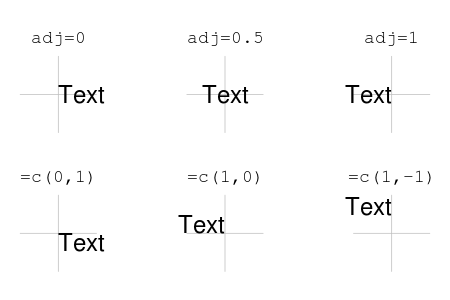
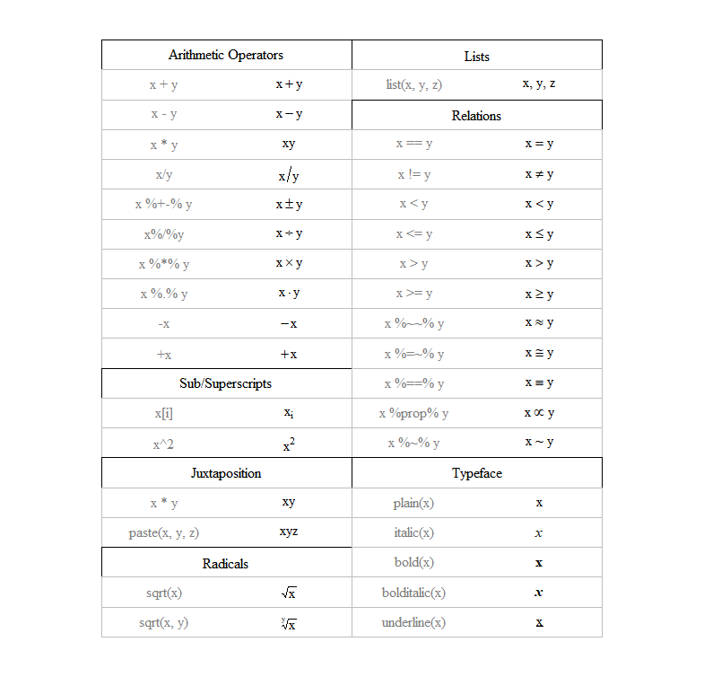
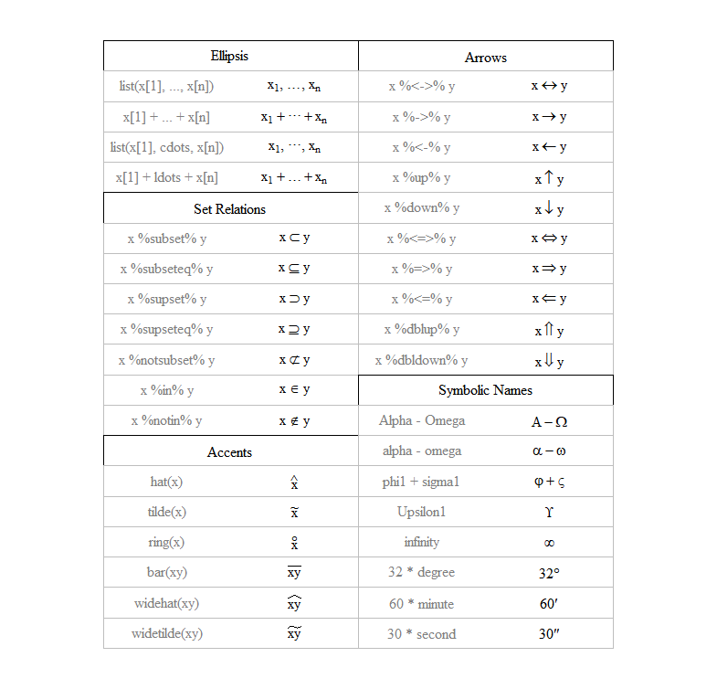
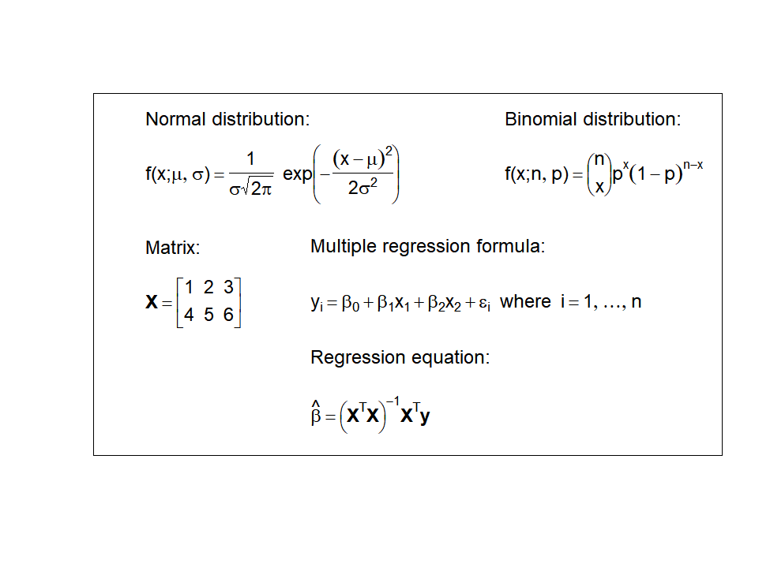

# 데이터 시각화 {#ch-data-visualization}

\footnotesize

\BeginKnitrBlock{rmdimportant}<div class="rmdimportant">**학습 목표**
  
- R에서 기본으로 제공하는 그래프 생성 개념 및 관련 함수의 의미 및 사용 방법에 대해 학습한다. 
- Grammar of graphics를 기반으로 개발된 ggplot2 패키지에 대해 알아보고 사용 방법을 학습힌다. 
</div>\EndKnitrBlock{rmdimportant}

 \normalsize

> “The simple graph has brought more information to the data analyst’s mind than any other device.” 
>
> $\rightarrow$ **John Tukey**


- 그래프는 생각보다 더 많은 정보를 제공 
- 데이터 분석 시 통계량 만으로 데이터의 속성을 결정하는 것은 매우 위험(예: Anscombe's quartet 데이터 예제)

\footnotesize


```
  x1 x2 x3 x4   y1   y2    y3   y4
1 10 10 10  8 8.04 9.14  7.46 6.58
2  8  8  8  8 6.95 8.14  6.77 5.76
3 13 13 13  8 7.58 8.74 12.74 7.71
4  9  9  9  8 8.81 8.77  7.11 8.84
5 11 11 11  8 8.33 9.26  7.81 8.47
6 14 14 14  8 9.96 8.10  8.84 7.04
```

```
      x1       x2       x3       x4       y1       y2       y3       y4 
9.000000 9.000000 9.000000 9.000000 7.500909 7.500909 7.500000 7.500909 
```

```
      x1       x2       x3       x4       y1       y2       y3       y4 
3.316625 3.316625 3.316625 3.316625 2.031568 2.031657 2.030424 2.030579 
```

<div class="figure">

<p class="caption">(\#fig:unnamed-chunk-3)Anscombe's quartet: https://goo.gl/Ugv3Cz 에서 스크립트 발췌</p>
</div>

 \normalsize

- 시각화는 분석에 필요한 통계량 또는 분석 방법론에 대한 가이드를 제시
- 인간의 뇌 구조 상 추상적인 숫자나 문자 보다는 그림이나 도표를 더 빨리 이해
- 다른 통계 패키지(SPSS, SAS, STATA 등)와 비교할 수 없을 정도로 월등한 성능의 그래픽 도구 및 기능 제공


## R 기본 그래프 함수 {#r-basic-graphics}

- R의 그래픽은 그래픽 장치에 특정 그림(선, 점, 면 등)을 순차적으로 추가하는 명령(스크립트)을 통해 생성

- **그래픽 장치**: R에서 그래프가 출력되는 장치
   - windows: R 프로그램 내에서 출력
   - graphic files: pdf, jpeg, tiff, png, bmp 등의 확장자를 갖는 이미지 파일


- 그래프 장치를 열기 위해 사용되는 함수

   - `windows()` 또는 `win.graph()`: 그래픽 장치를 열기 위해 사용하는 함수
   - `dev.cur()`: 현재 활성화된 그래프 장치 확인
   - `dev.set()`: 다수의 그래프 장치가 열려 있는 경우 `which = 번호`로 변경
   - `dev.list()`: 현재 열려 있는 그래픽 장치 목록 조회
   - `dev.off()`: 현재 작업 중인 그래픽 장치 중지
   - `graphics.off()`: 열려있는 모든 그래픽 장치 중지


- R 그래프의 구조

\footnotesize

<div class="figure" style="text-align: center">

<p class="caption">(\#fig:r-graphic-layout)R 그래프영역</p>
</div>

 \normalsize

- Figure region: 범례(legend), x축, y축, 도표 등을 그래프가 표현하는 모든 구성요소를 포함하는 영역(plot region 포함)
- Plot region: 도표 부분 출력되는 영역
- Figure margin: figure region 안에서 plot region의 여백 부분을 나타내며, x, y 축 레이블(label), 제목(title), 각 축의 tick 및 값 등이 주로 위치하는 영역
- Outer margin: figure region 밖의 여백 부분


\footnotesize

\BeginKnitrBlock{rmdnote}<div class="rmdnote">R 기본 그래프 함수에 대한 강의 내용은 주로 [AIMS-R-users](http://users.monash.edu.au/~murray/AIMS-R-users/ws/ws11.html)에서 참고를 함</div>\EndKnitrBlock{rmdnote}

 \normalsize


그래프의 요소: **점(point)**, **선(line)**, **면(area)**, , **텍스트(text)**, **축(axis)**, **눈금(tick)**, **범례(legend)** 등


- **저수준 그래프 함수(low level plotting function)**: 위의 그래프 요소들을 개별적으로 작업(좌표축 정의, 여백 정의)하기 위한 함수군
- **고수준 그래프 함수(high level plotting function)**: 그래프의 함수 기능(저수준 그래프 함수)를 모아서 하나의 완성된 도표(산점도, 막대도표, 히스토그램, 상자그림 등)를 생성할 수 있는 함수군
   - 고수준 그래프 함수를 호출할 경우 자동으로 그래픽 장치가 열려서 `win.graph()` 등을 사용할 필요가 없으나, 이미 호출된 그래프는 사라짐
   
   
\footnotesize

\BeginKnitrBlock{rmdcaution}<div class="rmdcaution">**주의**: 일반적으로 R 기본 그래픽 함수로 도표 작성 시 저수준 그래프 함수는 고수준 그래프 함수로 생성한 그래프에 부가적 기능을 추가하기 위해 사용됨. 따라서 저수준 그래프 함수군은 고수준 그래프 함수을 통해 먼저 생성한 그래프(주로 아래 설명할 `plot()` 함수) 위에 적용됨. 
</div>\EndKnitrBlock{rmdcaution}

 \normalsize


## 고수준 그래프 함수 {#high-level-graph}

### **`plot()` 함수** {#plot-fun}

- R의 가장 대표적인 2차원 고수준 그래프 출력 함수
- `plot()`의 가장 일반적인 용도는 그래프 장치를 설정(축, 값의 범위 등) 후 저수준 그래프 함수(축, 선, 점, 면 등)를 그래프 장치에 적용
- 데이터가 저장되어 있는 객체(벡터, 행렬, 데이터 프레임 등) 하나 이상을 함수의 인수(argument)로 사용
- 데이터의 클래스에 따라 출력되는 그래프 결과가 다름 $\rightarrow$ `methods(plot)`을 통해 `plot()` 함수가 적용되는 클래스 확인 가능


\footnotesize


```r
#각 클래스에 적용되는 plot() 함수 리스트
methods(plot)
```

```
 [1] plot,ANY-method        plot,color-method      plot.acf*             
 [4] plot.ACF*              plot.augPred*          plot.compareFits*     
 [7] plot.data.frame*       plot.decomposed.ts*    plot.default          
[10] plot.dendrogram*       plot.density*          plot.ecdf             
[13] plot.factor*           plot.formula*          plot.function         
[16] plot.ggplot*           plot.gls*              plot.gtable*          
[19] plot.hcl_palettes*     plot.hclust*           plot.histogram*       
[22] plot.HoltWinters*      plot.intervals.lmList* plot.isoreg*          
[25] plot.lm*               plot.lme*              plot.lmList*          
[28] plot.medpolish*        plot.mlm*              plot.nffGroupedData*  
[31] plot.nfnGroupedData*   plot.nls*              plot.nmGroupedData*   
[34] plot.pdMat*            plot.ppr*              plot.prcomp*          
[37] plot.princomp*         plot.profile.nls*      plot.R6*              
[40] plot.ranef.lme*        plot.ranef.lmList*     plot.raster*          
[43] plot.shingle*          plot.simulate.lme*     plot.spec*            
[46] plot.stepfun           plot.stl*              plot.table*           
[49] plot.trans*            plot.trellis*          plot.ts               
[52] plot.tskernel*         plot.TukeyHSD*         plot.Variogram*       
see '?methods' for accessing help and source code
```

```r
#예시 1: 객체 클래스가 데이터 프레임인 경우
# mtcars 데이터 예시
class(mtcars)
```

```
[1] "data.frame"
```

```r
plot(mtcars)
```

<!-- -->

 \normalsize

\footnotesize


```r
# 예시2: lm()으로 도출된 객체(list)
## 연비(mpg)를 종속 변수, 배기량(disp)을 독립변수로 한 회귀모형
## lm() 함수 사용 -> 객체 클래스는 lm

mod <- lm(mpg ~ disp, data = mtcars)
class(mod)
```

```
[1] "lm"
```

```r
par(mfrow = c(2, 2)) # 4개 도표를 한 화면에 표시(2행, 2열)
plot(mod)
dev.off() # 활성화된 그래프 장치 닫기
```

```
null device 
          1 
```

<!-- -->

 \normalsize

\footnotesize


```r
# 예시3: 테이블 객체
class(Titanic)
```

```
[1] "table"
```

```r
plot(Titanic)
```

<!-- -->

 \normalsize


- 객체의 클래스가 벡터나 행렬인 경우, 객체에 저장된 데이터를 2차원 평면(x-y 좌표)에 출력

\footnotesize


```r
# 예시1: 데이터 객체를 하나만 인수로 받는 경우
# -> x축은 객체의 색인이고, x의 데이터는 y 좌표에 매핑
x <- mtcars$disp
y <- mtcars$mpg

plot(x); plot(y)
```


 \normalsize

\footnotesize


```r
# 두개의 객체를 인수로 받은 경우
# -> 2차원 산점도 출력

plot(x, y)
```

<!-- -->

 \normalsize

- `plot()` 함수의 세부 옵션

\footnotesize


```r
plot(
  x, # x 축에 대응하는 데이터 객체
  y, # y 축에 대응하는 데이터 객체
  type, # 그래프 타입(예시 참조)
  main, # 제목 
  sub,  # 부제목 
  xlim, ylim, # x, y 축 범위 지정
  xlab, ylab, # x-y 축 이름
  lty, # 선 모양
  pch, # 점 모양
  cex, # 점 및 텍스트 크기
  lwd, # 선 굵기
  col  # 색상
)
```

 \normalsize

- `type` 인수: 그래프 타입 지정

\footnotesize


```r
# BOD 데이터셋 이용
x <- BOD$Time; y <- BOD$demand
x; y
```

```
[1] 1 2 3 4 5 7
```

```
[1]  8.3 10.3 19.0 16.0 15.6 19.8
```

```r
ctype <- c("p", "l", "b", "o", "c", "h", "s", "n")
type_desc <- c("points", "lines", 
               "both points and lines", 
               "overlapped points and plots", 
               "empty points joined by lines", 
               "histogram like vertical lines", 
               "stair steps", 
               "no lines and points")

op <- par(mfrow = c(2, 4))
for (i in 1:length(ctype)) {
  plot(x, y, 
       type = ctype[i], 
       main = paste("type =", "'", ctype[i], "'"),
       sub = type_desc[i], 
       cex.main = 1.5, 
       cex.sub = 1.5, 
       cex = 2)
}
```

<!-- -->

```r
par(op)
```

 \normalsize

- `xlim`, `ylim` 인수: x, y 축의 범위 지정


\footnotesize


```r
op <- par(mfrow = c(2, 3))
range <- data.frame(
  x1 = rep(c(0, 1), each = 3),
  x2 = rep(c(10, 5), each = 3), 
  y1 = rep(c(0, 5, 8), times = 2), 
  y2 = rep(c(30, 20, 16), times = 2)
  )
for (i in 1:6) {
  plot(x, y, 
       xlim = as.numeric(range[i, 1:2]), 
       ylim = as.numeric(range[i, 3:4]), 
       main = paste0("xlim = c(", 
                     paste(as.numeric(range[i, 1:2]), 
                           collapse = ", "), "), ", 
                     "ylim = c(", 
                     paste(as.numeric(range[i, 3:4]), 
                           collapse = ", "), ")")
       )
}
par(op)
```

<!-- -->

 \normalsize

- `xlab`, `ylab` 인수: x축과 y축 이름 지정

\footnotesize


```r
x_lab <- c(" ", "Time (days)")
y_lab <- c("Demand", "Oxygen demend (mg/l)")

op <- par(mfrow = c(2, 2))
lab_d <- expand.grid(x_lab, y_lab)

for (i in 1:4) {
  plot(x, y, 
       xlab = lab_d[i, 1], 
       ylab = lab_d[i, 2], 
       main = paste0("xlab = ", "'", lab_d[i, 1], "'", ", ", 
                     "ylab = ", "'", lab_d[i, 2], "'")
  )
}
par(op); dev.off()
```

```
null device 
          1 
```

<!-- -->

 \normalsize


- `lty` 인수: 선의 형태 지정

\footnotesize


```r
line_type <- c("blank", "solid", "dashed", "dotted",
               "dotdash", "longdash", "twodash")
plot(x = c(1:7), y = c(1:7), type="n", 
     axes = FALSE, 
     xlab = "", 
     ylab = "", 
     main = "Basic Line Types", 
     cex.main = 1.5)

for (i in 1:length(line_type)) {
  lines(c(1, 5.2), c(i, i), lty = i - 1, lwd = 2)  
  text(5.5, i, 
       labels = paste0("lty = ", i - 1, " (", 
                       line_type[i], ")"), 
       cex = 1.2, 
       adj = 0)
}
```

<div class="figure">

<p class="caption">(\#fig:plot-linetype)lty 파라미터 값에 따른 선 형태</p>
</div>

 \normalsize


- `pch` 인수: 점(point)의 모양을 지정

\footnotesize


```r
coord <- expand.grid(x = 1:5, y = 1:5)
plot(coord, type = "n", 
     xlim = c(0.8, 5.5), 
     ylim = c(0.8, 5.5), 
     xlab = "", 
     ylab = "", 
     main = "Basic plotting characters", 
     xaxt = "n", 
     yaxt = "n")
grid()
points(coord, pch=1:25, cex = 2.5)
text(coord + 0.2, labels = 1:25, cex = 1)
```

<div class="figure">

<p class="caption">(\#fig:plot-symbol)R graphics 점 표현 기호 및 대응 번호</p>
</div>

 \normalsize

- `cex` 인수: 텍스트 및 점의 크기 지정
   - `cex.axis`: 각 축의 눈금 레이블 크기 조정
   - `cex.lab`: x-y 축의 이름 크기 조정
   - `cex.main`: 그림 제목 크기 조정
   - `cex.sub`: 부제목 크기 조정

- 텍스트 `cex` 인수 적용 예시

\footnotesize


```r
par(mfrow = c(2, 3))
plot(BOD, type = "p", cex = 2, 
     main = "cex = 2", 
     sub = "Subtitle")
plot(BOD, type = "p", 
     cex.axis = 2, 
     main = "cex.axis = 2", 
     sub = "Subtitle")
plot(BOD, type = "p", 
     cex.lab = 2, 
     main = "cex.lab = 2", 
     sub = "Subtitle")
plot(BOD, type = "p", 
     cex.main = 2, 
     main = "cex.main = 2", 
     sub = "Subtitle")
plot(BOD, type = "p",
     cex.sub = 2, 
     main = "cex.sub = 2", 
     sub = "Subtitle")
```

<!-- -->

 \normalsize

- `lwd` 인수: 선의 두께 지정
   - 점 `cex` 크기와 `lwd` 두께 


\footnotesize


```r
coord <- expand.grid(x = 1:5, y = 1:5)
plot(coord, type="n", 
     xlab = "cex", 
     ylab = "lwd", 
     xlim = c(0.5, 5.5), 
     ylim = c(0.5, 5.5),
     main = "pch and lwd size", 
     cex.main = 2, 
     cex.lab = 1.5)
points(coord, pch=16, cex = 1:5, col = "darkgray")
for (i in 1:5) {
  points(1:5, coord$y[coord$y == i], pch=21, 
         cex = 1:5, 
         lwd = i, col = "black")
}
```

<!-- -->

 \normalsize

- `col` 인수: 그래프의 점, 면, 선의 색상 
- `palette()` 함수를 통해 그래픽 기본 색상 확인(총 8개)

\footnotesize


 \normalsize

- `colors()`를 통해 R에서 기본으로 제공하는 색상 확인 가능(총 657개)
- 내장 색상 팔레트: `n` 개의 색상을 반환하고, 색상의 투명도는 `alpha` 인수를 통해 조정
   - `rainbow(n)`: Red $\rightarrow$ Violet
   - `heat.colors(n)`: White $\rightarrow$ Orange $\rightarrow$ Red
   - `terrain.colors(n)`: White $\rightarrow$ Brown $\rightarrow$ Green
   - `topo.colors(n)`: White $\rightarrow$ Brown $\rightarrow$ Green $\rightarrow$ Blue
   - `grey(n)`: White $\rightarrow$ Black

- [R Color Chart](https://rstudio-pubs-static.s3.amazonaws.com/3486_79191ad32cf74955b4502b8530aad627.html) 참고


### 주요 고수준 그래픽 함수{#main-high-level-graph}

### 산점도 {#scatter-plot}

#### **`car::scatterplot()`** {#car_scatterplot .unnumbererd}

- `plot(x, y)`를 통해 2차원 산점도를 그릴 수 있으나, car 패키지에 내장되어 있는 해당 함수를 이용해 보다 많은 정보(상자그림, 회귀곡선 등)를 포함

\footnotesize


```r
# car 패키지 설치
# install.packages("car")
# require(car)
car::scatterplot(mpg ~ disp, data = mtcars)
```

<!-- -->

 \normalsize

- `plot()` 함수의 인수 적용 가능

\footnotesize


```r
# help(scatterplot) 참고
car::scatterplot(mpg ~ disp, data = mtcars, 
                 regLine = list(method = lm, lty = 1, col = "red"), 
                 col = "black", cex = 2, pch = 16)
```

<!-- -->

 \normalsize


#### **`pairs()`** {#pairs .unnumbererd}

- `pairs()`: 산점도 행렬을 생성해주는 함수로, 객체의 클래스가 데이터 프레임인 경우 `plot(dat)`과 동일한 그래프를 반환

\footnotesize


```r
# iris dataset
plot(iris)
```

<!-- -->

 \normalsize


#### **`car::scatterplotMatrix()`** {#car_scatterplotMatrix .unnumbererd}

- R graphics 패키지의 `pair()`와 유사하나 각 변수 쌍별 회귀 곡선 및 분포 확인 가능


\footnotesize


```r
# iris dataset
car::scatterplotMatrix(iris, col = "black")
```

<!-- -->

 \normalsize


\footnotesize


```r
# help(scatterplotMatrix)
car::scatterplotMatrix(iris, col = c("red", "blue", "green"), 
                       smooth = FALSE, 
                       groups = iris$Species, 
                       by.groups = FALSE, 
                       regLine = list(method = lm, lwd = 1, col = "gray"), 
                       pch = (15:17))
```

<!-- -->

 \normalsize

### 행렬 그래프 {#mat-plot}

- 행렬 객체를 `plot()` 함수의 입력으로 사용한 경우 1-2 번째 열 데이터로 산점도를 출력

\footnotesize


```r
# 행렬을 plot() 함수의 입력으로 받은 경우
par(mfrow = c(1,2))
x <- seq(-5, 5, 0.01)
X <- mapply(dnorm, 
            list(a = x, b = x, c = x), 
            c(0, 1, 2), 
            c(1, 2, 4))
X <- matrix(X, nrow = length(x), ncol = 3)
head(X)
```

```
             [,1]        [,2]       [,3]
[1,] 1.486720e-06 0.002215924 0.02156933
[2,] 1.562867e-06 0.002249385 0.02166383
[3,] 1.642751e-06 0.002283295 0.02175862
[4,] 1.726545e-06 0.002317658 0.02185368
[5,] 1.814431e-06 0.002352479 0.02194902
[6,] 1.906601e-06 0.002387763 0.02204463
```

```r
# plot() 함수를 이용한 행렬 그래프 출력
plot(X, type = "l", main = "plot matrix (X) using plot()")
text(0.2, 0.05, labels = "plot(X, type = `l`)")
plot(X[, 1], X[, 2], type = "l", 
     main = "scatterplot between X[, 1] and X[, 2]")
text(0.2, 0.05, labels = "plot(X[,1], X[,2], type = `l`)")
```

<!-- -->

 \normalsize

#### **`matplot()`** {#mat_plot .unnumbered}

- 객체의 클래스가 행렬(matrix) 형태로 이루어진 데이터에 대한 그래프 출력
   - 열 기준으로 그래프 출력
   - x 가 주어지지 않은 경우, 행렬의 색인을 x 축으로 사용

\footnotesize


```r
# matplot 도표
par(mfrow = c(1, 2))
matplot(X, type = "l", 
        lwd = 2, 
        main = "matplot() without x")
matplot(x, X, type = "l", 
        lwd = 2, 
        main = "matplot() with x")
```

<!-- -->

 \normalsize


### 히스토그램  {#histogram}

#### **`hist()`** {#hist .unnumbered}

\footnotesize


```r
hist(
  x, # vector 객체
  breaks, # 빈도 계산을 위한 구간
  freq, # y축 빈도 또는 밀도(density) 여부
  col, # 막대 색상 지정
  border, # 막대 테두리 색 지정
  labels, # 막대 위 y 값 레이블 출력 여부 
  ...
)
```

 \normalsize


\footnotesize


```r
# airquality 데이터 셋
# help(airquality) 참고
glimpse(airquality)
```

```
Rows: 153
Columns: 6
$ Ozone   <int> 41, 36, 12, 18, NA, 28, 23, 19, 8, NA, 7, 16, 11, 14, 18, 1...
$ Solar.R <int> 190, 118, 149, 313, NA, NA, 299, 99, 19, 194, NA, 256, 290,...
$ Wind    <dbl> 7.4, 8.0, 12.6, 11.5, 14.3, 14.9, 8.6, 13.8, 20.1, 8.6, 6.9...
$ Temp    <int> 67, 72, 74, 62, 56, 66, 65, 59, 61, 69, 74, 69, 66, 68, 58,...
$ Month   <int> 5, 5, 5, 5, 5, 5, 5, 5, 5, 5, 5, 5, 5, 5, 5, 5, 5, 5, 5, 5,...
$ Day     <int> 1, 2, 3, 4, 5, 6, 7, 8, 9, 10, 11, 12, 13, 14, 15, 16, 17, ...
```

```r
temp <- airquality$Temp
hist(temp)
```

<!-- -->

 \normalsize

- `hist()` 함수의 반환값

\footnotesize


```r
h <- hist(temp, plot = FALSE) # 그래프를 반환하지 않음
h
```

```
$breaks
 [1]  55  60  65  70  75  80  85  90  95 100

$counts
[1]  8 10 15 19 33 34 20 12  2

$density
[1] 0.010457516 0.013071895 0.019607843 0.024836601 0.043137255 0.044444444
[7] 0.026143791 0.015686275 0.002614379

$mids
[1] 57.5 62.5 67.5 72.5 77.5 82.5 87.5 92.5 97.5

$xname
[1] "temp"

$equidist
[1] TRUE

attr(,"class")
[1] "histogram"
```

 \normalsize


- `hist()` 함수의 인수 사용(`plot()` 함수의 인수 거의 대부분 사용 가능)

\footnotesize


```r
par(family = "nanumgothic")
hist(temp,
main="La Guardia Airport 일중 최고 기온",
xlab = "온도",
ylab = "밀도",
xlim = c(50,100),
col = "orange",
freq = FALSE
)
```

<!-- -->

 \normalsize

- `labels` 인수를 통해 빈도값 출력

\footnotesize


```r
par(family = "nanumgothic")
hist(temp,
main = "La Guardia Airport 일중 최고 기온",
xlab = "온도",
ylab = "빈도",
xlim = c(50,100),
col = "orange",
labels = TRUE
)
```

<!-- -->

 \normalsize

- `breaks` 인수를 통해 막대 구간 조정

\footnotesize


```r
op <- par(mfrow = c(1, 2))
hist(temp, breaks = 4, main = "breaks = 4")
hist(temp, breaks = 15, main = "breaks = 15")
par(op); dev.off()
```

```
null device 
          1 
```

<!-- -->

 \normalsize


### 막대 그래프 {#bar-plot}

- 히스토그램(`hist()`)은 연속형 데이터의 구간 별 빈도 또는 밀도를 나타냄
- 막대 도표(bar plot)는 해당 좌표의 값(value)를 나타냄

\footnotesize


```r
x = c(1,2,2,1,3,3,1,5)
par(mfrow = c(1, 2))
hist(x); barplot(x)
```

<!-- -->

 \normalsize

#### **barplot()** {#barplot_fun .unnumbered}

- `help(barplot)` 을 통해 함수 사용 방법 확인
- 보통 요약통계량(예: 그룹별 빈도, 평군)의 시각화를 위해 많이 사용

\footnotesize


```r
## Wool dataset: warpbreaks 
## 제직 중 방적 횟수
## 직조기 당 날실 파손 횟수 데이터
head(warpbreaks)
```

```
  breaks wool tension
1     26    A       L
2     30    A       L
3     54    A       L
4     25    A       L
5     70    A       L
6     52    A       L
```

```r
count <- with(warpbreaks, 
              tapply(breaks, list(wool, tension), 
                     sum))

par(mfrow = c(1, 2))
barplot(count, legend = TRUE, 
        xlab = "Tension", 
        ylab = "Number of breaks", 
        ylim = c(0, 700), 
        cex.lab = 1.5) # stack 형태

barplot(count, legend = TRUE, beside = TRUE, 
        xlab = "Tension", 
        ylab = "Number of breaks", 
        ylim = c(0, 450), 
        cex.lab = 1.5) # 분리 형태
```

<!-- -->

 \normalsize

- 데이터 프레임을 대상으로 `barplot()` 실행 시 수식 표현 가능
- 막대도표 + 표준오차

\footnotesize


```r
mean_breaks <- aggregate(breaks ~ wool + tension, 
                         data = warpbreaks, 
                         mean)
se_breaks <- aggregate(breaks ~ wool + tension, 
                       data = warpbreaks, 
                       FUN = function(x) sd(x)/sqrt(length(x)))

barplot(breaks ~ wool + tension, 
        data = mean_breaks, 
        ylim = c(0, 55), 
        beside = TRUE, 
        legend = TRUE, # 범례
        col = c("blue", "skyblue")
        ) -> bp
cent <- matrix(mean_breaks$breaks, 2, 3)
sem <- matrix(se_breaks$breaks, 2, 3)
arrows(bp, cent - sem, bp, cent + sem, angle = 90, code = 3, length = 0.05)
```

<!-- -->

 \normalsize

### 상자 그림 {#boxplot}

- 다섯 개의 통계량(5 numbers summary: 최솟값, 1사분위수, 중앙값, 3사분위수, 최댓값)을 이용해 연속형 자료를 그래프로 표현한 도표

\footnotesize


```r
set.seed(20200522)
x <- rnorm(100)
plab <- c("min(x)", "quantile(x, 0.25)", "median(x)", 
          "quantile(x, 0.75)", "max(x)") # x-axis 레이블
bxplt <- boxplot(x, 
                 horizontal = TRUE, # x-y 축 회전 여부
                 axes = F, # x-y 축 출력 여부
                 main = "Boxplot anatomy", 
                 cex.main = 2
                 ) # boxplot 수치 요약값 저장
axis(side = 1, at = bxplt$stats, 
     labels = FALSE, 
     las = 2) # x-axis 설졍
text(x = c(bxplt$stats), 
     y = 0.4, 
     labels = plab, 
     xpd = TRUE, # 텍스트 출력 영역 범위 지정
     srt = 25, # 레이블 로테이션 각도(degree)
     adj = 1.1, # 레이블 위치 조정
     cex = 1.2 # 레이블 크기 조정
     ) # x-axis 레이블 조정
abline(v = c(bxplt$stats), lty = 2, col = "gray") # 수직 선 출력
arrows(x0 = c(bxplt$stats)[2], y0 = 1.3, 
       x1 = c(bxplt$stats)[4], y1 = 1.3, 
       code = 3, 
       length = 0.1) # IQR 범위에 화살표 출력
text(x = -0.1, y = 1.3, 
     labels = "Interquartile range (IQR)", 
     adj = 0.5, pos = 3) # 
```

<!-- -->

 \normalsize


#### **boxplot()** {#boxplot_fun .unnumbered}

- `help(boxplot)`을 통해 상세 함수 인수 내용 확인

\footnotesize


```r
boxplot(x, # boxplot 대상 객체 명
        ... # 두 개 이상 객체(보통은 벡터)
        ) 
또는 

boxplot(formula, # 수식 표현
        data, # 데이터 프레임 객체명
        subset, # 부집단 선택
        ... # help(boxplot)을 통해 인수 사용법 참고
        )
```

 \normalsize


- 벡터, 행렬, 데이터 프레임, 리스트 객체에 적용 가능
- 데이터 프레임의 경우 수식 표현 가능
   - `y ~ x`: 변수 `x` (보통은 factor 형)에 따른 `y`
   - `y ~ x + y`: 변수 `x`와 `y`의 조합에 따른 `y`


\footnotesize


```r
par(mfrow = c(2, 2))
set.seed(20200522)
y <- rnorm(100, 2, 1)
# vector 객체 boxplot
boxplot(x, y, 
        main = "Boxplot for a vector object")
axis(side = 1, at = 1:2, labels = c("x", "y"))

# 행렬 객체 boxplot
head(X)
```

```
             [,1]        [,2]       [,3]
[1,] 1.486720e-06 0.002215924 0.02156933
[2,] 1.562867e-06 0.002249385 0.02166383
[3,] 1.642751e-06 0.002283295 0.02175862
[4,] 1.726545e-06 0.002317658 0.02185368
[5,] 1.814431e-06 0.002352479 0.02194902
[6,] 1.906601e-06 0.002387763 0.02204463
```

```r
boxplot(X, 
        main = "Boxplot for a matrix `X`")

# 데이터 프레임 객체 boxplot
boxplot(breaks ~ wool + tension, 
        data = warpbreaks, 
        main = "Boxplot for a dataframe `warpbreaks`", 
        col = topo.colors(6))

# 리스트 객체 boxplot
## list 생성: mapply
set.seed(20200522)
xl <- mapply(rnorm, # 정규 난수 생성 함수
             c(50, 100, 150, 200), # 첫번째 인수 n
             c(0, 2, 4, 6), # 두 번째 인수 mean
             c(1, 1, 1, 2)) # 세번째 인수 sd
boxplot(xl, 
        main = "Boxplot for a list `xl`", 
        col = "lightgray")
```

<!-- -->

 \normalsize


### 바이올린 도표 {#violin-plot}

- 상자그림과 유사하나, 가운데를 중심으로 왼쪽과 오른쪽에 데이터의 밀도(kernel density)를 표시 


#### **vioplot::viplot()** {#vioplot .unnumbered}

- `boxplot()`과 사용 방법이 유사 

\footnotesize


```r
# install.packages(vioplot)
# require(vioplot)
## generating bimodal distribution
mu <- 2; sigma <- 1
set.seed(20200522)
bimodal <- c(rnorm(200, mu, sigma), 
             rnorm(300, -mu, sigma)) # 두 정규분포 혼합
normal <- rnorm(200, 2*mu, sigma) # 정규분포
unif <- runif(200, -2, 2) # uniform 분포 (-2, 2)

par(mfrow = c(2,2))
boxplot(bimodal, normal, unif, 
        main = "Boxplot for each distribution (vectors)")
vioplot::vioplot(bimodal, normal, unif, 
                 main = "Violin plot for each distribution (vectors)", 
                 col = "skyblue")

vioplot::vioplot(breaks ~ wool + tension, 
                 data = warpbreaks, 
                 main = "Violin plot for a dataframe `warpbreaks`", 
                 col = heat.colors(6))

vioplot::vioplot(xl, 
                data = warpbreaks, 
                main = "Violin plot for a list `xl`", 
                col = rainbow(4))
```

<!-- -->

 \normalsize


### 모자이크 도표 {#mosaicplot}

- 다변량 범주형 자료의 분포(빈도, frequency)를 시각화 하기 위한 그래프
- 전체 직사각형의 면적을 1이라고 할 때, 중첩되지 않는 각 셀의 빈도(행 기준)의 비율만큼 면적을 할당. 
- 로그선형모형(log-linear model)에 대한 적합도 검정(goodness of fit test) 결과 출력

\footnotesize

\BeginKnitrBlock{rmdnote}<div class="rmdnote">로그선형모형(log-linear model)은 다차원 교차표의 셀 빈도를 예측하기 위한 모형임. 해당 모형에 대한 기술은 본 강의의 범위 벗어나기 때문에 설명을 생략함. </div>\EndKnitrBlock{rmdnote}

 \normalsize


\footnotesize

<!-- -->

 \normalsize


#### **mosaicplot()** {#mosaicplot_fun .unnumbered} 

- R graphics 패키지(기본 그래픽 패키지)에 내장되어 있는 함수
- 기본적으로 table 객체(기본적으로 `table()`을 통해 생성된 객체)를 입력 데이터로 받음
- 수식 표현을 통해 모자이크 데이터 프레임(또는 리스트), 객체로부터 도출한 테이블로 도표 생성 가능(테이블 객체에도 수식 표현 가능)

\footnotesize


```r
mosaicplot(
  x, # 테이블 객체
  shade # goodness-of-test 결과 출력 여부
  ... 
) 
또는

mosaicplot(
  formula, # 수식 표현식
  data, # 데이터 프레임, 리스트 또는 테이블 
  shade 
)
```

 \normalsize

- 예시: 버클리 주립대 대학원 합격자 데이터
   - Simpson's paradox를 설명하는 대표적인 예시로 많이 활용되는 데이터

\footnotesize


```r
dimnames(UCBAdmissions)
```

```
$Admit
[1] "Admitted" "Rejected"

$Gender
[1] "Male"   "Female"

$Dept
[1] "A" "B" "C" "D" "E" "F"
```

```r
collapse_admin_tab <- margin.table(UCBAdmissions, margin = c(1,2))
is.table(collapse_admin_tab)
```

```
[1] TRUE
```

```r
par(mfrow = c(1, 2), 
    mar = c(2, 0, 2, 0)) # figure margin 조정
                         # bottom, left, top, right
mosaicplot(collapse_admin_tab, 
           main = "Student admissions at UC Berkeley", 
           color = TRUE)
mosaicplot(~ Dept + Admit + Gender, data = UCBAdmissions, 
           color = TRUE)
```

<!-- -->

 \normalsize

- 각 학과 별 mosaic 도표(`help(UCBAdmissions)`의 예시 코드)

\footnotesize


```r
par(mfrow = c(2, 3), 
    oma = c(0, 0, 2, 0))
for (i in 1:6) {
  mosaicplot(
    UCBAdmissions[, , i], 
    xlab = "Admit", 
    ylab = "Sex", 
    main = paste("Department", LETTERS[i]), 
    color = TRUE
  )
}
mtext(
  expression(bold("Student admissions at UC Berkeley")), 
  outer = TRUE, 
  cex = 1.2
)
```

<!-- -->

 \normalsize


## 저수준 그래프 함수 {#low-level-graphic}

- 고수준 그래픽 함수(일반적으로 `plot()` 함수)를 통해 호출한 그래픽 장치 위에 추가적인 그래프 요소(점, 선, 면, 문자, 범례 등)를 수동으로 추가
- 그래프의 미학적 효과를 극대화 하기 위해, 최소한으로 그래픽 장치를 호출(공백, 크기, 레이아웃 축 정의) 후 저수준 그래픽 함수를 이용해 그래프 생성
- \@ref(plot-fun) 절 `plot()` 함수에서 확인했던 다양한 그래픽 관련 인수(예: `main`, `xlim`, `ylim`, `pch` `lty`, `col` 등)들을 저수준 그래프 함수에서 사용 가능
- 명시적으로 포함되지 않은(`help()` 통해 확인) 인수들은 `...`로 표현되고, `par()` 함수 내 파라미터 값으로 전달


### par() {#par}

- 전체 그래픽 장치에 적용되는 여러가지 파라미터를 제어하며, 고수준 및 저수준 그래프의 모양 및 미학적 특성 설정
- `par()` 함수를 통해 그래픽 파라미터 설정 및 조회 가능

\footnotesize


```r
# 그래프 파라미터 조회 
# 처음 12개 파라미터들에 대해서만 조회
unlist(par()) %>% head(12)
```

```
         xlog          ylog           adj           ann           ask 
      "FALSE"       "FALSE"         "0.5"        "TRUE"       "FALSE" 
           bg           bty           cex      cex.axis       cex.lab 
"transparent"           "o"           "1"           "1"           "1" 
     cex.main       cex.sub 
        "1.2"           "1" 
```

```r
# 파라미터 이름으로 값 추출
par("mar")
```

```
[1] 5.1 4.1 4.1 2.1
```

 \normalsize

- `par()` 함수 조정 파라미터 리스트


\footnotesize

<table class="table table-striped" style="font-size: 11px; margin-left: auto; margin-right: auto;">
<caption style="font-size: initial !important;">(\#tab:tab-05-01)</caption>
 <thead>
  <tr>
   <th style="text-align:right;"> Parameter </th>
   <th style="text-align:left;"> 값 </th>
   <th style="text-align:left;"> 설명 </th>
  </tr>
 </thead>
<tbody>
  <tr>
   <td style="text-align:right;width: 2cm; font-family: monospace;"> din, fin, pin </td>
   <td style="text-align:left;width: 4cm; font-family: monospace;"> = c(width, height) </td>
   <td style="text-align:left;width: 5cm; font-family: monospace;"> 그래픽 장치(device), figure, plot 영역 크기(너비: width, 높이: height) 조정(인치 단위) </td>
  </tr>
  <tr>
   <td style="text-align:right;width: 2cm; font-family: monospace;"> fig </td>
   <td style="text-align:left;width: 4cm; font-family: monospace;"> =c(left, right, bottom, top) </td>
   <td style="text-align:left;width: 5cm; font-family: monospace;"> 장치 내 figure 영역의 4개 좌표 조정을 통해 figure 위치 및 크기 조정 </td>
  </tr>
  <tr>
   <td style="text-align:right;width: 2cm; font-family: monospace;"> mai, mar </td>
   <td style="text-align:left;width: 4cm; font-family: monospace;"> = c(bottom, left, top, right) </td>
   <td style="text-align:left;width: 5cm; font-family: monospace;"> Figure 영역의 각 4개 마진의 크기 조정(인치 또는 현재 폰트 사이즈 기준 텍스트 길이 단위) </td>
  </tr>
  <tr>
   <td style="text-align:right;width: 2cm; font-family: monospace;"> mfcol,mfrow </td>
   <td style="text-align:left;width: 4cm; font-family: monospace;"> = c(row, column) </td>
   <td style="text-align:left;width: 5cm; font-family: monospace;"> 그래프 화면 출력을 열 또는 행 기준으로 분할 </td>
  </tr>
  <tr>
   <td style="text-align:right;width: 2cm; font-family: monospace;"> mfg </td>
   <td style="text-align:left;width: 4cm; font-family: monospace;"> =c(rows, columns) </td>
   <td style="text-align:left;width: 5cm; font-family: monospace;"> mfcol 또는 mfrow로 분할된 그림에서 figure의 위치 조정 </td>
  </tr>
  <tr>
   <td style="text-align:right;width: 2cm; font-family: monospace;"> new </td>
   <td style="text-align:left;width: 4cm; font-family: monospace;"> =TRUE or =FALSE </td>
   <td style="text-align:left;width: 5cm; font-family: monospace;"> 현재 figure 영역을 새 그래프 장치로 인지(TRUE 이면 이미 출력된 그림 위에 새로운 고수준 그래프 함수가 생성) 여부 </td>
  </tr>
  <tr>
   <td style="text-align:right;width: 2cm; font-family: monospace;"> oma,omd,omi </td>
   <td style="text-align:left;width: 4cm; font-family: monospace;"> =c(bottom, left, top, right) </td>
   <td style="text-align:left;width: 5cm; font-family: monospace;"> Outer margin (여백) 각 영역별 크기 조정(인치 또는 설정 텍스트 크기 기준) </td>
  </tr>
</tbody>
</table>

 \normalsize


- R 그래픽 레이아웃(그림 \@ref(fig:r-graphic-layout) 참조) 조정 파라미터

\footnotesize

<div class="figure">

<p class="caption">(\#fig:layout-par)레이아웃 파라미터. AIMS-R-Users 에서 발췌</p>
</div>

 \normalsize


\footnotesize

\BeginKnitrBlock{rmdnote}<div class="rmdnote">아래 `par()` 함수의 파라미터 값에 대한 도표 생성을 위한 R 스크립트는 [Graphical parameters of R graphics package](http://rstudio-pubs-static.s3.amazonaws.com/315576_85cccd774c29428ba46969316cbc76c0.html)에서 참고 및 발췌
</div>\EndKnitrBlock{rmdnote}

 \normalsize


#### **`pin`** {#pin .unnumbered}

> 현재 plot의 차원(너비와 높이) 조정

\footnotesize

<!-- -->

 \normalsize

#### **`fin`** {#fin .unnumbered}

> Figure 영역의 차원(너비와 높이)

\footnotesize

<!-- -->

 \normalsize


#### **`fig`** {#fig-par .unnumbered}

> - `c(x1, x2, y1, y2)` 형태의 숫자형 벡터를 인수로 받아 그래픽 디바이스의 디스플레이 영역에서 figure 영역의 좌표 지정
> - 처음 디폴트 값은 `c(0, 1, 0, 1)`
> - `fig` 파라미터 조정의 목적이 여러 개의 그림을 한 화면에 출력하는 것이 목적이라면 `par()` 파라미터 중 `new` 의 값을 `TRUE`로 설정

\footnotesize


```r
text_loc <- seq(0, 0.25, by = 0.05)
par_name <- c("mar", "mai", "fig", "fin", "plt", "pin")

plot_dim <- function(x, y, op, title, ...) {
  for (i in 1:length(text_loc)) {
    text(x, y + text_loc[i], 
         paste0(par_name[i], " = c(", 
                paste(round(op[[par_name[i]]]), 
                            collapse = ", "), ")"), 
         adj = 0, ...)
  }
  text(x, y + text_loc[i] + 0.05, title, adj = 0)
}


# 1. plot area available when internal margins are 0
par(op)
par(mai = c(0, 0, 0, 0), xaxs = 'i', yaxs = 'i')
plot.new()
abline(h = c(0.4, 0.9), v = c(0.4, 0.9), lty = 4)
rect(0.4, 0.4, 0.9, 0.9, border = "red")
par(op)


# 2. Plot new fig
newfig <- c(0.4, 0.9, 0.4, 0.9)
par(fig = newfig, new = TRUE)
op_reduced <- par(no.readonly = TRUE)
set.seed(12345)
plot(runif(10), runif(10), typ = 'p', 
    xlab = 'X', ylab = 'Y', xlim = c(0, 1), ylim = c(0, 1))
par(op)
par(mai = c(0, 0, 0, 0), xaxs = 'i', yaxs = 'i', new = TRUE)

# 3. Info about dimensions
plot.new()
plot_dim(0.05, 0.5, op_reduced, "New plot dimension on the right", cex = 0.9)
plot_dim(0.5, 0.05, op, "Default plot dimensions", cex = 0.8)
```

<div class="figure">

<p class="caption">(\#fig:fig-anatomy)fig 인수 조정 예시: Graphical parameters of R graphics package에서 발췌</p>
</div>

 \normalsize


#### **`mar`** {#mar .unnumbered}

> - `c(bottom, left, top, left)` 형태의 수치형 벡터를 값으로 갖음
> - plot 영역 밖의 여백(figure 영역)을 line 수로 지정(아래 그림 참고)
> - 디폴트 값은 `c(5, 4, 4, 2) + 0.1` 임

\footnotesize

<div class="figure">

<p class="caption">(\#fig:mar-anatomy)Figure 영역에서 기본 여백: Graphical parameters of R graphics package 에서 발췌</p>
</div>

 \normalsize


#### **`mfcol`, `mfrow`** {#mfrow-mfcol .unnumbered}

> - `c(nrow, ncol)` 형태의 2차원 수치형 벡터를 값으로 갖음
> - 앞의 예제에서 확인한 바와 같이 각 행과 열 별로 행 기준 또는 열 기준으로 다중 그래프를 한 화면에 출력
> - 정방형 그래프로 분할하며 `c(2, 2)`인 경우 텍스트 크기는 `cex` 값 기준 0.83배 감소

\footnotesize


```r
par(oma = c(0, 0, 3, 0), # 윗쪽 여백 크기 조정
    mfrow = c(3, 2))
for (i in 1:6) {
  set.seed(12345)
  plot(rnorm(20), rnorm(20),
       main = paste("Plot", i))
  box("figure")
}
# 윗쪽 여백(side=3)에 텍스트 출력
mtext(side = 3, line = 1, cex = 0.8, col = "blue",
    "Muptiple plots with mfrow = c(2, 3)",
    outer = TRUE) # outer 여백 사용 여부

par(oma = c(0, 0, 3, 0),
    mfcol = c(3, 2))
for (i in 1:6) {
  set.seed(12345)
  plot(rnorm(20), rnorm(20),
       main = paste("Plot", i))
  box("figure")
}
mtext(side = 3, line = 1, cex = 0.8, col = "blue",
    "Muptiple plots with mfcol = c(3, 2)",
    outer = TRUE)
```


 \normalsize


#### **mfg** {#mfg .unnumbered}

> - `c(i, j)` 형태의 숫자형 벡터의 값
> - `mfcol` 또는 `mfrow` 파라미터로 그림 배열이 정해진 상태에서 어떤 그림이 다음에 드려지는지를 지정
> - `c(1,1)`은 차원과 상관 없이 맨 처음 출력한 그래프가 생성

\footnotesize


```r
df_order <- expand.grid(x = 1:2,
                        y = 1:3)
set.seed(123)
idx <- sample(2:6, nrow(df_order)-1)
df_order <- df_order[c(1,idx), ]
par(mfrow = c(2, 3),
    oma = c(0, 0, 3, 0))

for (i in 0:5) {
  set.seed(123)
  par(mfg = as.numeric(df_order[i+1, ]))
  plot(rnorm(20), rnorm(20),
       main = paste("Plot", i+1))
  box("figure")
}

mtext(side = 3, line = 1, cex = 0.8, col = "blue",
    "Multiple plots by row: order in mfrow changed by mfg parameter.",
    outer = TRUE)
```

<!-- -->

 \normalsize

- `mfrow`와 `mfcol` 유사함수: `layout()`, `split.screen()`

- `layout()`:  행렬 객체를 인수로 받아 화면 분할

\footnotesize


```r
# mtcars 데이터셋
graph_array <- matrix(c(1, 1, 2, 3), nrow = 2, byrow = TRUE)
par(oma = c(0, 0 , 3, 0))
layout(mat = graph_array)
plot(mpg ~ disp, # 데이터 프레임인 경우 수식 표현도 가능
     data = mtcars,
     main = "layout 1")
hist(mtcars$disp,
     main = "layout 2")
hist(mtcars$mpg,
     main = "layout 3")
mtext(side = 3, line = 1, cex = 1, col = "blue",
      "c(1, 1): scatter plot, c(2) = histogram: dsip, c(3) = histogram: mpg",
      outer = TRUE)
```

<!-- -->

 \normalsize

- `split.screen()`: `layout()`과 유사하게 그래프의 화면을 분할하고 더 많은 기능을 제공
   - `screen()`: 분할된 화면 지정
   - `erase.screen()`: 지정된 화면의 그래프 삭제

\footnotesize


```r
split.screen(fig = c(2, 2)) # 화면을 2 by 2로 분할
```

```
[1] 1 2 3 4
```

```r
par(oma = c(0, 0, 3, 0))
screen(n = 4)
vioplot::vioplot(mpg ~ cyl, data = mtcars,
                 main = "screen n = 4")
screen(n = 1)
hist(mtcars$mpg,
     main = "screen n = 1")
screen(n = 3)
plot(mpg ~ wt, data = mtcars,
     main = "screen n = 3")
screen(n = 2)
boxplot(mpg ~ gear, data = mtcars,
        main = "screen n = 2")
mtext(side = 3, line = 1, cex = 0.8, col = "blue",
      "Split using split.screen()",
      outer = TRUE)
```

<!-- -->

 \normalsize


#### **new** {#new .unnumbered}

> - 논리값(`TRUE` 또는 `FALSE`) 지정
> - 디폴트 값은 `FALSE`
> - 새로운 그래프를 이미 존재하는 그래프 장치에 출력

\footnotesize


```r
# boxplot + violin plot
## iris 데이터 셋
par(bty = "n") # x-y 축 스타일 지정
boxplot(Sepal.Length ~ Species,
        data = iris)
new_fig <- c(0.05, 0.46, 0.4, 0.99)
par(new = TRUE,
    fig = new_fig)
vioplot::vioplot(Sepal.Length ~ Species,
                 data = iris,
                 col = "skyblue",
                 yaxt = "s",
                 ann = FALSE)
```

<!-- -->

 \normalsize


#### **oma** {#oma .unnumbered}

> - `c(bottom, left, top, right)` 형태의 숫자형 벡터 값 사용
> - Outer 여백의 크기 조정(텍스트 라인 기준)
> - 아래 예시는 `oma = c(2, 3, 3, 1)` 인 경우 여백 표시

\footnotesize

<div class="figure">

<p class="caption">(\#fig:oma-anatomy)Outer 여백 조정 파라미터(mar = c(2, 3, 3, 1)) Graphical parameters of R graphics package에서 발췌</p>
</div>

 \normalsize


### points() {#points}

- 점을 그리는 저수준 그래프 함수로 이미 출력된 x-y 좌표 위에 지정한 점 문자 출력
- x-y 좌표 지정은 `plot()` 함수와 동일
- 많이 사용되는 점 문자 기호(symbol)은 그림 \@ref(fig:plot-symbol) 참고

\footnotesize


```r
# cars 데이터셋
par(mfrow = c(1, 2))
plot(dist ~ speed, data = cars,
     type = "n",
     bty = "n",
     main = "points() function example 1: cars dataset")
points(cars$speed, cars$dist,
       pch = 16,
       col = "darkgreen",
       cex = 1.5)
shapes <- 15:17 # pch 지정
plot(Petal.Length ~ Sepal.Length, data = iris,
     type = "n",
     bty = "n",
     main = "points() function example 2: iris dataset")
points(iris$Sepal.Length,
       iris$Petal.Length,
       pch = shapes[as.numeric(iris$Species)], # 각 Species에 대해 shapes 할당
       col = as.numeric(iris$Species),
       cex = 1.5)
```

<!-- -->

 \normalsize


### lines() {#lines}

- x-y 좌표의 점을 이어 선을 만드는 함수
- `plot()` 함수에서 `type` 인수에 "l"을 사용한 것과 유사
- 선의 모양(`lty`)과 굵기(`lwd`)를 지정할 수 있으며 그림 \@ref(fig:plot-linetype)와 그림 \@ref(fig:plot-linewidth)를 참고

\footnotesize

<div class="figure">

<p class="caption">(\#fig:plot-linewidth)선 두께(lwd) 파라미터: Graphical parameters of R graphics package 에서 발췌</p>
</div>

 \normalsize

- `line()` 함수 사용 예시: 정규분포 분포 그리기

\footnotesize


```r
# 정규분포 평균=0, 분산=1
# 정규분포 평균=0, 분산=2
# 정규분포 평균=0, 분산=3
par(mar = c(3, 0, 3, 0))
x <- seq(-5, 5, 0.01)
y <- mapply(dnorm,
            list(x, x, x),
            c(0, 0, 0),
            c(1, sqrt(2), sqrt(3)))

plot(x, y[,1],
     type = "n",
     bty = "n",
     yaxt = "n",
     ann = FALSE,
     xlim = c(-5, 5))
lines(c(0, 0), c(0, max(y[,1])), lty = 2, col = "lightgray")
lines(x, y[,1], lty = 1, lwd = 2,
      col = "black")
lines(c(0.3, 2), rep(max(y[,1]), 2), lty = 1, col = "gray")
text(2.1, max(y[,1]),
     expression(paste(mu == 0, "," ~~ sigma == 1)), # 수식 표현
     adj = 0)

lines(x, y[,2], lty = 2, lwd = 2, col = "blue")
lines(c(0.3, 2), rep(max(y[, 2]), 2), lty = 1, col = "gray")
text(2.1, max(y[,2]),
     expression(paste(mu == 0, "," ~~ sigma == 2)), # 수식 표현
     adj = 0)

lines(x, y[,3], lty = 3, lwd = 2, col = "green")
lines(c(0.3, 2), rep(max(y[,3]), 2), lty = 1, col = "gray")
text(2.1, max(y[,3]),
     expression(paste(mu == 0, "," ~~ sigma == 3)), # 수식 표현
     adj = 0)
mtext("Normal distribution", side = 3, adj = 0.2, cex = 2)
```

<!-- -->

 \normalsize


### ablines() {#ablines}

- x-y 좌표에 직선을 그리는 함수로 `lines()` 함수와 유사하나 y 절편과 x 기울기, 또는 x 절편(y 축과 평행한 직선, `(x, 0)`)과 y 절편(x축과 평행한 직선, `(0, y)`)을 이용해 직선을 그릴 수 있음
   - `a`: y 절편
   - `b`: x 기울기
   - `h`: x축과 수평선(y 값)
   - `v`: x축과 수직선(y축과 수평선, x 값)

\footnotesize


```r
# 회귀직선과 x, y의 평균선, 회귀직선으로부터 각 점 까지 거리를 직선 표시
## mtcars 데이터
plot(mpg ~ hp, data = mtcars,
     type = "n",
     bty = "n",
     xlim = c(50, 350),
     ylim = c(5, 40),
     main = "abline() examples with mtcars dataset",
     xlab = "Horse power",
     ylab = "Miles/gallon",
     cex.main = 1.5)
m <- lm(mpg ~ hp, data = mtcars) # 일변량 회귀모형
yhat <- predict(m) # 회귀모형의 예측값

# 회귀직선으로부터 각 관측점 까지 거리(오차) 직선 표시 함수
dist_error <- function(i) {
  lines(c(mtcars$hp[i], mtcars$hp[i]),
        c(mtcars$mpg[i], yhat[i]),
        col = "green",
        lwd = 0.8,
        lty = 1)
}
for (i in 1:nrow(mtcars)) dist_error(i)

with(mtcars,
     points(hp, mpg,
            pch = 16,
            cex = 1))
abline(m, lty = 1, lwd = 3, col = "red")
abline(h = mean(mtcars$mpg),
       lty = 2,
       col = "darkgray") # mpg 평균
abline(v = mean(mtcars$hp),
       lty = 2,
       col = "darkgray") # hp 평균
text(mean(mtcars$hp), 40,
     # text 수식 표현 참고
     bquote(paste(bar(x) == .(sprintf("%.1f", mean(mtcars$hp))))),
     adj = 0,
     pos = 4)
text(350, mean(mtcars$mpg),
     bquote(paste(bar(x) == .(sprintf("%.1f", mean(mtcars$mpg))))),
     pos = 3)
```

<div class="figure">

<p class="caption">(\#fig:abline-example)abline(), lines() 함수를 이용한 회귀직선 및 오차 거리 표시 예제</p>
</div>

 \normalsize


### arrows() {#arrows}

- 화살표를 그리는 함수
- `x0, y0, x1, y1` 형태의 숫자를 값으로 사용
- `(x0, y0)`: 시작점 좌표
- `(x1, y1)`: 끝점 좌표
- `angle`, `length`, `code` 인수 조정을 통해 화살표 스타일 지정

\footnotesize


```r
par(mar = rep(0, 4))
plot(1, 1,
     type = 'n', axes = FALSE, ann = FALSE,
     xaxs = 'i', yaxs = 'i',
     xlim = c(0,11), ylim = c(0,11))
text(5.5, 10.5,
     "Type of arrows by values of angle, length, and codes",
     font = 2, # 2=bold, 3=italic, 4=bold italic
     adj = c(0.5, 0),
     cex = 1.5)

angle_val <- c(60, 90, 120)
length_val <- c(0.25, 0.1, 0.5)
code_val <- c(0, 1, 3)
for (i in 1:3) {
  arrows(1, 9-i+1, 5, 9-i+1,
         length = length_val[i])
  text(6, 9-i+1, pos = 4,
       sprintf("angle = 30, length = %.2f, code = 2",
               length_val[i]))
}

for (i in 1:3) {
  arrows(1, 6-i+1, 5, 6-i+1,
         length = 0.25,
         angle = angle_val[i])
  text(6, 6-i+1, pos = 4,
       sprintf("angle = %d, length = 0.25, code = 2",
               angle_val[i]))
}

for (i in 1:3) {
  arrows(1, 3-i+1, 5, 3-i+1,
         length = 0.25,
         angle = 30,
         code = code_val[i])
  text(6, 3-i+1, pos = 4,
       sprintf("angle = 30, length = 0.25, code = %d",
               code_val[i]))
}
```

<div class="figure">

<p class="caption">(\#fig:arrow-type)arrows() 함수 주요 파라미터 변경에 따른 화살표 출력 결과</p>
</div>

 \normalsize


### rect() {#rect}

- x-y 좌표 위에 사각형을 그리는 함수
   - `xleft`: 사각형의 왼쪽 x 좌표
   - `ybottom`: 사각형의 아래쪽 y 좌표
   - `xright`:  사각형의 오른쪽 x 좌표
   - `ytop`: 사각형의 위쪽 y 좌표

\footnotesize


```r
# 길이와 높이가 5인 정사각형 그리기
plot(x = 1:10,
     y = 1:10,
     type = "n",
     xlab = "", ylab = "",
     main = "Rectangle coordinates used in rect()")
rect(3, 3, 8, 8,
     density = 10, # 사각형 내부를 선으로 채움
     angle = 315) # 내부 선의 기울기 각도(degree)
text(3, 3, "(xleft = 3, ybottom = 3)", adj = 0.5,  pos = 1)
text(8, 3, "(xright = 8, ybottom = 3)", adj = 0.5, pos = 1)
text(8, 8, "(xright = 8, ytop = 8)", adj = 0.5, pos = 3)
text(3, 8, "(xleft = 3, ytop = 8)", adj = 0.5, pos = 3)
grid()
```

<div class="figure">

<p class="caption">(\#fig:rectangle-coord)rect() 좌표 인수</p>
</div>

 \normalsize


### polygon() {#polygon}

- x-y 좌표의 점을 연결해 폐 다각형을 만드는 함수
- 좌표 지정 방법은 `plot()` 함수와 동일

\footnotesize


```r
# polygon() 사용 예시
plot(x = 0:10,
     y = 0:10,
     type = "n",
     bty = "n",
     xaxt = "n",
     yaxt = "n",
     xlab = "",
     ylab = "",
     main = "Polygon examples")

# Pentagon
theta1 <- seq(-pi, pi, length = 6)
x <- cos(theta1 + 0.5*pi) # cosine 함수
y <- sin(theta1 + 0.5*pi)
x1 <- 2*x + 2; y1 <- -2*y + 7
polygon(x1, y1)
text(2, 9.2, "Pentagon", adj = 0.5, pos = 3, cex = 1.5)

# Octagon
theta2 <- seq(-pi, pi, length = 9)
x <- cos(theta2) # cosine 함수
y <- sin(theta2)

x2 <- 2*x + 7; y2 <- -2*y + 7
polygon(x2, y2,
        col = "#05B8FF",
        border = "black",
        lwd = 4)
text(7, 9.2, "Octagon", adj = 0.5, pos = 3, cex = 1.5)

# 별표시
x2 <- c(2, 4/3, 0, 2/3, 0, 4/3, 2, 8/3, 4, 10/3, 4, 8/3)
y2 <- c(4, 3.0, 3, 2.0, 1, 1.0, 0, 1.0, 1,  2.0, 3, 3.0)
polygon(x2, y2,
        density = 20,
        angle = 135,
        lty = 1,
        lwd = 2)
text(2, 4.1, "Star (Jewish)", adj = 0.5, pos = 3, cex = 1.5)

# Triangle (perpendicular)
x3 <- c(5, 9, 5)
y3 <- c(0, 0, 4)
polygon(x3, y3, lwd = 3, col = "gray")
x4 <- c(5, 5.3, 5.3, 5)
y4 <- c(0, 0.0, 0.3, 0.3)
polygon(x4, y4, lwd = 3) # 직각표시
text(7, 4.1, "Triangle (perpendicular)", adj = 0.5, pos = 3, cex = 1.5)
```

<!-- -->

 \normalsize

- 확률분포 아래 면적 표시
- $Z ~  \stackrel{i.i.d}{\sim} N(0, 1)$ 라고 할 때 $P(-1.5 < Z < 0.7)$에 해당하는 부분 표시

\footnotesize


```r
# 표준정규분포 곡선 하 면적 표시
x <- seq(-3, 3, by = 0.01)
z <- dnorm(x)
plot(x, z,
     type = "n",
     bty = "n",
     xlab = expression(bold(Z)),
     ylab = "Density",
     main = "Standard normal distribution")
idx <- x > -1.5 & x < 0.7 # 해당 구간 index 설정
polygon(c(-1.5, x[idx], 0.7),
        c(0, z[idx], 0),
        col = "green",
        border = "green")
lines(x, z, lty = 1, lwd = 2)
text(x = 0.5, y = 0.15,
     bquote(P({-1.5 < Z} < 0.7 ) ==
              .(sprintf("%.3f", pnorm(0.7) - pnorm(-1.5)))),
     # pnorm = P(Z <= c), 평균=0, 분산=1 인 경우
     adj = 1)
```

<div class="figure">

<p class="caption">(\#fig:polygon-example)polygon()을 이용한 확률밀도함수 곡선 아래 면적 표시 예시</p>
</div>

 \normalsize

### text(), mtext() {#text}

- `text()`: x-y 좌표에 문자열을 입력하는 함수

\footnotesize


```r
text(x, # x-좌표값
     y, # y-좌표값
     label, # 입력할 텍스트 문자열
     adj, # 원점 좌표를 기준으로 텍스트 문자열 자리 맞춤
          # 0 - 1 사이 값은 수평 맞추기 지정
          # 0=오른쪽, 0.5=가운데 정렬, 1=왼쪽 정렬 (원점 기준)
     pos, # adj를 단순화하여 텍스트 자리 맞춤
          # 1=bottom, 2=left, 3=top, 4=right,
     srt  # 문자열 회전(in degree)
     ...
     )
```

 \normalsize


\footnotesize

<div class="figure">

<p class="caption">(\#fig:text-adj-par)text() 함수에서 adj 파라미터 값에 따른 텍스트 위치: AIMS-R-users 에서 발췌</p>
</div>

 \normalsize


\footnotesize

<div class="figure">

<p class="caption">(\#fig:text-pos-par)text() 함수에서 pos 파라미터 값에 따른 텍스트 위치: AIMS-R-users 에서 발췌</p>
</div>

 \normalsize


\footnotesize

<div class="figure">

<p class="caption">(\#fig:text-srt-par)text() 함수에서 srt 파라미터 값에 따른 텍스트 위치: AIMS-R-users 에서 발췌</p>
</div>

 \normalsize


- `mtext()`: plot 여백 또는 outer 여백 상에 문자를 출력하는 함수

\footnotesize


```r
mtext(
  text, # 입력할 텍스트 문자열
  side, # 텍스트 문자열이 출력되는 여백 지정
        # 1=bottom, 2=left, 3=top, 4=right
  line, # 지정 여백에서 텍스트 출력 위치 지정
  outer, # outer 여백 사용 여부
  at,  # line 내에서 텍스트 열 위치(좌표축 기준) 지정
  adj, # text() 함수의 adj 파라미터와 동일
  ...
)
```

 \normalsize

\footnotesize


```r
par(mar = c(4, 4, 4, 4),
    oma = c(4, 0, 0, 0))
set.seed(1345)
plot(rnorm(20),
     type = "o",
     xlab = "", ylab = "")
# side = 3 (top), line=0, 1, 2, 3 변경
for (i in 0:4) {
  mtext(paste("Side = 3, line =", i),
        side = 3,
        line = i)
}
# side = 3 (top), outer 여백 사용, line=0, 1, 2, 3 변경
for (i in 0:4) {
  mtext(paste("Side = 1, outer = TRUE, line =", i),
        side = 1,
        line = i,
        outer = TRUE)
}

# adj 인수 조정
adj_par <- c(0, 0.5, 1)
for (i in 1:3) {
  mtext(sprintf("Side = 1, line = %d, adj = %.1f",
                i, adj_par[i]),
  side = 1, line = i, adj = adj_par[i])
}

# side = 2 (left)
for (i in 1:3) {
  mtext(sprintf("Side = 2, line = %d, adj = %.1f",
                i, adj_par[i]),
  side = 2, line = i, adj = adj_par[i])
}

# side = 4 (right), at 조정
at_val <- c(-1, 0, 1)
for (i in 1:3) {
  mtext(sprintf("Side = 4, line = %d, at = %.1f",
                i, adj_par[i]),
  side = 4, line = i, at = at_val[i])
}
mtext("mtext parameter check",
      col = "blue",
      cex = 0.8,
      line = 0,
      adj = 0)
```

<!-- -->

 \normalsize


### legend() {#legend}

- 범례(legend)를 생성하는 함수로 그래프에 표시된 점, 선, 또는 색에 해당되는 정보를 설명하기 위해 이용
- `legend()` 함수에서 범례 위치 지정 방법
   - x-y 좌표 이용
   - 위치를 나타내는 문자 이용: `bottomright`, `right`, `topright`, `top`, `topleft`, `left`, `bottomleft`, `bottom`

\footnotesize


```r
plot(Petal.Length ~ Sepal.Length, data = iris,
     type = "n",
     bty = "n",
     main = "points() function example 2: iris dataset")
points(iris$Sepal.Length,
       iris$Petal.Length,
       pch = shapes[as.numeric(iris$Species)], # 각 Species에 대해 shapes 할당
       col = as.numeric(iris$Species),
       cex = 1.5)
legend("bottomright", legend = unique(iris$Species), pch = 15:17, col = 1:3)
legend(4.5, 6, legend = unique(iris$Species), pch = 15:17, col = 1:3)

legend("top",
       legend = unique(iris$Species),
       pch = 15:17, col = 1:3,
       pt.cex = 3, # legend 점 크기 조정
       ncol = 3) # # legend 영역 열 개수 지정
```

<!-- -->

 \normalsize


### 수식 표현 {#math-expression}

<!-- - 문자열을 출력하는 텍스트 함수(`text()`, `mtext()`, `legend()`)는 언어 객체(language object)를 지원하며 다음을 포함 -->
<!--   - **names**: 객체의 이름 -->
<!--   - **expression**: R 명령 프롬프트 상에서 다르게 해석(평가)될 수 있는 특정 표현식  -->
<!--   - **calls**: 인수값으로 완전한 표현을 할 수 있는 평가되지 않은 함수로 구성된 특정 표현식 -->

> - 그래프 상 수식은 `expression()`, `bquote()`, `substitute()` 함수로 표현 가능
> - TeX^[도널드 커누스가 만든 문서 조판 프로그램으로, 수학, 통계학, 물리학 등 자연과학 및 공학 분야에서 논문, 책자, 슬라이드 등 다양한 형태의 문서 작성을 위해 사용됨. 특히 수식 표현에 있어 다른 워드 프로세서와 비교할 수 없을 정도로 강력하며, 구조적 문서 작성을 강제함.]과 유사한 수식 형태를 표현하기 위해 복잡한 표현식들이 사용됨 $\rightarrow$ 아래 표 참고(`demo(plotmath)`를 통해 동일한 표 출력 가능)


<!-- ```{r, echo=FALSE, message=FALSE, results=FALSE, out.width="50%", fig.height=8, fig.width=6.5, fig.show="hold"} -->
<!-- demo(plotmath, ask = FALSE, echo = FALSE, encoding = "UTF-8") -->
<!-- ``` -->


\footnotesize

<div class="figure">

<p class="caption">(\#fig:expression-math)R expression() 함수 내 수식 표현 방법</p>
</div>

 \normalsize


> Greek letters

\footnotesize

<div class="figure">

<p class="caption">(\#fig:greek-letters)R 그리스 문자 표현</p>
</div>

 \normalsize


<!-- ```{r, echo=FALSE, eval=FALSE} -->
<!-- par(family = "serif") -->
<!-- plot(0:6, 0:6,  -->
<!--      type = "n",  -->
<!--      ann = FALSE,  -->
<!--      bty = "n",  -->
<!--      yaxt = "n", -->
<!--      xaxt = "n", -->
<!--      xpd = NA,  -->
<!--      ) -->
<!-- text(0.3, 5.8, expression(paste(Alpha~~alpha)), cex = 4) -->
<!-- text(0.3, 5.8, "Alpha alpha", pos = 1, offset = 1.5, cex = 2) -->

<!-- text(1.6, 5.8, expression(paste(Beta~~beta)), cex = 4) -->
<!-- text(1.6, 5.8, "Beta beta", pos = 1, offset = 1.5, cex = 2) -->

<!-- text(2.9, 5.8, expression(paste(Gamma~~gamma)), cex = 4) -->
<!-- text(2.9, 5.8, "Gamma gamma", pos = 1, offset = 1.5, cex = 2) -->

<!-- text(4.2, 5.8, expression(paste(Delta~~delta)), cex = 4) -->
<!-- text(4.2, 5.8, "Delta delta", pos = 1, offset = 1.5, cex = 2) -->

<!-- text(5.5, 5.8, expression(paste(Epsilon~~epsilon)), cex = 4) -->
<!-- text(5.5, 5.8, "Epsilon epsilon", pos = 1, offset = 1.5, cex = 2) -->

<!-- text(0.3, 4.5, expression(paste(Zeta~~zeta)), cex = 4) -->
<!-- text(0.3, 4.5, "Zeta zeta", pos = 1, offset = 1.5, cex = 2) -->

<!-- text(1.6, 4.5, expression(paste(Eta~~eta)), cex = 4) -->
<!-- text(1.6, 4.5, "Eta eta", pos = 1, offset = 1.5, cex = 2) -->

<!-- text(2.9, 4.5, expression(paste(Theta~~theta)), cex = 4) -->
<!-- text(2.9, 4.5, "Theta theta", pos = 1, offset = 1.5, cex = 2) -->

<!-- text(4.2, 4.5, expression(paste(Iota~~iota)), cex = 4) -->
<!-- text(4.2, 4.5, "Iota iota", pos = 1, offset = 1.5, cex = 2) -->

<!-- text(5.5, 4.5, expression(paste(Kappa~~kappa)), cex = 4) -->
<!-- text(5.5, 4.5, "Kappa kappa", pos = 1, offset = 1.5, cex = 2) -->

<!-- text(0.3, 3.2, expression(paste(Lambda~~lambda)), cex = 4) -->
<!-- text(0.3, 3.2, "Lambda lambda", pos = 1, offset = 1.5, cex = 1.8) -->

<!-- text(1.6, 3.2, expression(paste(Mu~~mu)), cex = 4) -->
<!-- text(1.6, 3.2, "Mu mu", pos = 1, offset = 1.5, cex = 2) -->

<!-- text(2.9, 3.2, expression(paste(Nu~~nu)), cex = 4) -->
<!-- text(2.9, 3.2, "Nu nu", pos = 1, offset = 1.5, cex = 2) -->

<!-- text(4.2, 3.2, expression(paste(Xi~~xi)), cex = 4) -->
<!-- text(4.2, 3.2, "Xi xi", pos = 1, offset = 1.5, cex = 2) -->

<!-- text(5.5, 3.2, expression(paste(Omicron~~omicron)), cex = 4) -->
<!-- text(5.5, 3.2, "Omicron omicron", pos = 1, offset = 1.5, cex = 2) -->

<!-- text(0.3, 1.9, expression(paste(Pi~~pi)), cex = 4) -->
<!-- text(0.3, 1.9, "Pi pi", pos = 1, offset = 1.5, cex = 2) -->

<!-- text(1.6, 1.9, expression(paste(Rho~~rho)), cex = 4) -->
<!-- text(1.6, 1.9, "Rho rho", pos = 1, offset = 1.5, cex = 2) -->

<!-- text(2.9, 1.9, expression(paste(Sigma~~sigma)), cex = 4) -->
<!-- text(2.9, 1.9, "Sigma sigma", pos = 1, offset = 1.5, cex = 2) -->

<!-- text(4.2, 1.9, expression(paste(Tau~~tau)), cex = 4) -->
<!-- text(4.2, 1.9, "Tau tau", pos = 1, offset = 1.5, cex = 2) -->

<!-- text(5.5, 1.9, expression(paste(Upsilon~~upsilon)), cex = 4) -->
<!-- text(5.5, 1.9, "Upsilon upsilon", pos = 1, offset = 1.5, cex = 2) -->

<!-- text(0.3, 0.6, expression(paste(Phi~~phi)), cex = 4) -->
<!-- text(0.3, 0.6, "Phi phi", pos = 1, offset = 1.5, cex = 2) -->

<!-- text(1.6, 0.6, expression(paste(Chi~~chi)), cex = 4) -->
<!-- text(1.6, 0.6, "Chi chi", pos = 1, offset = 1.5, cex = 2) -->

<!-- text(2.9, 0.6, expression(paste(Psi~~psi)), cex = 4) -->
<!-- text(2.9, 0.6, "Psi psi", pos = 1, offset = 1.5, cex = 2) -->

<!-- text(4.2, 0.6, expression(paste(Omega~~omega)), cex = 4) -->
<!-- text(4.2, 0.6, "Omega omega", pos = 1, offset = 1.5, cex = 2) -->

<!-- ``` -->


- `expression()`: 문자 TeX 형태와 유사한 기호 및 표현을 이용해 수식 표현
- `bquote()`: `.()` 안에 있는 표현을 먼저 평가 한 후 그 값을 변환해 수식 표현식 안에 들어가는 값으로 사용 $\rightarrow$ 그림 \@ref(fig:abline-example), 그림 \@ref(fig:polygon-example) 예시 및 스크립트 참고

> 두 함수 모두 `paste()` 함수와 같이 사용 하는 것이 일반적인 수식과 문자 표현 방법임.

\footnotesize


```r
# 수식 표현 예시 expression() + paste()
par(cex = 1.5 ,
    cex.lab = 1.2)
set.seed(202005)
x <- rnorm(10, 25, 3)
y <- rnorm(10, 25, 3)

plot(x, y,
     type = "p",
     axes = TRUE,
     ann = FALSE,
     bty = "n")
mtext(expression(paste("Temperature", ~(degree*C))),
      side = 1, line = 3, cex = 1.5)
mtext(expression(paste("Respiration", ~(mL ~O[2] ~ h^-1))),
      side = 2,
      line = 3,
      cex = 1.5)
```

<!-- -->

 \normalsize

::: {.tiny}
\footnotesize


```r
par(cex = 1.5)
plot(0:6, 0:6,
     type = "n",
     bty = "o",
     xaxt = "n",
     yaxt = "n",
     ann = FALSE)
text(0.3, 5.8, "Normal distribution:", adj = 0)
text(0.3, 4.8, expression(paste(f, "(", x, ";", list(mu, sigma), ")"
                                == frac(1, sigma*sqrt(2*pi))*~~exp *
                                  bgroup('(', -frac((x-mu)^2, 
                                                    2*sigma^2), ')') 
                                )),
     adj = 0)
text(4, 5.8, "Binomial distribution:", adj = 0)
text(4, 4.8, expression(paste(f, "(", x, ";", list(n, p), ")"
                                == bgroup("(", atop(n, x) ,")")
                              *p^x*(1-p)^{n-x})),
     adj = 0)

text(0.3, 3.5, "Matrix:", adj = 0)
text(0.3, 2.5,
     expression(bold(X) == bgroup("[", atop(1 ~~ 2 ~~ 3, 
                                            4 ~~ 5 ~~ 6), "]")),
     adj = 0)
text(2, 3.5, "Multiple regression formula:",
     adj = 0)
text(2, 2.5,
     expression(paste(y[i] == beta[0] + beta[1]*x[1] + 
                        beta[2]*x[2] + epsilon[i]~~
                      "where", ~~i == list(1, ldots, n))),
     adj = 0)

text(2, 1.5, "Regression equation:", adj = 0)
text(2, 0.5,
     expression(hat(bold(beta)) == bgroup("(", bold(X)^T*bold(X), 
                                          ")")^-1*bold(X)^T*bold(y)),
     adj = 0)
```

 \normalsize

:::

\footnotesize

<div class="figure">

<p class="caption">(\#fig:math-example)R 그래픽 수식 표현 예시</p>
</div>

 \normalsize

### R 기본 그래프 이미지 파일로 저장

\@ref(r-basic-graphics) 절 R 기본 그래프 함수에서 언급한 그래픽 파일에 해당하는 함수로 그래픽 장치를 먼저 연 다음 그래프 생성 후 저장

\footnotesize


```r
# save-example.png에 cars 산점도 저장
png("figures/save-example.png")
plot(cars)
dev.off()
```

```
pdf 
  2 
```

 \normalsize

## ggplot2 {#ggplot2-package}

\footnotesize

\BeginKnitrBlock{rmdwarning}<div class="rmdwarning">**Prerequisites**: tidyverse 패키지 또는 ggplot2 패키지 읽어오기: `require(tidyverse)` 또는 `require(ggplot2)` 실행
  </div>\EndKnitrBlock{rmdwarning}

 \normalsize


- 데이터에 대한 그래프는 데이터의 속성(수치형, 범주형)과 시각적 속성(점, x-y 좌표 위치, 선, 색상, 막대의 높이) 간에 대응 또는 매핑(mapping) 으로 이루어짐
- R 에서 가장 유명한 데이터 시각화 패키지 중 하나로 2005년 Hadley Wickham이 개발 및 배포
- Leland Wilkinson 의 **grammar of graphics** [@wilkinson2012grammar] 를 구현

\footnotesize

\BeginKnitrBlock{rmdnote}<div class="rmdnote">**Grammar of graphics**: 그래프를 구현하기 위한 일관적인 체계로 그래프를 데이터, 스케일, 레이어, 좌표 등과 같은 의미론적 요소(sementic components) 로 나눔</div>\EndKnitrBlock{rmdnote}

 \normalsize

- ggplot의 grammar of graphics

\footnotesize

<div class="figure" style="text-align: center">

<p class="caption">(\#fig:unnamed-chunk-59)ggplot의 grammar of graphics 주요 구성 요소</p>
</div>

 \normalsize


- R 기본 graphics 패키지의 경우 데이터 속성을 시각적 속성으로 매핑 시 매 경우가 고유한 작업이고, 매핑이 변경될 경우 데이터를 재구성하거나 완전히 다른 plotting 함수를 적용해야 함. 
- R base graphics와 ggplot의 비교

\footnotesize


```r
# R 기본 데이터셋: ToothGrowth
ToothGrowth %>% 
  group_by(supp, dose) %>% 
  summarise(mean = mean(len)) %>% 
  mutate(dose = factor(dose, 
                       ordered = TRUE))-> tg_long
```

```
`summarise()` regrouping output by 'supp' (override with `.groups` argument)
```

```r
tg_long %>% 
  spread(supp, mean) %>% 
  column_to_rownames("dose") %>% # 열 값을 열이름으로 변환(in tibble 패키지)
  as.matrix -> tg_mat

# R graphics: barplot() 사용
barplot(tg_mat, beside = TRUE)
```

<div class="figure">

<p class="caption">(\#fig:base-barplot-a)R 기본 barplot() 생성 그래프</p>
</div>

 \normalsize

- `dose` 별 OJ와 VC 막대도표: `dose`로 그룹화를 하기 위해 데이터 구조 변경(전치) 필요

\footnotesize


```r
# tg_mat 행렬 전치
barplot(t(tg_mat), beside = TRUE)
```

<div class="figure">

<p class="caption">(\#fig:base-barplot-b)R 기본 barplot() 생성 그래프: 데이터 전치</p>
</div>

 \normalsize

- 막대 대신 선(line)으로 표현

\footnotesize


```r
plot(tg_mat[,1], type="l", col = "blue")
lines(tg_mat[,2], type="l", col = "black")
```

<div class="figure">

<p class="caption">(\#fig:base-lineplot)R 기본 선 그래프: plot(), lines() 함수 사용</p>
</div>

 \normalsize

- `plot()` 함수 호출 시 y 축 범위가 첫 번째 선에 대해서만 설정
- x 축이 범주 대신 번호가 사용
- ggplot 사용: 데이터 프레임에만 적용 가능(데이터 구조는 long-format)

\footnotesize


```r
# require(ggplot2)
ggplot(data = tg_long, 
       aes(y = mean)) -> gmap # 기본 mapping 유지를 위해 
                              # ggplot 클래스 객체 저장
gmap + 
  geom_bar(aes(x = supp, fill = dose), 
           stat = "identity", # 데이터 고유값을 막대 높이로 사용
           position = "dodge") # 막대 위치 조정(beside 조건과 유사)
```

<div class="figure">

<p class="caption">(\#fig:ggplot-bar-intro-a)ggplot()과 geom_bar()을 이용한 막대 도표</p>
</div>

 \normalsize

- 데이터 구조를 변경하지 않고 ggplot의 매핑 변수 변경

\footnotesize


```r
gmap + 
  geom_bar(aes(x = dose, fill = supp), 
           stat = "identity", 
           position = "dodge")
```

<div class="figure">

<p class="caption">(\#fig:ggplot-bar-intro-b)x와 fill의 mapping 변경</p>
</div>

 \normalsize


- ggplot을 이용한 선 도표 생성

\footnotesize


```r
gmap + 
  geom_line(aes(x = dose, 
                group = supp, 
                color = supp), 
            size = 1)
```

<div class="figure">

<p class="caption">(\#fig:ggplot-line-intro)geom_line()을 이용한 선 그래프 생성</p>
</div>

 \normalsize

> - 기본 그래프 함수를 이용해 막대도표 대신 선 도표 생성 시 완전히 다른 명령 사용
> - 선 그래프 생성 시 기본 그래프는 하나씩 도표를 추가한 반면, geom_line()의 경우 모든 선이 한번에 그려짐


### 기본 문법{#basic-grammar}


\footnotesize


```r
ggplot(data = <DATA>) + 
  <GEOM_FUNCTION>(mapping = aes(<MAPPINGS>)) + 
  <SCALE_FUNCTION> + 
  <LABEL or GUIDES> + 
  <ANNOTATION> + 
  <THEME>
```

 \normalsize

**용어(terminology)**

- _**data**_: 시각화의 대상으로 관측값과 변수(열)로 이루어짐
- _**geom**_: 데이터의 값을 시각적으로 보여주기 위한 레이어로 막대, 선, 점과 같은 기하학적 객체
- _**aesthetic**_: geom의 시각적 속성을 정의하며, x, y 위치, 선 색상, 점 모양 등을 정의
- _**mapping**_: 데이터 값을 asthetic에 매핑
- _**scale**_: asthetic에 매핑 시 세부 값들을 제어
- _**guide**_: 그래프 해석에 도움을 주는 속성으로 x-y 축의 눈금, 레이블, 범례(legend)를 포함
- _**annotation**_: 생성한 그래프 위에 추가적인 정보(선, 화살표, 텍스트, 도형 등) 추가
- _**theme**_: 그래프의 비데이터적 요소(제목, 레이블, 글꼴, 배경색, 격자, 범례 등) 제어를 통해 그래프의 미적 효과 극대화

\footnotesize

\BeginKnitrBlock{rmdnote}<div class="rmdnote">ggplot 계열 함수에서 범주형 변수(categorical variable)은 이산형(**discrete**), 수치형 변수(numeric variable)을 연속형(**continuous**)이라고 명칭함.
</div>\EndKnitrBlock{rmdnote}

 \normalsize

ggplot 그래프 생성 기본 단계(각 단계(layer)는 `+` 연산자로 덧붙혀짐)

1. `ggplot()`으로 ggplot 객체 초기화
2. `aes()` 함수로 x-y 축 지정
3. geom 계열 함수로 데이터를 시각적 요소로 매핑. 이때 aes() 함수와 같이 색상, 크기 등 지정 
4. scale 계열 함수를 이용해 asthetic의 세부 값을 조정
5. 축 제목, 레이블, 범례 설정 조정
6. 필요 시 theme 조정을 통해 시각적 요소 가미


- `ggplot()`: ggplot 객체를 생성하는 함수로 시각화할 데이터가 무엇인지, 그리고 데이터에 포함된 변수들이 어떤 asthetic에 매핑되는지를 선언
- `aes()`: 데이터 내 변수들이 어떤 geoms 레이어에서 어떤 시각적 속성을 갖는지를 지정해주는 함수로 ggplot() 함수 내, 혹은 독립적인 레이어로 추가 가능
   - ggplot에서 지정한 데이터 내에서 평가되기 때문에 변수명 지정 시 원래 데이터셋 참조할 필요 없음(예: `ggplot(data = car, aes(x = speed))`)


\footnotesize


```r
# ggplot()을 이용한 ggplot 생성
# 표현식 1
ggplot(data = <DATA>, # 데이터 프레임, 티블 객체
       mapping = aes(x = <X-axis>, 
                     y = <Y-axis>, 
                     color = <색 속성을 부여할 변수 이름>, 
                     fill = <면의 색 속성을 부여할 변수 이름>, 
                     group = <group 변수 지정>
                             # 보통 선 그래프 작성 시 이을 선에 대한 
                             # 그룹을 지정하기 위해 사용
                     group
                     ...)) + 
  <GEOM_FUNCTION>
# 표현식 2
ggplot(data = <DATA>) + 
  aes(...) + 
  <GEOM_FUNCTION>(mapping = aes(...))

# 표현식 3
ggplot(data = <DATA>) + 
  <GEOM_FUNCTION>(mapping = aes(x, y, ...))


# 표현식 4
<GGPLOT_OBJECT> <- ggplot(data = <DATA>)
<GGPLOT_OBJECT> + 
  <GEOM_FUNCTION>(mapping = aes(...))
```

 \normalsize

\footnotesize


```r
# cars 데이터셋
## ggplot() 내에 aes() 지정 
ggplot(data = cars, 
       aes(x = speed, y = dist)) + 
  geom_point()

## aesthetic을 ggplot() 함수 밖에서 지정
ggplot(data = cars) + 
  aes(x = speed, y = dist) + 
  geom_point()

## geom 계열 함수 내에서 asthetic 지정
ggplot(data = cars) + 
  geom_point(aes(x = speed, y = dist))

## ggplot 객체 생성 
gp <- ggplot(data = cars); gp

gp <- gp + 
  aes(x = speed, y = dist); gp

gp + geom_point()

## 참고: R 기본 plot()의 결과는 객체로 저장되지 않음
grph <- plot(cars); grph
```

 \normalsize


- 주요 aesthetics
   - **`x`**, **`y`**: x-y 축에 해당하는 변수명. `x`와 `y`의 이름은 생략 가능(예: `ggplot(data = car, aes(speed, dist)`로도 사용 가능))
   - **`color`**: 점, 선, 텍스트 색상
   - **`fill`**: 면(막대, 상자, 도형 등) 색상
   - **`alpha`**: 색상의 투명도
   - **`group`**: 시각화에 사용할 데이터의 그룹
   - **`size`**: 점, 선, 텍스트의 크기 또는 굵기
   - **`shape`**: 점의 모양(그림 \@ref(fig:plot-symbol) 참고). R 기본 그래픽 파라미터 `pch`와 호환
   - **`linetype`**: 선의 형태 지정하며 그림 \@ref(fig:plot-symbol) 의 선 형태 지정 방법 준용(숫자, 문자열 모두 사용 가능)


- 색상 관련 aesthetics: **`color`**, **`fill`**, **`alpha`**
   - `aes()` 함수 내부 또는 외부에서 인수 조정 가능(함수 내부: 변수명으로 지정, 함수 외부: 특정 값으로 지정)

\footnotesize


```r
# 막대도표 예시
# `aes()` 함수 외부에서 사용 시 단일 값을 입력
gpcol <- ggplot(data = mpg, aes(x = class))
gpcol + geom_bar() + 
  labs(title = "Default geom_bar()") # 그래프 제목 지정

gpcol + geom_bar(fill = "navy") + 
  labs(title = "fill = 'navy'")
```


 \normalsize

\footnotesize


```r
# 막대도표 예시
gpcol + geom_bar(color = "red") + 
  labs(title = "color = 'red'")

gpcol + geom_bar(color = "red", fill = "white")+ 
    labs(title = "color = 'red', fill = 'white'")
```


 \normalsize

\footnotesize


```r
# 연료 타입에 따라 면 색 지정
gpcol + 
  geom_bar(aes(fill = fl)) + 
  labs(title = "Filled by fuel types (fl)")

# 연료 타입에 따라 막대 선 색 지정
gpcol + 
  geom_bar(aes(color = fl)) + 
  labs(title = "Colored by fuel types (fl)")
```


 \normalsize

\footnotesize


```r
# alpha: 0-1 사이 값을 갖고 투명도 지정
# 주로 aes() 함수 밖에서 사용됨
set.seed(20200605)
df1 <- tibble(
  x = rnorm(5000), 
  y = rnorm(5000)
)

gpalpha <- ggplot(data = df1, aes(x, y))
gpalpha + geom_point() + 
  labs(title = "alpha = 1") 
gpalpha + geom_point(alpha = 0.1) + 
  labs(title = "alpha = 0.1")
```


 \normalsize

- 그룹(group) aesthetic
  - 기본적으로 `aes()` 내부에서 aesthetic에 대응하는 변수가 이산형(범주형) 변수로 정해짐
  - 보통은 color, shape, linetype 으로 그룹 지정이 가능하지만 충분하지 않은 경우 `group` 인수 값 지정

\footnotesize


```r
# 다중 집단에 하나의 aesthetic만 적용한 경우
## gapminder 데이터셋
gapm <- read_csv("dataset/gapminder/gapminder_filter.csv")
gapm_filter <- gapm %>% 
  filter(grepl("Asia", region))
gpgroup <- ggplot(data = gapm_filter, 
                  aes(x = year, y = life_expectancy))

gpgroup + geom_line(size = 0.5, alpha = 0.2) 
gpgroup_l <- gpgroup + geom_line(aes(group = country), 
                                 size = 0.5, alpha = 0.2)
gpgroup_l
```


 \normalsize


\footnotesize


```r
# 전체 아시아 국가의 평균 추세선 
## geom_line과 geom_smooth 모두 group을 country로 지정
gpgroup_l + 
  geom_smooth(aes(group = country), 
              method = "loess", 
              size = 0.5, 
              color = "blue", 
              se = FALSE)

## 모든 국가에 가장 적합한 하나의 곡선으로 fitting
gpgroup_l + 
  geom_smooth(aes(group = 1), 
              method = "loess", 
              size = 1, 
              color = "blue", 
              se = FALSE)
```


 \normalsize


- 크기(size), 점 모양(shape), 선모양(linetype) aesthetic

\footnotesize


```r
# size 지정
gpsize <- ggplot(data = mtcars, 
                 aes(disp, mpg))

gpsize + geom_point(size = 4)

gpsize + geom_point(aes(size = hp), 
                    alpha = 0.5)
```


 \normalsize


\footnotesize


```r
gpshape <- ggplot(data = mtcars, 
                  aes(hp, mpg))
gpshape + 
  geom_point(shape = 5) # 

# 실린더 개수에 따라 점 모양 지정
gpshape + 
  geom_point(aes(shape = factor(cyl)), 
             size = 4)
## pch를 인수로 사용해도 동일한 그래프 출력
# gpshape + 
#   geom_point(aes(pch = factor(cyl)), 
#              size = 4)
```


 \normalsize


\footnotesize


```r
# linetype 지정
## economics_long 데이터셋
gplty <- ggplot(data = economics_long, 
                aes(x = date, y = value01))

gplty + 
  geom_line(aes(group = variable, color = variable), 
            size = 0.5, 
            linetype = 6)

# 실린더 개수에 따라 점 모양 지정
gplty + 
  geom_line(aes(linetype = variable, 
                color = variable), 
            size = 0.5)
```


 \normalsize


### Geoms: 선 관련 geometric  {#geom-lines}

- `geom_line()`: x축에 대응한 변수의 순서대로 관측값을 선으로 연결
- `geom_path()`: 관측치가 데이터셋에 나타난 순서대로 선으로 연결
- `geom_abline(slope, intercept)`: 기울기(`slope`) 절편(`intercept`)에 대한 직선 $\rightarrow$ R 기본 그래픽 함수 `abline(a=value, b=value)`와 유사
- `geom_vline(xintercept)`: x축에 수직(y 축에 수평)인 직선 생성
- `geom_hline(yintecept)`: x축에 수평(y 축에 수직)인 직선 생성


\footnotesize


```r
# gap-minder 데이터
gpline <- ggplot(data = gapm_filter, 
                  aes(y = gdp_cap)) 
# geom_line
gpline + 
  geom_line(aes(x = year, 
                group = country), 
            size = 0.5, 
            alpha = 0.3, 
            linetype = "solid") -> gpline
gpline
```

<!-- -->

 \normalsize


\footnotesize


```r
# geom_path
highlight_country <- c("South Korea", "China", "Japan", 
                       "India", "Taiwan", "Singapore")

# dplyr 패키지 체인과 ggplot 함수 연결 가능
gppath <- gapm %>% 
  filter(year >= 2000, 
         country %in% highlight_country) %>% 
  ggplot(aes(x = gdp_cap, 
             y = life_expectancy))

gppath + geom_path(aes(group = country))
```

<!-- -->

 \normalsize


\footnotesize


```r
# 선 굵기 및 색상 조정
gppath + 
  geom_path(aes(color = country), 
            size = 4, 
            alpha = 0.5) -> gppath

# 선과 점 동시에 출력
gppath + 
  geom_point(aes(shape = country), 
             size = 2)
```

<!-- -->

 \normalsize


\footnotesize


```r
# geom_abline, geom_hline, geom_vline
## abline
m <- lm(gdp_cap ~ year, data = gapm_filter)
gpline +   
  geom_abline(slope = coef(m)[2], 
              intercept = coef(m)[1], 
              size = 2, 
              color = "blue") -> gplines
gplines
```

<!-- -->

 \normalsize


\footnotesize


```r
## hline
gplines + 
  geom_hline(yintercept = mean(gapm_filter$gdp_cap, 
                               na.rm = TRUE), 
             color = "red", 
             size = 1) -> gplines
gplines + ggtitle("Addling a horizontal line: mean of gdp_cap")

## vline  
gplines + 
  geom_vline(xintercept = mean(gapm_filter$year, 
                               na.rm = TRUE), 
             color = "red", 
             size = 1) + 
  ggtitle("Adding a vertical line: mean of year")
```


 \normalsize


### Geoms: 점 geometrics {#geom-points}

- `geom_point()`: ggplot 객체에 지정된 aesthetic (x-y에 대응하는 변수)에 대한 산점도를 생성
- `geom_jitter()`: 각 점의 위치에 random noise를 추가해 overplotting 처리 $\rightarrow$ `geom_point(position = "jitter")`의 축약 버전

\footnotesize


```r
# geom_point
## 갭마인더 데이터: 2015년 기대수명 vs. 일인당 국민소득 산점도
gppoint <- gapm %>% 
  mutate(continent = gsub("(.+\\s)", "", region) %>% 
  # region 변수에서 공백 앞 문자 모두 제거
           factor) %>% 
  filter(year == 2015) %>% 
  ggplot(aes(x = life_expectancy, y = gdp_cap))

gppoint + 
  geom_point(size = 1)
```

<!-- -->

 \normalsize


\footnotesize


```r
## 점의 크기는 해당 국가 인구수(log10 변환) 에 비례
## 각 대륙에 따라 색 구분
## 투명도는 0.3
## --> Bubble plot
gppoint + 
  geom_point(aes(size = log(population, base=10), 
                 color = continent), 
             alpha = 0.3)
```

<!-- -->

 \normalsize


\footnotesize


```r
## mpg 데이터 셋
## cylinder 개수에 따른 시내 연비
gppoint2 <- ggplot(data = mpg, 
                   aes(x = cyl, y = cty))
gppoint2 + geom_point(size = 3)
```

<!-- -->

 \normalsize

\footnotesize


```r
# geom_jitter
## geom_point에서 position 인수 조정
gppoint2 + 
  geom_point(position = "jitter") + 
  ggtitle("geom_point() with position = 'jitter'")

## geom_jitter: jittering 크기는 0.3
## class로 색 조정
gppoint2 + 
  geom_jitter(aes(color = class), 
              width = 0.3) + 
  ggtitle("Jittering using geom_jitter()")
```


 \normalsize

### Geoms: 막대 geometrics {#geom-bars}

- `geom_bar()`: 범주형(factor 또는 문자열) 변수에 대응하는 케이스의 수를 막대의 높이로 나타냄.
   - 기본적으로 `stat_count()`를 통해 각 집단 별 케이스 수가 그래프에 표현
   - 함수 내 `stat` 인수 값을 "identity"로 설정 시 데이터 값 표현 가능
- `geom_col()`: 데이터 값 자체를 높이로 표현
   - `stat_identity()`를 사용

\footnotesize


```r
# geom_bar(), geom_col() 주요 함수 인수
<MAPPING> = aes() 함수를 통해 수행
            geom_bar()의 경우 aes() 내 x 위치에 대응하는
            변수명만 입력해도 되지만, geom_col()의 경우, 
            x, y 에 대응하는 변수 모두 입력
<ARGUMENTS>
  - width: 상자의 너비 조정
  - positon: 문자열 또는 위치 조정 관련 함수 호출 가능
    두 개 이상의 범주가 한 그래프에 표현된 경우, 
    디폴트 값은 "stack" (position_stack() 호출). 
    두 번째 범주에 해당하는 막대를 나란히 배열하고자 할 때, 
    positon = "dodge", "dodge2", 또는 position_dodge(값) 사용
```

 \normalsize

#### **Examples** {#geom-bars-example .unnumbered}

\footnotesize


```r
# geom_bar()와 geom_col() 예시
p1 <- ggplot(data = mpg, 
       aes(x = class)) + 
  geom_bar() + 
  labs(title = "p2: Barplot via geom_bar()", 
       caption = "The y-axis indicates the number of cases in each class")

p2 <- mpg %>% 
  group_by(class) %>% 
  summarise(mean = mean(cty)) %>% 
  ggplot(aes(x = class, y = mean)) + 
  geom_col() +
  labs(title = "p1: Barplot via geom_col()", 
       caption = "The y axis indicates the identical values of means")
```

 \normalsize

\footnotesize

<!-- -->

 \normalsize


\footnotesize


```r
# geom_bar(stat = "identity") 인 경우 geom_col()과 동일한 결과 도출
p1 <- mpg %>% 
  group_by(class) %>% 
  summarise(mean = mean(cty)) %>% 
  ggplot(aes(x = class, y = mean)) + 
  geom_bar(stat = "identity") +
  labs(title = "p1: Barplot via geom_bar(stat = 'identity')")
```

```
`summarise()` ungrouping output (override with `.groups` argument)
```

```r
# 막대도표 x-y 축 변환
# 이 경우 geom_bar()에 aesthetic 추가
p2 <- ggplot(mpg) + 
  geom_bar(aes(y = class)) + 
  labs(title = "p2: Map 'class' variable to y")
```

 \normalsize


\footnotesize

<!-- -->

 \normalsize

\footnotesize


```r
# diamonds dataset
# 2개의 범주형 변수가 aesthetic에 mapping된 경우
# stacked barplot
gbar_init <- ggplot(data = diamonds) + 
  aes(x = color, fill = cut)
p1 <- gbar_init + 
  geom_bar()
  
# fill에 해당하는 범주에 대해 나란히 배열
p2 <- gbar_init + 
  geom_bar(position = "dodge2")
```

 \normalsize

\footnotesize

<!-- -->

 \normalsize

- 막대도표 값 순으로 정렬하기

\footnotesize


```r
# gapminder region 별 중위수 계산
gapm_median <- gapm %>%
  filter(year == 2015) %>%
  group_by(region) %>%
  summarise(median = median(gdp_cap, na.rm = TRUE))
```

```
`summarise()` ungrouping output (override with `.groups` argument)
```

```r
p1 <- ggplot(gapm_median) + 
  aes(x = region, y = median) + 
  geom_bar(stat = "identity") + 
  coord_flip()

p2 <- gapm_median %>% 
  mutate(region = reorder(region, median)) %>% 
  ggplot(aes(x = region, y = median)) +
  geom_bar(stat = "identity") +
  coord_flip() # x-y 축 뒤집기
```

 \normalsize


\footnotesize

<!-- -->

 \normalsize


### Geom: 수직 범위선 관련 geometrics {#geom-intervals}

오차 막대, 신뢰구간 등을 도식화 할 때 많이 활용되며 데이터의 변수를 mapping 시 위치 관련 aesthetic에 `x`, `y` 외에 `ymin`(또는 `xmin`), `ymax`(또는 `xmax`)가 사용

- `geom_errorbar()`: 주어진 범위(구간) 내 오차막대(errorbar) 생성 $\rightarrow$ 오차막대는 선 끝에 범위 선과 수직인 선이 생성
- `geom_linerange()`: 주어진 범위(구간) 내 선 생성

\footnotesize


```r
# geom_errorbar(), geom_linerange() 주요 함수 인수
<MAPPING> = 기본 x, y에 대한 aesthetic 기본 mapping 이외
            범위를 지정하는 ymin (ymax), xmin (ymax) 지정 필수

<ARGUMENTS>
  - width: geom_errorbar()에서 범위선에 수직인 선의 너비 짖어
  - positon: 문자열 또는 위치 조정 관련 함수 호출 가능
    positon = "dodge", "dodge2", 또는 position_dodge(값) 사용
```

 \normalsize


\footnotesize


```r
# geom_errorbar() 예시
# diamonds cut, color에 따른 carat의 평균, 표준편차,  95% 신뢰구간 계산
# dplyr + pipe operator를 이용한 통계량 계산
carat_summ <- diamonds %>% 
  group_by(cut, color) %>% 
  summarise(N = n(), 
            mean = mean(carat), 
            sd = sd(carat)) %>% 
  # 95 % 신뢰구간(모분산 모른다고 가정)
  mutate(lcl = mean - qt(0.975, N-1)*sd/sqrt(N), 
         ucl = mean + qt(0.975, N-1)*sd/sqrt(N))
```

```
`summarise()` regrouping output by 'cut' (override with `.groups` argument)
```

```r
gerror_init <- ggplot(data = carat_summ) + 
  aes(x = cut, y = mean, color = color) 

# 오차 막대 도표 (디폴트) 오차 범위는 95 % 신뢰구간
gerror_init + 
  geom_errorbar(aes(ymin = lcl, 
                    ymax = ucl))
```

<!-- -->

 \normalsize

\footnotesize


```r
# 오차 막대 도표2
# 선과 점 추가
# 집단 별 위치 및 막대 조정
gerror_init + 
  geom_errorbar(aes(ymin = lcl, 
                    ymax = ucl), 
                width = 0.1,  # 선 너비 지정
                position = position_dodge(0.8)) + 
  geom_line(aes(group = color)) + 
  geom_point(size = 3)
```

<!-- -->

 \normalsize

- 평균-95 % 신뢰구간 오차 막대 도표 예시

\footnotesize


```r
# 점과 선에 대해서도 동일하게 position 조정 필요
# position은 수동으로 조정("dodge" 등 대신 position_dodge(value) 입력)
gerror_init + 
  geom_errorbar(aes(ymin = lcl, 
                    ymax = ucl), 
                width = 0.1,  # 선 너비 지정
                position = position_dodge(0.8)) + 
  geom_line(aes(group = color), 
            position = position_dodge(0.8)) + 
  geom_point(size = 3, 
             position = position_dodge(0.8))
```

<!-- -->

 \normalsize


- 막대도표 위에 오차 막대 표시 예제

\footnotesize


```r
# warpbreaks 데이터
# R 기본 그래픽스 barplot() 예제와 동일한 그래프 생성

break_summ <- warpbreaks %>%
  group_by(wool, tension) %>% 
  summarise(N = n(),  
            mean = mean(breaks), 
            sem = sd(breaks)/sqrt(N)) 
```

```
`summarise()` regrouping output by 'wool' (override with `.groups` argument)
```

```r
ggplot(data = break_summ) + 
  aes(x = tension, y = mean, fill = wool) + # aesthetic 지정
  geom_col(position = position_dodge(0.9), 
           color = "black") + # 테두리 선 색상 지정(검정)
  geom_errorbar(aes(ymin = mean - sem, 
                    ymax = mean + sem), 
                position = position_dodge(0.9), 
                width = 0.1)
```

<!-- -->

 \normalsize


- 95 % 신뢰구간 시뮬레이션 예제

\footnotesize


```r
# geom_linerange 예시
# 정규 난수 생성
# 표본 크기 n = 30, 반복 N = 200
# 평균 mu = 20, 표준편차 sx = 10
# 각 표본에 대한 95 % 신뢰구간 계산(모분산은 안다고 가정)
set.seed(20200609)
n <- 30; N = 200
mu <- 20; sx <- 10
X <- mapply(rnorm, 
            rep(n, N), 
            rep(mu, N), 
            rep(sx, N))
mi <- apply(X, 2, mean) # 각 반복에 대한 표본 평균 계산
si <- apply(X, 2, sd) # 각 반복에 대한 표준편차 계산
alpha <- 0.05 # 유의수준
lower_ci <- mi - qnorm(1-alpha/2)*si/sqrt(n) # 신뢰구간 하한
upper_ci <- mi + qnorm(1-alpha/2)*si/sqrt(n) # 신뢰구간 상한
df_ci <- tibble(lower_ci, upper_ci) %>% 
  mutate(nsim = seq_len(N), 
         mu_contain = lower_ci <= mu & 
           mu <= upper_ci)

ggci_init <- ggplot(df_ci) +
  aes(x = nsim) # simulation 횟수 정보

ggci_init + 
  geom_linerange(
    aes(ymin = lower_ci, # 하한
        ymax =upper_ci,  # 상한
        color = mu_contain), # 색 지정
    size = 1.2, 
    alpha = 0.3
  ) + 
  geom_hline(yintercept = mu,
             color = "tomato", 
             size = 1)
```

<!-- -->

 \normalsize

### Geoms: 텍스트 관련 geometrics {#geom-texts}

x-y 좌표축에 텍스트를 추가하기 위한 함수. 여기서 미리 지정된 x-y aesthetic에 대한 매핑은 사용할 수 있으며, 별도의 aesthetic 정의를 통해 새로운 좌표점에 텍스트 추가 가능

- `geom_text()`
- `geom_label()`: 추가한 텍스트 뒤에 사각형을 동시에 출력

\footnotesize


```r
<MAPPING>: 필수 aesthetic은 x, y, label 임

다음 aesthetic 속성들은 geom_text() 또는 geom_label() 
함수에서 인수(aes() 함수 외부)로 사용 가능

- angle: 텍스트 각도 조정
- family: 텍스트 폰트 페미리
- fontface: 텍스트 형태("bold", "italic", "bold.italic", "plain" 가능)
- hjust: 텍스트 수평 위치 조정
- vjust: 텍스트 수직 위지 초정

<ARGUMENTS> (중요 인수)
  - parse: 논리값, 문자열을 parsing 하여 expression() 함수로 표현
  - check_overlap: 이전에 생성된 텍스트 위에 새로운 텍스트가 중첩(overlapping)될 경우
                   인수값이 TRUE 이면 출력하지 않음. (geom_text()에서만 사용 가능)
```

 \normalsize

- `geom_text() 예시`

\footnotesize


```r
gtext_init <- mtcars %>% 
  rownames_to_column(var = "model") %>% 
  ggplot(aes(x = wt, y = mpg)) 

gtext1 <- gtext_init + 
  geom_text(aes(label = model), 
            size = 4) +  # x-y aesthetic 사용
  labs(title = "geom_text() with size = 4")
  
# 중첩되는 텍스트 제거
gtext2 <- gtext_init + 
  geom_text(aes(label = model), 
            size = 4, 
            check_overlap = TRUE) + 
  labs(title = "Remove overlapped text with check_overlap = TRUE")

# geom_label() 
# check_overlap 옵션 사용할 수 없음
gtext3 <- gtext_init + 
  geom_label(aes(label = model), 
             size = 4) + 
  labs(title = "geom_label()")

gtext4 <- gtext_init + 
  geom_point(size = 1) + 
  geom_text(aes(label = model, 
                color = factor(cyl)), 
            size = 4, 
            fontface = "italic", 
            check_overlap = TRUE) + 
  labs(title = "Both points and texts: using italic fontface")
```

 \normalsize


\footnotesize

<!-- -->

 \normalsize


#### ggplot 텍스트 위치 조정 {#text-adjustment .unnumbered}

R 기본 그래픽 함수 `text()` 함수의 `adj` 인수와 유사 

- vjust: (-) 방향 $\uparrow$; middle = 0.5; (+) 방향 $\downarrow$
- hjust: (-) 방향 $\rightarrow$; middle = 0.5; (+) 방향 $\leftarrow$

\footnotesize

\BeginKnitrBlock{rmdwarning}<div class="rmdwarning">`vjust`, `hjust` 모두 (0, 1) 밖의 값을 갖을 수 있으나, 이러한 위치 조정은 그래프의 크기에 상대적이기 때문에 해당 값들을 이용해 텍스트 위치를 과도하게 조정하는 것이 바람직한 방법은 아님. 
</div>\EndKnitrBlock{rmdwarning}

 \normalsize


\footnotesize


```r
# hjust, vjust 별 문자 위치 표시
adj_val <- c(-0.5, 0, 0.5, 1)
df_adjust <- expand.grid(hjust = adj_val, 
                         vjust = adj_val)
df_adjust <- df_adjust %>% 
  mutate(just_label = sprintf("(h=%.1f, v=%.1f)", 
                              hjust, vjust))
ggplot(data = df_adjust) + 
  aes(x = hjust, y = vjust) + 
  geom_point(color = "gray", 
             alpha = 0.8, 
             size = 5) + 
  geom_text(aes(label = just_label, 
                hjust = hjust, 
                vjust = vjust))
```

<div class="figure">

<p class="caption">(\#fig:unnamed-chunk-93)hjust와 vjust 값에 따른 텍스트 위치. https://ggplot2.tidyverse.org/articles/ggplot2-specs.html 인용</p>
</div>

 \normalsize


#### geom_text() 수식(math) 표기 {#geomtext-math-expression .unnumbered}

- R 기본 그래픽 함수에서 적용한 `expression()`, `bquote()` 함수를 이용해 수식 표현 가능.
- `bquote()`를 이용 시 생성한 표현을 다시 parsing (문자열을 expression 구문으로 해석) 하기 위해 `deparse()` 함수를 통해 문자열로 변환해줘야 함. 이 때 텍스트가 `label`의 값으로 입력이 되기 때문에 텍스트를 expression() 형태로 바꿔주기 위해 `parse = TRUE` 로 설정해야 수식 표현 가능

\footnotesize


```r
set.seed(12345)
x <- rnorm(100, 5, 2)
df_dummy <- data.frame(x = 0, y = 0)
# 정규분포 pdf 
expr1 <- expression(paste(f, 
                          "(", x, ";", list(mu, sigma), ")"
                          == frac(1, sigma*sqrt(2*pi))*~~exp *
                            bgroup('(', 
                                   -frac((x-mu)^2, 
                                         2*sigma^2), ')')))
# 회귀계수 추정 공식
expr2 <- expression(hat(bold(beta)) ==
                    bgroup("(", bold(X)^T*bold(X), 
                     ")")^-1*bold(X)^T*bold(y))
# 그리스 문자
expr3 <- expression(alpha[1]~~beta[2]~~gamma[3]~~delta[4]
                    ~~epsilon[5]~~theta[6]~~pi[7])
# 
expr4 <- bquote(paste("Estimated" ~~ 
                        hat(mu) == 
                        .(sprintf("%.2f", mean(x)))))

ggplot(data = df_dummy) + 
  aes(x = x, y = y) + 
  geom_point(size = 0) + 
  geom_text(x = 0, y = 0, label = expr1, 
            size = 10) + 
  geom_text(x = 0, y = -0.025, label = expr2, 
            size = 10) + 
  geom_text(x = 0, y = -0.04, 
            label = "y[i] == beta[0] + beta[1]~x + epsilon[i]", 
            parse = TRUE, # 수식 내용이 문자열로 label 값으로 사용
            size = 10) +
  geom_text(x = 0, y = 0.025, label = expr3, 
            size = 10) + 
  geom_text(x = 0, y = 0.04, label = deparse(expr4), 
            parse = TRUE, 
            size = 10)

## ggplot 객체 저장
# ggsave("figures/ggplot-text-math.png", plot = last_plot())
```

 \normalsize


\footnotesize


 \normalsize

### Geoms: 면적 관련 geometrics {#geom-areas}

- `geom_ribbon()`: 각 `x` 값에 대해 `ymin`과 `ymax`로 정의된 간격을 면적으로 표시
- `geom_area()`: `geom_ribbon()`의 special csae 로 `ymin = 0`이고 `ymax` 대신 `y` 를 사용하여 면적 영역 표시


\footnotesize


```r
<MAPPING> = 기본 x, y에 대한 aesthetic 기본 mapping 이외
            범위를 지정하는 ymin (ymax), xmin (xmax) 지정 필수
```

 \normalsize

#### Examples {#geom-areas-example .unnumbered}

- `geom_ribbon()` 예시

\footnotesize


```r
# gapminder 데이터셋
gapm %>% 
  filter(iso == "KOR") %>% 
  select(year, gdp_cap) %>% 
  ggplot(aes(x = year, y = gdp_cap)) + 
  geom_ribbon(aes(ymin = gdp_cap - 5000, 
                  ymax = gdp_cap + 5000), 
              fill = "gray", 
              alpha = 0.5) + 
  geom_line(size = 1.5, 
            color = "black")
```

<!-- -->

 \normalsize

- 표준정규분포 밀도함수 곡선 아래 면적 표시(그림 \@ref(fig:polygon-example) 참고)
- $Z ~  \stackrel{i.i.d}{\sim} N(0, 1)$ 라고 할 때 $P(-1.2 < Z < 0.7)$ 에 해당하는 영역과 확률값 표시

\footnotesize


```r
x <- seq(-3, 3, by = 0.01)
z <- dnorm(x)
df_norm <- data.frame(x, z)
idx <- -1.2 < x  & x < 0.7 # 해당 구간 index 설정
df_area <- df_norm %>% 
  filter(idx)
expr <- bquote(P({-1.2 < Z} < 0.7 ) == 
                 .(sprintf("%.3f", pnorm(0.7) - pnorm(-1.2))))

# 각 geom 별로 다른 데이터 적용
ggplot() + 
  geom_line(data = df_norm, 
            aes(x = x, y = z), size = 1) + 
  geom_area(data = df_area, 
            aes(x = x, y = z), 
            fill = "red", alpha = 0.2) + 
  geom_text(aes(x = -1, y = 0.2, 
                # expr 이 3 행으로 구성되었기 때문에 paste로 collapse
                label = paste(deparse(expr), collapse = "")),
            parse = TRUE, size = 5, 
            hjust = 0)
```

<!-- -->

 \normalsize


### Geoms: 통계 그래프 관련 geometrics {#geom-statistics}

다음 소개하는 그래프 함수는 기본적으로 `stat_*` 함수로 도출한 통계량을 바탕으로 그래프 생성

-`geom_histogram()`: `stat_bin()` (연속형 변수)를 사용한 히스토그램 생성

\footnotesize


```r
<MAPPING>: 하나의 변수를 x 또는 y에 대응
<ARGUMENTS>
  - binwidth: 히스토그램의 너비 조정. 결국 범주의 개수 조정
  - bins: 히스토그램 생성 시 범주화 개수(기본값 = 30)
```

 \normalsize

#### geom_histogram 예시 {#geom-hist-example .unnumbered}

- 히스토그램 인수 조정

\footnotesize


```r
# diamonds 데이터셋
p0 <- ggplot(data = diamonds, aes(x = carat))
p1 <- p0 + geom_histogram() + 
  labs(title = "bins, binwidth = default")
p2 <- p0 + geom_histogram(binwidth = 0.01) + 
  labs(title = "binwidth = 0.05")
p3 <- p0 + geom_histogram(bins = 150) + 
  labs(title = "bins = 150")
p4 <- ggplot(data = diamonds, aes(y = carat)) + 
  geom_histogram() + # y 축 기준으로 히스토그램 생성
  labs(title = "Map to y (flipped)")
```

 \normalsize


\footnotesize


```
`stat_bin()` using `bins = 30`. Pick better value with `binwidth`.
`stat_bin()` using `bins = 30`. Pick better value with `binwidth`.
```

<!-- -->

 \normalsize


- 다중 집단 히스토그램

\footnotesize


```r
# iris 데이터셋. 변수: Sepal Length
p0 <- ggplot(data = iris, aes(x = Petal.Length))
p1 <- p0 + 
  geom_histogram(aes(fill = Species), 
                 color = "white",
                 bins = 20, 
                 alpha = 0.2) + 
  labs(title = "p1: Histograms of petal length: frequency")

p2 <- p0 + 
  geom_histogram(aes(fill = Species, 
                     y = ..density..), # y축을 밀도로 변경
                 color = "white", # 막대 테두리선 지정
                 alpha = 0.2, 
                 bins = 20) +  
  labs(title = "p2: Histograms of petal length: density")
```

 \normalsize

\footnotesize

<!-- -->

 \normalsize

-`geom_density()`: 막대 형태의 히스토그램을 부드러운(smoothed) 선(여기서 y 값은 밀도임)으로 나타낸 곡선으로, 커널 밀도 추정(kernel density estimate)을 통해 밀도 곡선 추정

\footnotesize


```r
<MAPPING>: 커널 밀도를 추정할 변수 (x 또는 y)

<ARGUMENTS>
   - adjust: 커널 함수의 복잡도 조정(수치형 값 입력)
```

 \normalsize

\footnotesize


```r
# geom_histogram() 예시 이어서
# dataset: iris

p1 <- p0 + 
  geom_density() + 
  labs(title = "p1: Basic geom_density()")

p2 <- p0 + 
  geom_density(aes(color = Species)) + 
  labs(title = "p2: geom_density(aes(color = Species))")

p3 <- p0 + 
  geom_density(aes(fill = Species, 
                   color = Species), 
               alpha = 0.2) + 
  labs(title = "p3: geom_density(aes(color = Species))")
p4 <- p0 + 
  geom_density(aes(fill = Species, 
                   color = Species), 
               alpha = 0.2) + 
  geom_histogram(aes(y = ..density.., # 밀도로 변환 필요
                     fill = Species), 
                 color = "white", 
                 alpha = 0.3, 
                 bins = 20) + 
  labs(title = "p4: Overlaying multiple histograms with multiple densities")
```

 \normalsize

\footnotesize

<!-- -->

 \normalsize


-`geom_boxplot()`: R 기본 그래픽스 함수 `boxplot()`과 유사. `stat_boxplot()` 함수의 결과값을 기반으로 그래프 도출


\footnotesize


```r
<MAPPING>
  - x: 이산형(discrete) 변수를 x에 대한 aesthetic으로 mapping
  - y: 상자그림으로 표현할 변수

<ARGUMENTS>
  - outlier.*: outlier의 aesthetic 조정 (*=color, fill, shape, size, ...)
  - width: 상자의 너비 조정
  - varwidth: 논리값. 상자의 크기를 sqrt(n)에 비례하여 조정
```

 \normalsize

\footnotesize


```r
# diamond 데이터 셋
## cut 범주에 따른 carat의 분포

p0 <- ggplot(data = diamonds, 
             aes(y = carat))
p1 <- p0 + 
  geom_boxplot() # 디폴트 상자 그림

p2 <- p0 + 
  geom_boxplot(aes(x = cut, 
                   fill = cut))

p3 <- p0 + 
  geom_boxplot(aes(x = cut, 
                   fill = cut), 
               width = 0.5) # 상자 크기 조정

p4 <- p0 + 
  geom_boxplot(aes(x = cut, 
# aesthetic에 x 이외의 factor가 추가된 경우 자동으로 dodge                   
                   fill = color), 
               # outlier 표시 모양 및 색상 지정
               outlier.shape = 4, 
               outlier.color = "red")
```

 \normalsize

\footnotesize

<!-- -->

 \normalsize

- `geom_boxplot()` + `geom_jitter()` 콜라보레이션

\footnotesize


```r
# mpg 데이터셋
p0 <- ggplot(data = mpg) + 
  aes(x = class, y = cty)

p1 <- p0 + 
  geom_boxplot(aes(fill = class), 
               outlier.shape = NA, 
               alpha = 0.1) + # 이상치 표시하지 않음
  geom_jitter(aes(color = class), 
              alpha = 0.5, 
              width = 0.2) + 
  labs(title = "p1: boxplot with jittered data points per each class (unordered)")

p2 <- mpg %>% 
  # stats::reorder() 함수를 이용해 특정 통계량 기준으로 데이터 정렬 가능
  mutate(class = reorder(class, cty, median)) %>% 
  ggplot(aes(x = class, y = cty)) + 
  geom_boxplot(aes(fill = class), 
               outlier.shape = NA, 
               alpha = 0.1) + 
  geom_jitter(aes(color = class), 
              alpha = 0.5, 
              width = 0.2) + 
  labs(title = "p2: ordered by median of cty for each car class")
```

 \normalsize


\footnotesize

<!-- -->

 \normalsize


-`geom_smooth()`: x-y 관계에 대한 패턴을 도식화하기 위한 그래프로 아래와 같은 방법(`method`)을 이용해 추세선과 추정 직선의 오차 그래프 출력

   - 선형 회귀 곡선(linear model, `lm`)
   - 일반화 선형 모형(generalized linear model, `glm`)
   - 국소 다항 회귀 곡선(locally estimated scatterplot smoothing, `loess`)
   - generalized addictive model (GAM, `gam`)


\footnotesize


```r
p0 <- ggplot(data = diamonds) + 
  aes(x = carat, y = price)

p1 <- p0 + 
  geom_point(alpha = 0.2) + 
  geom_smooth() + 
  labs(title = "p1: geom_smooth() default")

p2 <- p0 + 
  geom_point(aes(color = color), 
             alpha = 0.2) + 
  geom_smooth(aes(color = color)) + 
  labs(title = "p2: geom_smooth() for different color groups")

p3 <- p0 + 
  geom_point(aes(color = color), 
             alpha = 0.2) + 
  geom_smooth(aes(color = color), 
              se = FALSE) + # 표준오차 영역 삭제
  labs(title = "p3: geom_smooth() without the SE region")

p4 <- p0 + 
    geom_point(aes(color = color), 
             alpha = 0.2) + 
  geom_smooth(aes(color = color), 
              se = FALSE, 
# 선형 회귀 곡선을 추세선으로 사용
              method = "lm") + 
  labs(title = "p4: geom_smooth() using the linear regression curve")  
```

 \normalsize


\footnotesize


```
`geom_smooth()` using method = 'gam' and formula 'y ~ s(x, bs = "cs")'
`geom_smooth()` using method = 'gam' and formula 'y ~ s(x, bs = "cs")'
`geom_smooth()` using method = 'gam' and formula 'y ~ s(x, bs = "cs")'
```

```
`geom_smooth()` using formula 'y ~ x'
```

<!-- -->

 \normalsize


### Scales: x-y 축 관련 aesthetic 조정 {#scale-x-y}

- `scale_x_*`, `scale_y_*`: x-y 축의 범위, plot 상 눈금선, 축 제목 등을 조정
   - `xlim()`, `ylim()`: `scale_x_*`, `scale_y_*`의 특별한 케이스로 x-y 축의 범위 조정


### Scales: 색상 관련 aesthetic 조정 {#scale-colors-fill}

- `scale_color_*`, `scale_fill_*`: `aes()`에 color 또는 fill이 정의된 경우, 기본 색상 변경 가능
- 색상 조정은 palette를 통해 가능하며, 색상 파레트를 사용할 경우 `scale_*_brewer()`를 통해 palette 설정 가능
- RColorBrewer 패키지 설치 시 보다 다양한 palette 사용 가능

### Scales: 크기, 선 종류, 점 모양 aesthetic 조정 {#scale-size-line-shape}

- `scale_size_*`: size에 대한 세부적인 값 지정 가능
- `scale_shape_*`: shape가 aes() 함수에 사용된 경우, shape에 대한 세부 값(점 모양, 크기, 색 등 지정 가능)
- `scale_linetype_*`: linetype이 aes() 함수에 사용된 경우, linetype에 대한 세부 값(선 종류, 굵기 등 조정 가능)

#### scale_size_* 예시

\footnotesize


```r
gppoint + 
  geom_point(aes(size = population, 
                 color = continent), 
             alpha = 0.3) + 
  scale_size_continuous(range = c(1, 20))
```

<!-- -->

 \normalsize


### Coordinate systems

- `coord_flip()`: x-y 축 뒤집기

\footnotesize


```r
p0 <- ggplot(data = diamonds, 
             aes(y = carat))
p1 <- p0 + geom_boxplot(aes(x = color, 
                   fill = color), 
               width = 0.5)
p2 <- p1 + 
  coord_flip()
```

 \normalsize

\footnotesize


```r
ggarrange(p1, p2, ncol = 2)
```

<!-- -->

 \normalsize


### Guides: x-y 축 및 그래프 제목 관련 

- `labs()`: x-y 축 제목, 부제목, 캡션 조정
   - `xlab()`, `ylab()`, `ggtitle()`: `labs()`의 조정 인수를 개별 함수로 구현
- `guide_legend()`: `guides()` 함수 내부에서 사용되며, 범례 영역 조정하기 위한 함수
   - 이미 정의한 aesthetic에 대한 범례 영역의 세부 속성을 변경하고 싶은 경우 `overrride.aes` 인수 조정(입력값은 리스트)


\footnotesize


```r
# gap-minder 데이터 
gapm <- read_csv("dataset/gapminder/gapminder_filter.csv")
```

```
Parsed with column specification:
cols(
  iso = col_character(),
  country = col_character(),
  region = col_character(),
  year = col_double(),
  population = col_double(),
  life_expectancy = col_double(),
  gdp_cap = col_double()
)
```

```r
gapm %>% 
  mutate(continent = gsub("(.+\\s)", "", region) %>% 
           factor) %>% 
  filter(year == 2015) %>% 
  ggplot(aes(x = life_expectancy, y = gdp_cap)) + 
  geom_point(aes(size = population, 
                 color = continent), 
             alpha = 0.3) -> p1

p2 <- p1 + 
  guides(size = FALSE, # size 관련 guide(범례는 출력하지 않음)
         color = guide_legend(
           title = "Contient", # 범례 제목 변경
           title.theme = element_text(face = "bold"), # 범례 제목 폰트 굵은체
           override.aes = list(size = 5) # 범례 표시 점의 크기를 5로
         )) + 
  theme(legend.position = "top") # 범례 위치를 맨 위로 조정
```

 \normalsize


\footnotesize

<!-- -->

 \normalsize


### Facets: 국소 시각화 기법

- `facet_grid()`: 행과 열에 대한 facet (면 또는 패널)을 정의한 변수에 의해 패널 행렬을 구성한 그래프로 두 개 이상의 범주형(이산) 변수가 있고 변수의 모든 조합이 데이터에 존제하는 경우 유용

\footnotesize


```r
facet_grid(<ROW VARIABLE> ~ <COLUMN VARIABLE>, ...)
```

 \normalsize


- `facet_wrap()`: 1차원 패널을 2차원으로 변환. 일반적으로 `facet_grid()` 보다 화면 분할이 효율적이고, 서로 다른 단위로 측정된 변수를 패널 형태로 출력하고자 할 때 데이터를 long format으로 변환 후 적용


\footnotesize


```r
facet_wrap(~ <DISCRETE VARIABLE>, 
           ncol = n,  # 열 개수
           nrow = m,  # 행 개수
           scale: x, y 스케일
                  "fixed": x-y 스케일을 모든 패널에 동일하게 고정
                  "free": x-y 모두 각 panel에 맞게 조정
                  "free_x": y의 스케일은 모든 고정하고 x 만 각 페널에 맞게 조정
                  "free_y": x의 스케일은 모든 고정하고 y 만 각 페널에 맞게 조정
           )
```

 \normalsize


\footnotesize


```r
# mpg 데이터 셋
p0 <- ggplot(data = mpg) + 
  aes(x = displ, y = hwy)

# class 별 displ vs. hwy 산점도
p1 <- p0 + 
  geom_point(size = 2) + 
  facet_grid(. ~ class)
p1
```

<!-- -->

 \normalsize

- `cyl`을 행, `class`를 열로 사용하여 `cyl`과 `class`의 수준 조합 별 산점도 출력

\footnotesize


```r
p2 <- p0 + 
  # 모든 facet에 동일한 데이터를 표현하려면 
  #  geom 내부에서 데이터를 재정의
  geom_point(data = mpg %>% select(-class, -cyl), 
             color = "gray", alpha = 0.3) + 
  geom_point(size = 2) + 
  facet_grid(cyl ~ class)
p2
```

<!-- -->

 \normalsize

- `facet_wrap()`을 이용한 다변수 패널 도표

\footnotesize


```r
# economics_long 데이터셋
glimpse(economics_long)
```

```
Rows: 2,870
Columns: 4
$ date     <date> 1967-07-01, 1967-08-01, 1967-09-01, 1967-10-01, 1967-11-0...
$ variable <chr> "pce", "pce", "pce", "pce", "pce", "pce", "pce", "pce", "p...
$ value    <dbl> 506.7, 509.8, 515.6, 512.2, 517.4, 525.1, 530.9, 533.6, 54...
$ value01  <dbl> 0.0000000000, 0.0002652497, 0.0007615234, 0.0004706043, 0....
```

```r
economics_long %>% 
  mutate(variable = factor(variable, 
                           levels = unique(variable), 
                           labels = c("Personal consumption expenditures", 
                                      "Total population", 
                                      "Personal saving rates", 
                                      "Median duration of unemployment", 
                                      "# of unemployed in thausand"))) %>% 
  ggplot(aes(x = date, y = value)) + 
  geom_line(size = 1) + 
  facet_wrap(~ variable, nrow = 2, 
             scale = "free_y") + 
  theme(
    strip.background = element_blank(), 
    strip.text = element_text(hjust = 0, 
                              face = "bold")
  )
```

<!-- -->

 \normalsize


\footnotesize

\BeginKnitrBlock{rmdtip}<div class="rmdtip">두 개 이상의 ggplot 객체를 한 화면에 출력하고자 할 때(R 기본 그래픽스에서 `par(mfrow = c(n, m))`와 유사하게), 별도의 패키지(예: gridExtra, ggpubr, cowplot 패키지 등)가 요구됨. 이 중 가장 사용하기 용이한 패키지와 함수는 `ggubr::ggarrange()` 임. 
</div>\EndKnitrBlock{rmdtip}

 \normalsize

### Themes

- `theme()`: ggplot의 결과에서 비데이터(non-data)적 요소(예: 제목, 레이블, 글꼴, 배경, 눈금선, 범례)를 조정하기 위한 함수로 출력 그래프의 전반적인 형태를 정의함. 
- `theme()`을  이용한 비데이터적 요소는 다음의 4 가지 속성을 가짐
   - **line**: 모든 선 구성 요소(x-y 축선, 눈금선, 보조선 등) $\rightarrow$ `element_line()`
   - **rect**: 모든 사각형 구성 요소(facet strips, 범례, 배경 등) $\rightarrow$ `element_rect()`
   - **text**: 모든 텍스트 구성 요소(눈금선 레이블, 범례 표시 텍스트, ...) $\rightarrow$ `element_text()`
   - **title**: 모든 제목 요소(plot, 축, 범례 등) $\rightarrow$ `element_text()`
- **`element_blank()`**: 특정 요소를 없앨 때 사용


**<`element_text()`>**

- **axis.title**: ggplot에 표현된 모든 축의 제목 조정(크기, 폰트 등) 
   - **axis.title.x**, **axis.title.y**: x, y 축 각각의 제목 조정
- **axis.text**: 모든 축의 눈금 레이블 크기 폰트 등 조정
   - **axis.text.x**, **axis.text.y**: x, y 축 각각의 눈금선 레이블 조정
- legend.text: 범례표시의 텍스트 조정
- legend.title: 범례 제목 조정
- **plot.title**, plot.subtitle, plot.caption: ggplot 제목, 부제목, 캡션 텍스트 조정
- **strip.text**: facet 레이블 텍스트 조정
   - **strip.text.x**, **strip.text.y**


**<`element_line()`>**: 선과 관련된 모든 요소 조정

- **axis.ticks**: 모든 눈금선 조정
   - **axis.ticks.x**, **axis.ticks.y**: x, y 축 각각의 눈금선 조정
- **axis.line**: 모든 axis 선 설정 조정
   - **axis.line.x**, **axis.line.y**: 
- **panel.grid**: plot 내 주(major) 또는 보조(minor) 격자선 조정
   - **panel.grid.minor**, **panel.grid.minor.x**, **panel.grid.minor.y**
   - **panel.grid.major**, **panel.grid.major.x**, **panel.grid.major.y**
   

**<`element_rect()`>**: plot 배경 및 범례 배경 및 표시 상자 설정

**기타**

- **legend.position**: 범례 위치 조정
   - "none", "left", "right", "bottom", "top" 과 같은 문자열 값 또는 좌표의 상대적 위치(0에서 1사이 값)을 나타내는 2차원 벡터 값을 가짐
- **legend.direction**: 범례 표시 방향 설정
   - "horizontal" (수평) 또는 "vertical" (수직)


\footnotesize

\BeginKnitrBlock{rmdnote}<div class="rmdnote">**`theme()`** 함수를 이용한 그래프 조정 옵션은 `help(theme)` 또는 [ggplot2 공식 메뉴얼](https://ggplot2.tidyverse.org/reference/theme.html) 또는 [Statistical tools for high-throughput data analysis](http://www.sthda.com/english/wiki/ggplot2-themes-and-background-colors-the-3-elements)를 참고
</div>\EndKnitrBlock{rmdnote}

 \normalsize
   

#### 가능한 완성 theme {#theme-complete .unnumbered}

- ggplot2 패키지 제공 theme
  - `theme_grey()`
  - `theme_bw()`
  - `theme_light()`
  - `theme_minimal()`
  - `theme_classic()`


\footnotesize


```r
p0 <- ggplot(mtcars, aes(wt, mpg)) +
  geom_point() 

p1 <- p0 + theme_grey() + 
  labs(title = "Basic theme: theme_grey() (default)")

p2 <- p0 + theme_bw() + 
  labs(title = "Basic theme: theme_bw()")

p3 <- p0 + theme_light() + 
  labs(title = "Basic theme: theme_light()")

p4 <- p0 + theme_minimal() + 
  labs(title = "Basic theme: theme_minimal()")

p5 <- p0 + theme_classic() + 
  labs(title = "Basic theme: theme_classic()")

p6 <- p0 + theme_linedraw() + 
  labs(title = "Basic theme: theme_linedraw()")
```

 \normalsize


\footnotesize

<!-- -->

 \normalsize

  

\footnotesize

\BeginKnitrBlock{rmdtip}<div class="rmdtip">**ggplot 관련 알아두면 유용한 팁

   - [ggplot2](https://ggplot2.tidyverse.org/reference/index.html)는 ggplot2에 포함된 모든 함수에 대한 메뉴얼을 제공
   - [r-statistics.co](http://r-statistics.co/Top50-Ggplot2-Visualizations-MasterList-R-Code.html)에서 ggplot 예시 확인 가능
   - ggplot2 패키지에서 제공하는 기본 theme 외에 ggtheme, ggpubr 과 같은 패키지를 통해 보다 다양한 theme을 적용할 수 있음
</div>\EndKnitrBlock{rmdtip}

 \normalsize


### 확장 예제 {#ggplot-application}

- [Our World in Data](https://ourworldindata.org/)에서 각 국가별 코로나 19 바이러스 통계 데이터 제공
- 감염자 및 사망자 수 통계는 하루 단위로 업데이트가 되고 있고, 각 국가별 검사 수는 일주일 단위로 업데이트

**데이터 전처리**

- 데이터 불러오기: `covid19-cases-20200601.txt`, `country_pubhealth.csv`, `country_info.txt`

\footnotesize


```r
covid19 <- read_delim("dataset/covid-19-dataset/covid19-cases-20200601.txt", 
                      delim = "\t")
```

```
Parsed with column specification:
cols(
  iso_code = col_character(),
  date = col_date(format = ""),
  total_cases = col_double(),
  new_cases = col_double(),
  total_deaths = col_double(),
  new_deaths = col_double(),
  total_tests = col_double(),
  new_tests = col_double(),
  new_tests_smoothed = col_double()
)
```

```r
country <- readxl::read_excel("dataset/covid-19-dataset/country_info.xlsx")
country_pubhealth <- read_csv("dataset/covid-19-dataset/country_pubhealth.csv")
```

```
Parsed with column specification:
cols(
  location = col_character(),
  cvd_death_rate = col_double(),
  diabetes_prevalence = col_double(),
  female_smokers = col_double(),
  male_smokers = col_double(),
  handwashing_facilities = col_double(),
  hospital_beds_per_100k = col_double()
)
```

```r
# glimpse(covid19); glimpse(country); 
# glimpse(country_pubhealth)
```

 \normalsize

> 데이터 코드북

\footnotesize


```
# A tibble: 10 x 3
   Dataset Varialbe           Description     
   <chr>   <chr>              <chr>           
 1 country iso_code           3자리 국가코드  
 2 country location           국가명          
 3 country region             지역            
 4 country population         총인구수        
 5 country population_density 인구밀도        
 6 country median_age         중위연령        
 7 country aged_65_older      65세 이상 인구수
 8 country aged_70_older      70세 이상 인구수
 9 country gdp_per_capita     일인당 국민소득 
10 country extreme_poverty    극빈층 비율     
```

```
# A tibble: 7 x 3
  Dataset   Variable               Description            
  <chr>     <chr>                  <chr>                  
1 pubhealth location               국가명                 
2 pubhealth cvd_death_rate         심혈관계 질환 사망률   
3 pubhealth diabetes_prevalence    당뇨병 유병률          
4 pubhealth female_smokers         여성 흡연율            
5 pubhealth male_smokers           남성흡연율             
6 pubhealth handwashing_facilities 구내 세수시설 설치 비율
7 pubhealth hospital_beds_per_100k 1000명 당 병상 수      
```

```
# A tibble: 9 x 3
  Dataset Variable           Description                  
  <chr>   <chr>              <chr>                        
1 covid19 iso_code           3자리 국가코드               
2 covid19 date               조사일자                     
3 covid19 total_cases        누적(전체) 확진자            
4 covid19 new_cases          신규 확진자 수               
5 covid19 total_deaths       누적(전체) 사망자 수         
6 covid19 new_deaths         신규사망자 수                
7 covid19 total_tests        누적(전체) 검사 수           
8 covid19 new_tests          신규 검사수                  
9 covid19 new_tests_smoothed 신규 검사 수(7일 이동평균 값)
```

 \normalsize

#### 데이터 전처리 {#ggplot-data-preprocessing .unnumbered}

1. **Filtering**
   - `covid19` 에서 `iso_code`가 "OWID_WRL"인 케이스 제외
   - 2020년 3월 1일 부터 2020년 5월 31 일 까지 데이터만 추출


\footnotesize


```r
covid19_full <- covid19 %>% 
  filter(iso_code != "OWID_WRL", 
         date >= as.Date("2020-03-01") &
           date <= as.Date("2020-05-31")) 
# glimpse(covid19_full)
```

 \normalsize

2. **Join**: `covid19`를 기준으로 나머지 두 데이터셋(`country`, `country_pubhealth`) 결합

\footnotesize


```r
covid19_full <- covid19_full %>% 
  left_join(country, by = "iso_code") %>%  #country의 siso_code와 공통 변수
  left_join(country_pubhealth, by = c("location")) # 공통 변수: location
# glimpse(covid19_full)
```

 \normalsize

3. 대륙(continent) 변수 생성(`region` 변수를 활용해서)

\footnotesize


```r
covid19_full <- covid19_full %>% 
  # 하나 이상의 어떤 문자와 공백을 포함한 문자열을 그룹화
    mutate(continent = gsub("(.+\\s)", "", region) %>% 
           factor) 
# glimpse(covid19_full)
```

 \normalsize

4. 케이스, 사망자 수 관련 변수를 이용해 100만명 당 확진자 수 및 사망자 수 계산(변수이름은 기존 변수명 마지막에  "_per_million"을 추가)


\footnotesize


```r
covid19_full <- covid19_full %>% 
    mutate_at(vars(matches("cases|deaths")), 
          list(per_million =~ ./population * 10^6)) 
# glimpse(covid19_full)
```

 \normalsize

5. 2020년 5월 31일 기준 총 확진자 수가 2000 명 이상인 국가만 추출

\footnotesize


```r
# 각 국가별로 grouping을 한 후 total_case의 최댓값이 1000 명을 초과한 경우만 추출
covid19_full <- covid19_full %>% 
  group_by(location) %>%  
  filter(max(total_cases) > 1000)
# glimpse(covid19_full)
```

 \normalsize

6. 각 국가별 total_test 결측값 대체
   - 최초 시점의 total_test가 결측인 경우 0으로 대체
   - 기록 중 중간에 결측이 발생한 경우 이전 시점 값으로 대체
   
\footnotesize


```r
# 위에서 location 에 대한 grouping이 유지가 되고 있음
# 각 국가별 첫 번째 행이고 그 첫 번째 행이 결측이면 0 값을 대체하고
# 아니면 원래 관측값을 반환
covid19_full <- covid19_full %>% 
  mutate(total_tests = ifelse(row_number() == 1 & 
# 첫 번째 값을 추출하기 위해 dplyr 제공 first() 함수 사용
                                is.na(first(total_tests)), 
                              0, total_tests)) %>% 
# help(fill) 참고  
  fill(total_tests, .direction = "down") %>% 
  ungroup 
# glimpse(covid19_full)
```

 \normalsize

7. "_tests"가 포함된 변수들에 대해 인구 천 명당 검사 수 계산(변수이름은 기존 변수명 마지막에  "_per_thousand"을 추가)


\footnotesize


```r
# 4 번과 유사
covid19_full <- covid19_full %>% 
    mutate_at(vars(contains("_tests")),
                 list(per_thousand = ~ ./population * 10^3))
# glimpse(covid19_full)
```

 \normalsize

8. `iso_code`, `date`, `location`, `continent`, `population`, 그리고 "case", "deaths", "tests"가 포함된 변수 선택

\footnotesize


```r
covid19_full <- covid19_full %>% 
  select(iso_code:date, location, continent, population, 
         matches("cases|deaths|tests"))
glimpse(covid19_full)
```

```
Rows: 9,733
Columns: 19
$ iso_code                        <chr> "AFG", "AFG", "AFG", "AFG", "AFG", ...
$ date                            <date> 2020-03-01, 2020-03-02, 2020-03-08...
$ location                        <chr> "Afghanistan", "Afghanistan", "Afgh...
$ continent                       <fct> Asia, Asia, Asia, Asia, Asia, Asia,...
$ population                      <dbl> 38928341, 38928341, 38928341, 38928...
$ total_cases                     <dbl> 1, 1, 4, 7, 10, 16, 21, 22, 22, 22,...
$ new_cases                       <dbl> 0, 0, 3, 3, 3, 6, 5, 1, 0, 0, 2, 0,...
$ total_deaths                    <dbl> 0, 0, 0, 0, 0, 0, 0, 0, 0, 0, 0, 0,...
$ new_deaths                      <dbl> 0, 0, 0, 0, 0, 0, 0, 0, 0, 0, 0, 0,...
$ total_tests                     <dbl> 0, 0, 0, 0, 0, 0, 0, 0, 0, 0, 0, 0,...
$ new_tests                       <dbl> NA, NA, NA, NA, NA, NA, NA, NA, NA,...
$ new_tests_smoothed              <dbl> NA, NA, NA, NA, NA, NA, NA, NA, NA,...
$ total_cases_per_million         <dbl> 0.02568823, 0.02568823, 0.10275290,...
$ new_cases_per_million           <dbl> 0.00000000, 0.00000000, 0.07706468,...
$ total_deaths_per_million        <dbl> 0.00000000, 0.00000000, 0.00000000,...
$ new_deaths_per_million          <dbl> 0.00000000, 0.00000000, 0.00000000,...
$ total_tests_per_thousand        <dbl> 0, 0, 0, 0, 0, 0, 0, 0, 0, 0, 0, 0,...
$ new_tests_per_thousand          <dbl> NA, NA, NA, NA, NA, NA, NA, NA, NA,...
$ new_tests_smoothed_per_thousand <dbl> NA, NA, NA, NA, NA, NA, NA, NA, NA,...
```

 \normalsize


#### 시각화 {#covid-19-visualization .unnumbered}

1. 대륙별 일별 일일 확진자 수(`new_case` 기준)에 대한 시각화

\footnotesize


```r
Sys.setlocale("LC_TIME", "english")
```

```
[1] "English_United States.1252"
```

```r
covid19_full %>%
  ungroup %>%
  group_by(continent, date) %>%
  summarise(confirm_case_date = sum(new_cases)) %>%
  ungroup %>%
  ggplot(aes(x = date)) +
  geom_bar(aes(y = confirm_case_date,
               fill = continent,
               alpha = continent),
           stat = "identity",
           position = "identity",
           # color = "white"
           alpha = 0.3) +
  scale_fill_brewer(palette = "Set1") +
  scale_x_date(date_breaks = "2 weeks",
               date_labels = "%b-%d") +
  theme_minimal(base_size = 15) +
  labs(x = "", y = "",
       title = "World COVID-19 cases over time") +
  theme(
    legend.position = "bottom",
    panel.grid = element_line(size = 0.5,
                              linetype = "dashed"),
    panel.grid.major.x = element_blank(),
    panel.grid.minor.x = element_blank()
  )
```

```
`summarise()` regrouping output by 'continent' (override with `.groups` argument)
```

<!-- -->

 \normalsize


2. 대한민국 일일 검사수와 검사수와 7일 이동평균선(new_tests_smoothed) 시각화
  - 일일 검사수는 막대도표로 표시
  - 7일 이동 평균선은 빨강색으로 표시

\footnotesize


```r
Sys.setlocale("LC_TIME", "english") # date 영문 표시를 위해 필요
```

```
[1] "English_United States.1252"
```

```r
covid19_full %>% 
  filter(iso_code == "KOR") %>% 
  mutate(total_tests_n = max(total_tests)) %>% 
  ungroup %>% 
  ggplot(aes(x = date)) + 
  geom_bar(aes(y = new_tests), 
           stat = "identity", 
           fill = "lightblue", 
           color = "white") + 
  geom_line(aes(y = new_tests_smoothed, 
                group = location), 
            size = 1, 
            color = "red") + 
  # x의 데이터 유형이 date
  # date label에 대한 자세한 설명은 help(strptime)으로 확인
  scale_x_date(date_breaks = "2 weeks", 
               date_labels = "%b-%d") + 
  # y = Inf 는 텍스트의 위치를 맨 위에 위치시킬 때 유용
  geom_text(aes(x = as.Date('2020-03-01'), y = Inf, 
                label = paste("Total number of COVID-19 tests performed:", 
                              # 출력 숫자 자리수 콤마 표시를 위해 사
                              format(unique(total_tests_n), 
                               big.mark = ","))), 
            vjust = 1, 
            hjust = 0, 
            color = "black", 
            size = 4) +  
  theme_minimal(base_size = 15) + # minimal theme 사용
  labs(x = "", 
       y = "", 
       title = "Daily COVID-19 tests in South Korea", 
       subtitle = "Test unit: people tested") + 
  theme(
    legend.position = "none", # 범례 표시 제거
    panel.grid = element_line(size = 0.5, linetype = "dashed"), 
    panel.grid.minor.x = element_blank(), 
    panel.grid.major.x = element_blank(), 
    axis.ticks = element_blank()
  )
```

```
Warning: Removed 2 rows containing missing values (position_stack).
```

<!-- -->

 \normalsize


3. 2020년 5월 31일 기준 상위 24개 국가의 국가 별 확진자 대비 COVID-19 검사 수(전체, 전체 검사수/전체 확진자 수)를 도식화
   - 막대도표 사용
   
\footnotesize


```r
require(RColorBrewer)
```

```
필요한 패키지를 로딩중입니다: RColorBrewer
```

```r
getPalette = colorRampPalette(brewer.pal(9, "Set1"))
covid19_full %>%
  filter(date == as.Date("2020-05-31")) %>%
  mutate(total_tests_per_cases = total_tests/total_cases) %>%
  filter(total_tests_per_cases != 0) %>%
  select(iso_code:continent,
         total_tests_per_cases) %>%
  arrange(desc(total_tests_per_cases)) %>% 
  slice(1:24) %>% 
  mutate(location = factor(location,
                           levels = unique(location))) %>%
  ggplot(aes(x = reorder(location, desc(location)),
             y = total_tests_per_cases)) +
  geom_bar(aes(fill = location),
           stat = "identity") +
  geom_text(aes(label = sprintf("%.1f", total_tests_per_cases)),
            hjust = -0.5,
            size = 4) +
  scale_y_continuous(expand = c(0, 0),
                     limits = c(0, 300),
                     breaks = c(0, 100, 200)) +
  scale_fill_manual(values = getPalette(24)) +
  labs(x = "", y = "",
       title = "Total COVID-19 tests per each confirmed case at May 31, 2020")  +
  coord_flip() +
  theme_minimal(base_size = 15) +
  theme(
    legend.position = "none",
    panel.grid = element_line(size = 0.5,
                              linetype = "dashed"),
    panel.grid.major.y = element_blank(),
    panel.grid.minor.y = element_blank()
  )
```

<!-- -->

 \normalsize
   


